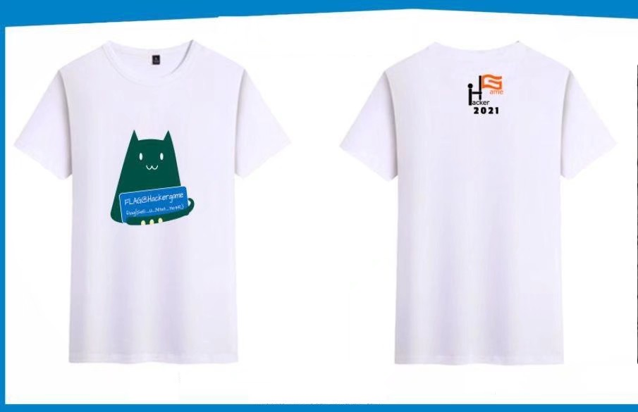
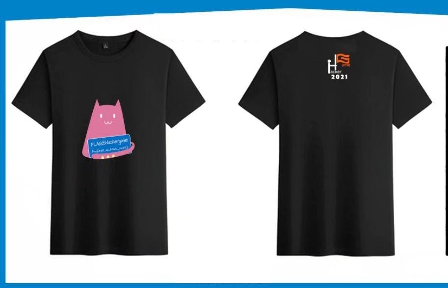
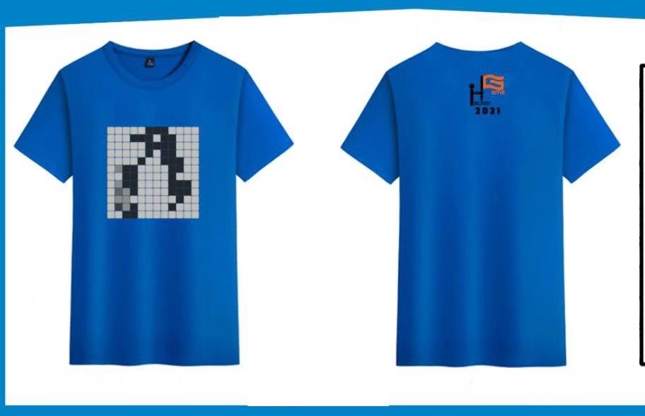

# 关于本次比赛的纪念衫

## 预览图

受到商家限制，图片可能不足够清晰，具体请按照实物为准。

衬衫用到的图样都放置在 `files` 文件夹。关于使用许可，请查看 [版权声明](#版权声明)。

## 如何获得

**重要**：本次比赛由承办方负责印制的纪念衫仅限在**中国科学技术大学在校生**中发放！！！

### 中国科学技术大学在校生

1. 获得校内一二三等奖 or 新生特别奖即可获得一件。一二三等奖和新生特别奖不叠加，同时获得两种奖项只有一件。

2. USTCLUG QQ 公众号上的转发抽奖活动，中奖名单已确认。抽奖可以和比赛获奖叠加。

### 其他人员

出于种种原因，我们不便且没有额外精力负责给其他选手发放纪念衫或者接受定制。为了满足非科大在校生对纪念衫的需求，我们提供纪念衫的设计素材，供有需要的人**自行印制**。合作高校的协办组织也可以组织批量印制发给本校选手。

## 版权声明

对于纪念衫前部图案（[粉色猫猫](files/neko-pink.png)、[绿色猫猫](files/neko-green.png) 与 [网格](files/lug-grid.png)），许可证为：[知识共享署名-非商业性使用-相同方式共享 4.0 国际许可协议](http://creativecommons.org/licenses/by-nc-sa/4.0/)。这意味着你可以**随意分享**和**自由更改**，只是不能**商业使用**~~（例如印纪念衫然后销售赚钱）~~。

对于纪念衫背部的 [Hackergame 官方 logo](files/hg_2021-logo.png)， 许可证为：All rights reserved。这意味中你**不能**对其进行随意更改/使用，即使是非商业用途也不行。当然，在本次 Hackergame 2021 纪念衫的自行印制过程中使用它并没有问题，并且出于适应背景颜色将黑色部分全部替换成白色也没有问题。

