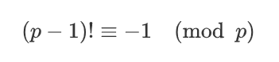
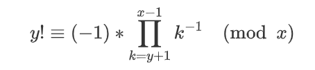
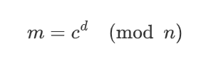
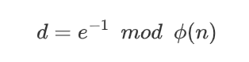

# Easy RSA

题解作者：[xuao](https://github.com/xuao1)

出题人、验题人、文案设计等：见 [Hackergame 2021 幕后工作人员](https://hack.lug.ustc.edu.cn/credits/)。

## 题目描述

- 题目分类：math

- 题目分值：200

- 题目链接：[src/Easy_RSA.py](src/Easy_RSA.py)

自从 [Hackergame 2018 公然揭露了大整数可以被神童口算分解的事实](https://github.com/ustclug/hackergame2018-writeups/tree/master/official/RSA_of_Z#%E8%A7%A3%E6%B3%95-1)，RSA 在 hackergame 中已经只能处于低分值的地位了。如果不在其名称前面加上 Easy 这个单词，似乎就会显得完全对不起其他题目。

更何况，在本题的附件中，你还获得了构造 p 和 q 的方式。数理基础扎实的你应该可以轻松解决这些问题吧。

## 解题策略
本题目主要使用到 Wilson 定理与 Euler 定理分别求解 p 和 q .
### p 的求解
通过题目描述可以看出，p 为 y 的阶乘模 x ，但由于 y 数值过大，直接求解会溢出。可以发现，x 为质数，并且 y 与 x 数值十分接近。
考虑使用 Wilson 定理：p 为素数时，满足：  
    
故  
  

所以对 p 的求解转换为求解逆元。

```python
def cal_p(x, y):
    p = 1
    temp = gmpy2.powmod(-1, 1, x)
    for i in range(y + 1, x):
        p = (p * gmpy2.invert(i, x)) % x
    value = (p * temp) % x
    return sympy.nextprime(value)
```

###  q 的求解

即为应用 Euler 公式，这也是 RSA 算法的核心。

我们知道，密文 c 与明文 m 的关系为：  
  
其中，n 为已知的模数，e 为公开的加密密钥，且根据题目可求得 n 的素因子，故可利用 n 的 Euler 函数求解 d :  
  
代码如下：

```python
def cal_q(x, y):
    for i in range(9):
        x = sympy.prevprime(x)
    q = [x]
    for i in range(1, 10):
        q.append(sympy.nextprime(q[i - 1]))
    N = 1
    phi = 1
    for i in range(10):
        N = N * q[i]
        phi = phi * (q[i] - 1)
    d = gmpy2.invert(e, phi)
    value = gmpy2.powmod(y, d, N)
    return sympy.nextprime(value)
```

### 密文求解

已知 p 和 q ，求解密文就是一件简单的事情了。

```python
d = gmpy2.invert(e, (p - 1) * (q - 1))
m = gmpy2.powmod(c, d, p * q)
M = long_to_bytes(m)
print(M)
```
