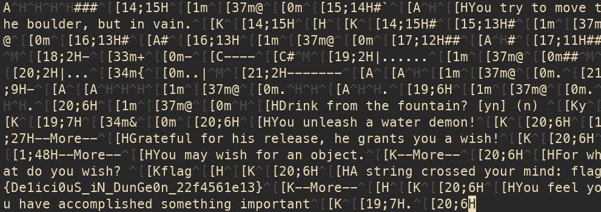

# Make a wish

题解作者：[Peter Gu](https://github.com/regymm)

出题人、验题人、文案设计等：见 [Hackergame 2021 幕后工作人员](https://hack.lug.ustc.edu.cn/credits/)。

## 题目描述

- 题目分类：general

- 题目分值：400

- 题目链接：[http://202.38.93.111:10046/?token={token}](http://202.38.93.111:10046/)

在 NetHack 中，许愿（Wish）是珍贵而难得的机会——你可以有机会得到几乎想要的任何东西，比如优质的装备（blessed greased +3 gray dragon scale mail），或是救急的物资（horn of plenty）。而 flag 也不例外——事实上，这也是获得 flag 的唯一方式，完成游戏（ascension）也并不能获得 flag。不过很明显，不能“套娃”也不能作弊：你不能许愿得到一个许愿魔杖（wand of wishing），也不能许愿得到剧情物品，比如祈祷烛台（Candelabrum of Invocation）。

尽管机会稀少，能获得愿望的方式还是很多的。除了直接挥动（z）许愿魔杖和用其刻字（E）之外，摩擦（#rub）神灯（magic lamp）、喝（q）喷泉（{）里的水、坐（#sit）上王座（\）也有一定概率获得愿望。

随机生成地图是 NetHack 的主要难度之一。为了应对这一点，你买通了炎多的法师（Wizard of Yendor），并让他在你进入地牢时始终以 0 作为随机数种子，进而生成固定的地图——经过反复练习，在固定的地图中获得愿望总不是什么难事吧。然而，进入地牢的你却发现这里早已被 Hackergame 势力渗透：99.9% 的许愿会被 Hackergame 委员会否决。

你已经没空思考为什么事情会变成这样，无论是被炎多的法师摆了一道，还是 Hackergame 委员会过于狡猾，事实都无法改变：许愿并拿到 flag，或是在地牢深处郁郁而终。

> Do you want your possessions identified?


提示：你有必要了解 NetHack 的基本操作，包括但不限于移动（如 h, j, k, l）和开门（O + 方向）等，但不需要任何高级技巧。[NetHack Wiki](https://nethackwiki.com/wiki/Main_Page) 或许能提供一些帮助。[此处](https://lug.ustc.edu.cn/planet/2021/09/nethack-gitgud/)是 LUG Planet 上一篇新手导向的 NetHack 教程。

提示：你可以在 [NAO](https://alt.org/nethack/) 上观看其他人的游戏或亲自体验。

提示：什么？昨天还好用的脚本今天怎么就不工作了？或许你应该抬头看看月亮。

关于题目：服务器（`nc` 连接和网页终端）不支持保存，并且连接仅能保持十几个小时或更短的时间。因此如果想仔细研究题目，最好下载源代码自己编译（服务器版本是在 Ubuntu 20.04 环境下编译并运行的）。如果想深入体验 NetHack 本身，可以直接从大部分 Linux 发行版的软件源中安装最新版本。

关于题目：服务器上 NetHack 的源代码和二进制文件可于[此处](src/nethack-3.4.3-src-hg.tar.gz)和[此处](src/nethack-3.4.3-bin-hg.tar.gz)下载。可以在源代码中搜索 `hackergame` 关键字查看修改过的部分。`.nethackrc` 用户配置文件在[此处](src/nethackrc)，使用这个配置可以保证本地环境和服务器上完全相同。

关于题目：你可以点击下面的按钮直接进入网页终端，或是在 Linux、MacOS、WSL 或 Git Bash 等本地终端中使用 `stty raw -echo; nc 202.38.93.111 10047; stty sane` 连接题目。注意，输入的 token 不会被显示，输入结束后按 Ctrl-J 开始题目。

> 如果你不知道 `nc` 是什么，或者在使用上面的命令时遇到了困难，可以参考我们编写的 [萌新入门手册：如何使用 nc/ncat？](https://lug.ustc.edu.cn/planet/2019/09/how-to-use-nc/)

## 题解

（认识出题人的同学应该已经猜到是谁出的题了 * 2）

本题其实思路比较直接，但出题人自己也是花了 10 多个小时才把全套的”半自动“脚本写出来，所以还是有一定难度的。

本 write-up 假设你已经熟悉了 NetHack 基本内容，如果不，可以阅读[此博客](https://lug.ustc.edu.cn/planet/2021/09/nethack-gitgud/)。

#### 题目思路

如果稍微了解一下 NetHack 相关的“作弊”，不难发现主要方法就是随机数利用。通过服务器上游戏的状态推断出服务器上的随机数种子，然后在本地用同样的种子反复练习直到充分了解该种子下的地图和游戏状态等，再用完全相同的按键操作序列在服务器上完成游戏。

比如说在 [NAO 上的速通记录](https://alt.org/nethack/fastasc-current.html)榜首是 SWAGGINZZZ 游客角色惊人的 7 分 15 秒飞升成神，[期间](https://s3.amazonaws.com/altorg/dumplog/SWAGGINZZZ/1546732576.nh361.txt)许愿 90 次。[此处](https://pellsson.github.io/)是关于这一战绩的博客文章。首先将游戏起始物品和随机数种子进行 mapping，建立了百 GB 的数据库。有了随机数种子之后，在本地手动找到靠墙的非魔法喷泉，通过撞墙推进随机数而不影响其他游戏状态，然后反复喝喷泉获得大量愿望。有了可靠的愿望来源后就可以”为所欲为“并 single shot 大部分怪物。中途他们遇到一些服务器端和本地 RNG 步伐不一致的问题，但通过分析代码解决了。

在 [NetHack Wiki](https://nethackwiki.com/wiki/Random_number_generator) 上也记录了其他相关内容，比如其他从喷泉中获得大量愿望的例子，和通过在服务器端开始时间附近试验进而找到旧版本 NetHack 中基于系统时间的随机数种子。

此时题目思路就很明确了。因为用的是旧版本，并且已经固定了随机数种子为 0，较为繁琐的同步本地和服务器游戏这第一步就不用了（为了难度不到讨厌的程度，并且已经有利用系统时间推断随机数种子的题了，这里就不再玩这一部分了）。那么，需要做的就是通过靠墙的喷泉（或其他愿望来源），在本地分析代码或进行实验，使得随机数恰好满足愿望不被否决。

分析一下概率：

- 喷泉喝水，产生 water demon：1 / 30
- 被 water demon 给予一个愿望：约 1 / 5
- 愿望不被 Hackergame committee 否决：1 / 1000

所以单次喝水的愿望概率约 1 / 150000，而代价为喷泉有 1 / 3 概率蒸发，如果没有愿望，其他喝喷泉的事件对低级玩家很可能致命。

#### 找到喷泉

首先通过人工控制找到靠墙的喷泉。因为自动化非常重要，希望能在人进行游戏时”录制“按键序列。NetHack 是比较依赖终端环境的，所以直接输入输出重定向会使得 NetHack 拒绝启动。一个解决方案是 PTY（Pseudo TTY），Python 的 pty 库就足够了。这里不讲解原理，只给出还算能用的代码。

part2.py 会开始游戏并将结果记录在 keylog2.txt 中。结束之后用 Vim 等较好的编辑器可以查看按键序列。手动删除找到喷泉后退出的几个字符（后面脚本要用），得到到喷泉为止的序列。以下是一个例子，将这段代码复制进开始（未选角色时）的游戏，可以看到 @ 已经站在喷泉上了。默认角色选择生成的地图在第一次就有靠墙的喷泉，因此我们甚至不需要走出第一层就能完成题目。

```
y  jHHjHohHHkHHhhHhhHjjjohhhhhhHhHklKKkkkhHbhjjjhhjjhhhjhlh
```

```


                                                        -----
                ---                                     ....|       -----
                |.                      -----------     |...|       |...|
                 .                      -.........|   ##....|`####  ....|
                |.                      |.........|   # |...-#####  |.(.|
                 .                      |.........-#### |...|#   #  |...|
                                        |.........|     -----    ###|..<|
                                        |.........|                #....|
                                       #-.........|                 -----
                ##                   ###-----------
              ###%                   #
              #  ###               ###
            ##`    #               #
            #    --.---------    ###
          ###    |..........|    #
 -+-.---- #      |..........-#####
 |.......##      |>........$|
 |...@..|        ------------
 --------

Hacker the Digger          St:11 Dx:9 Co:17 In:13 Wi:15 Ch:10  Lawful
Dlvl:1  $:0  HP:6(15) Pw:1(1) AC:9  Exp:1
```

#### 遍历随机数

下一步比较困难。

最基本的想法是，反复运行 NetHack 并遍历撞墙次数，但这需要的遍历量大概是 150000，看似不大，但如果只是用 pty 和 NetHack 交互，当撞墙次数增大时，NetHack 的处理时间会线性增加。如果尝试一下，可以发现想在后期将每次尝试的时间压到 1 s 以下都是比较困难的，那么运行完整遍历需要一天以上。NetHack 是开源游戏，最好的方法是阅读并魔改代码，节省遍历的时间。

首先，可以让 NetHack 每次把生成的随机数输出到 stderr，这样走到喷泉上方时随机数的状态就可以知道。而喝喷泉的代码（src/fountain.c，drinkfountain()）中，产生水怪的随机数是 23。如果不仔细分析，能直接预测的就到此为止了，从水怪产生到许愿，需要消耗数量不确定的随机数（makemon()），这部分代码不易看懂。但至少，这个 23 是可以写个小程序“直接”解出的，也就是到了 NetHack 中，每次尝试至少会产生水怪，这就将搜索量降到了 1 / 30，约 5000。当然，你需要大致阅读随机数生成的代码。

对于交互，我们可以加一个命令行参数，表示撞墙次数，然后在准备喝喷泉的时候循环消耗这么多随机数。并且，虽然 pty 可以获得完整的程序输出，但这不是很方便，并且在实际代码中我总是遇到缓存没写入文件等小问题。因此我的方法是到判断不会有愿望了就直接 exit()，靠返回值判断遍历结果。

把脚本写出来，这次不到 1 个小时就能完成 10000 量的遍历，并且成功得到了撞墙次数。

上述初始序列中，走到喷泉上时随机数被调用 3922 次，需要的撞墙次数是 104949 次。

脚本用法：处理好第一步的 keylog2.txt，需要的随机数调用是第一步生成的 nethack_rng.log 行数减一。将这个数填入 rng.c 中的 rng_start_cnt，将 rng.c 编译后的输出重定向到 bumplist.txt。安装魔改后的 NetHack 后同时运行 `python part3.py 0 1000; python part3.py 1000 1000; python part3.py 2000 1000; python part3.py 3000 1000; python part3.py 4000 1000;` 和 `python part3.py 5000 1000; python part3.py 6000 1000; python part3.py 7000 1000; python part3.py 8000 1000; python part3.py 9000 1000;` 进行 10000 量的遍历，等待直到文件夹中出现 result_xxx.xxx，就是需要撞墙的次数。脚本有些问题，单次运行遍历过长时间会耗尽 pty 资源，并且默认 NetHack 有锁，只能同时运行两个。

魔改的代码位置（可能不全）：

```
src/zap.c makewish()
src/fountain.c drinkfountain()
src/rnd.c RND()
src/hacklib.c setrandom()
```

#### 获得结果

现在我们已经有完整的按键序列了，只需要把这部分写入服务器得到 flag。也不很难，调整好 bumpcount，token 和服务器地址后等待结束，看 part4.log 末尾就会有 flag。



#### 尾声

不得不说我的脚本写得实在非常差，并且看了一遍无力重构，就只好直接放在这里了。如果要运行的话，各个文件头部的命令基本都要根据情况调整一下（只运行 part4.py 得到 flag 应该不需要太多更改）。如果运行中有任何哪怕很小的问题，欢迎提出 issue。

如果你看到这里那么疑问一定不少，我争取说明一下。

首先，如果你稍微写了本题自动化相关的内容，那透明的文件基本就白给了。那篇 write-up 说这里会讲如何抓取 VT100 控制序列，答案是请看 Python 官网 pty 的文档，或我的代码。至于原理，以及为什么需要把终端设置成 raw 模式才能正常游戏，[留到之后有机会再仔细讲讲](https://www.reddit.com/r/mathmemes/comments/8apspv/common_proof_techniques/)。

关于为什么喝喷泉，其实这不是一个太好的选择，因为生成水怪的过程我没分析出来。如果稍微研究一下游戏技巧，在前几层找到一个王座，或是干脆找到真的许愿魔杖。这二者的愿望流程应该比较直接，不涉及怪的产生与湮灭，进而随机数使用也非常可控，这样有可能只要“离线”遍历随机数，不需要反复运行游戏就可以得到愿望了。

关于撞墙，这个似乎没有其他显然的替代方法，因为任何游戏操作，即使是原地休息，都会引发大量随机数使用，比如周围的怪行走，自己体力回复，饥饿度上升等等。并且似乎没有任何其他操作可以安全地进行千万次而不导致玩家饿死或被路过的怪打死。

3.4.3 版本是特意选的，因为新的版本优化了随机数的使用，使其不是这么容易利用。仍然有方法从正在运行的游戏中“反推”随机数状态，不过非常困难。

另一个很重要的事情是，NetHack 是依赖日期（即月相变化）的，在满月时运气会好，而新月运气会差，这也导致同样的随机数开局不同。如果开始游戏时有 You are lucky 或 Be careful 等字样，则上述“一般”情况下的按键序列不会正常工作。代码中默认写的是满月（比赛开始前几天到比赛第一天）时候的数据，撞墙 105369 或 258383 次，按键序列为：

```
y  jHHjHohHHkHHhhbhbHjjohHHjjBHklKKyhyYHbBhhhj
```

不知道目前为止唯一一位做出了本题目的选手是不是因此而没有更早的完成。

关于文案，最早对于随机数种子为 0 的描述是“穿越回了 1970 年 1 月 1 日”，但在比赛开始前两天，出题人发现恰好是满月时游戏行为发生了变化，并且这会持续到比赛第一天，因此将该描述改为“买通了炎多的法师”。

作为最后一道被人做出来的题，出题人感觉很荣幸。本人高中期间了解了 NetHack，之后一直偶尔玩一局，但进展非常缓慢，最好的成绩仅仅是女武神开局高强度 Save / Load 下才打到 20 层。一直想 source diving 也未能坚持。而有些新手似乎在第一天玩就达到了很高的水平，使我备受打击，之后便很少玩了。今年出题期间又想到了这个事情，便在此分享 NetHack  / Roguelike 的快乐。

希望有一天能在 NAO 上与大家相见。啊，或许还是不要相见为好。（提示：Bone file）

> You hear a jackal howling at the moon.
