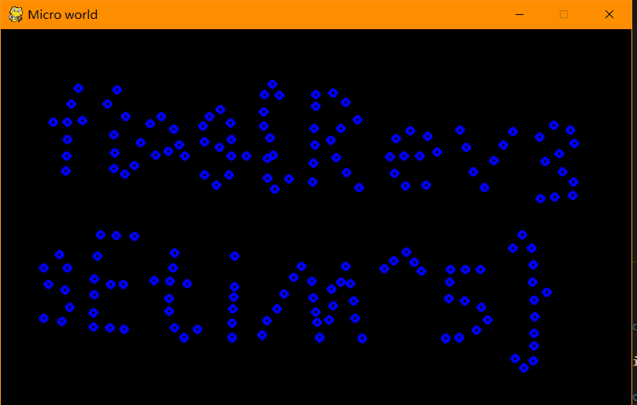

# Micro World

题解作者：[Wu Han](https://github.com/youremailaddress)

出题人、验题人、文案设计等：见 [Hackergame 2021 幕后工作人员](https://hack.lug.ustc.edu.cn/credits/)。

## 题目描述

- 题目分类：binary

- 题目分值：250

- 题目链接：[src/microworld.exe](src/microworld.exe)

宇宙中某一片极其微小的区域里的粒子被一股神秘力量初始化设置成了 flag 的形状，程序忠实地记录了一段时间之后这片区域的粒子运动情况。

## 解题策略

本题目主要使用到 pyinstxtractor 对 exe 文件进行反编译得到 pyc 文件，再对 pyc 文件进行反编译得到源码，之后要想办法修改源码逻辑得到初始图形。

### 确定原文件是 Python 打包

这一步可以通过将 exe 拖入 ida 中查找函数，或者使用 strings 命令查看字符串等有意义信息等方法找到很多 python/pygame 字段，因此确定原文件是由 Python 编写的。~~当然，看二十多 MB 的原文件也能猜到必然不可能是 C/C++~~

### 反编译 exe 得到 pyc

这一步需要借助一些工具，我使用的是 [pyinstxtractor.py](https://github.com/extremecoders-re/pyinstxtractor)。

```
$ python pyinstxtractor.py microworld.exe
```

可以得到生成的文件夹中的 [2.pyc](src/2.pyc) ( ~~不按照规范随便命名文件的出题人是屑~~ )

### pyc 反编译生成源码

得到的 pyc 文件依然不能看到逻辑，我们要把 pyc 文件进一步处理。这里有很多种选择（如果你选择了在线的 pyc 反编译网站，有一定概率出现得到的原位置精度不够高的情况，比如[在线反编译](https://tool.lu/pyc/)）。这里推荐一个工具 [python-uncompyle6](https://github.com/rocky/python-uncompyle6/)

### 源码修改逻辑获取 flag

拿到了源码，艰巨的任务才刚刚开始。（什么）因为由反编译得来的源码依然存在一些缩进和逻辑处理问题，因此做题人需要通读源码并且把这些地方一一修改，复原后的源码 [source.py](src/source.py) 修改之后只要找到逻辑把速度方向修改即可。
下面是复原完成后反向看 flag 的代码 [microworldwp.py](src/microworldwp.py)
通过这个代码可以很容易得到最后的结果：


### 题外话

这个题目出出来在比赛过程中也接受了不少来自各个做题选手的质疑和询问，因为得到了很模糊看不清的 flag 图像。出这个题目灵感来源于周董的反方向的钟（x）。可以预见这个题的风评不是很好。出题者已经尽可能的把预期解的 flag 图像做的足够清晰，如果非预期情况可以检查如下几个地方：

- 是否选择了在线反编译
- 是否修改正确了代码逻辑
- 是否修改得到了正确的反向时间的代码
