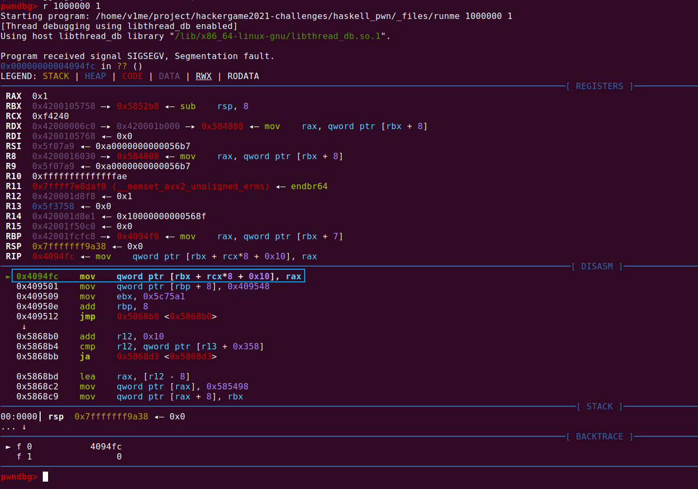
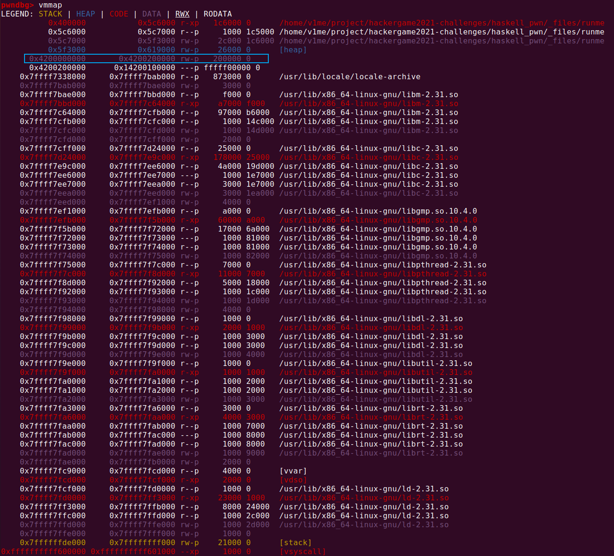
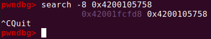
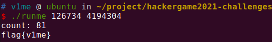
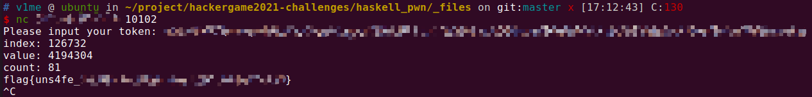

# 一石二鸟

题解作者：[V1me](https://github.com/Roarcannotprogramming)、[Hypercube](https://0x01.me/)

出题人、验题人、文案设计等：见 [Hackergame 2021 幕后工作人员](../../credits.pdf)。

## 题目描述

- 题目分类：binary

- 题目分值：250

传说中优秀的黑客可以口算 MD5，可以控制宇宙射线来黑入你的电脑，还可以越权用自己的钱帮别人支付订单，这已经不足为奇了。

现在你需要只用一次写入就修改数组中两个位置，这次可没有宇宙射线帮你。

**[源代码与可执行文件](src/一石二鸟.zip)**

**连接题目**：`nc 202.38.93.111 10102` 或[网页终端](http://202.38.93.111:10103/)

> 如果你不知道 `nc` 是什么，或者在使用上面的命令时遇到了困难，可以参考我们编写的 [萌新入门手册：如何使用 nc/ncat？](https://lug.ustc.edu.cn/planet/2019/09/how-to-use-nc/)

## 出题思路

本节作者：[Hypercube](https://0x01.me/)

这道题的出题人自己并不熟练 pwn，所以只能讲讲出题思路。Haskell 是一门非常有趣的语言，有着和其他现代编程语言很不一样的模型。但无论哪个编程语言，只要在意实用性和性能，都必须能表达常见的各种算法，例如对可变数组的读写。在 Haskell 中，数组（可变的和不可变的）是由 [vector](https://www.fpcomplete.com/haskell/library/vector/) 库提供的。

在学习这个库时，我注意到了这个库中有三类不同安全性的函数，不同于其他库中常见的两类：

1. Total（完全的）函数，这类函数对所有可能的输入都能产生输出，就像数学上的函数一样。但有的操作就是不可能对所有输入都有意义（例如“取第一项”这个操作对空数组没有意义），相应的函数要么没有，要么不得不返回 Maybe 类型，表示结果有成功和失败两种可能性。
2. Partial（部分的）函数，这类函数只对部分输入能产生输出，对另外一些输入，会抛出运行时异常。如果程序员相信输入一定在正确范围内（例如不会把空数组传给“取第一项”函数），或者能够妥善处理异常，用这类函数可以简化代码，但编译器将无法帮忙检查程序正确性。
3. Unsafe（不安全的）函数（这是 vector 库特有的），这类函数同样只对部分输入能产生输出，但是对另外一些输入会产生未定义的结果。这类函数一般是前两类函数省去了数组边界检查的版本，如果用错误的参数调用，会导致整个程序的内存被随意读写，产生难以预料的后果。如果程序员相信输入一定在正确范围内，用这类函数可以节约边界检查的开销。

如果用了 unsafe 函数，就可以构造出一个任意内存读写的 pwn 题，它的唯一难点应该就是要知道 Haskell 运行时内存管理方式。我好奇这样的题是否能解出，以及有多容易解出，于是写了个简单的程序，交给验题人尝试。

如今很多程序是用比较高级的语言写的，这些语言有自己的内存管理方式和运行时，我想要考一考选手在这种环境中逆向和 pwn 的能力，而不仅仅会做 C 语言的 pwn 题。

另外，可能是由于很多介绍 Haskell 的材料都着重在讲函数式编程的思想和做法（不是说这样不好），我了解到一些同学以为 Haskell 很难写出天然就是过程式的算法，或者很难和需要不断变化的数据打交道，因此不适合用来开发实际软件。希望这道题的源代码作为一个简短的示例，展示了 Haskell 也可以和其他语言一样，一行一行地写算法的每一步，操作不断变化的数据。源代码同时还展示了 Haskell 项目常用的依赖管理工具 [Stack](https://www.haskellstack.org/) 和稳定发行版 [Stackage](https://www.stackage.org/)。

## 解题策略

本节作者：[V1me](https://github.com/Roarcannotprogramming)

作为验题人，拿到题目发现对 Haskell 以及函数式编程一无所知。于是花了一下午时间学习 Haskell，在 [@ThinerDAS](https://github.com/ThinerDAS) 的帮助下学习到了一点皮毛。

然后发现这题和 Haskell 根本没什么关系。只需要将这个二进制文件看作一个普通的 ELF 文件就行。

既然是普通的 ELF 文件，就可以打开 GDB 硬调。在知道数组可以溢出的情况下，索性就让溢出大一点，看看会不会访问没有 map 到的非法区域，从而 Segment Fault。



从图中我们可以看到，程序死在了一个数组赋值操作上，这就是我们需要的。数组基地址是此时的 `rbx -> 0x4200105758`，index 是 `rcx`，也就是我们输入的 1000000。看到这个段是自己 mmap 的，结合之前调 go 语言的经验，搞不好堆栈都在这个段上。



之后想到，在除了 C 语言之外的其他语言中，主流的数组实现方式都是类似于下面这种。

```c
struct vector {
    unsigned int max_cap;
    unsigned int cur_length;
    type *a;
}
```

所以内存中大概率是有指向 `rbx -> 0x4200105758` 的指针的。查找一下。



果然是有的，如果我们能把这个指针给改掉，那么程序就会认为这个数组的基址是我们修改后的恶意值。只要这个恶意值是一个合法的内存地址，而且里面本身有很多非零数据的话，那么就能够达成 “一石二鸟” 或者 “一石多鸟”。

开启 ASLR 多次执行，这个指针永远在 `0x42001fcfd8`（但是在不同机器上的地址不同，但是偏差不大，可能是环境变量的原因）。所以计算出相对数组基址的偏移如下。


所以最后 `./runmme 126734 4194304` 就可以拿到 flag。



所以如果远程的偏移不对，就在 126734 的基础上加减就好了～

经过测试，远程偏移是 126732。


