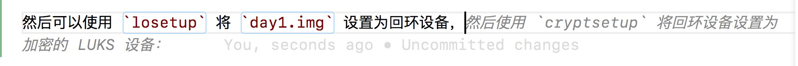

# 加密的 U 盘

题解作者：[taoky](https://github.com/taoky)、[zzh1996](https://github.com/zzh1996)

出题人、验题人、文案设计等：见 [Hackergame 2021 幕后工作人员](https://hack.lug.ustc.edu.cn/credits/)。

## 题目描述

- 题目分类：general

- 题目分值：200

- 题目链接：[src/lukspwd.zip](src/lukspwd.zip)

这是一个关于 LUKS (Linux Unified Key Setup) 的故事。

第一天

小 T：「你要的随机过程的课件我帮你拷好了，在这个 U 盘里，LUKS 加密的密码是 `suijiguocheng123123`。」

小 Z：「啊，你又搞了 Linux 文件系统加密，真拿你没办法。我现在不方便用 Linux，我直接把这块盘做成磁盘镜像文件再回去处理吧。」

第二天

小 Z：「谢谢你昨天帮我拷的课件。你每次都搞这个加密，它真的安全吗？」

小 T：「当然了！你看，你还给我之后，我已经把这块盘的弱密码改掉了，现在是随机生成的强密码，这样除了我自己，世界上任何人都无法解密它了。」

小 Z：「我可不信。」

小 T：「你不信？你看，我现在往 U 盘里放一个 flag 文件，然后这个 U 盘就给你了，你绝对解密不出来这个文件的内容。当初搞 LUKS 的时候我可研究了好几天，班上可没人比我更懂加密！」

## 基础概念

在分析 day2.img 之前，要知道 LUKS 是啥，以及怎么挂载 day1.img 拿到随机过程的课件（实际上是小抄）。

打比方的话 LUKS 大概和 Windows 的 BitLocker 和 macOS 的 FileVault 差不多：加密硬盘/分区，就算坏人物理接触了你的设备，没有密码的情况下也无法获得硬盘里的内容。

LUKS 的操作通过 `cryptsetup` 程序进行。先 `tldr` 大概看看：

```console
$ tldr -p linux cryptsetup

cryptsetup

Manage plain dm-crypt and LUKS (Linux Unified Key Setup) encrypted volumes.
More information: <https://gitlab.com/cryptsetup/cryptsetup/>.

- Initialize a LUKS volume (overwrites all data on the partition):
    cryptsetup luksFormat /dev/sda1
 Open a LUKS volume and create a decrypted mapping at `/dev/mapper/target:

    cryptsetup luksOpen /dev/sda1 target

- Remove an existing mapping:
    cryptsetup luksClose target

- Change the LUKS volume's passphrase:
    cryptsetup luksChangeKey /dev/sda1
```

然后可以使用 `losetup` 将 `day1.img` 设置为回环设备——不过在此之前先看看里面有啥吧。

```console
$ fdisk -l ./day1.img
Disk ./day1.img: 20 MiB, 20971520 bytes, 40960 sectors
Units: sectors of 1 * 512 = 512 bytes
Sector size (logical/physical): 512 bytes / 512 bytes
I/O size (minimum/optimal): 512 bytes / 512 bytes
Disklabel type: gpt
Disk identifier: E1D1730D-1029-44A4-898B-FEBC77E7884F

Device      Start   End Sectors Size Type
./day1.img1  2048 40926   38879  19M Linux filesystem
```

可以看到这是个 GPT 分区表的盘，里面有一个分区。然后就把磁盘文件 `losetup` 映射到 `/dev/loop0` 上。

```console
$ sudo losetup -P /dev/loop0 ./day1.img
```

`-P` 参数会要求内核扫描新回环设备的分区表。没加也没事，`sudo partprobe /dev/loop0` 就行。然后就可以用 `cryptsetup` 打开 LUKS 分区了（起名 `day1`）：

```console
$ sudo cryptsetup luksOpen /dev/loop0p1 day1
Enter passphrase for /dev/loop0p1:
$
```

和 Linux 其他地方输入密码的传统一致，没有回显，直接输入 `suijiguocheng123123` 即可。解密后的分区在 `/dev/mapper/day1`，然后挂载就行。

```console
$ mkdir day1_mp
$ sudo mount /dev/mapper/day1 ./day1_mp
$ cd day1_mp
$ ls -lh
total 31K
drwx------ 2 root root 12K Oct 18 23:52 lost+found
-rw-r--r-- 1 root root 19K Oct 18 23:52 随机过程.txt
$ head 随机过程.txt
常见随机变量分布和矩母函数
离散概率分布    P(X=x)  矩母函数 g(t)   EX      Var(X)
二项分布 B(n,p), 0<=p<=1        C_n^x p^x (1-p)^(n-x), x=0,1,…,n        (pe^t+(1-p))^n  np      np(1-p)
泊松 Poisson分布,λ>0    e^(-λ) λ^x/x!, x=1,2,…  e^(λ(e^t-1))    λ       λ
几何分布, 0<=p<=1       p(1-p)^(x-1), x=1,2,…   pe^t/(1-(1-p) e^t)      1/p     (1-p)/p^2
负二项分布      C_(x-1)^(r-1) p^r (1-p)^(x-r), x=r, r+1, …      (pe^t/(1-(1-p)e^t  ))^r r/p     r(1-p)/p^2
连续概率分布    f(x)    g(t)    EX      VarX
均匀分布 U(a,b) 1/(b-a), a<x<b  (e^ta-e^tb)/(t(a-b))    (a+b)/2 (b-a)^2/12
指数分布λ>0     λe^(-λx), x>=0  λ/(λ-t) 1/λ     1/λ^2
Γ(n,λ) 分布 λ>0 λe^(-λx) (λx)^(n-1)/(n-1)!, x>=0        (λ/(λ-t))^n     n/λ     n/λ^2
```

（PS：科大随机过程课考试半开卷，这就是我大三时候做的大抄的文本版）

那么问题来了，怎么解密 `day2.img` 获得 flag 呢？

## Master key 与 passphrase

从直觉上来说，磁盘加密做的事情是：使用用户输入的密码 (passphrase) 将用户的文件以某种算法进行加密。但是这个模型有一个问题：如果用户修改了密码，那么就必须把整块盘重新读写一遍得到用新密码加密的文件，读整盘的开销是很大的（写整盘更大）。所以 LUKS 采取的方式是：

用户密码 (passphrase) 加密 master key，由 master key 加密全盘文件。当用户密码修改的时候，只需要重新加密 LUKS metadata 里面的 master key，用户的文件不用动。

所以可以知道：**在攻击者已经得到磁盘镜像和密码的情况下，修改密码是没有意义的，因为 master key 没有变化**。我们接下来要做的，就是获得 day1.img 的 master key，并且用这个 master key 解密 day2.img。

## 题解

读 `man cryptsetup`，发现可以 dump master key:

```console
$ sudo cryptsetup luksDump --dump-master-key /dev/loop0p1

WARNING!
========
The header dump with volume key is sensitive information
that allows access to encrypted partition without a passphrase.
This dump should be stored encrypted in a safe place.

Are you sure? (Type 'yes' in capital letters): YES
Enter passphrase for /dev/loop0p1:
LUKS header information for /dev/loop0p1
Cipher name:    aes
Cipher mode:    xts-plain64
Payload offset: 32768
UUID:           e9a660d5-4a91-4dca-bda5-3f6a49eea998
MK bits:        512
MK dump:        be 97 db 91 5c 30 47 ce 1c 59 c5 c0 8c 75 3c 40
                72 35 85 9d fe 49 c0 52 c4 f5 26 60 af 3e d4 2c
                ec a3 60 53 aa 96 70 4d f3 f2 ff 56 8f 49 a1 82
                60 18 7c 58 d7 6a ec e8 00 c1 90 c1 88 43 f8 9a
```

然后把 master key (MK dump) 存成二进制文件。

```console
$ echo 'be 97 db 91 5c 30 47 ce 1c 59 c5 c0 8c 75 3c 40 72 35 85 9d fe 49 c0 52 c4 f5 26 60 af 3e d4 2c ec a3 60 53 aa 96 70 4d f3 f2 ff 56 8f 49 a1 82 60 18 7c 58 d7 6a ec e8 00 c1 90 c1 88 43 f8 9a' | tr -d ' ' | xxd -r -p > masterkey.bin
$ hexdump -C masterkey.bin
00000000  be 97 db 91 5c 30 47 ce  1c 59 c5 c0 8c 75 3c 40  |....\0G..Y...u<@|
00000010  72 35 85 9d fe 49 c0 52  c4 f5 26 60 af 3e d4 2c  |r5...I.R..&`.>.,|
00000020  ec a3 60 53 aa 96 70 4d  f3 f2 ff 56 8f 49 a1 82  |..`S..pM...V.I..|
00000030  60 18 7c 58 d7 6a ec e8  00 c1 90 c1 88 43 f8 9a  |`.|X.j.......C..|
00000040
```

再次阅读 `man cryptsetup`，可以看到 `luksOpen` 有个 `--master-key-file` 的参数。

```console
$ sudo losetup -P /dev/loop1 ./day2.img
$ sudo cryptsetup luksOpen /dev/loop1p1 day2 --master-key-file masterkey.bin
```

可以看到解密成功了。之后做什么大家都会了吧（

```console
$ mkdir day2_mp
$ sudo mount /dev/mapper/day2 day2_mp/
$ cat day2_mp/flag.txt
flag{changing_Pa55w0rD_d0esNot_ChangE_Luk5_ma5ter_key}
```

别忘了做完之后 `umount`, `cryptsetup luksClose` 与 `losetup -D` 清理现场。

## 附录

在写此 writeup 当天，出题人获得了 GitHub Copilot 的试用权限，所以特地试了一下：



之后可以考虑让 Copilot 来写 writeup（确信

此外，因为出题人的电脑内存不是很够，在格式化 LUKS 卷的时候，加上了 `--pbkdf pbkdf2` 参数。

## 其他

本题的 idea 是 @zzh1996 的，我只负责 implementation（

zzh1996：通过这道题，我想告诉大家，绝大多数磁盘加密方案（没有使用 TPM 的情况下）修改密码是不会改变加密的主密钥的！很多人并不了解这个安全模型，以为改密码就意味着新文件用新密码加密。如果你做磁盘加密是为了防止别人读你磁盘的物理攻击（不然呢？），那么当你觉得密码泄露时，一定要重新加密一遍全盘，否则用旧的密码加上旧的扇区头就可以随时解密新的文件。
