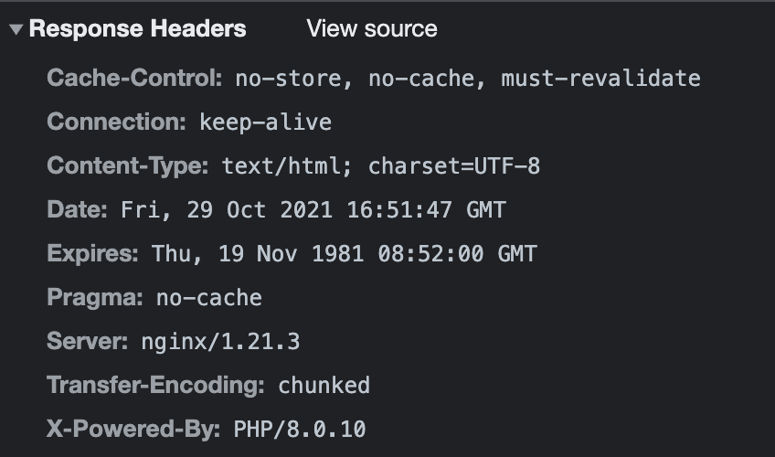

# 卖瓜题解

TL;DR: 使用大数字在 PHP 中将重量溢出到模 3 余 2 的数字。

## 题目简介


本题类似于用无刻度水杯凑出某个体积的水这个问题。瓜的重量为 6 和 9， 目标重量是 20，如果正常操作是无法满足条件的，因为不存在非负整数 x, y 使得 6x+9y=20 成立 （证明：左式 = 0 mod 3，右式 = 2 mod 3）。所以我们需要找到一些机制使得重量不再是 3 的倍数。

## 参考解法

在题目返回的 HTTP Header 中可以看到本题是用 PHP 写的。



本题目没有提供源代码，需要选手尝试（随便放瓜）并猜测还原内部的代码逻辑，事实上题目的核心逻辑只有一个函数：

```php
function action()
{
    check_last_action();
    $bottle_6 = intval($_POST['b6']);
    $bottle_9 = intval($_POST['b9']);
    if ($bottle_6 < 0 || $bottle_9 < 0) {
        die('操作无效：不能放负数个瓜。点击<a href="/">这里</a>回到主页。');
    }
    $_SESSION['pool'] += intval($bottle_6 * 6 + $bottle_9 * 9);
    header('Location: /');
}
```

根据 PHP 文档 [Integer 整型](https://www.php.net/manual/zh/language.types.integer.php)，PHP 在运算结果超出 int 范围时，会返回 float 类型，进一步使用函数 `intval()` 来把 float 转为 int 时，如果这个 float 超出了 int 范围（定义在 `PHP_INT_MAX`），结果是未定义的，在其评论中有一条 `Be aware of float to int cast overflow` 列举了一些溢出后的转换结果，选手也可以自己尝试。在尝试的过程中，只要能产生一个模 3 余 2 的重量（如 2, -1 等）都可以很容易凑到 20。

下面这段代码尝试了将一个比 `PHP_INT_MAX` 稍大的数转换成 int 时会发生什么：

```php
//             PHP_INT_MAX = 9223372036854775807
// 1024819115206086200 * 9 = 9223372036854775800
// 1024819115206086201 * 9 = 9223372036854775809

$a = 1024819115206086200 * 9;
$b = 1024819115206086201 * 9;
$ia = intval($a);
$ib = intval($b);

var_dump($a);
// int(9223372036854775800)

var_dump($b);
// float(9.223372036854776E+18)
// overflow!

var_dump($ia);
// int(9223372036854775800)

var_dump($ib);
// int(-9223372036854775808)
// ???
```

注意到 `$ib` 其实是一个模 3 余 1 的数，我们先把它加回到 0 附近（注意这个过程不要溢出了），再重复一次，就能得到一个模 3 余 2 的数：

```php
$b = 1024819115206086201 * 9;
$ib = intval($b); // int(-9223372036854775808)
$b = 1024819115206086200 * 9;
$ib += intval($b); // int(-8)
$b = 1 * 9;
$ib += intval($b); // int(1)
$b = 1024819115206086201 * 9;
$ib += intval($b); // int(-9223372036854775807)
$b = 1024819115206086200 * 9;
$ib += intval($b); // int(-7)
$b = 3 * 9;
$ib += intval($b); // int(20)
```

其中每一个 `$b` 都是放瓜的操作，一共操作 6 次即可，分别是：

```
1024819115206086201 * 9
1024819115206086200 * 9
1 * 9
1024819115206086201 * 9
1024819115206086200 * 9
3 * 9
```

当然熟悉了这个原理之后可以尝试找到一些更短的操作，比如：

```
1500000000000000000 * 9 // int(-4946744073709551616), 模 3 余 2
549638230412172404 * 9 // int(20)
```


## 关于补充说明

为什么会有「补充说明：当称的数字变为浮点数而不是整数时，HQ 不会认可最终的称重结果。」？

因为有的选手在一通操作之后重量已经变成了浮点数，而判断胜利的条件使用了 `$_SESSION['pool'] === 20` 比较，需要类型完全相同才能判断通过，选手需要注意不要在操作中把重量变成浮点数了。
