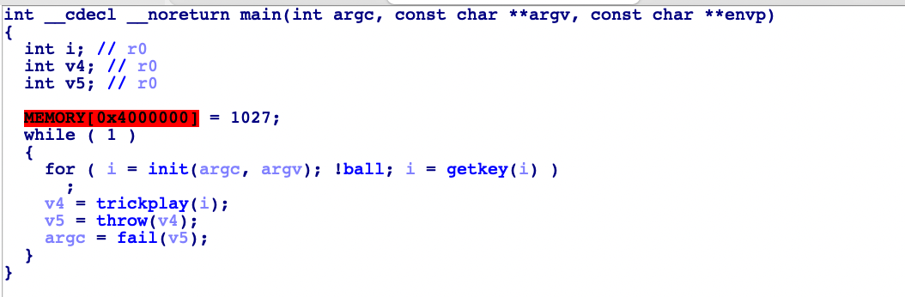
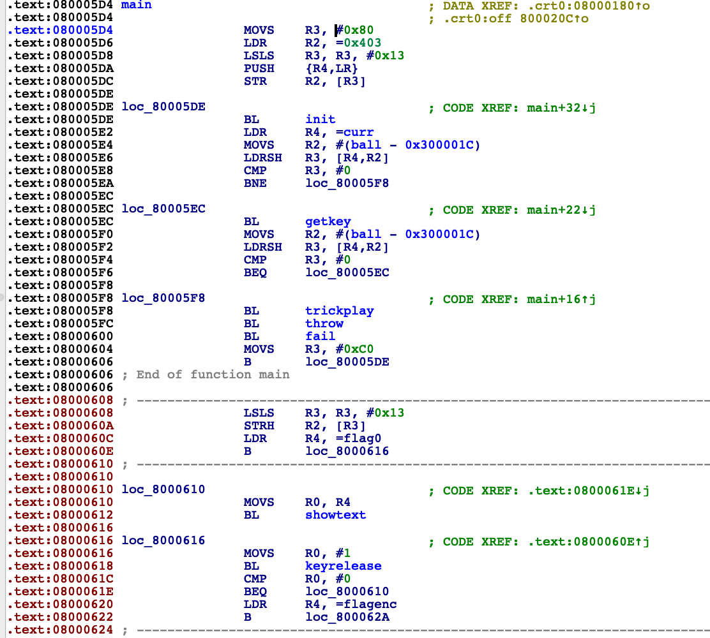
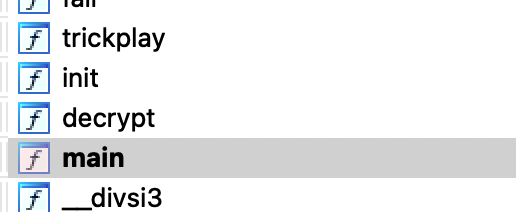
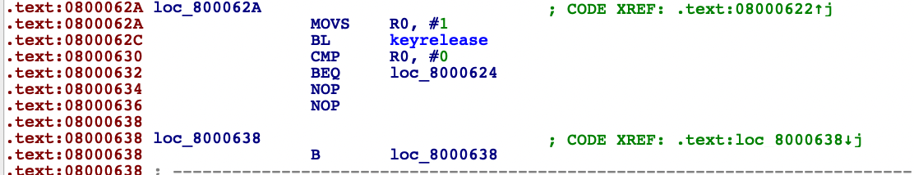
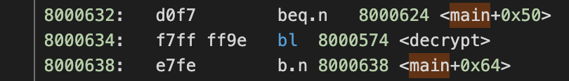
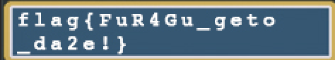

# 卷王与野生的 GPA

题解作者：[cabasky](https://github.com/cabasky)

出题人、验题人、文案设计等：见 [Hackergame 2021 幕后工作人员](https://hack.lug.ustc.edu.cn/credits/)。

## 题目描述

- 题目分类：binary

- 题目分值：250

- 题目链接：[src/catchGPA.zip](src/catchGPA.zip)

“24 岁，是卷王。”

即便一早学会了养生、收获了强者的发型，24 岁的科大卷王仍然无法超脱开“电子鸦片”的荼毒。

最近，他喜欢玩一款经典的掌机。这台掌机推出于 2001 年，曾经风靡全球，销量累计 8100 万台。

令卷王非常快乐的是，这台掌机使用了 ARM 指令集，正好就是上个学期在《微机原理与嵌入式系统》中学习的内容。

就算是沉迷“电子鸦片”，卷王也不忘记要在轻松娱乐的时光中获取 GPA。

这天，卷王得到了一张破旧的游戏卡带。（顺带地，他还得到了卡带烧录之前编译的 ELF 文件）

当年在这台游戏机上，少年们夜以继日捕捉着传说中的精灵；

而就在卷王冒险的过程中、野生的 GPA 跳了出来！

手上没有任何装备的卷王卷不起来，不愿躺平的他在惊慌之中输入了经典的作弊码。

就在他向野生的 GPA 扔出球时，他发现，要抓住野生的 GPA，远没有那么简单……

## 背景

GBA 掌机是经典的 ARM 架构的机器，根据题目的提示，随便找一个开源的 GBA 模拟器（比如 [mgba](https://github.com/mgba-emu/mgba)，支持汇编级别的动态调试以及链接到 gdb 等）就能打开。这题考查程序阅读能力，以及 ARM 下跳转指令的的偏移计算。题主在高中接触过 GBA 编程，最近正在 3DS 上复习第三世代的复刻，看到出题要求一道非 x86_64 架构的题，于是想到出这题。

这题的素材取自 [PMFR](https://wiki.52poke.com/wiki/%E5%AF%B6%E5%8F%AF%E5%A4%A2_%E7%81%AB%E7%B4%85%EF%BC%8F%E8%91%89%E7%B6%A0) 上常磐镇碰到的倒地老爷爷的抓怪教学关。

~~多年来题主的 QQ 验证问答就是 GBA 的显存起始地址，卡验证无数，只有被大佬 @zzh1996 拉进战队的时候被试出来，做出这题后可以扩下列。~~

## 题解


玩家设置好键位，一路按 a 键发现没有球，于是根据题目的提示**经典作弊码**，搜索引擎中可以找到，尝试输入 **↑ ↑ ↓ ↓ ← → ← → B A B A**。（游戏史上著名的 [KONAMI Command](https://zh.wikipedia.org/wiki/%E7%A7%91%E4%B9%90%E7%BE%8E%E7%A7%98%E6%8A%80) 的一个广为人知的误传；有趣的是，比赛期间 KONAMI 公司推出了纪念这个作弊码的活动）另外，解题者可以观察 IDA 中的 `getkey` 函数来得到。然后发现，游戏进入了死循环。

从这里开始，我们需要用 IDA 分析 `catchGPA.elf` 了。在 IDA 中 `F5` 观察 `main` 函数。



打开 `Text View` 之后，发现扔完球（`fail` 函数）以后，`0x08000606` 一个不正常的 `b` 指令跳回到主函数的 `init` 处，导致后面有一大段代码变红没法运行，且没被 IDA 反编译解析。



将这个 b 指令 patch 替换成 `nop`（十六进制 `46 c0`，可以从前面的代码里抄过来）。`catchGPA.gba` 卡带中的指令是从 `catchGPA.elf` 代码段中照搬过来的，我们在 `catchGPA.gba` 文件中找到相应的部分修改，然后丢模拟器运行，可以走出死循环了，但是发现最后的 flag 是乱码，并提示“被跳过的加密函数”。


根据这个提示，我们在 IDA 左侧函数列表发现一个没被执行过的 `decrypt` 函数在 `0x08000574`，猜测这个就是程序给的后门。



同时，发现 `catchGPA.elf` 的最后 `0x08000634` 开始有两个没必要的 `nop`，正好对应了 `bl` 指令函数调用需要四字节。



因此，我们尝试将这两个 `nop` 替换成 `bl decrypt`。根据其他函数调用，`bl` 前两个字节是 `f7 ff`；后两个字节为跳转的偏移地址，计算方式为：

```
offset = [ dst - ( src + 4 ) ] / 2

= ( 0x08000574 - 0x08000634 - 4 ) / 2

= 0xff9e
```



十六位补码表示。用十六进制编辑器将 `catchGPA.gba` 文件相应的位置换掉，运行卡带，最终得到 flag 的图片。



## 其他方法

同样这题也可以找到 `decrypt` 函数后阅读内容，发现其实就是一个简单的象素置乱，密钥明文存放，然后像素颜色写入 `0x6000000` 开头的 160 x 240 的显存空间中。颜色为十六位，RGB 各五位，最高位保留。解题者也可以将对应的数据抽出来自行解密。

## 相关信息

这题有一些地址常量可能影响程序的分析。这里解释一下：

| 地址 | 意义 |
| ---- | ---- |
| 0x06000000 | GBA 显存地址，从此开始的 160 x 240 x 2 字节的空间在 `mode 3` 下存放像素信息 |
| 0x04000000 | 显示模式的地址，程序中设置为 0x0403 ，表示使用 `mode 3`  |
| 0x04000130 | 存储按键的状态，一共 11 位，用 0 和 1 表示对应按键是否按下 |

并解释一些函数

| 函数 | 作用 |
| --- | --- |
| init | 初始化，绘制背景等 |
| vid_vsync | 视频同步，等待到下一次屏幕扫描刷新完成，用于计时、控制图像刷新的时间和速率 |
| showtext | 绘制下方的文字 |
| showchara | 绘制人物，显示移动动画 |
| showball | 显示球 |
| getkey | 获取按键信息，同时判定作弊码的输入 |
| decrypt | 反置乱，解密并显示 flag |

其他的资源请在 `src` 文件夹下寻找。这里给出题主机上的 `objdump` 的结果。

源代码在 `fail` 函数后将显存第零位改成 23 的代码只是作为死循环的占位符，没有其他含义。

[主程序源代码](src/source/src/main.c)

[题目给出的汇编](src/source/rom/hg2021dump.asm)

[顺序执行的汇编](src/source/rom/originaldump.asm)

## 交叉编译工具链

本程序使用 [devkitpro](https://devkitpro.org/) 编译。

编译时，请将 `rom` 文件夹下的内容清除，然后运行 make。
