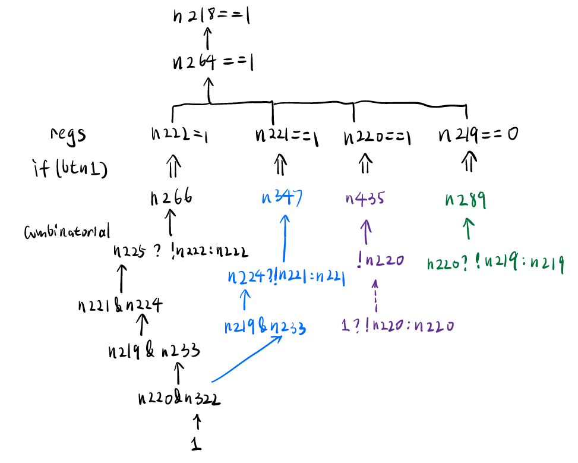
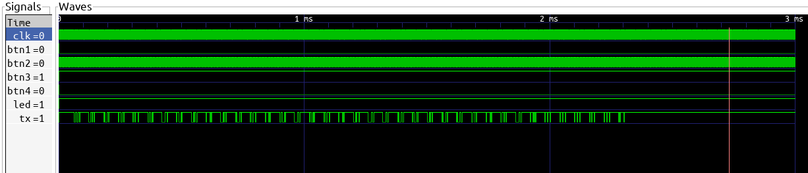

# 外星人的音游掌机

题解作者：[Peter Gu](https://github.com/regymm)

出题人、验题人、文案设计等：见 [Hackergame 2021 幕后工作人员](https://hack.lug.ustc.edu.cn/credits/)。

## 题目描述

- 题目分类：binary

- 题目分值：300

- 题目链接：[src/ice40_files.zip](src/ice40_files.zip)

一块带着四个开关、一个 LED、一个串口、和一块 iCE40-HX1K-TQ144 FPGA 芯片的电路板。以纳秒量级的速度正确地按动开关，LED 会亮起，同时串口会输出 flag。

你记下了存储在 Flash 中 FPGA 的比特流（bitstream.bin）和电路板的接线（constraint.pcf）。

完成本题并不需要任何硬件设备。

## 题解

（认识出题人的同学应该已经猜到是谁出的题了）

你需要数字电路、Verilog 和 FPGA 的基本知识。可以参考 [Vlab 上的实验课程资料](https://vlab.ustc.edu.cn/guide/index.html)。

首先，既然是 FPGA 逆向，就先找找工具链吧。不难发现，Lattice 的 iCE40 系列是最早有开源工具链和比特流分析的 FPGA 了。先安装 [Project IceStorm](http://www.clifford.at/icestorm/)，其实只需要 IceStorm Tools 就可以了，正向编译工具不需要。

阅读网站上能看懂的部分，发现有 `icebox_vlog` 可以将比特流直接解释成内部布线形式的 Verilog 代码。我们需要的就是这个东西。

```
iceunpack bitstream.bin bitstream.rev.asc
icebox_vlog -p constraint.pcf  bitstream.rev.asc > reverse.v
```

然后此处需要一个脑洞：就是，应该直接分析从 BTN 到 LED 部分的逻辑，而不是分析整个 UART 发送器的逻辑，或是尝试直接找出 flag。后者完全可行，但多半非常繁琐困难。

那么，打开这个逆向出来的 Verilog 文件，开始从 LED 倒推，直到用户输入。无聊但几分钟就可以搞定。

```verilog
module chip (input clk, input btn1, output tx, output led, input btn2, input btn3, input btn4);
wire led;
assign led = n357;
wire n357;
assign n357 = (n218 ? (n15 ? (n223 ? !btn2 : btn2) : 1'b0) : 1'b0);

wire n15;
assign n15 = n456;
wire n456;
assign n456 = (btn3 ? !btn4 : 1'b0);

reg n223 = 0;
always @(posedge clk) if (1'b1) n223 <= 1'b0 ? 1'b0 : n359;
wire n359;
assign n359 = btn2;

wire n218;
assign n218 = n264;
wire n264;
assign n264 = (n222 ? (n221 ? (n220 ? !n219 : 1'b0) : 1'b0) : 1'b0);
reg n222 = 0;
always @(posedge clk) if (btn1) n222 <= 1'b0 ? 1'b0 : n266;
reg n221 = 0;
always @(posedge clk) if (btn1) n221 <= 1'b0 ? 1'b0 : n347;
reg n220 = 0;
always @(posedge clk) if (btn1) n220 <= 1'b0 ? 1'b0 : n435;
reg n219 = 0;
always @(posedge clk) if (btn1) n219 <= 1'b0 ? 1'b0 : n289;
wire n266;
assign n266 = (n225 ? !n222 : n222);
wire n225;
assign n225 = (1'b0 & n221) | ((1'b0 | n221) & n224);
wire n224;
assign n224 = (1'b0 & n219) | ((1'b0 | n219) & n233);
wire n347;
assign n347 = (n224 ? !n221 : n221);
wire n435;
assign n435 = !n220;
wire n289;
assign n289 = (n220 ? !n219 : n219);
wire n233;
assign n233 = (n220 & 1'b0) | ((n220 | 1'b0) & n322);
wire n322;
assign n322 = 1;
endmodule
```

我们需要让 LED 亮起来。

```verilog
assign led = n357;
assign n357 = (n218 ? (n15 ? (n223 ? !btn2 : btn2) : 1'b0) : 1'b0);
```

这个式子由三个条件组成：

```
n218 == 1
n15 == 1
n223 ? !btn2 : btn2 == 1
```

先看比较简单的 n15 和 n223：

```verilog
wire n15;
assign n15 = n456;
wire n456;
assign n456 = (btn3 ? !btn4 : 1'b0);
```

这个是非常明显的组合逻辑，需要 btn3 持续为高点平，btn4 持续为低电平。

```verilog
reg n223 = 0;
always @(posedge clk) if (1'b1) n223 <= 1'b0 ? 1'b0 : n359;
wire n359;
assign n359 = btn2;
```

简单的时序逻辑，化简一下：

```verilog
always @(posedge clk) n223 <= btn2;
n223 ? !btn2 : btn2
```

也就是说，如果寄存器 n223 和 btn2 电平相反。而每个时钟上升沿 n223 会被设置为 btn2，即为，上一个周期的 btn2 和这一个周期的 btn2 电平相反（如果这里不明白，可以了解一下寄存器的工作原理）。即 btn2 每个周期反相。

现在只剩下复杂的 n218，即 btn1 了。



分析可知，当 btn1 按下时，n222、n221、n220、n219 这四个寄存器翻转的条件分别为：

```
n222 : n221 & n219 & n220
n221 : n219 & n220
n220 : 1
n219 : n220
```

如果按 `n222 n221 n219 n220` 排列，会发现这就是个 4 位累加器。需要四个值为 1101，则 btn1 需要被按下 0b1101 = 13 个周期。

那么，现在已经知道了 LED 亮起的条件，根据题目描述，这个时候串口会输出 flag。

把四个 btn 的条件写好：

```verilog
reg btn1 = 0;
reg btn2 = 0;
wire btn3;
wire btn4;
wire led;
wire tx;

initial begin
	$dumpfile("wave.vcd");
	$dumpvars(0, top_inst);
	btn1 = 1;
	#130
	btn1 = 0;
	#3000000
	$finish;
end
always @ (posedge clk) begin
	btn2 <= ~btn2;
end
assign btn3 = 1;
assign btn4 = 0;
```

然后直接把整个 reverse.v 塞进 Icarus Verilog 仿真，然后 GTKWave 打开：



看到了串口有输出。串口的传输协议是很固定的，开头一个低电平开始位，结束一个高点平终止位，中间 8 位数据，注意 LSB 在前，MSB 在后。

当然手工解码不是很舒服，可以直接连一个 UART 接收模块然后用 $display 打印输出，波特率随便算一下就好了。

[simulation.v](src/simulation.v)

[reverse.v](src/reverse.v)

`iverilog reverse.v simulation.v` 编译。

`./a.out` 运行：

```
VCD info: dumpfile wave.vcd opened for output.
f
l
a
g
{
F
p
G
4
... 省略 ...
w
w
w
w
}
```

附上题目源代码和编译指令：

[uart.v](src/uart.v)

[constraint.pcf](src/constraint.pcf)，其实用的是 iCEstick 开发板的约束文件。

```
yosys -p 'synth_ice40 -top top -blif example.blif' uart.v
arachne-pnr -d 1k -o example.asc -p constraint.pcf example.blif
icepack example.asc bitstream.bin
```

出题人在出题的时候其实并没有用过 iCE40 的芯片，这个东西嘛，确实可以在硬件上验证一下，找另一个 FPGA，把时钟关系搞好，连线输出这四个开关的信号，也不难，但实在没必要（懒）了。

如果你阅读 uart.v 源代码，会发现其实点亮 LED 和串口使能的逻辑虽然相同，但 btn4 寄存器初始值不同，这是因为如果用完全相同的逻辑，综合的时候会将 LED 的 wire 直接用于串口使能，这样直接手动改一下这个 wire 为 1 就输出 flag 了，难度就下降了很多。

本题在 Hackergame 出题刚开始就出好了，后来也基本没改，本来想玩 SymbiFlow，但发现不会，就玩的 IceStorm。出题和解题的时候我感觉还是比较有意思的，但不知道为啥 write-up 写出来好无聊。不过真正的硬件开发还是很有意思的。

总之，新手在学习硬件描述语言，尤其是 Verilog 的时候，经常会写出不可综合（即不可在物理设备上实现）的代码，或时序和资源占用很差的代码。如果了解综合后的电路是什么样子（比如由 LUT、MUX、触发器等基本单元组合成的图，类似 Vivado 中的 Elaborate Design），个人感觉会好很多。~~本题逆向出的 Verilog 算是真正“可综合”的代码了。~~

#### 题目背景

早些年的时候 FPGA 还是普通人不可触及的高级东西，而其配套的 EDA 软件也价格非常昂贵。而自从 2015 年 Claire Wolf 发布了面向 Lattice iCE40 系列（宣传是“世界上最小的 FPGA”，价格低廉，逻辑资源有限）的 Project Icestorm 比特流格式和综合（Yosys）、布线（Arachne-PNR）工具之后，FPGA 也逐渐像 Arduino 一样在开源社区中普及，从工具链到 Kicad 绘制的电路板均只需要自由软件。

到现在 FPGA 相关的开源软件已经较为成熟了，目前情况\*，Lattice iCE40 全系列（最高 8 K 逻辑单元）、Lattice ECP5 系列（最高 85 K 逻辑单元，有 PCI-e 等高速接口）等已经完全支持，而 Xilinx 7 系列除了 Block RAM 和 DSP 等特殊的单元，比特流逆向工作已经完成，目前支持的设备主要是 Artix 7（最高 xc7a200t，200 K 等价逻辑单元，有高速收发器但不知道能不能用）和 Zynq-7000（关于 ARM 核心，至少 EMIO 或者 AXI 点灯是没问题的），Kintex 7 和 UltraScale 的工作似乎正在进行。反正，在学校提供的 Nexys 4 DDR 开发板上进行 RISC-V 软核的开发工作（或所有课程实验）时，完全使用自由软件是已经没有问题的，不需要使用某 V 开头的商业软件，虽然个人感觉门槛较高。

并且，现在 Lattice 官方似乎也“接受了现实“，官网介绍中甚至出现了一些开源开发板。国产 FPGA 如高云小蜜蜂系列似乎也已经有了开源工具链。

可以前往 [SymbiFlow](https://symbiflow.github.io/) 和 [YosysHQ](https://github.com/YosysHQ/) 了解更多内容。

\* 我只是总结了网站上的信息，很可能有偏差。

如果你只用过某 D 开头厂家的开发板，可能以为极高的价格，笨重的工具链，和无法忍受的综合时间是 FPGA 的常态，但其实并不是这样（虽然高端好像确实是这样？）。Altera 和 Lattice 的小器件大多可以在一分钟内完成综合布线。而 [Repurposed hardware](https://github.com/iDoka/awesome-fpga-boards) 更是将一些中高端产品的价格拉到了极低的水平。

最后，如果你还是觉得 FPGA 开发板很贵，说出你的预算。
