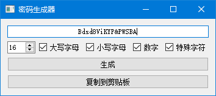
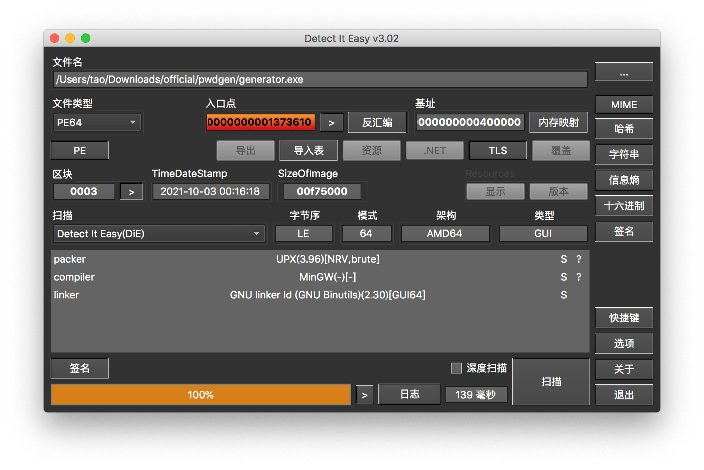
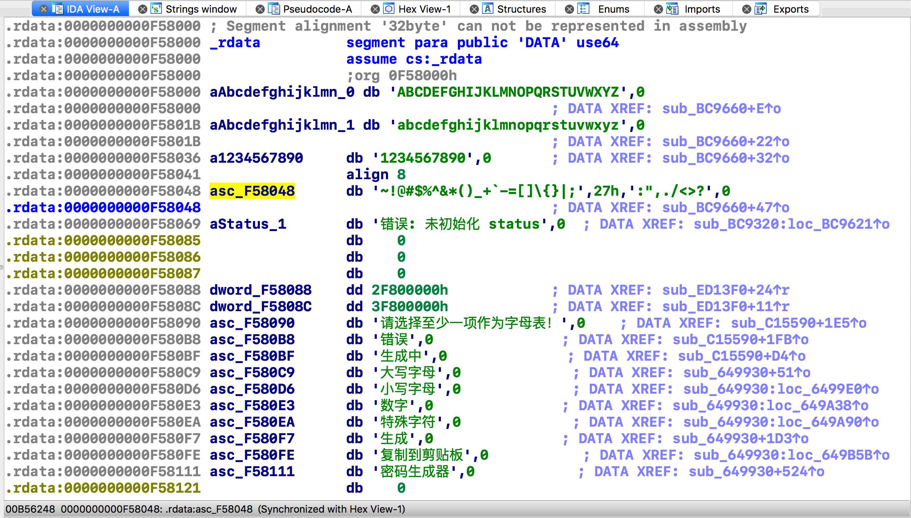
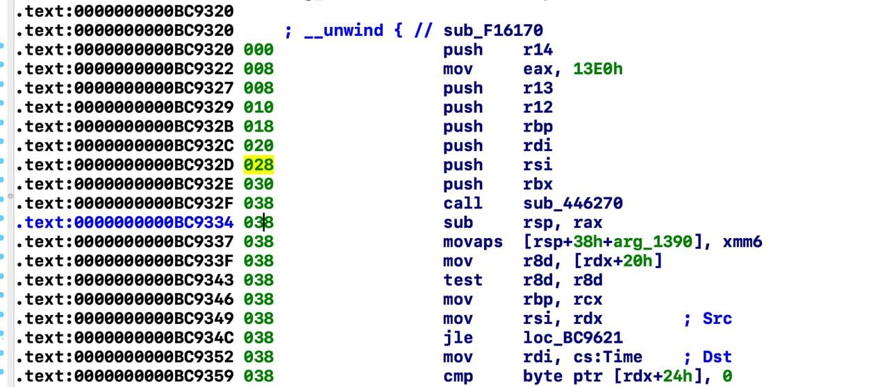

# 密码生成器

题解作者：[taoky](https://github.com/taoky)。本题解得到了 [emc2314](https://github.com/emc2314) 的大力帮助。

出题人、验题人、文案设计等：见 [Hackergame 2021 幕后工作人员](https://hack.lug.ustc.edu.cn/credits/)。

## 题目描述

- 题目分类：binary

- 题目分值：300

- 题目链接：[http://202.38.93.111:15002/?token={token}](http://202.38.93.111:15002/)

小 T 最近又写了一个 web 应用。

他发现很多用户都喜欢设置弱密码，于是决定让所有用户的密码都必须是 16 位长，并且各种符号都要有。为了让大家可以方便生成这样的密码，他还写了一个密码生成器，让用户可以生成符合规则的密码。

但这样果真安全吗？

## 背景

这是一道看起来像 web 的逆向题。灵感来源于卡巴斯基密码管理器的严重漏洞 CVE-2020-27020，题目的很多实现都「借鉴」了漏洞实现（漏洞解析：<https://donjon.ledger.com/kaspersky-password-manager/>，挺有意思的）。

因为我的逆向水平属于只会出逆向题，但是不太会解自己出的逆向题的水平，所以下面的题解可能比较怪异 + 连蒙带猜写的，请多见谅。

## 思路

看网站已知的信息如下：

- 有个用户 admin；
- admin 的邮箱是 admin@example.com（没用），注册时间是 2021-09-22 23:11 (UTC +8)；
- 用户的密码都是 16 位，并且必须至少包含一个数字、一个小写字母、一个大写字母和一个特殊符号；
- 有个「密码生成器」的 Windows 程序 (generator.exe) 可以下载。根据公开展板的信息，admin 的密码是这玩意生成的。

generator.exe 是 64 位的 Windows 程序。我测试的时候，第一版可以在 `wine` 下运行，但是最后放出来的版本不行，可能是因为加了个 UPX 压缩壳？

运行效果如下：



点击生成，会等一秒多，然后出现一个新的「随机」密码，那么问题在哪里呢？只能逆向了。

## 逆向过程

直接拖 IDA/Ghidra 里面是不行的——我加了 UPX 压缩壳（目的并非为了阻挠逆向，只是因为静态链接之后的程序文件太大了，我想在分发的时候弄小一点）。怎么判断是 UPX？我使用的是 [Detect It Easy](https://github.com/horsicq/DIE-engine)。



到 [UPX 官网](https://upx.github.io/)下载，然后 `upx -d generator.exe` 即可：

```console
PS C:\path\to\upx> ./upx -d ..\generator.exe
                       Ultimate Packer for eXecutables
                          Copyright (C) 1996 - 2020
UPX 3.96w       Markus Oberhumer, Laszlo Molnar & John Reiser   Jan 23rd 2020

        File size         Ratio      Format      Name
   --------------------   ------   -----------   -----------
  16154112 <-   6869504   42.52%    win64/pe     generator.exe

Unpacked 1 file.
```

得到的解压后的文件大约 15 MB（可以再拖进 Detect It Easy 看看），可以拖进反编译器了——但是直接拖的结果是：根本找不到程序的逻辑在哪里。因为是静态编译，大量 Qt 的代码也被编译了进去，场面非常混乱。

这种情况下一个方便的办法是找 UI 中出现的字符串，但是鉴于（据我所知）IDA/Ghidra 找 UTF-8 中文字符串的表现并不算好，所以这里搜索字符串我想用 radare2 先看看位置。

```console
$ r2 generator_unpacked.exe
 -- what happens in #radare, stays in #radare
[0x004014b0]> iz | grep 生成
10    0x00b56311 0x00f58111 5    16   .rdata  utf8    密码生成器 blocks=CJK Unified Ideographs
[0x004014b0]> iz | grep 复制
9     0x00b562fe 0x00f580fe 6    19   .rdata  utf8    复制到剪贴板 blocks=CJK Unified Ideographs
[0x004014b0]> axt 0x00f580fe
fcn.00649930 0x649b5b [DATA] lea rcx, [0x00f580fe]
[0x004014b0]> axt 0x00f58111
fcn.00649930 0x649e54 [DATA] lea rcx, [0x00f58111]
[0x004014b0]> afl | grep fcn.00649930
0x00649930   30 1562 -> 1540 fcn.00649930
```

可以得到 UI 中出现的字符串是 UTF-8 的。因为我也不太会用 radare2 进行下一步分析，所以接下来的题解还是用 IDA（

在操作前，将 IDA Options -> General -> Strings 里 Default 8-bit 改成 UTF-8。定位到 0x00f58111 附近的位置，按 A 解析为字符串显示。



这里可以看到 UI 中出现的一些字符串，以及几个特别的字符串。这里入手的点是字符串 `"错误: 未初始化 status"`，会发现真正的逻辑所在的函数是 `sub_BC9320`。

这个函数没有办法直接 F5 反编译，提示 sp-analysis failed。可能是编译器搞出了什么奇怪的优化——我们来修一下。

在 Options -> General -> Disassembly -> Display disassembly line parts 中打开 Stack pointer，显示 sp 的情况。可以看到：




为什么 `retn` 的时候栈不稳定？看函数起始部分会发现 0xbc9334 中 `sub rsp, rax`，但是 IDA 没能分析出来 `rsp` 的变化情况。在当行右键 Change stack pointer，difference 为 -0x13e0 (这个值在 0xbc9322)，就能得到正确的 sp 寄存器变化。

修改后需要右键 Edit function -> OK 来让 IDA 重新分析。然后就可以愉快反编译了：

```c
size_t *__fastcall sub_BC9320(__int64 a1, float a2, __int64 a3, __int64 a4, __int64 a5, __int64 a6, __int64 a7, int a8, int a9, char a10)
{
  __int64 v10; // rdx
  size_t *v11; // rcx
  size_t *v12; // rbp
  __int64 v13; // rsi
  bool v14; // zf
  unsigned int v15; // eax
  signed __int64 v16; // rdx
  unsigned int v17; // ecx
  __int64 v18; // rdx
  int v19; // ecx
  int v20; // er12
  __int64 v21; // rcx
  __int64 v22; // rdx
  size_t v23; // rax
  bool v24; // sf
  unsigned __int8 v25; // of
  _WORD *v26; // rax
  __int16 v27; // r14
  float v28; // xmm0_4
  float v29; // xmm6_4
  __int64 v30; // rdx
  signed int v31; // edx
  char v32; // al
  size_t v33; // rcx
  signed __int32 v34; // et0
  __time64_t *v35; // rcx
  signed __int32 v36; // et0
  __time64_t *v38; // [rsp+28h] [rbp-13F0h]
  size_t v39; // [rsp+30h] [rbp-13E8h]
  __int64 v40; // [rsp+9F0h] [rbp-A28h]
  __int64 v41; // [rsp+A00h] [rbp-A18h]
  char v42; // [rsp+A08h] [rbp-A10h]

  sub_446270(a1);
  v12 = v11;
  v13 = v10;
  if ( *(_DWORD *)(v10 + 32) <= 0 )
  {
    *v11 = sub_B21B40(a1, v10, 27LL, "错误: 未初始化 status");
    return v12;
  }
  v14 = *(_BYTE *)(v10 + 36) == 0;
  v38 = qword_11E9580;
  if ( !v14 )
    sub_B22B70(qword_11E9580, v10, v10, &v38);
  if ( *(_BYTE *)(v13 + 37) )
    sub_B22B70(qword_11E9580, v13, v13 + 8, &v38);
  if ( *(_BYTE *)(v13 + 38) )
    sub_B22B70(qword_11E9580, v13, v13 + 16, &v38);
  if ( *(_BYTE *)(v13 + 39) )
    sub_B22B70(qword_11E9580, v13, v13 + 24, &v38);
  v15 = time64(qword_11E9580);
  v16 = 1LL;
  v17 = v15;
  LODWORD(v39) = v15;
  while ( 1 )
  {
    *((_DWORD *)&v39 + v16) = v16 + 1812433253 * (v17 ^ (v17 >> 30));
    if ( ++v16 == 624 )
      break;
    v17 = *((_DWORD *)&v39 + v16 - 1);
  }
  v40 = 624LL;
  v41 = 4575657221408423936LL;
  memcpy(qword_11E9580, (const void *)v13, (size_t)&v39);
  while ( 1 )
  {
    v19 = *(_DWORD *)(v13 + 32);
    v39 = (size_t)qword_11E9580;
    if ( v19 > 0 )
    {
      v20 = 0;
      while ( 1 )
      {
        v27 = 0;
        sub_ED13F0(qword_11E9580, v13, v18, &v42);
        v28 = a2 * (float)(*((float *)&v41 + 1) - *(float *)&v41);
        v29 = v28 + *(float *)&v41;
        sub_ED13F0(qword_11E9580, v13, v30, &v42);
        v31 = *((_DWORD *)v38 + 1);
        a2 = (float)((float)((float)(v28 * (float)(*((float *)&v41 + 1) - *(float *)&v41)) + *(float *)&v41) * v29)
           * (float)v31;
        if ( (signed int)a2 < v31 )
          v27 = *(_WORD *)((char *)v38 + 2 * (signed int)a2 + v38[2]);
        v23 = v39;
        if ( *(_DWORD *)v39 > 1u )
          break;
        v21 = *(signed int *)(v39 + 4);
        v22 = (unsigned int)(v21 + 2);
        if ( (unsigned int)v22 > (*(_DWORD *)(v39 + 8) & 0x7FFFFFFFu) )
          goto LABEL_17;
LABEL_18:
        ++v20;
        *(_DWORD *)(v23 + 4) = v21 + 1;
        v18 = 0LL;
        v25 = __OFSUB__(*(_DWORD *)(v13 + 32), v20);
        v14 = *(_DWORD *)(v13 + 32) == v20;
        v24 = *(_DWORD *)(v13 + 32) - v20 < 0;
        v26 = (_WORD *)(*(_QWORD *)(v23 + 16) + v23 + 2 * v21);
        *v26 = v27;
        v26[1] = 0;
        if ( (unsigned __int8)(v24 ^ v25) | v14 )
          goto LABEL_23;
      }
      v22 = (unsigned int)(*(_DWORD *)(v39 + 4) + 2);
LABEL_17:
      sub_B20AD0(qword_11E9580, v13, v22, &v39, 1LL);
      v23 = v39;
      v21 = *(signed int *)(v39 + 4);
      goto LABEL_18;
    }
LABEL_23:
    v32 = sub_BC91C0(qword_11E9580, v13, &v39, v13);
    v33 = v39;
    if ( v32 )
      break;
    if ( *(_DWORD *)v39 )
    {
      if ( *(_DWORD *)v39 == -1 )
        continue;
      v34 = _InterlockedSub((volatile signed __int32 *)v39, 1u);
      v33 = v39;
      if ( v34 )
        continue;
    }
    sub_64A030(qword_11E9580, v13, 2LL, v33, 8LL);
  }
  *v12 = v39;
  v39 = (size_t)qword_11E9580;
  if ( !LODWORD(qword_11E9580[0])
    || LODWORD(qword_11E9580[0]) != -1 && !_InterlockedSub((volatile signed __int32 *)qword_11E9580, 1u) )
  {
    sub_64A030(qword_11E9580, v13, 2LL, v39, 8LL);
  }
  v35 = v38;
  if ( !*(_DWORD *)v38
    || *(_DWORD *)v38 != -1 && (v36 = _InterlockedSub((volatile signed __int32 *)v38, 1u), v35 = v38, !v36) )
  {
    sub_64A030(qword_11E9580, v13, 2LL, v35, 8LL);
  }
  return v12;
}
```

看开头的部分可以推断出来 `v10` 的部分可能是一个结构体（类）。而这个结构体的内容不太容易从这个函数获得。所以看 `sub_BC9660`: 引用了各个字母数组的函数（可能是结构体初始化的部分）。从 `sub_BC9660` 以及上面的代码推断的结果，可以在 Subview 里 structure 里新建一个结构体：

```
00000000 status          struc ; (sizeof=0x28, mappedto_87)
00000000 upper           dq ?
00000008 lower           dq ?
00000010 numeric         dq ?
00000018 speical         dq ?
00000020 length          dd ?
00000024 bool_upper      db ?
00000025 bool_lower      db ?
00000026 bool_numeric    db ?
00000027 bool_speical    db ?
00000028 status          ends
```

右键点击对应的变量转换为结构体即可，最开始的逻辑就清楚多了：

```c
if ( v10->length <= 0 )
{
  *v11 = sub_B21B40(a1, v10, 27LL, "错误: 未初始化 status");
  return v12;
}
v14 = v10->bool_upper == 0;
v38 = qword_11E9580;
if ( !v14 )
  sub_B22B70(qword_11E9580, v10, v10, &v38);
if ( v13->bool_lower )
  sub_B22B70(qword_11E9580, v13, &v13->lower, &v38);
if ( v13->bool_numeric )
  sub_B22B70(qword_11E9580, v13, &v13->numeric, &v38);
if ( v13->bool_speical )
  sub_B22B70(qword_11E9580, v13, &v13->speical, &v38);
```

判断是否选择对应的单选框，如果选择，则用 `sub_B22B70` 处理，最后结果存储在 `v38` 里。`qword_11E9580` 看起来是一个空的 `QString` 字符串。它所做的事情猜测是把第三个参数对应的字符串拼在第四个参数字符串后面。

接下来是随机数部分。如果看汇编，这里 `time64()` 的参数实际上是 `ecx` (0)，但是反汇编器没有正确识别，所以参数有点奇怪。生成部分的重点是这个循环：

```c
while ( 1 )
{
  *((_DWORD *)&v39 + v16) = v16 + 1812433253 * (v17 ^ (v17 >> 30));
  if ( ++v16 == 624 )
    break;
  v17 = *((_DWORD *)&v39 + v16 - 1);
}
```

搜索 1812433253，可以确认它是伪随机数生成算法梅森旋转 (Mersenne twister) 使用到的数字，并且这段代码是在初始化算法需要的 MT 数组，**seed 是 `time64(0)` 的返回值。**而 `time64()` 函数返回的是当前时间距离 1970 年 1 月 1 日的秒数，结合之前的信息，我们可以把可能的密码数量情况压到一个很小的范围。

如果继续逆向接下来的部分，高逆向技术力的同学可能能逆向出来随机数是 `std::uniform_real_distribution<float>(0, 1)` + `std::mt19937` 生成的，以及密码生成的具体逻辑。但是很遗憾，我做不到。所以能不能用某种脚本的方式来直接使用源程序的逻辑呢？是可以的。

我们给 `call cs:_time64` 打 patch 成 `mov eax, <常数>` 的形式（多出来的部分填 `nop`）。用 IDA 下断点动态调试，可以发现：

1. `LABEL_18` 处的代码会生成密码的每一个字符，以 UTF-16 的形式存储在内存里。
2. `sub_BC91C0` 可能是一个对生成出来密码的检查（其实是检查是否有要求的字符以及长度对不对的函数），如果不满足一定的要求，会重新开始生成密码。
3. 在跳出外层 `while (1)` 循环之后，生成得到的密码在 `rcx` 寄存器指向位置的附近。

根据这个思路，可以写 IDA Python 脚本，在调试的时候枚举 seed。以下的脚本是 [emc2314](https://github.com/emc2314) 撰写的，这里再次表示感谢。

```python
from idaapi   import *
from idautils import *
from ida_dbg  import *

tx = 1632323400
run_to(0xBC9393)
wait_for_next_event(WFNE_SUSP, -1)
f = open("pwd.txt","w")

while tx < 1632323520:
    cpu.rax = tx
    run_to(0xBC9555)
    wait_for_next_event(WFNE_SUSP, -1)
    passwd = get_bytes(cpu.rcx+24,32).decode('utf-16')
    cpu.rip = 0xBC9518
    run_to(0xBC9400)
    wait_for_next_event(WFNE_SUSP, -1)
    cpu.rip = 0xBC9393
    tx += 1
    f.write(passwd+'\n')
    
f.close()
```

首先划一个在注册时间附近的时间范围 `1632323400` (2021/09/22 23:10:00 UTC+8) 到 `1632323520` (2021/09/22 23:12:00 UTC+8)，以这个范围来爆破密码。`0xBC9393` 是调用 `time64()` 完成后的地址，在这里把 `rax` 改成我们需要的随机数种子，然后运行到 `0xBC9555`（大循环外面，密码已经生成完成的地方），根据 `rcx` 偏移量读取内存，以 UTF-16 编码解析。然后改 `rip` 跳回到密码检查失败的地方 `0xBC9518`，因为密码检查失败之后，会跳到重新生成的逻辑 `0xBC9400`（大循环的最开始部分）。这里再改 `rip` 到 `0xBC9393`，并且 seed 自加 1，继续循环。

保存成 `py` 文件，停在函数开头，然后 Alt + F7 执行即可，可以得到 [`pwd.txt` 文件](./assets/pwd.txt)。

最后（最简单的）一步是爆破 `admin` 的密码：

```python
import requests

s = requests.Session()
s.get("http://202.38.93.111:15002/?token=<urlencode 之后的 token>")
s.get("http://202.38.93.111:15002/login")  # set csrftoken cookie

with open("pwd.txt") as f:
  for pwd in f:
    ret = s.post("http://202.38.93.111:15002/login", data={"username": "admin", "password": pwd, "csrfmiddlewaretoken": s.cookies['csrftoken']})
    if "用户名或密码错误" in ret.text:
        print(pwd, "❌")
    else:
        print(pwd, "✅")
```

```
LHYX#SSa5ySEufXA
 ❌
2xGrMX~V@O*D4ZCg
 ❌
#dHIshAbM5mPVk^I
 ❌
OMDH`YZW8XVtBGlM
 ❌
UeOAQyLE2sF{K6jF
 ❌
uGXAIaRN[xPrP0PA
 ❌
XyD=yfl)dL5pvhq#
 ❌
$Z=CBDL7TjHu~mEX
 ✅
```

得到 `$Z=CBDL7TjHu~mEX` 是 admin 的密码。登录就能看到 flag 了。

## 附录

就算修了这个大问题，这个密码生成器仍然不是很安全。因为逻辑是按照开头给的链接里的描述模仿的，另一个问题也顺便「模仿」了过来：

```cpp
for (auto i = 0; i < status.length; i++)
{
    auto r1 = mtrand();
    auto r2 = mtrand();
    auto pos = int(r1 * r2 * alphabet.length());
    password += alphabet[pos];
}
```

**这里得到的「随机 index」`pos` 事实上分布并不随机，而是会更偏向于偏小的值**。具体的数学分析链接里有，这里就不重复了。


