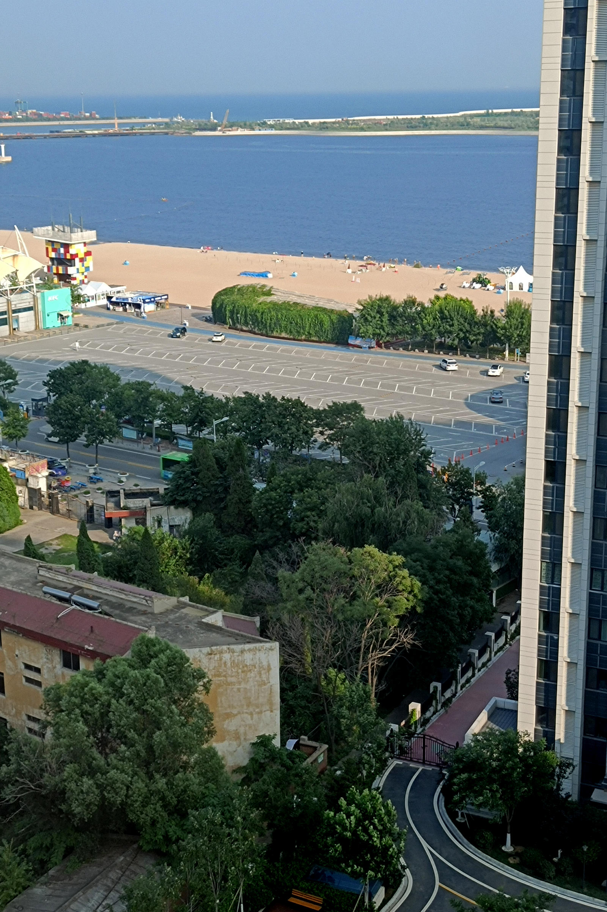

# 旅行照片

题解作者：[Yanbing Zhao](https://github.com/ustc-zzzz)

出题人、验题人、文案设计等：见 [Hackergame 2021 幕后工作人员](../../credits.pdf)。

## 题目描述

- 题目分类：general

- 题目分值：150

- 题目链接：[http://202.38.93.111:10055/](http://202.38.93.111:10055/)

你的学长决定来一场说走就走的旅行。通过他发给你的照片来看，他应该是在酒店住下了。

从照片来看，酒店似乎在小区的一栋高楼里，附近还有一家 KFC 分店。突然，你意识到照片里透露出来的信息比表面上看起来的要多。

请观察照片并答对全部 5 道题以获取 flag。注意：图片未在其他地方公开发布过，也未采取任何隐写措施（通过手机拍摄屏幕亦可答题）。

## 出题背景

这张照片是我今年夏天去秦皇岛旅游的时候（8 月 6 日）拍摄的，所以说可能和我比较熟悉的人已经猜出来了。不过图上的 KFC 其实我也没去过——由于我的出发地（北京）有一地升为中风险，我很快便被 2 + 14 + 14 了：前两天居家隔离（因为隔离酒店没多余房间），中间十四天五星级酒店（不是这个酒店）集中隔离，最后十四天居家隔离。换言之，这五道题其实也是我在酒店里自己分析出来的——当然感兴趣的读者可以实地考察一下。

## 第一题

> 该照片拍摄者的面朝方向为？

可以注意到图片下半部分的左侧有两个太阳能热水器——太阳能热水器几乎一定面朝正南（South），因此可推得拍摄者的面朝方向为东南（Southeast）。

## 第二题

> 该照片的拍摄时间大致为？

通过建筑的阴影可以注意到太阳几乎从正西侧照射而来，故为傍晚（17:00 左右）。事实上该照片的拍摄时间为 16:48（当然通过照片本身几乎不可能分析得这么准确了）。

## 第三题

> 该照片的拍摄者所在楼层为？

我怀疑这道题很多人是穷举出来的……不过其实是可以推断出来的。照片上方有一处较为明显的天地交界线（较深和较浅蓝色的分界线），这条线对应的是水平面，换言之，照片上落在这条线上的所有点，其海拔高度均和拍摄者相同。那么通过照片右侧的建筑可以数出来对面高楼的 14 楼和拍摄者处于同一高度下。再根据「小区内每栋楼的层高和海拔均相同」，可推得拍摄者位于 14 楼。

## 第四题

> 该照片左上角 KFC 分店的电话号码是？

Fine……我其实也没想到那是家网红 KFC。从照片以及「活海鲜」三个字可以看出拍摄地位于中国大陆的海边，然后使用搜索引擎搜索「海边的 KFC」可以找到一些诸如「国内唯一一家在海边的 KFC」（其实并不是）之类的文章。经过比对内容很快便可得出这家 KFC 和照片里的确实是同一家——秦皇岛新澳海底世界店。在地图 APP 里检索相关内容便可查到电话号码是 0335-7168800。

我听说有人照着占位符上的电话打了过去——那个是 USTC 保卫处的电话。

当然，我们也不鼓励各位朝那家 KFC 打电话，嗯。

## 第五题

> 该照片左上角 KFC 分店左侧建筑有三个水平排列的汉字，它们是？

通过百度街景或者其他人拍摄的照片可以看出该家 KFC 附近贴着「海豚馆」三个黑色水平大字。

## FLAG

FLAG 是 `flag{D0n7-5hare-ph0t05-ca5ua11y}`，主要是在提醒各位不要随随便便发自己的照片（Don't share photos casually）——否则被人扒个底裤都不剩也只是分分钟的事。
