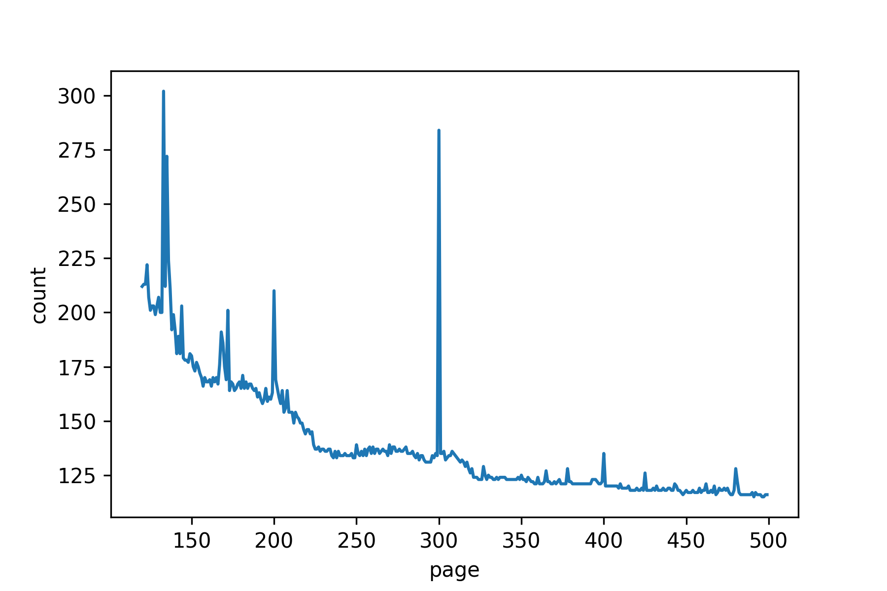
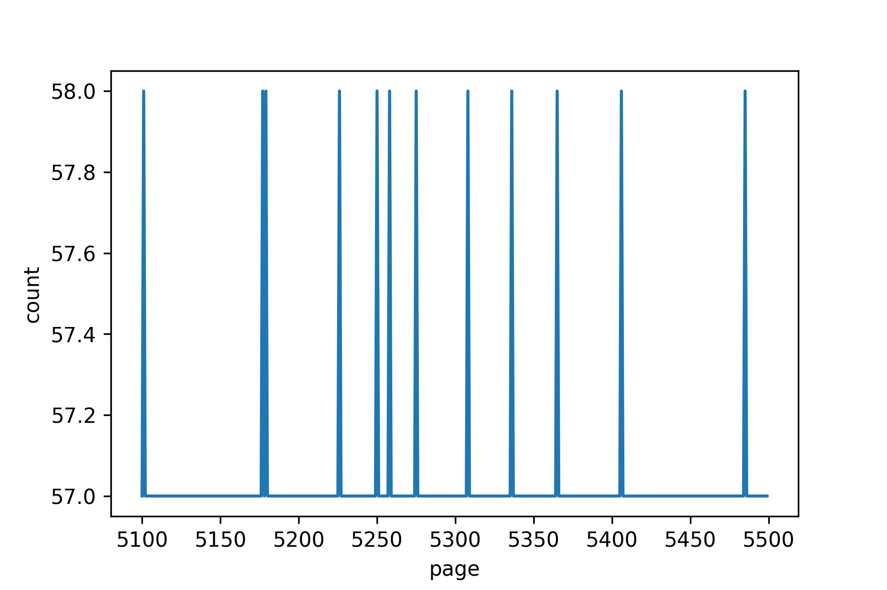

# 签到

题解作者：[taoky](https://github.com/taoky), [volltin](https://github.com/volltin)

出题人、验题人、文案设计等：见 [Hackergame 2021 幕后工作人员](https://hack.lug.ustc.edu.cn/credits/)。

## 题目描述

- 题目分类：web

- 题目分值：50

- 题目链接：[http://202.38.93.111:10000/?token={token}](http://202.38.93.111:10000/)

为了能让大家顺利签到，命题组把每一秒的 flag 都记录下来制成了日记本的一页。你只需要打开日记，翻到 Hackergame 2021 比赛进行期间的任何一页就能得到 flag！

提示：完成题目遇到困难？你可以参考 [2018 年签到题题解](https://github.com/ustclug/hackergame2018-writeups/tree/master/official/qiandao)、[2019 年签到题题解](https://github.com/ustclug/hackergame2019-writeups/blob/master/official/%E7%AD%BE%E5%88%B0%E9%A2%98/README.md) 和 [2020 年签到题题解](https://github.com/USTC-Hackergame/hackergame2020-writeups/blob/master/official/%E7%AD%BE%E5%88%B0/README.md)。

## 题解

与往年不同的是，今年的签到题需要少许计算或者测试。

首先日记的第一页是 1970 年 1 月 1 日 8:00 (UTC+8)，也是 UNIX 时间戳的最起始位置。点击 Previous 可以跳到上一秒，点击 Next 可以跳到下一秒。

题目的目标是跳转到今年比赛期间的时间。首先在点击任意按钮后都可以观察到地址栏有变化：`http://202.38.93.111:10000/?page=0`，把 0 改成需要的页数就可以跳到那一页。当然，直接上手猜是可以的。除此之前，以下介绍两种可行的思路和一种不可行的思路。

### 准确计算比赛时间距离 1970/1/1 8:00 的时间差（UNIX 时间戳）

有很多在线工具都可以做到这一点。在比赛期间网络搜索，[随](https://www.unixtimestamp.com/)[便](https://www.epochconverter.com/)[挑](https://tool.chinaz.com/tools/unixtime.aspx)[一](https://c.runoob.com/front-end/852/)[个](https://www.nexcess.net/web-tools/unix-timestamp-converter/)，将得到的时间戳输入页数参数访问即可。

### 二分法

二分法可以以 `O(log N)` 的时间复杂度得到答案。以下是一个例子（起始点为 0）：

1. 测试 `100000000000`，太大 => (100000000000 + 0) / 2 = 50000000000
2. 测试 `50000000000`，太大 => (50000000000 + 0) / 2 = 25000000000
3. 测试 `25000000000`，太大 => (25000000000 + 0) / 2 = 12500000000
4. 测试 `12500000000`，太大 => (12500000000 + 0) / 2 = 6250000000
5. 测试 `6250000000`，太大 => (6250000000 + 0) / 2 = 3125000000
6. 测试 `3125000000`，太大 => (3125000000 + 0) / 2 = 1562500000
7. 测试 `1562500000`，太小（2019 年）=> (1562500000 + 3125000000) / 2 = 2343750000
8. 测试 `2343750000`，太大 => (1562500000 + 2343750000) / 2 = 1953125000
9. 测试 `1953125000`，太大 => (1562500000 + 1953125000) / 2 = 1757812500
10. 测试 `1757812500`，太大（2025 年）=> (1562500000 + 1757812500) / 2 = 1660156250
11. 测试 `1660156250`，太大（2022 年）=> (1562500000 + 1660156250) / 2 = 1611328125
12. 测试 `1611328125`，太小（2021 年 1 月）=> (1611328125 + 1660156250) / 2 = 1635742187
13. 测试 `1635742187`，太大（2021 年 11 月）=> (1611328125 + 1635742187) / 2 = 1623535156
14. 测试 `1623535156`，太小（2021 年 6 月）=> (1623535156 + 1635742187) / 2 = 1629638671
15. 测试 `1629638671`，太小（2021 年 8 月）=> (1629638671 + 1635742187) / 2 = 1632690429
16. 测试 `1632690429`，太小（2021 年 9 月）=> (1632690429 + 1635742187) / 2 = 1634216308
17. 测试 `1634216308`，太小（2021 年 10 月 14 日）=> (1634216308 + 1635742187) / 2 = 1634979247
18. `1634979247` 得到答案（2021-10-23 16:54:07 +08:00）

### 不可行的解法

使用按键精灵/鼠标连点器是不可行的。因为最小的数值是 1634961600（2021-10-23 12:00:00 +08:00）。乐观假设每次点击跳转到下一页只需要 10 毫秒，那么从 0 点到 1634961600 需要 16349616000 毫秒 = 16349616 秒 = 189.231667 天 >> 7 天，需要半年时间才能点出结果。

### 一些统计信息

我们观察到一些毅力过人的选手在 100 页左右就逐渐放弃了理想，但也有约 57.5 位选手直到第 5000 页都还在坚持：

