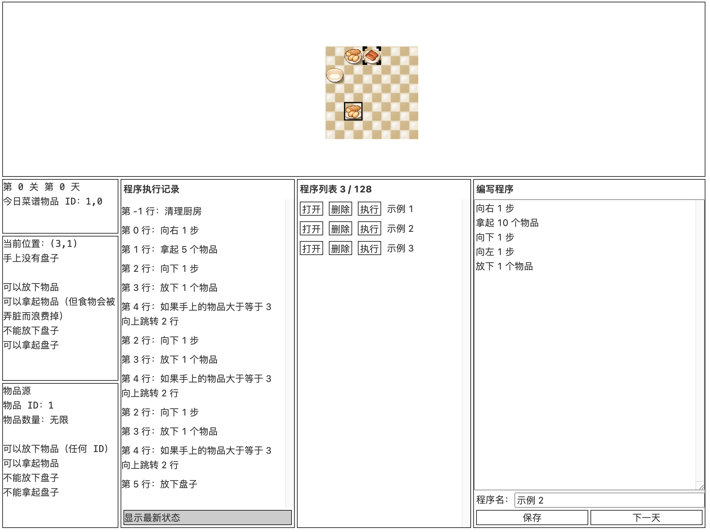
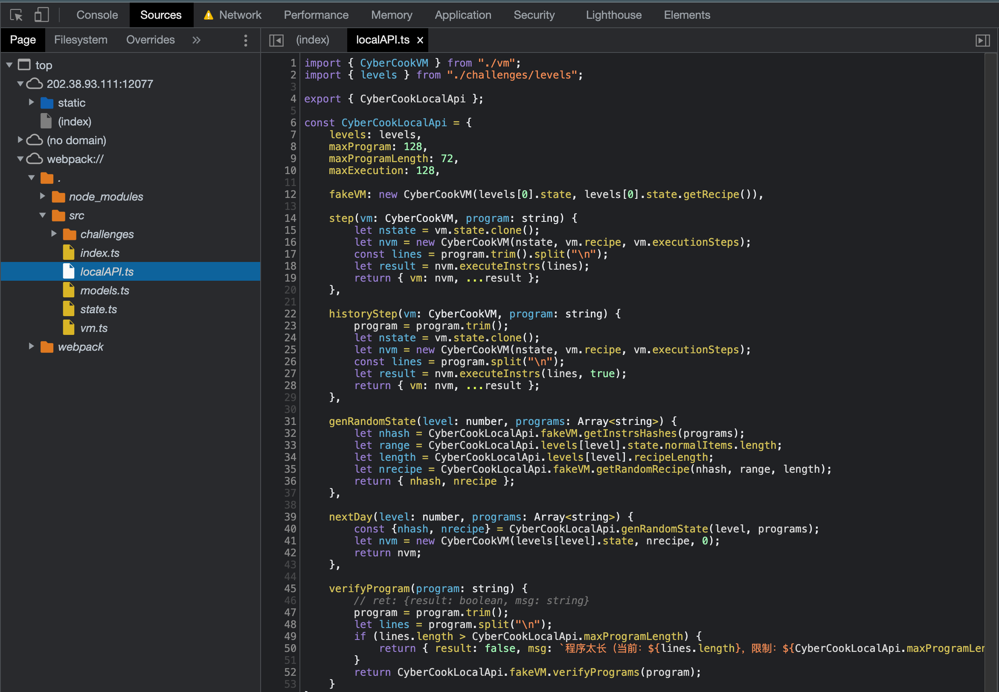

# 赛博厨房题解

TL;DR: 前两关教学，第三关改变程序中的一部分来枚举得到一个会做的菜谱，第四关枚举 + 用地上的盘子来编码和解码；

## 题目简介

这是一个自定义指令集的做菜游戏，在一定的限制条件下，玩家通过程序控制机器人完成做菜。

想要通过前两关，玩家只需要大致理解厨房的运行机制和指令用法；想要通过第三关，玩家需要知道 hash 和随机数产生器的一些基本性质、能阅读和编写简单的程序；想要通过第四关，玩家还需要对游戏机制有全面的理解、了解图灵机、能编写较为复杂的程序。



## 基本概念和指令集

打开赛博厨房界面可以看到，有方格地图，每个方格上有或者没有东西，不同的东西通过鼠标悬浮的方式可以看到能进行哪些操作（比如能不能放下盘子）。机器人当前的位置用黑色框表示，左侧也可以看到机器人手上目前有什么东西。经过尝试可以熟悉这些基本概念和模型。

### 基本概念

- 物品源：提供无限个某种物品，机器人走到这个格子的时候就可以拿起；
- 锅：每次可以往锅里放一种东西，这会被记录到已经放的物品里，如果已经放的物品和今日菜谱一样，就可以胜利；
- 空地：空地上可以放盘子，如果直接往没有盘子的空地放物品，物品就会消失；
- 手：手上可以放盘子；
- 盘子：盘子可以出现在机器人手上和空地上，盘子中间可以放任意多个物品，但必须是同一种；
- 指令：包括了移动和拿起放下物品和盘子，也有一些条件跳转指令；
- 程序：一串指令，机器人按照指令依次执行；
- 执行历史：可以看到程序执行的记录，点击可以看到某一条指令执行完之后厨房的状态；
- 清理厨房：每次执行程序之前无法绕过的一个步骤，整个地图的所有有限物品（包括锅里，盘子里）都会被清理掉，清理的物品会消失，然后机器人会拿上盘子回到 (0,0) 待命；
- 学习：添加的程序需要花一天时间才能学会，学会之后就可以随意执行；
- 下一天：每次下一天菜谱都有可能发生变化，长度不变，似乎可以观测到如果没有新学习的程序菜谱是不会变化的；

### 指令集

指令是整个赛博厨房最核心的概念，可以用的指令有：

```
向上 n 步
向下 n 步
向左 n 步
向右 n 步
放下 n 个物品
拿起 n 个物品
放下盘子
拿起盘子
如果手上的物品大于等于 n 向上跳转 m 行
如果手上的物品大于等于 n 向下跳转 m 行
```

指令的意思比较清晰，不用过多解释，具体的用法可以从示例程序中看出。

关于移动，如果机器人撞到地图边界就不会继续前进，这个特性在自己位置不确定但又想到一个确定的位置去的时候会有一些作用。所有指令都不会报错，在不合适的地方执行一些指令会导致没有任何事情发生。

## 示例程序

### 示例 1

这个示例展示移动、拿取物品和盘子的基本用法。

<details>

<summary>示例 1 程序</summary>

```
向右 1 步
拿起 1 个物品
向下 2 步
放下 1 个物品
向下 1 步
放下盘子
```

</details>

<details>

<summary>示例 1 解释</summary>

机器人先进行清理厨房操作，然后从 `(0, 0)` 出发，先向右一步到达 `(1, 0)`，这是 ID 为 0 的物品源的位置，然后拿起 1 个物品，这个物品会出现在机器人的手上，再向下走 2 步到达 `(1, 2)`，这是一个空地，机器人放下 1 个物品，物品消失了，机器人手上只剩下一个空盘子，然后机器人再向下走 1 步到达 `(0, 3)`，然后放下盘子，此时机器人手里什么都没有了，地面上出现了一个盘子。这个过程可以结合程序执行记录来理解。

</details>

### 示例 2

这个示例展示和锅交互的方法。

<details>

<summary>示例 2 程序</summary>

```
向右 1 步
拿起 10 个物品
向下 1 步
向左 1 步
放下 1 个物品
```

</details>

<details>

<summary>示例 2 解释</summary>

机器人先进行清理厨房操作，然后从 `(0, 0)` 出发，先向右一步到达 `(1, 0)`，这是 ID 为 0 的物品源的位置，然后拿起 10 个物品，这个物品会出现在机器人的手上，再向下走 `1` 步到达 `(1, 1)`，向左走 1 步到达 `(0, 1)`，这是一个锅，机器人放下 1 个物品，锅里出现了 1 个 ID 为 0 的物品，机器人手上还剩下 9 个 ID 为 0 的物品。这个过程可以结合程序执行记录来理解。

</details>

### 示例 3

这个示例展示循环的写法。


<details>

<summary>示例 3 程序</summary>

```
向右 1 步
拿起 5 个物品
向下 1 步
放下 1 个物品
如果手上的物品大于等于 3 向上跳转 2 行
放下盘子
```

</details>

<details>

<summary>示例 3 解释</summary>

机器人先进行清理厨房操作，然后从 `(0, 0)` 出发，先向右一步到达 `(1, 0)`，这是 ID 为 0 的物品源的位置，然后拿起 5 个物品，这些物品会出现在机器人的手上，[loop] 再向下走 `1` 步，此时机器人放下 1 个物品，然后进行判断，如果手上的物品大于等于 3，则回到 [loop] 的地方执行，那么直到机器人放下 3 个东西，已经向下 3 步，到了 `(1, 3)`，然后放下盘子，此时机器人放下盘子（包括里面剩下的 2 个物品），地面上出现了一个盘子。这个过程可以结合程序执行记录来理解。

</details>

### 注意

以上分析都是指从一个全新的厨房开始分别执行示例 1，2，3 得到的结果，有的选手可能会发现执行示例 1 之后再执行示例 3 会有奇怪的现象发生，这是因为示例 1 中放下的盘子不会被清理厨房的操作清理掉，这是一个铺垫。

## Level 0 解法

这一关中只有 2 种物品，随机生成的菜谱也就只有可能有 `[0,0]`, `[0,1]`, `[1,0]`, `[1,1]` 四种。

如果只写一个程序，比如做 `[0,0]` 这个菜的程序，在下一天的时候菜谱可能就不是 `[0,0]` 了，所以不妨写四个程序，分别做这四种菜，然后看一下菜谱需要哪个就执行哪个。

参考答案见附录。

## Level 1 解法

这一关只有 1 种物品，但是菜谱比较长，有 73 长度，那么先多拿一点东西在手上，走到锅上用循环一个一个放就好了。

为什么不能不用循环，因为每次 `放下 1 个物品` 或者 `放下 10 个物品` 都只能把菜谱推进 1 个，需要至少 73 个指令才能完成菜谱，如果你试过，就会得到程序太长的错误提示。

参考答案见附录。

## Level 2 解法

这一关共有 32 种物品，菜谱长度为 6，也就是说一共有可能出现 32^6 = 1073741824 个菜谱，使用第一关的技巧，会发现最多能添加 128 个程序。这一关需要选手观察到，如果程序发生变化，菜谱也会发生变化（如果选手能阅读 javascript 和 typescript
源代码，可以在浏览器控制台看到，这一过程是通过先对全部程序内容进行 hash，然后以此作为种子产生随机数来实现的），那么我们可以写 128 个程序，他们能做 128 种不同的菜（比如：`[1, 2, 3, 4, 5, 6]`，`[3, 6, 23, 15, 31, 0]`，……），然后我们进入下一天，如果恰好今日菜谱是我们能做的 128 个菜之一，我们就执行一下那个程序；如果我们没法做出今日菜谱，就稍微改改程序（只要有任何一点改动就行），然后再进入下一天，这时候菜谱又会不一样。

这个做法有赌的成分，有可能第一次尝试就有能做的菜，虽然这样的概率只有大约 0.000000119209 （ =1-(32^6-128)/32^6 ），但是期望上重复约 8388628 次就真的能发生这样的事情了。

这个数字是一个合理的数字，大家可以通过编写程序在自己的电脑上自动化地完成尝试（不需要提交网络请求），在我的个人电脑上一个核每秒可以枚举 25000 次，期望上 335 秒能得到一个结果。

参考答案见附录。

## Level 3 解法

这一关共有 128 种物品，菜谱长度为 8，可能的菜谱达到了 128^8 = 72057594037927936 个，还是按照枚举的方法，需要的时间已经不太合理了。但是这一关提供了 56 块空地，经过尝试或阅读代码可以发现，每次执行一个程序清理厨房都会得到一个新盘子，而且放在地上的盘子不会被下一次清理厨房的操作清空。

那么我们可以尝试写一些放盘子和读盘子的程序，在进入新的一天看到菜谱后，通过盘子在不同的程序之间传递信息，使得地面上的盘子能表达出今天的菜谱是什么（比如，我们可以让前 7 bit 表示第一个菜谱物品的 ID，用二进制表示）。注意到菜谱的信息量共有 log(72057594037927936) = 56 bits，一个空地有放盘子和不放盘子两种状态，提供 1 bit 信息，所以看起来空地数量是刚刚好。

放盘子的程序很好实现：

```
向右 x 步
向下 1 步
放下盘子
```

读盘子的程序也很好实现：

```
# 保持现在手上有 1 个物品
放下 1 个物品
拿起 1 个物品
如果手上的物品大于等于 1 向下跳转 x 行
如果手上的物品大于等于 0 向下跳转 y 行
# x 行后，一些有盘子的操作
# y 行后，一些没盘子的操作
```

读盘子还可以不使用 `if-else` 的模式，而是直接多次拿起来累加结果，比如下面 `_` 代表盘子：

```
_ x _ _ _ x _
```

可以写一个程序从左到右分别放 1, 2, 4, 8, 16, 32, 64 个物品，然后从左到右拿起 1, 2, 4, 8, 16, 32, 64 个物品，手上会得到 1 + 4 + 8 + 16 + 64 = 93 个物品。这一段程序是完全静态的，不需要任何判断。

除了读写盘子，还有一些基本操作，如向前走手上的盘子这么多步，可以通过循环来实现，在物品源上移动时，我特意设置了随时可以扔掉东西，所以可以通过每走一步扔掉一个东西来走特定步数：

```
向前走 1 步
放下 1 个物品
如果手上的物品大于等于 1 向上跳转 2 行
```

有了这些基本能力，剩下的工作是设置好 56 个放盘子程序，用于编码你今天看到的菜谱，一个 runner，用来读取编码，实际做菜。

实际实现时，因为目前机器人的状态只能由程序指针（当前行数）和手上的物品数量表示，在程序长度 72 的限制下，程序会比较难写，为了方便我们可以把一部分地面空出来当作寄存器使用，这就要求我们稍微降低菜谱的信息量，使用 Level 2 的技巧即可，如果通过改变程序得到一个末尾固定是 0 的菜谱，那么菜谱的信息量从 56 bits 降为了 49 bits。

参考答案见附录。

## Take-home questions

如果有无限大的二维地面，赛博厨房是否是图灵完备的？

## 附录

### Level 0 参考答案

程序 1~4：

```
# 放一个 ID 0
向右 1 步
拿起 1 个物品
向下 1 步
向左 1000 步
放下 1 个物品
向上 1 步
# 放一个 ID 0
向右 1 步
拿起 1 个物品
向下 1 步
向左 1000 步
放下 1 个物品
```

```
# 放一个 ID 0
向右 1 步
拿起 1 个物品
向下 1 步
向左 1000 步
放下 1 个物品
向上 1 步
# 放一个 ID 1
向右 2 步
拿起 1 个物品
向下 1 步
向左 1000 步
放下 1 个物品
```

```
# 放一个 ID 1
向右 2 步
拿起 1 个物品
向下 1 步
向左 1000 步
放下 1 个物品
向上 1 步
# 放一个 ID 0
向右 1 步
拿起 1 个物品
向下 1 步
向左 1000 步
放下 1 个物品
```

```
# 放一个 ID 1
向右 2 步
拿起 1 个物品
向下 1 步
向左 1000 步
放下 1 个物品
向上 1 步
# 放一个 ID 1
向右 2 步
拿起 1 个物品
向下 1 步
向左 1000 步
放下 1 个物品
```

### Level 1 参考答案

```
向右 1 步
拿起 114514 个物品
向左 1 步
向下 1 步
放下 1 个物品
如果手上的物品大于等于 1919 向上跳转 1 行
```

### Level 2 参考答案

为了方便之后判断菜谱，我们只考虑生成前面 4 个都是 0 的菜，第 5 个小于 4，第 6 个随意的菜谱，刚好 128 个。

比如生成 `[0, 0, 0, 0, 3, 28]` 的程序这么写：

```
向右 1 步
拿起 4 个物品
向左 100 步
放下 1 个物品
放下 1 个物品
放下 1 个物品
放下 1 个物品

向右 4 步
拿起 1 个物品
向左 100 步
放下 1 个物品

向右 29 步
拿起 1 个物品
向左 100 步
放下 1 个物品
```

然后随便找个程序加点注释就可以（或者加一些无关紧要的指令或换行在后面）都可以改变 hash，进而改变菜谱。

为了方便大家自动化，我们已经在前端添加了一些编程接口，可以直接在浏览器控制台执行，下面是一个参考的方式：

```javascript
// 生成固定程序
function genProgram(i, j) {
    return "向右 1 步\n拿起 4 个物品\n向左 100 步\n放下 1 个物品\n放下 1 个物品\n放下 1 个物品\n放下 1 个物品\n向右 " + (i+1) + " 步\n拿起 1 个物品\n向左 100 步\n放下 1 个物品\n向右 " + (j+1) + " 步\n拿起 1 个物品\n向左 100 步\n放下 1 个物品\n";
}
// 生成随机程序
function genRandomProgram() {
    var i = Math.floor(Math.random() * 99999999999);
    return "# nonce = " + i;
}

function genFirst127Program() {
    var programs = [];
    for (var i = 0; i < 4; i++) {
        for (var j = 0; j < 32; j++) {
            programs.push(genProgram(i, j));
        }
    }
    programs.pop();
    return programs;
}

// 尝试一次
function fire(programs) {
    var randomProgram = genRandomProgram();
    programs.push(randomProgram);

    // 得到菜谱
    var recipe = CyberCook.genRandomState(2 /*lv2*/, programs).nrecipe;

    if (recipe[0] == 0 && recipe[1] == 0
     && recipe[2] == 0 && recipe[3] == 0
     && recipe[4] < 4
    ) {
        console.log("Success!");
        console.log(recipe);
        console.log(randomProgram);
        return true;
    }

    programs.pop();
    return false;
}

var fisrt127Programs = genFirst127Program();
// 循环 1 万次，估计一下时间
for (var i = 0; i < 10000; i ++) { if (fire(fisrt127Programs)) break; };

// 循环更多次，如果没成功就继续，直到成功，可能要花不少时间
for (var i = 0; i < 5000000; i ++) { if (fire(fisrt127Programs)) break; };

// 把这些程序添加到程序列表

var programs = fisrt127Programs.concat(["# nonce = 26877451365"]);

app.programs = programs.map( (x, i) => { return { content: x, name: i }; });
```

然后点击下一天，根据菜谱选择一个程序执行即可。

另外给出一个可以直接在前端看到效果的答案，直接在浏览器控制台运行下面的代码即可：

```javascript
function genProgram(i, j) {
    return "向右 1 步\n拿起 4 个物品\n向左 100 步\n放下 1 个物品\n放下 1 个物品\n放下 1 个物品\n放下 1 个物品\n向右 " + (i+1) + " 步\n拿起 1 个物品\n向左 100 步\n放下 1 个物品\n向右 " + (j+1) + " 步\n拿起 1 个物品\n向左 100 步\n放下 1 个物品\n";
}
function genFirst127Program() {
    var programs = [];
    for (var i = 0; i < 4; i++) {
        for (var j = 0; j < 32; j++) {
            programs.push(genProgram(i, j));
        }
    }
    programs.pop();
    return programs;
}
var fisrt127Programs = genFirst127Program();
var programs = fisrt127Programs.concat(["# nonce = 4408784915"]);
app.programs = programs.map( (x, i) => { return { content: x, name: i }; });
app.nextDay();
app.runProgram(app.programs[5]);
```

最后，因为接口里面会重复计算 hash（指前 127 个程序），这样来枚举是比较慢的，还可能造成电脑烫手等现象。如果有选手愿意读一下代码（所有游戏逻辑都提供了 Source Map，在 `webpack://` 中可以看到），看一下 hash 函数和 seedrandom 用的算法，可以自己写出更高效的枚举。



比如：

```python
import hashlib
import random
import requests
from tqdm import tqdm
from Crypto.Cipher import ARC4

programs = []
for i in range(4):
    for j in range(32):
        programs.append(f"向右 1 步\n拿起 4 个物品\n向左 100 步\n放下 1 个物品\n放下 1 个物品\n放下 1 个物品\n放下 1 个物品\n向右 {i+1} 步\n拿起 1 个物品\n向左 100 步\n放下 1 个物品\n向右 {j+1} 步\n拿起 1 个物品\n向左 100 步\n放下 1 个物品")

programs = programs[:-1]
programs = [x.strip() for x in programs]

print(len(programs)) # 127

hash = lambda s: hashlib.sha256(s.encode()).hexdigest()
nextint = lambda rng: int.from_bytes(rng.encrypt(b"\x00" * 4), "big") % 32

fixed_hashes = '\n'.join(list(map(hash, programs)))
s = None
for _ in tqdm(range(9000000)):
    nonce = random.randint(0, 99999999999)
    s = '# nonce = ' + str(nonce)
    program_hashes = fixed_hashes + '\n' + hash(s)
    seed = hash(program_hashes)
    rng = ARC4.new(seed.encode(), drop=256)
    if any(nextint(rng) != 0 for _ in range(4)):
        continue
    if nextint(rng) >= 4:
        continue
    else:
        print(s, seed)
        break

"""
运气不错，1 分钟 30 秒就跑出来了
 12%|█▏        | 1064325/9000000 [01:30<11:17, 11715.88it/s]
 # nonce = 4408784915 716bef304c1a0b1b3c61c59f1c51edecee243d00f80434efe6be7cb3eb26aa82
"""

all_programs = programs + [s]
program_hashes = '\n'.join(map(hash, all_programs))
seed = hash(program_hashes)
rng = ARC4.new(seed.encode(), drop=256)
recipe = [nextint(rng) for _ in range(6)]
exe_id = recipe[4] * 32 + recipe[5]
print(recipe, exe_id, programs[exe_id])

# 直接调用验证接口
TOKEN = "11:..."
ret = requests.post("http://202.38.93.111:12077/verify", json={'token': TOKEN,'level':2, 'seed': seed, 'programs': all_programs,'executions': [exe_id]})
print(ret.text)
```

### Level 3 参考答案

```javascript
function setbit(i) { return "向右 " + i + " 步\n向下 1 步\n放下盘子"; }
function runner() { return "拿起 1050 个物品\n向下 1 步\n放下 141 个物品\n向右 1 步\n放下 146 个物品\n向右 1 步\n放下 151 个物品\n向右 1 步\n放下 156 个物品\n向右 1 步\n放下 161 个物品\n向右 1 步\n放下 166 个物品\n放下 1 个物品\n向右 1 步\n如果手上的物品大于等于 127 向上跳转 2 行\n放下 2 个物品\n向右 1 步\n放下 4 个物品\n向右 1 步\n放下 8 个物品\n向右 1 步\n放下 16 个物品\n向右 1 步\n放下 32 个物品\n向右 1 步\n放下 64 个物品\n拿起 64 个物品\n向左 1 步\n拿起 32 个物品\n向左 1 步\n拿起 16 个物品\n向左 1 步\n拿起 8 个物品\n向左 1 步\n拿起 4 个物品\n向左 1 步\n拿起 2 个物品\n向左 1 步\n拿起 1 个物品\n向左 128 步\n向上 1 步\n如果手上的物品大于等于 1 向下跳转 2 行\n如果手上的物品大于等于 0 向下跳转 4 行\n向右 1 步\n放下 1 个物品\n如果手上的物品大于等于 1 向上跳转 2 行\n拿起 1 个物品\n向右 128 步\n向下 1 步\n放下 1 个物品\n向左 128 步\n拿起 141 个物品\n如果手上的物品大于等于 1 向上跳转 40 行\n向右 1 步\n拿起 147 个物品\n如果手上的物品大于等于 1 向上跳转 43 行\n向右 1 步\n拿起 153 个物品\n如果手上的物品大于等于 1 向上跳转 46 行\n向右 1 步\n拿起 159 个物品\n如果手上的物品大于等于 1 向上跳转 49 行\n向右 1 步\n拿起 165 个物品\n如果手上的物品大于等于 1 向上跳转 52 行\n向右 1 步\n拿起 171 个物品\n如果手上的物品大于等于 1 向上跳转 55 行\n拿起 1 个物品\n向右 128 步\n放下 1 个物品"; }
function genRandomProgram() {
    return "# nonce = " + Math.floor(Math.random() * 99999999999);;
}

function fire(programs) {
    var randomProgram = genRandomProgram();
    programs.push(randomProgram);

    var recipe = CyberCook.genRandomState(3 /*lv3*/, programs).nrecipe;

    if (recipe[7] == 0) {
        console.log("Success!");
        console.log(recipe);
        console.log(randomProgram);
        return randomProgram;
    }

    programs.pop();
    return false;
}

// 56 setbit + 1 runner
var programs = Array(56).fill(0).map( (_, i) => { return setbit(i); });
programs.push(runner());

// try
for (var i = 0; i < 1000; i++) {
    var randomProgram = fire(programs)
    if(randomProgram) {
        break;
    }
}

var recipe = CyberCook.genRandomState(3 /*lv3*/, programs).nrecipe;

var executions = [0,1,2,3,4,5,6];
// first 7 item IDs
for (var i = 0; i < recipe.length - 1; i++) {
    for (var j =0; j < recipe.length - 1; j++) {
        if (recipe[i] & (1 << j)) {
            executions.push(i*7+7+j);
        }
    }
}
// push runner
executions.push(56);

app.programs = programs.map( (x, i) => { return { content: x, name: i }; });
app.nextDay();
executions.map( id => { app.runProgram(app.programs[id]); });
```
