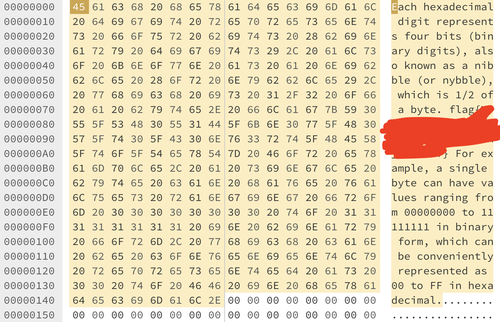
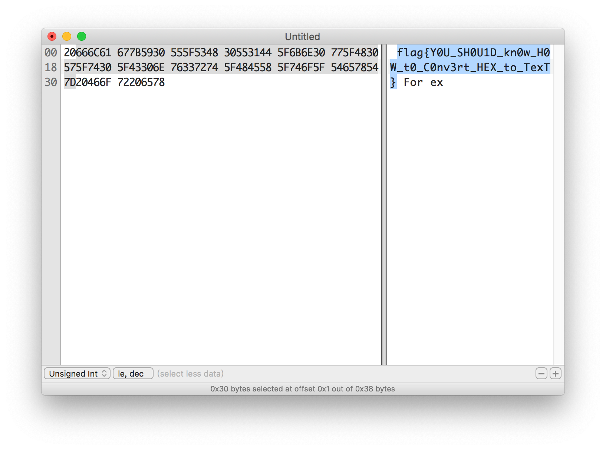
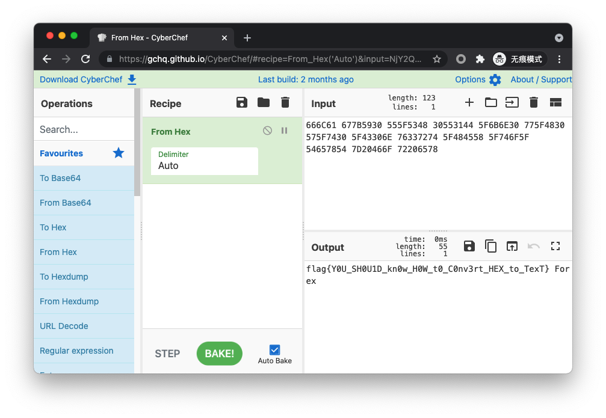

# 进制十六——参上

题解作者：[taoky](https://github.com/taoky)、[zzh1996](https://github.com/zzh1996)

出题人、验题人、文案设计等：见 [Hackergame 2021 幕后工作人员](../../credits.pdf)。

## 题目描述

- 题目分类：general

- 题目分值：100

为严防 flag 泄漏以及其他存在于未来所有可能的意外灾难，神通广大的 Z 同学不仅强制要求每一道题目都加上权限和资源的限制，还给所有参与 Hackergame 2021 命题的计算机施加了一层法术结界。任何试图从结界逃逸的 flag 都会被无情抹除。

而一位明面上是计算机学院的新生，实则为物理学院暗部核心成员的 X 同学，在 Hackergame 2021 命题组已经潜伏多时。妄想趁比赛开始的午时，借阳火正旺之势，冲破 Z 同学的结界，以图片而非明文的形式，将 flag 悄悄传递出来。

好在 Z 同学法力之深厚，不可管窥蠡测。在 flag 被传出去的前两天，就已预知此事并将图片中的 flag 无声消泯了。

只是，这位 X 同学，虽然不会退出 Vim，但是似乎对打开十六进制编辑器颇有造诣……



## 题解

选择你最喜欢的十六进制编辑器，输入被遮挡的 flag（图右）对应的十六进制序列（图左）即可（注意不要把行漏掉）。



常用的包含十六进制编辑功能的图形界面工具有 WinHex (Windows), Okteta (Linux KDE), Jeex (Linux GTK+), Hex Fiend (macOS), 010 Editor（全平台）等，甚至 Visual Studio Code 安装 Hex Editor 扩展之后都能支持。

对于命令行工具用户，可以使用 `xxd` 解决这个问题：

```console
$ echo '20666C61 677B5930 555F5348 30553144 5F6B6E30 775F4830 575F7430 5F43306E 76337274 5F484558 5F746F5F 54657854 7D20466F 72206578' | xxd -r -p
 flag{Y0U_SH0U1D_kn0w_H0W_t0_C0nv3rt_HEX_to_TexT} For ex
```

### [zzh1996](https://github.com/zzh1996) 补充解法：

如果你熟悉 Python，可以在 Python 中使用 `bytes.fromhex` 解决：

```python
>>> bytes.fromhex("20666C61 677B5930 555F5348 30553144 5F6B6E30 775F4830 575F7430 5F43306E 76337274 5F484558 5F746F5F 54657854 7D20466F 72206578")
b' flag{Y0U_SH0U1D_kn0w_H0W_t0_C0nv3rt_HEX_to_TexT} For ex'
```

另一个我喜欢的在线工具是 [CyberChef](https://gchq.github.io/CyberChef/)，你可以在左侧选择“From Hex”，然后把十六进制填写到 Input 中，在 Output 区域得到 flag。



也可以很容易搜索到其他的在线转换工具。
