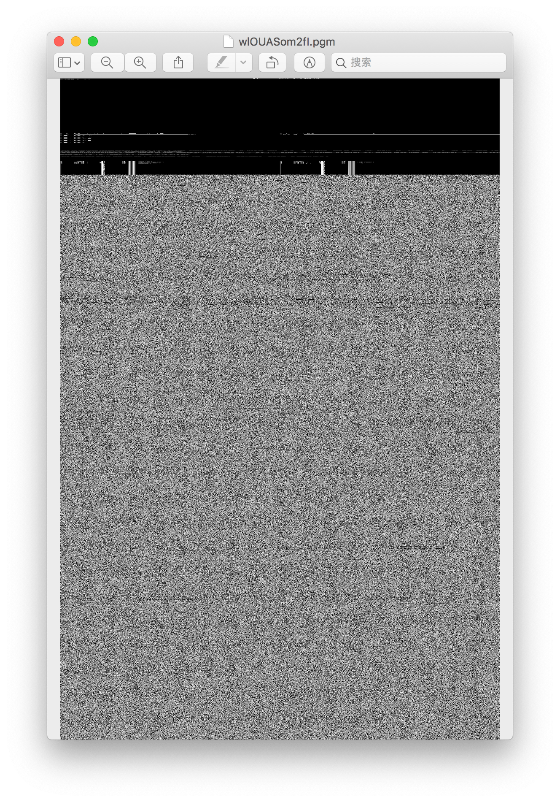
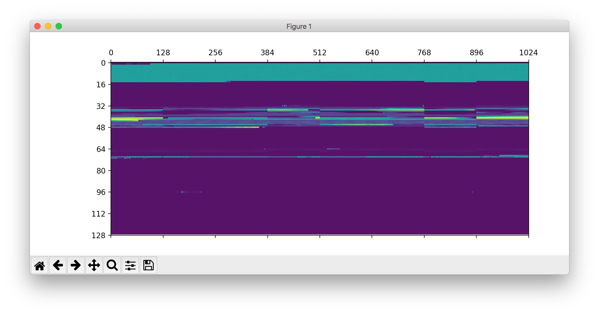
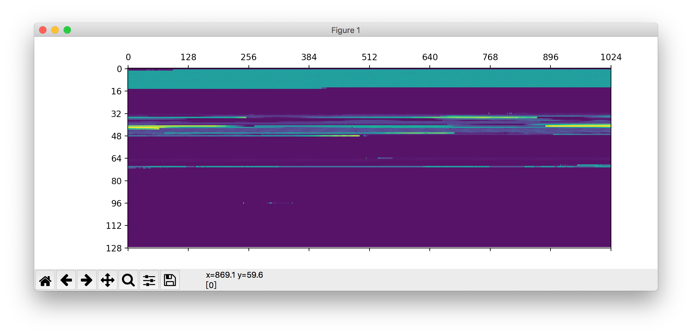
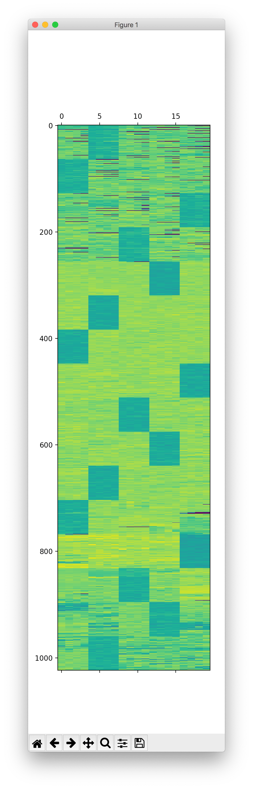
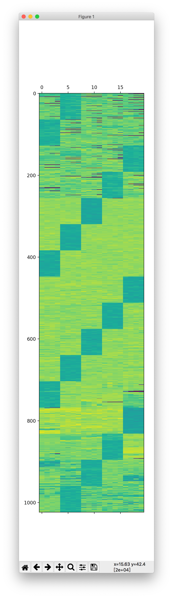

# 阵列恢复大师

题解作者：[taoky](https://github.com/taoky)

出题人、验题人、文案设计等：见 [Hackergame 2021 幕后工作人员](../../credits.pdf)。

## 题目描述

- 题目分类：general

- 题目分值：1 - RAID 0（200）+ 2 - RAID 5（250）

2021 年 10 月 3 日，阴转小雨。

你发现你运行在实验室机器上的炼丹脚本挂了。

「好好的国庆假期，怎么我还得来改程序……」收到邮件通知后，你登录了机器，看到的却是一大堆 `Input/Output Error`，回过神来才发现，放数据的阵列好像出了问题。

「完了！上面的数据我从来没有备份过！这下赶不上 DDL 发不了 paper 了！」你赶忙跑到机房，检查了一下阵列的情况——看起来盘没坏，都能读，只是可能是受到神秘宇宙射线（误）的影响，阵列的管理页面看不了，每块盘的 RAID 元数据好像也全不见了，更要命的是，你忘了当初组阵列时候盘的顺序和其他的参数。怎么恢复数据呢？上网搜索一下，好像得花不少钱。但你听说你的同学最近在搞信息什么大赛——或许可以让他们试试？

---

以下是两个压缩包，分别是一个 RAID 0 阵列的磁盘压缩包，和一个 RAID 5 阵列的磁盘压缩包，对应本题的两小问。你需要解析得到正确完整的磁盘阵列，挂载第一个分区后在该分区根目录下使用 Python 3.7 或以上版本执行 `getflag.py` 脚本以获取 flag。磁盘数据保证无损坏。

[RAID 0 阵列压缩包](src/diskresuce-raid0.zip)，SHA256: `f73bee3a2dce201566573f51bd28026c467182601eb6e55130db10c7c0c8127f`

[RAID 5 阵列压缩包](src/diskresuce-raid5.zip)，SHA256: `5eb1d2042ab5f8e2ee1508bf5e66632b4c307a595099e499aa9bc2a7255a6009`

## 背景

这道题的背景是，USTCLUG 在今年 3 月份惨遭阵列问题（阵列是 RAID 10），结果整个三月份我们都在想办法恢复。要去找阵列恢复服务真的挺贵的……不过因为大部分「坏盘」实际都能读取，我们把能组成 RAID 0 的盘全盘 `ddrescue` 下来，然后根据 SAN 管理页面猜顺序，由 @zzh1996 写程序验证之后搞了个 FUSE 脚本，这样才在没有破费（不含新硬盘成本和人力成本）的情况下把数据都救回来（虚拟机有备份，但是 LUGFTP 没有设置备份……这是我们的问题，现在已经整上备份了）。

**注意：数据无价，以上操作请勿贸然模仿！**

在验证的时候，我们发现数据是「有规律」的：可视化之后可以拼图来判断出正确的参数。这也是这道题的重要思路。如果在 CTF 里这道题的分类应该是 forensics（取证）。

这道题的一个遗憾是：我错误估计了 RAID 0 和 RAID 5 的实际难度，导致分值更高的 RAID 5 做出来的人更多。

## 概论

RAID (Redundant Array of Independent Disks) 的概念操作系统课上肯定都会讲，如果没有上过课也可以直接在网上搜索了解。简单地说，把多块盘放在一起，可以以 RAID 的方式组成一块盘，并且根据 RAID 等级的不同，最后得到的磁盘的大小、性能、容错性会有不同。

RAID 有一些重要的参数：

- RAID 等级。这里是 RAID 0 或者 RAID 5；
- 块大小 (Block size / Chunk size)。常见的块大小一般是 2 的次幂，从 32 KB 到 1024 KB 不等（更多/更少也可以）；
- 磁盘顺序/映射。

虽然 RAID 5 似乎「更简单」，我还是想从 RAID 0 小题开始写。到最后大家会发现，这道题和拼图本质上差不多（

## RAID 0

RAID 0 无容错（一块盘坏了就全完了）。以 4 块盘的 RAID 0 为例子，数据存储大致长成下面这样：

| 盘 1 | 盘 2 | 盘 3 | 盘 4 |
| ---- | ---- | ---- | ---- |
| 0    | 1    | 2    | 3    |
| 4    | 5    | 6    | 7    |
| 8    | 9    | 10   | 11   |

其中每个标号都代表了一个块，可以看到 RAID 0 的结构还是很简单的。另一个显然的结论是，在顺序读取大文件的时候，RAID 0 的读取带宽是所有盘的和，提升了阵列的性能。

本题给了 8 个磁盘文件。首先 `file` 一下看看：

```console
$ file *.img
1GHGGrmaMM0.img: data
5qiSQnlrA4Y.img: data
d3Be7V0EVKo.img: data
eRL2MQSdOjo.img: data
ID7sM2RWkyI.img: data
jCC60mutgoE.img: data
RApjvIxRlu0.img: data
wlOUASom2fI.img: DOS/MBR boot sector; partition 1 : ID=0xee, start-CHS (0x0,0,2), end-CHS (0x3ff,255,63), startsector 1, 262143 sectors, extended partition table (last)
```

可以看到 `wlOUASom2fI.img` 有 MBR 头，并且第一块分区 ID 是 `0xee`。这表明整块磁盘实际上是 GPT 格式的，并且 `wlOUASom2fI.img` 是第一块盘。

接下来分析 GPT 的元信息（建议先找一份 GPT 结构的介绍）。使用你最喜欢的十六进制编辑器打开 `wlOUASom2fI.img`。（对 macOS 用户，个人推荐使用 Hex Fiend；用 `hexdump` 也是可以的！）

首先，GPT 的 signature (magic number) "EFI PART" 在 0x200 = 512 的位置，代表一个 LBA (Logical Block Address) 的大小是 512 B。题目已经说了 flag 在第一个分区，所以直接来看 LBA 2 的内容（第一个分区表项，在 0x400 的位置）。

在 0x400 + 0x20 的位置是第一个分区的初始 LBA，得到十六进制 `00080000 00000000`，转换为小端序 64 位整数是 2048，代表第一个分区在 2048 \* 512 = 1048576 B = 1 MB (0x100000) 的位置。

那么它在哪里呢？为了解决这个问题，这里介绍一个实用的生活小技巧：一个快速可视化二进制文件的方法。

```console
$ (echo "P5 1024 16384 255"; cat wlOUASom2fI.img) > ./wlOUASom2fI.pgm
```

其中 1024 是宽度，16384 是高度（单位都是像素）。技巧来源于 <https://blahcat.github.io/2018/12/02/quick-visualization-of-a-binary-file/>。得到的 pgm 文件可以被许多图片查看器打开，效果如图：



这里，顶部的黑块高 128 个像素 (= 128 KB)，这表明**块大小必然小于等于 128 KB**，否则第一块不可能会在 128 KB 之后出现其他的数据（因为只有一个分区，其他的分区表项都是空的）。因为块大小是 2 的次幂 KB，所以 1 MB 的块必然在第一块盘上（对应的位置是 1 MB / 8 = 131072 B = 0x20000）。

让我们来看看吧！

```console
*
00020010  00 00 58 46 53 42 00 00  10 00 00 00 00 00 00 00  |..XFSB..........|
00020020  7e fb 00 00 00 00 00 00  00 00 00 00 00 00 00 00  |~...............|
```

`XFSB` 是 XFS 文件系统超级块 (superblock) 的特征。说明第一个分区是 XFS 文件系统。除此之外，我们还可以知道最后一块盘是哪个——因为 GPT 会在磁盘的末尾放上备用分区表。

```console
$ for i in *.img; do echo $i && hexdump -C $i | grep 'EFI PART'; done
1GHGGrmaMM0.img
5qiSQnlrA4Y.img
ID7sM2RWkyI.img
00fffe00  45 46 49 20 50 41 52 54  00 00 01 00 5c 00 00 00  |EFI PART....\...|
RApjvIxRlu0.img
d3Be7V0EVKo.img
eRL2MQSdOjo.img
jCC60mutgoE.img
wlOUASom2fI.img
00000200  45 46 49 20 50 41 52 54  00 00 01 00 5c 00 00 00  |EFI PART....\...|
```

证明了 `ID7sM2RWkyI.img` 是最后一块盘。

接下来问题的焦点是：块大小到底是多少？我们来看看可能的块边缘（0x10000 = 64 KB 的倍数）的情况吧。

```console
$ for i in *.img; do echo $i && hexdump -C $i | grep '0000  '; done > ./tmp1
```

会发现一些有意义的字符串：

```
d3Be7V0EVKo.img
...
008c0000  69 76 65 6e 65 73 73 5f  75 6e 64 65 72 5f 6c 6f  |iveness_under_lo|
008d0000  74 20 2f 53 75 62 74 79  70 65 20 2f 4c 69 6e 6b  |t /Subtype /Link|
```

使用十六进制编辑器定位到这里，可以明显发现：

1. 0x8c0000 前面的数据被截断了，代表 0x8c0000 是块大小的倍数；
2. 0x8c0000 到 0x8dd906 是明显连续的数据，中间没有被截断；
3. 0x8e0000 处出现了明显的截断。

所以可以推得块大小是 0x8e0000 - 0x8c0000 = 131072 B = 128 KB。

最后一步我们需要知道盘的顺序。虽然可以找刚好被截断的文件一个个推顺序，但是玩拼图不是更简单吗？让我们~~来点数据科学，用炼丹的同学最喜欢的~~ `matplotlib` 试试（

```python
import numpy as np
import matplotlib.pyplot as plt

files = ['wlOUASom2fI.img', '1GHGGrmaMM0.img', '5qiSQnlrA4Y.img',
         'RApjvIxRlu0.img', 'd3Be7V0EVKo.img', 'eRL2MQSdOjo.img',
         'jCC60mutgoE.img', 'ID7sM2RWkyI.img']  # 第一块和最后一块盘是已知的
start = 0  # 从头开始读取
sz = 16 * 1024 * 1024  # 读取的文件大小 (bytes)
n = 128 * 1024  # 块大小
b = 1024  # 用于求和的小块大小
data = []
for fn in files:
    with open("./" + fn, 'rb') as f:
        f.seek(start, 0)
        data.append(np.frombuffer(f.read(sz), dtype=np.uint8))

p = [[np.sum(data[f][i * n + j * b : i * n + j * b + b]) for f in range(len(files)) for j in range(n // b)] for i in range(sz // n)]  # i: 块, j: 小块, f: 文件

graph = np.array(p)
print(graph.shape)

plt.matshow(graph, aspect='auto')
plt.xticks(np.arange(0, 1024.1, step=128))
plt.yticks(np.arange(0, 128.1, step=16))
plt.show()
```

可视化的思路是：将数据按照顺序和块大小拼起来，每 `b` (1024) 字节（小块）的数据求和得到的结果作为得到的矩阵 `p` 的一项。图中横轴对应不同的盘（每 128 对应不同的盘），竖轴对应盘的不同位置。如果拼图拼得不对，预期的结果是出现裂痕：



相信各位同学都会玩拼图，怎么拼这里就不详细阐述了，最后得到的正确顺序是：

```python
files = ['wlOUASom2fI.img', 'jCC60mutgoE.img', '1GHGGrmaMM0.img',
         '5qiSQnlrA4Y.img', 'd3Be7V0EVKo.img', 'eRL2MQSdOjo.img',
         'RApjvIxRlu0.img', 'ID7sM2RWkyI.img']
```

拼出来：



最后一个问题：怎么挂载分区？

写脚本拼成一个大文件是可以的，但是在现实中，阵列的大小会上至少几 TB 的情况下这么搞是不现实的。这种需求可以用 `mdadm --build`（用于拼接无 RAID superblock 的阵列）解决：

```console
$ sudo losetup --read-only /dev/loop0 wlOUASom2fI.img
$ sudo losetup --read-only /dev/loop1 jCC60mutgoE.img
$ sudo losetup --read-only /dev/loop2 1GHGGrmaMM0.img
$ sudo losetup --read-only /dev/loop3 5qiSQnlrA4Y.img
$ sudo losetup --read-only /dev/loop4 d3Be7V0EVKo.img
$ sudo losetup --read-only /dev/loop5 eRL2MQSdOjo.img
$ sudo losetup --read-only /dev/loop6 RApjvIxRlu0.img
$ sudo losetup --read-only /dev/loop7 ID7sM2RWkyI.img
$ sudo mdadm --build --assume-clean --chunk=128 --level=0 --raid-devices=8 /dev/md0 /dev/loop{0..7}
mdadm: array /dev/md0 built and started.
```

别忘了 `losetup` 加上 `--read-only`，不然可能会有错误的写入。

第一个分区在 `/dev/md0p1`。

在实际操作中最后一个坑是 XFS 的只读挂载。**XFS 即使挂载时设置了 `-o ro`，它也还是会在挂载时尝试恢复日志（这个过程需要写入）**，于是需要加 `norecovery` 参数。但是这里盘是 clean 的，所以不会触发这个坑点。

```console
$ mkdir mountpoint
$ sudo mount -o ro /dev/md0p1 mountpoint/
$ cd mountpoint
$ python3 getflag.py
（输出省略）
Flag: flag{4857cdeac07d8456fcaedb61d07b0b7d}
```

RAID 0 小题结束。别忘了结束之后收拾残局（`umount`, `mdadm --stop /dev/md0`, `losetup -D`）

这道题的很多参数都是从三月份那次阵列恢复中实际拿的：包括盘的数量（我们的配置是 16 块盘的 RAID 10，它的一侧就是 8 块盘的 RAID 0）、块大小 (128 KB) 以及文件系统 (XFS)。

当然，暴力穷举也不是不行，可能性一共有 8! * 6 = 241920 种（块大小只考虑开头说的情况）。

## RAID 5

本来没有这一小题，是后面加上的。RAID 5 还是有点稍微不一样的地方的。

以五块盘的 RAID 5 阵列为例子，很多教科书的介绍里都是这么排布的：

| 盘 1 | 盘 2 | 盘 3 | 盘 4 | 盘 5 |
| ---- | ---- | ---- | ---- | ---- |
| 0    | 1    | 2    | 3    | P    |
| 4    | 5    | 6    | P    | 7    |
| 8    | 9    | P    | 10   | 11   |
| 12   | P    | 13   | 14   | 15   |
| P    | 16   | 17   | 18   | 19   |

（其中 P 是 parity，奇偶校验位，取相同行其他磁盘的块异或得到）

但是这不是唯一可能的排布方式。以上的排布称为 left-asymmetric。除此之外，还有 left-symmetric, right-asymmetric, right-symmetric 三种可能。

left-symmetric:

| 盘 1 | 盘 2 | 盘 3 | 盘 4 | 盘 5 |
| ---- | ---- | ---- | ---- | ---- |
| 0    | 1    | 2    | 3    | P    |
| 5    | 6    | 7    | P    | 4    |
| 10   | 11   | P    | 8    | 9    |
| 15   | P    | 12   | 13   | 14   |
| P    | 16   | 17   | 18   | 19   |

right-asymmetric:

| 盘 1 | 盘 2 | 盘 3 | 盘 4 | 盘 5 |
| ---- | ---- | ---- | ---- | ---- |
| P    | 0    | 1    | 2    | 3    |
| 4    | P    | 5    | 6    | 7    |
| 8    | 9    | P    | 10   | 11   |
| 12   | 13   | 14   | P    | 15   |
| 16   | 17   | 18   | 19   | P    |

right-symmetric:

| 盘 1 | 盘 2 | 盘 3 | 盘 4 | 盘 5 |
| ---- | ---- | ---- | ---- | ---- |
| P    | 0    | 1    | 2    | 3    |
| 7    | P    | 4    | 5    | 6    |
| 10   | 11   | P    | 8    | 9    |
| 13   | 14   | 15   | P    | 12   |
| 16   | 17   | 18   | 19   | P    |

RAID 5 的主要难点就是要知道以上排布的方法。（可能我构造的时候应该搞个 right-symmetric 的……这样难度可能能和分值更匹配）

按照惯例，`file`:

```console
$ file *
3D8qN9DH91Q.img: data
3RlmViivyG8.img: DOS/MBR boot sector; partition 1 : ID=0xee, start-CHS (0x0,0,2), end-CHS (0x3ff,255,63), startsector 1, 262143 sectors, extended partition table (last)
60kE0MQisyY.img: DOS/MBR boot sector; partition 1 : ID=0xee, start-CHS (0x0,0,2), end-CHS (0x3ff,255,63), startsector 1, 262143 sectors, extended partition table (last)
IrYp6co7Gos.img: data
QjTgmgmwXAM.img: data
```

两块盘有 GPT 分区表。这表明 `3RlmViivyG8.img` 和 `60kE0MQisyY.img` 其中有一个是第一块盘，有一个是最后一块盘（parity）。用上面 RAID 0 分析的方法就会发现，两道题的分区表信息是几乎一样的（做的时候摸了）。

我自己做的时候得到块大小的方法可能比较 tricky：将所有盘都用上面的生活小技巧可视化看一下，可以发现有很多高为 64 像素的块，并且找不到高为 32 像素的块，表明块大小很可能就是 64 KB。

如果排布是 left 的，那么第一个 parity 块在最后一个磁盘上，第一个分区的 superblock (1 MB 的位置) 就在第二块盘的 256 KB (= 0x40000) 的位置上（像上面一样画表格，可以看到在表格的第五行）。把所有盘看一遍，可以看到 `3RlmViivyG8.img` 和 `IrYp6co7Gos.img`:

```
00040430  91 3d 71 61 01 00 ff ff  53 ef 01 00 01 00 00 00  |.=qa....S.......|

00040480  00 00 00 00 00 00 00 00  2f 68 6f 6d 65 2f 64 65  |......../home/de|
00040490  62 69 61 6e 2f 68 61 63  6b 65 72 67 61 6d 65 2f  |bian/hackergame/|
```

位于 0x40430 的 `53 ef` 是 ext 文件系统超级块的 signature。说明这是个 ext 文件系统（ext2/3/4）。因为 `3RlmViivyG8.img` 不可能是第二块盘，所以只有可能是 `IrYp6co7Gos.img` 为第二块盘。同时得到 `3RlmViivyG8.img` 是第一块盘，`60kE0MQisyY.img` 是最后一块盘。

如果排布是 right 的，那么第一个分区的 superblock 还会在第一块盘上（parity 此时在最后一块盘上）。但是 IrYp6co7Gos.img 和 3RlmViivyG8.img 有 ext4 signature，代表它们分别为第一块盘和最后一块盘，和解析 GPT 数据得到的结论矛盾。

如何给盘排序呢？还是拼图吧。画出来就能发现 parity 是相当有特征的。

```python
import numpy as np
import matplotlib.pyplot as plt

files = ["3RlmViivyG8.img",
         "IrYp6co7Gos.img",
         "QjTgmgmwXAM.img",
         "3D8qN9DH91Q.img",
         "60kE0MQisyY.img",]  # 第 1、2、5 块盘是已知的
start = 3 * 1024 * 1024  # 后面的特征稍微明显一点
sz = 1 * 1024 * 1024  # 读取的文件大小 (bytes)
n = 1 * 1024  # 这里不是块大小，小一点的话特征更明显
b = 256  # 用于求和的小块大小
data = []
for fn in files:
    with open("./" + fn, 'rb') as f:
        f.seek(start, 0)
        data.append(np.frombuffer(f.read(sz), dtype=np.uint8))

p = [[np.sum(data[f][i * n + j * b : i * n + j * b + b]) for f in range(len(files)) for j in range(n // b)] for i in range(sz // n)]  # i: 块, j: 小块, f: 文件

graph = np.array(p)
print(graph.shape)

plt.matshow(graph, aspect='auto')
plt.show()
```

得到图如下：



很明显，第三四块盘要换个顺序，最后正确的图：



顺序:

```python
files = ["3RlmViivyG8.img",
         "IrYp6co7Gos.img",
         "3D8qN9DH91Q.img",
         "QjTgmgmwXAM.img",
         "60kE0MQisyY.img",]
```

因为 `mdadm --build` 不支持 RAID5，所以当然还是可以试试写脚本自己拼，或者想办法让 mdadm 来 assemble（会覆盖掉每块盘开头一部分），不过有个更有意思的做法：写个 fuse 小脚本（这也是 @zzh1996 当时确认文件能恢复的方法）

```python
#!/usr/bin/env python3
# pip3 install fusepy
import logging
import sys
import os
import time

from errno import ENOENT
from threading import Lock
from stat import S_IFDIR, S_IFLNK, S_IFREG

from fuse import FUSE, FuseOSError, Operations, LoggingMixIn


class MyFS(LoggingMixIn, Operations):
    def __init__(self):
        self.rwlock = Lock()
        self.blocksize = 64 * 1024
        self.disk_num = 5
        self.imgs = [open('./disk' + str(i) + ".img", 'rb') for i in range(1, self.disk_num + 1)]
        self.size = 0
        self.offset = 0  # set offset when image is created by mdadm (0x100000)
        for i in range(1, self.disk_num):
            self.size += os.path.getsize('./disk' + str(i) + ".img") - self.offset

    def getattr(self, path, fh=None):
        if path == '/img':
            st_mtime = 0
            st_atime = 0
            st_ctime = 0
            st_uid = 0
            st_gid = 0
            st_mode = S_IFREG | 0o444
            st_size = self.size
            st_nlink = 1
            return dict(st_mtime=st_mtime, st_atime=st_atime, st_ctime=st_ctime, st_uid=st_uid,
                        st_gid=st_gid, st_mode=st_mode, st_size=st_size, st_nlink=st_nlink)
        elif path == '/':
            st_mtime = 0
            st_atime = 0
            st_ctime = 0
            st_uid = 0
            st_gid = 0
            st_mode = S_IFDIR | 0o755
            st_size = 0
            st_nlink = 1
            return dict(st_mtime=st_mtime, st_atime=st_atime, st_ctime=st_ctime, st_uid=st_uid,
                        st_gid=st_gid, st_mode=st_mode, st_size=st_size, st_nlink=st_nlink)
        else:
            raise FuseOSError(ENOENT)

    def read(self, path, size, offset, fh=None):
        path = path[1:]
        if path == 'img':
            with self.rwlock:
                start = offset
                end = offset + size
                block_start = start // self.blocksize
                block_end = (end - 1) // self.blocksize
                data = b''
                for b in range(block_start, block_end + 1):
                    block_disk = b % (self.disk_num - 1)
                    parity = self.disk_num - 1 - (b // (self.disk_num - 1)) % self.disk_num
                    # left-asymmetric
                    # if block_disk >= parity:
                    #     block_disk += 1
                    # left-symmetric
                    block_disk = (parity + block_disk + 1) % self.disk_num
                    assert block_disk == b % self.disk_num
                    f = self.imgs[block_disk]
                    f.seek(b // (self.disk_num - 1) * self.blocksize + self.offset, 0)
                    data += f.read(self.blocksize)
                return data[start % self.blocksize : start % self.blocksize + size]
        else:
            raise FuseOSError(ENOENT)

    def readdir(self, path, fh=None):
        items = ['.', '..', 'img']
        path = path[1:]
        if path == '':
            return items
        else:
            raise FuseOSError(ENOENT)


if __name__ == '__main__':
    logging.basicConfig(level=logging.INFO)
    fuse = FUSE(MyFS(), sys.argv[1], foreground=True, allow_other=True)
```

```console
$ ln -s ./3RlmViivyG8.img disk1.img
$ ln -s ./IrYp6co7Gos.img disk2.img
$ ln -s ./3D8qN9DH91Q.img disk3.img
$ ln -s ./QjTgmgmwXAM.img disk4.img
$ ln -s ./60kE0MQisyY.img disk5.img
$ mkdir tmp
$ python3 -m venv venv
$ . venv/bin/activate
(venv) $ pip3 install fusepy
(venv) $ python3 fusemount.py tmp

```

然后开个新 terminal：

```
$ mkdir mountpoint
$ cd tmp
$ sudo mount -o ro,offset=$((1024*1024)),loop ./img ../mountpoint/
$ cd ../mountpoint/
$ python3 getflag.py
（输出省略）
Flag: flag{a18325a1ec0f58292908455c2df8ffcd}
```

就好了。最后发现排布是 left-symmetric。Left-symmetric 也是 `mdadm` 创建 RAID 5 阵列的默认值，因为它在连续读取大文件时相比于 left-asymmetric 有更好的性能（例如，连续读取 0-4 号块的时候，读取可以被均匀分布到每一块盘上）。同时也可以发现，如果 RAID 5 坏了一块盘，虽然阵列还能用，但是有性能损失（因为要读取所有其他的硬盘，并且进行异或计算之后才能够确认损坏硬盘那里对应的值）。

（一个无关的备注：不建议将 RAID 5 用于大硬盘阵列，否则在重建时第二块硬盘发生错误导致重建失败的可能性相当高。）

## 附录

RAID 0 盘的文件内容：

- 大物显微镜实验拍的照片。为了减少 RAID 0 的难度（避免出现大量高度压缩的文件导致拼图困难），转换成了 BMP 格式，部分色彩有丢失；
- 随便打印的的几个 PDF；
- 自己写的没有对外公开的一些代码；
- [2020 年科大 OSH 实验 1 第三个测试程序](https://osh-2020.github.io/lab-1/initrd/#_1) 在自己写 PoC 时候的录屏。因为太二次……那啥了，最后出实验换了一张图就是了。[程序代码](https://gist.github.com/taoky/053dcf9f5abc2f7b8491fa978d147434)，图片需要自己导出 XPM 格式后 `#include`。

RAID 5 盘的文件内容：

- GRUB 的源代码，删掉了一些东西，同时改了一个 C 文件。[相关的故事](https://blog.taoky.moe/attachments/2021-04-17-tunight/show.html#14)
- 调研 parcel 游戏引擎时用开源的代码糊出来东西，本来是准备改改用来做隔壁赛博餐厅的，但是后来自己忙 + 餐厅的出题人发现可以直接用前端栈解决，就没有用这个方案。

---

查过论文的同学可能知道有篇论文讲了阵列恢复的主题：*Generic RAID reassembly using block-level entropy*。但是，非常不幸，他们开源的代码，对这两道题不工作。我尝试编译并且修了类型的问题，结果 RAID 0 只能识别出正确的块大小，给的顺序是错误的；RAID 5 根本没法用。

## 参考资料

[RAID Reassembly - A forensic Challenge](http://pyflag.sourceforge.net/Documentation/articles/raid/reconstruction.html)
