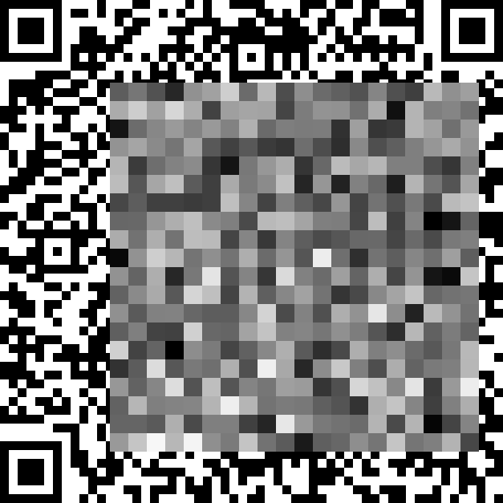

# 马赛克

题解作者：[Long Deng](https://github.com/ldeng-ustc)

出题人、验题人、文案设计等：见 [Hackergame 2021 幕后工作人员](https://hack.lug.ustc.edu.cn/credits/)。

## 题目描述

- 题目分类：general

- 题目分值：300

- 题目链接：[src/mosaic.zip](src/mosaic.zip)

共享单车只剩下一辆，走近一看，果然是一辆二维码被坏人涂掉一大块的车，谁也骑不走。

> 我今天还非就要把这个辆车骑走。

于是你开始研究起来这个二维码。



**点击下面按钮下载源代码与图片**

## 题解

题目是一块区域被打了码的二维码。显然，被马赛克遮住的区域信息没有完全丢失，如果某个马赛克块较黑，被遮住的区域就可能有更多黑色。

下载源代码，发现马赛克格子宽度是 23，二维码格子宽度是 11。每个马赛克格子正好一定会影响 3\*3 的二维码格子。

我们考虑将每个马赛克块影响的 9 个格子中不确定的暴力枚举（最多 512 种可能），如果只有一种组合能生成颜色正确的马赛克，那九个格子就都能确定了。

马赛克边缘的格子露出一部分，能够直接确定。先计算的格子确定后，也可以减少相邻格子的可能性。所以我们每轮记下已确定的二维码格子，把尝试过程循环多次，直至不再有新的格子被解码出来为止。

考虑到有些马赛克块完全盖住 2 块或 4 块二维码，这些被完全盖住的二维码格子显然不可能恢复了，但二维码有一定容错性，最终根据方法的不同，能解码出 80%~90% 左右的格子（如果联合考虑多个马赛克块，还能解出更多），已经完全足够读出数据。

脚本如下。

```python
import math
import numpy as np
from PIL import Image
from numpy.lib import ndindex

X, Y = 103, 137
N = 20
BOX_SIZE = 23
PIXEL_SIZE = 11

def set_pix(array, x, y, val):
    '''将图片数组 array 中第 (x, y) 个二维码格设为 val
    '''
    x1 = x * PIXEL_SIZE
    x2 = (x+1) * PIXEL_SIZE
    y1 = y * PIXEL_SIZE
    y2 = (y+1) * PIXEL_SIZE
    array[x1:x2, y1:y2] = val

# check box[i, j]
def check(ar, i, j):
    '''判断图片数组 ar 生成的马赛克的第 (i, j) 个块是否要求的相符
    即比较数组 ar 对应位置的平均值和马赛克数组的对应格
    '''
    x1 = X + i*BOX_SIZE
    x2 = X + (i+1)*BOX_SIZE
    y1 = Y + j*BOX_SIZE
    y2 = Y + (j+1)*BOX_SIZE
    # print('box:\n', ar[x1:x2, y1:y2])
    mean = ar[x1:x2, y1:y2].mean()
    return math.floor(mean) == mosaic[i, j]

def set_pixels(ar, uncertains, t):
    for k, pos in enumerate(uncertains):
        color = ((t >> k) & 1) * 255
        set_pix(ar, pos[0], pos[1], color)

def solve():
    error = False
    # for every box in pixelated area.
    for (i, j) in np.ndindex(mosaic.shape):
        # 考虑马赛克的每个格子 (i, j)，在 ar 中起始坐标是 (x, y)
        x = X + i*BOX_SIZE
        y = Y + j*BOX_SIZE

        # 只有从 (px, py) 开始的 3x3 个二维码格子会影响这个马赛克格子
        px = x // PIXEL_SIZE
        py = y // PIXEL_SIZE

        # 3x3 个格子中还不确定的位置
        uncertains = []
        for tx, ty in np.ndindex(3, 3):
            if not flags[px+tx, py+ty]:
                uncertains.append((px+tx, py+ty))
        if len(uncertains) == 0:
            continue

        possibles = []
        print(f'Try mosaic{(i, j)}, from pixel{(x, y)}, uncertains: {uncertains}')
        for t in range(2**len(uncertains)):
            '''遍历2^k种可能性'''
            # print('Try: {0:0{1}b}'.format(t, len(uncertains)))
            set_pixels(ar, uncertains, t)   # 将 ar 对应位置按 t 的每一位设置为对应颜色
            if check(ar, i, j):     # 判断马赛克颜色是否正确，正确则加入可能性列表
                possibles.append(t)

        if len(possibles) == 1:     # 只有一种可能性，那么是正确答案
            set_pixels(ar, uncertains, possibles[0])
            for x, y in uncertains:
                flags[x, y] = True
        elif len(possibles) > 1:
            # 多个可能就随便设一个，但是不标记为已经确定
            set_pixels(ar, uncertains, possibles[0])
            # 也可以用下面的方法，将所有可能性中颜色都相同的格子找出来，设置为确定的
            # 这样可以大大增加能解出的格子数（从 81% 提升到 88%）
            # print(possibles)
            # a = np.bitwise_and.reduce(np.asarray(possibles))
            # b = np.bitwise_or.reduce(np.asarray(possibles))
            # c = np.bitwise_xor(a, b)
            # print(f'{c:0{len(uncertains)}b}')
            # for k, pos in enumerate(uncertains):
            #     color = ((possibles[0] >> k) & 1) * 255
            #     set_pix(ar, pos[0], pos[1], color)
            #     if (c >> k) & 1 == 0:
            #         flags[pos[0], pos[1]] = True
        elif len(possibles) == 0 and len(uncertains) != 0:
            # 出现不明原因的错误
            print(f'Error: [{i}, {j}]')
            error = True
            break
        if error:
            break
        print(f'Solved: [{i}, {j}]')
    return flags.sum()  # 返回目前确定的格子数

im = Image.open('pixelated_qrcode.bmp')
ar = np.asarray(im, dtype='uint8')  # 在该数组上逐步恢复和试算二维码
mosaic = ar[X::BOX_SIZE, Y::BOX_SIZE][:N, :N].copy()    # 马赛克每格的数据
solved = ar[::PIXEL_SIZE, ::PIXEL_SIZE]     # 用于存放答案，开始取二维码每格左上角值
                                            # 注意 solved 是个引用，所以修改 ar 会跟着变
flags = (solved == 0) | (solved == 255)     # 如果某格是 0 或 255，已经能确定颜色

rd_corner = ar[PIXEL_SIZE-1::PIXEL_SIZE, PIXEL_SIZE-1::PIXEL_SIZE]  # 二维码每格右下角
rd_flags = (rd_corner == 0) | (rd_corner == 255)  # 按右下角能确定颜色的二维码格

for i, j in np.ndindex(flags.shape):
    # 按左上角和右下角边缘，将能够确定的格补全
    if flags[i, j]:
        set_pix(ar, i, j, solved[i, j])
    if rd_flags[i, j]:
        set_pix(ar, i, j, rd_corner[i, j])
flags = (solved == 0) | (solved == 255)  # 更新已确定的位置

while True:
    # 如果有新的格子被推算出来，那么继续算，否则已经没得算了
    num_ok = flags.sum()
    if solve() == num_ok:
        break

solved_im = Image.fromarray(ar)
solved_im.save('solved.bmp')
print('CertainRate:', flags.sum() / flags.size)
```
