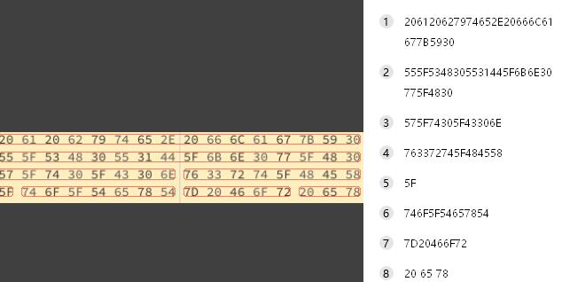
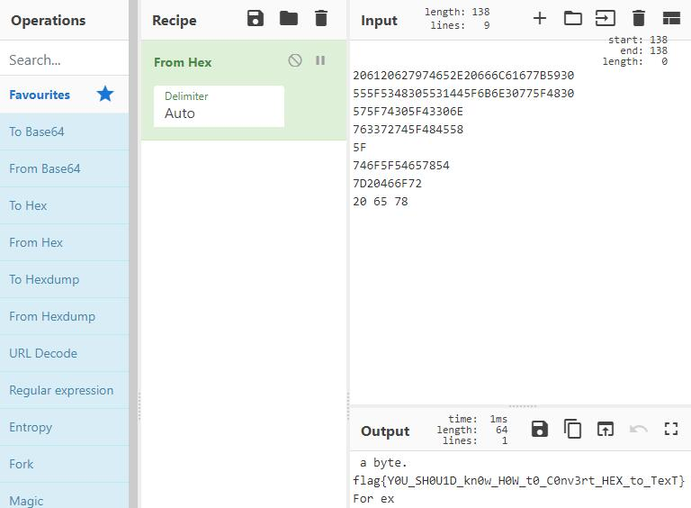

# hackergame2021 - Frankss
包含内容：
- 进制十六-参上   
- 超OI的writeup模拟器  

做出来的题都是20解+的，感觉思路中规中矩没有很tricky的解法，为了节省各位看官的时间（其实是自己懒），因此就只投一个一血和一个3解的wp。  
## 进制十六-参上（一血）
**CTF快速签到指南**：  

使用QQ/TIM的热键 ctrl+alt+a 截图后，使用文字识别快速得到一堆16进制字符  

  
点击复制，然后粘贴到[CyberChef](https://gchq.github.io/CyberChef/)里(强大的编码加密工具，推荐缓存后本地使用)  将from hex解码方式拖到配方栏 就得到了输出的flag  

  

## 超OI的writeup模拟器
"240题，逆向两分钟，交题半小时（指正确的答案每5秒只能交一个）"  

IDA打开0.bin，去main函数F5一下得到反汇编的C代码：  

```c
__int64 __fastcall main(int a1, char **a2, char **a3)
{
  size_t n; // [rsp+8h] [rbp-18h] BYREF
  char *lineptr; // [rsp+10h] [rbp-10h] BYREF
  __ssize_t v6; // [rsp+18h] [rbp-8h]

  lineptr = 0LL;
  printf("Input code: ");
  v6 = getline(&lineptr, &n, stdin);
  if ( v6 != 17 || sub_1430(*(_QWORD *)lineptr, *((_QWORD *)lineptr + 1)) )
    puts("Wrong code");
  else
    puts("Correct code");
  return 0LL;
}
```

得知正确的code为16字节长，然后把code的前8字节后8字节分别作为参数传到子函数里，双击sub_1430跟进：  
```c
__int64 __fastcall sub_1430(__int64 a1, __int64 a2)
{
  return sub_1160(0xEE697E6683F11AC7LL, 0x4960EFDF0E7E4CA0LL, a1, a2);
}
```
说明调用了sub_1160(0xEE697E6683F11AC7LL, 0x4960EFDF0E7E4CA0LL, code[0:8], code[8:16])，继续双击跟进sub_1160：  
```c
__int64 __fastcall sub_1160(__int64 a1, __int64 a2, __int64 a3, __int64 a4){
  __int64 v4; // rdi
  __int64 i; // [rsp+8h] [rbp-40h]

  for ( i = a1 - a2; ; i *= 0xF0E6BC2DDFEE78ADLL ){
    while ( 1 ){
      while ( 1 ){
        while ( i <= 0x448F67D7354C4BC5LL ){
          if ( i > (__int64)0xD3B3C1CEF93D7B4DLL ){
            if ( i == 0xD3B3C1CEF93D7B4ELL ){
              i = 0x52F23E8969C2801DLL;
              a4 &= a4 ^ a3;
            }
            else{
              if ( i != 0x3EFE1C0777D6E54DLL )
                goto LABEL_2;
              i = 0x52F23E8969C2801DLL;
              a4 |= a4 ^ a3;
            }
          }
          else if ( i == 0x8CA820EA5F9B11E7LL ){
            i = 0x52F23E8969C2801DLL;
            a4 = (a3 & 0xF3D1FC9F52BCE9D5LL ^ 0x6351680740244850LL | (0xF3D1FC9F52BCE9D5LL * a3) ^ 0xB4D5F4C47EA1D3D8LL | a4 & 0xABF973B8D649DE1DLL ^ 0x290840304440D009LL | (0xABF973B8D649DE1DLL * a4) ^ 0x2B029929B46CEE25LL) != 0;
          }
          else{
            if ( i != 0xB1A8A5724C934576LL )
              goto LABEL_2;
            i = 0x52F23E8969C2801DLL;
            a4 += a3;
          }
        }
        if ( i <= 0x6DB42F717E691C9ALL )
          break;
        if ( i == 0x6DB42F717E691C9BLL ){
          i = 0x52F23E8969C2801DLL;
          a4 ^= a3;
        }
        else{
          if ( i != 0x7722E987DC9B424CLL )
            goto LABEL_2;
          i = 0x52F23E8969C2801DLL;
          a4 = a3;
        }
      }
      if ( i != 0x448F67D7354C4BC6LL )
        break;
      i = 0x52F23E8969C2801DLL;
      a4 *= a4 ^ a3;
    }
    if ( i == 0x52F23E8969C2801DLL )
      break;
LABEL_2:
    v4 = a3 ^ ((a4 ^ 0x128D0211808990LL) & 0x8DA9D2B1587A9B4LL | 1);
    a3 = a4;
    a4 = v4;
  }
  return a4;
}
```
代码对控制流做了混淆，我们先不去混淆，仔细观察这段代码中变量的运算，可以发现：
- 传入的四个参数中，a1，a2只用于初始化i
- a3，a4的所有运算都与i无关，只与a3，a4本身有关
- 涉及a3，a4的运算只有& | ^三种和 * 乘法
- 最后的返回值是a4 != 0 

**如果运算只有 & | ^ 三种** 就可以逐位爆破求出答案（因为每一位都是互不影响的，所以可以逐位修改a3和a4，如果最后结果的对应位也是0，就得到了正确的输入）  
比如 a3 = 0xdeadbeefcafebabe, a4 = 0x1234567890abcdef 时，最后的运算为0xaaaaaaaaaaaaaaaa != 0  
我们改变 a3 和 a4 的第一个字节，即a3的de，a4的12部分 遍历所有结果，一定有一个结果，使得最后运算的第一个字节也为0，即0x00aaaaaaaaaaaaaa != 0  
重复这个过程，最终可以试得最后的运算变为0x0000000000000000 != 0  
此时的a3和a4就是正确的code在内存中的格式了  

**但是运算有 & | ^ * 四种，多了一个乘法** 这也没有关系，因为乘法只会有低到高的进位，高位不会影响低位，因此我们可以将上面的顺序改为 "从最低位开始爆破a3和a4" ，原理不变 这样我们可以通过正确的低位继续爆破出正确的高位

那么写一个爆破的c程序：
```cpp
#include <iostream>
using namespace std;
__int64 __fastcall test0(__int64 a1, __int64 a2){//就是反汇编的sub_1430
  return sub_1160(0xEE697E6683F11AC7LL, 0x4960EFDF0E7E4CA0LL, a1, a2);
}
__int64 __fastcall sub_1160(__int64 a1, __int64 a2, __int64 a3, __int64 a4){
    //你的ida反汇编出的代码，这里直接粘贴上边的sub_1160代码就可以
    //粘贴后去掉代码中唯一一处的 !=0 判断，以便得知爆破结果
}

const __int64 b[] = { 0xff,0xffff,0xffffff,0xffffffff,0xffffffffff,0xffffffffffff,0xffffffffffffff,0xffffffffffffffff };
const __int64 c[] = { 0x1,0x100,0x10000,0x1000000,0x100000000,0x10000000000,0x1000000000000,0x100000000000000 };
int main() {
    __int64 l, r;
    char a[17] = { 0 };
    l = 0x0, r = 0x0;
    for (int n = 0; n < 8; n++) {
        for (__int64 i = 0, ii = 0; ii <= 0xff; ii++, i += c[n]) {
            for (__int64 j = 0, jj = 0; jj <= 0xff; jj++, j += c[n]) {
                if ((test0(l | i, r | j) & b[n]) == 0) {
                    l |= i, r |= j;
                }
            }
        }
    }
    for (int i = 0; i < 8; i++) {
        a[i] = ((char*)&l)[i];
        a[i + 8] = ((char*)&r)[i];
    }
    cout << a << endl;
}
```
运行就能得到正确的code，i7-9650 msvc无优化 耗时1秒  
提交得到第一个flag  

但是手动从ida中复制F5的代码效率显然难以接受，所以写一个ida-python的脚本来自动得到x-rays反汇编的代码：  
注意这里的版本，IDA7.5的python接口有很大变动，脚本不适用于低版本IDA  
如果想改成适用旧版IDA的脚本，请参考 [官方doc](https://hex-rays.com/products/ida/support/ida74_idapython_no_bc695_porting_guide.shtml)
```python
#ida7.5-python3 
#analysis.py
import re
import idaapi
import ida_auto
import ida_nalt

idaapi.load_plugin('hexrays') # IDA的F5并不是IDA的功能，而是插件hexrays的功能
ida_auto.auto_wait()         # 所以先加载hexrays插件

func = idaapi.get_func(get_name_ea_simple('main')) # 反汇编main函数
code = str(idaapi.decompile(func))
func = "sub_"+str(re.findall("sub_(.*?)\\(",code)[0]) # 在main的c代码中得到第一个子函数的名字

func = idaapi.get_func(get_name_ea_simple(func)) # 反汇编第一个子函数，得到检查code的子函数和参数值  
code = str(idaapi.decompile(func))
a,b=re.findall("\\((.*?LL),(.*?LL)",code)[0] # 找到a1，a2的值
func = "sub_"+str(re.findall("sub_(.*?)\\(",code)[1]) # 找到检查code的子函数名

func = idaapi.get_func(get_name_ea_simple(func)) # 反汇编检查code的子函数
code = str(idaapi.decompile(func))
ind = ida_nalt.get_root_filename().split('.')[0]

output = "cpps\\"+ind+'.cpp'
f = open(output,'w') # 保存到指定目录
f.write(code.replace(" != 0;",";").replace("sub_1160","sub_1160"+ind)) # 去除最后的 != 0 判断，方便得知爆破是否成功
f.write("\n__int64 test"+ind+"(__int64 a3, __int64 a4) { return sub_1160"+f"{ind}({a}, {b}" +", a3, a4); }") # 生成的接口函数，方便调用
f.close()
ida_pro.qexit() # 关闭ida，否则会出现ida的界面
```
然后就可以通过命令行批量反汇编生成c代码了：
>Your_path_to_IDA\\ida64.exe -c -A -Sanalysis.py Your_path_to_BIN\\0.bin

python的os.system()返回延迟很高，这里推荐把指令交给bat批量执行，基本反汇编每个也不超过1秒，如果是加载过的BIN基本是一秒10条以上  
得到了全部的255个C代码之后，只要稍加修改上边的C代码就可以得到255个BIN的code：  
```c
#include <iostream>
using namespace std;
__int64 __fastcall test0(__int64 a3, __int64 a4);
__int64 __fastcall test1(__int64 a3, __int64 a4);
__int64 __fastcall test2(__int64 a3, __int64 a4);
....
__int64 __fastcall test254(__int64 a3, __int64 a4);
__int64 __fastcall test255(__int64 a3, __int64 a4);

__int64 (*func[])(__int64 a3, __int64 a4) = { test0,test1,test2,test3,...,test253,test254,};

const __int64 b[] = { 0xff,0xffff,0xffffff,0xffffffff,0xffffffffff,0xffffffffffff,0xffffffffffffff,0xffffffffffffffff };
const __int64 c[] = { 0x1,0x100,0x10000,0x1000000,0x100000000,0x10000000000,0x1000000000000,0x100000000000000 };
int main() {
    __int64 l, r;
    char a[17] = { 0 };
    for (int challenge = 0; challenge < 256; challenge++) {
        l = 0x0, r = 0x0;
        for (int n = 0; n < 8; n++) {
            for (__int64 i = 0, ii = 0; ii <= 0xff; ii++, i += c[n]) {
                for (__int64 j = 0, jj = 0; jj <= 0xff; jj++, j += c[n]) {
                    if ((func[challenge](l | i, r | j) & b[n]) == 0) {
                        l |= i, r |= j;
                    }
                }
            }
        }
        for (int i = 0; i < 8; i++) {
            a[i] = ((char*)&l)[i];
            a[i + 8] = ((char*)&r)[i];
        }
        cout << a << endl;
    }
}
```
运行2分钟就能得到全部的256个code。