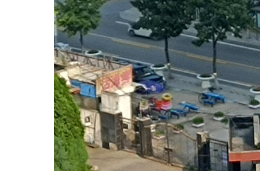

# 旅行照片

通过这里的字合理猜测这是中国境内。

随便找个地图软件，开卫星图，搜肯德基，沿着海岸线看有没有照片里的停车场，就能发现 [新澳海底世界](https://map.baidu.com/poi/%E6%96%B0%E6%BE%B3%E6%B5%B7%E5%BA%95%E4%B8%96%E7%95%8C/@13310611.474010557,4825473.307528202,19z) 了。

剩下的就没什么难度了：街景找左边建筑的字；目测十多楼左右，10 到 20 枚举一下；通过海判断拍照方向；通过光照判断大致时间是下午，14:30 和 17:00 都试一下就行。
