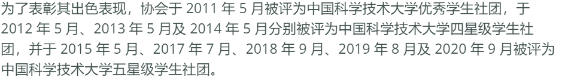
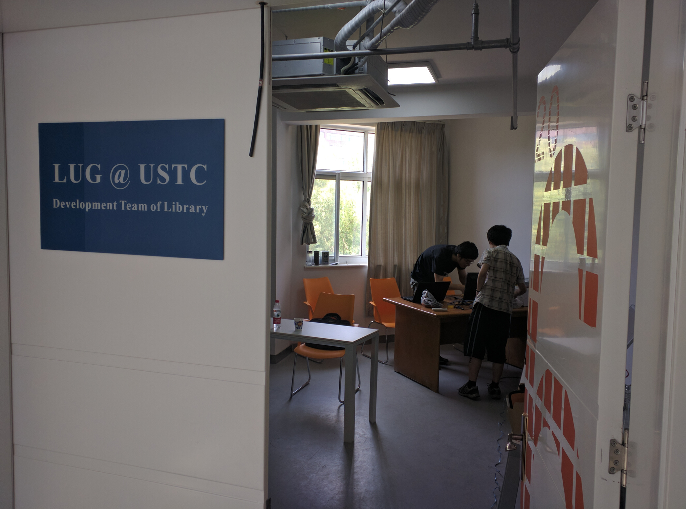
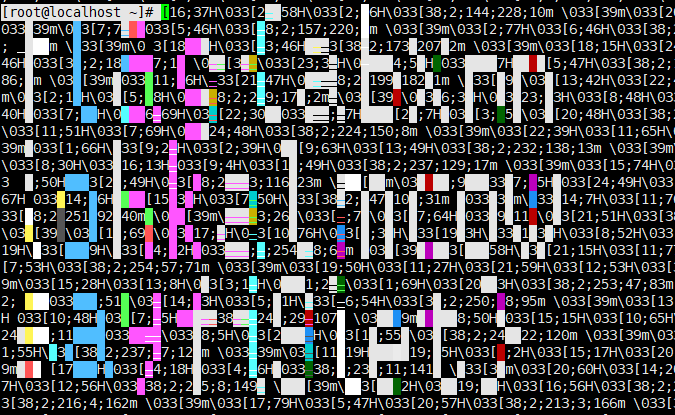
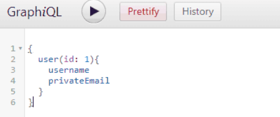

论如何以一名16岁菜鸡高生的视角去答竞赛（

## 签到

先尝试性点一下Next,发现秒数加1，地址栏中加了`/?page=1`，猜想是更改页码使得日期符合大赛时间以内就能获得flag，显然疯狂点击是不可行的，于是从几十亿左右开始试，试到大赛时间以内果然获得了flag。

不知道算不算彩蛋：在写题解的时候给别人演示了一下试数过程，结果正好试到周日晚到周一早比赛暂停时间内，会显示比赛暂停中，不会显示flag。

## 进制十六——参上

图中的信息相当明显了，十六进制转换，直接去winhex把对应几行的十六进制输进去，得到flag。

## 去吧！追寻自由的电波

题中提示“最终接受到的录音的速度有所改变”，下载mp3文件后发现速度明显偏高，塞到用来剪视频的Premiere（刷完系统的电脑还没来得及装Audition）把速度降到可以正常听到里面单词的程度。

之后结合题中提示“无线电中惯用的方法来区分字符串中读音相近的字母”，以及听到的英文单词上网搜索可得到无线电英文对照表，做一个简单的英语听力即可得到flag。

## 猫咪问答 Pro Max

1. 2017 年，中科大信息安全俱乐部（SEC@USTC）并入中科大 Linux 用户协会（USTCLUG）。目前，信息安全俱乐部的域名（sec.ustc.edu.cn）已经无法访问，但你能找到信息安全俱乐部的社团章程在哪一天的会员代表大会上通过的吗？

由于题中给出了原域名，第一时间想到了互联网时光机一类的东西，到Wayback machine查找域名`sec.ustc.edu.cn`,最后到这个页面(https://web.archive.org/web/20181004003308/http://sec.ustc.edu.cn/doku.php/codes/)可以找到“本章程在 2015 年 5 月 4 日，经会员代表大会审议通过。”。

2. 中国科学技术大学 Linux 用户协会在近五年多少次被评为校五星级社团？

就硬翻wiki页`https://lug.ustc.edu.cn/wiki/intro/`，可以找到

非常自信的填上了四次发现答案是错的，后来发觉可能没有最新一次的记录，于是改成五次得到了flag。

3. 中国科学技术大学 Linux 用户协会位于西区图书馆的活动室门口的牌子上“LUG @ USTC”下方的小字是？

（其实先去B站试图找了西区图书馆的游览视频，发现完全不可取）

又一次回到wiki，想着有没有活动照片，于是搜索了“活动”，直接找到了活动室的帖子(https://lug.ustc.edu.cn/news/2016/06/new-activity-room-in-west-library/)

找到活动室门口照片。

得到答案`Development Team of Library`。

4. 在 SIGBOVIK 2021 的一篇关于二进制 Newcomb-Benford 定律的论文中，作者一共展示了多少个数据集对其理论结果进行验证？

百度直接搜索SIGBOVIK无果，于是直接选择了谷歌搜索找到`http://sigbovik.org/2021/proceedings.pdf`，之后ctrl+f搜索`Newcomb-Benford`找到论文位置，共13张数据集相关图，答案为13。

5. 不严格遵循协议规范的操作着实令人生厌，好在 IETF 于 2021 年成立了 Protocol Police 以监督并惩戒所有违背 RFC 文档的行为个体。假如你发现了某位同学可能违反了协议规范，根据 Protocol Police 相关文档中规定的举报方法，你应该将你的举报信发往何处？

已经不再相信百度了，直接去谷歌搜索`Protocol Police`，找到(https://www.rfc-editor.org/rfc/rfc8962.html/)

在第六节中写到`Send all your reports of possible violations and all tips about wrongdoing to /dev/null. The Protocol Police are listening and will take care of it.`

答案即`/dev/null`。

## 卖瓜

这道题比赛第一天就看了一遍，直到第四天在学校做数学题的时候突然想到，既然只能无限往上叠加那么可能存在溢出值。

于是先尝试了int溢出值，不可取，之后又改int64溢出值，这时候成功的被重置到了-9223372036854775808/20。

但是这个值也不能得到20斤瓜，凭直觉试了几个边缘数之后得到-16/20，直接4*9得到flag。

## 透明的文件

因为之前开过MC服务器（理所应当的没有做出来minecRaft)接触过一个可视化面板,有时会输出成文本中类似的字符，据经验得出是ANSI控制码。

上网了解了ANSI控制码的使用，发现需要\033作为开始标志，于是用VSCODE把所有的`[`替换成了`\033[`，再直接把整段文本复制。

用XShell连接我的服务器，执行echo -e "文本内容"即会变成下图中的样子

还是能看出来点flag的，不过显然其他题解的解法更科学（

## 图之上的信息

先登录guest账户，之后习惯性看了一眼F12找到

.jpg)

得知GraphQL接口位置，看到userid：2猜想admin账户可能是id为1的账户

去谷歌搜索GraphQL，找到Github对于GraphQL的介绍，在(https://docs.github.com/cn/graphql/guides/using-the-explorer/)这个页面中得知可以使用GraphiQL浏览器扩展

在Chrome上安装扩展后进入扩展页面输入API地址`http://202.38.93.111:15001/graphql`，并依照左边默认提供的格式说明、网页中得到的信息再加上一点点直觉一路tab即可

最后在左边输入的应该为

就可以在右侧得到flag了。

## 补充

其余还做出来了旅行照片以及FLAG助力大红包，不过手法完全没有参考价值，故不作题解

晚上十点半到家冲题冲到一两点，早上五点半离家去上学，在学校老师差点以为我要挂了（（

前段时间本来还报了中科大的创新试点班结果材料被拒了，我不能接受（（
