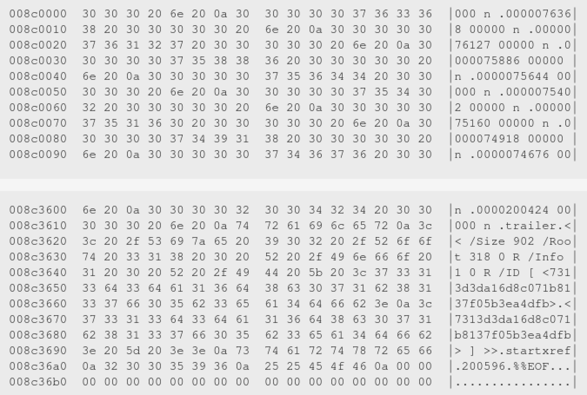

# Hackergame 2021 题解 - Rick Astley

https://t.me/hack2021_ans

前菜鸡OI选手，前安卓逆向玩家，现前端黑魔法与摸鱼选手的简单WP

只为图一乐

**WARNING:** 本WP包含以下内容

- 碎碎念
- 破防瞬间
- 非正常解法
- Jupyter Notebook

如有不适请立即关闭此页面

## T7 FLAG 助力大红包

> 我猛然一看，就猛然看到这个题，我直呼我直呼，上次看到这么这么的题还是上次。我之前还没发现，当我发现的时候我已经发现了，我不禁新建了一个Notebook：`([PD]{3}).ipynb` ...

三年之期已到，龙王究竟做了什么？请前往 `T7_Invite/$1.ipynb` 阅读更多精彩内容...

## T10 Easy RSA

出题人大概是摸了

记得之前见过完全一样的RSA题，于是根本没推式子，也没写代码，直接Google，发现有现成WP，抄之

~~真就是信息检索大赛~~

[EasyRSA_Solve.ipynb](T10_EasyRSA/EasyRSA_Solve.ipynb)

## T13 灯，等灯等灯

破防 x1

高斯消元没调出来，第一关都没过...

~~三年OI一场空~~

## T17 卷王与野生的 GPA

竟然提供了`.elf`，体验良好

直接进行了一个解密函数的写，覆盖到原来的内存上让其输出

[Decrypt.ipynb](T17_GBA/Decrypt.ipynb)

## T18 阵列恢复大师

不会只有我是一个一个文件 `hexdump` 对的吧.webp




## T19 链上预言家

破防 x2

其实没做过区块链题，头一回学，然后在 Remix 上感觉跑过了，提交，报错

成功陷入那个 creationCode 会加代码 hash 的坑，感觉学到许多.jpg

[本应能做出来Part1的.Sol](T19_Solidity/attack.sol)

## T24 密码生成器

破防 x3

IDA反编译Qt真不是什么好体验，尤其是在忘记把编码换到 `utf-8` 的时候

## T28 p😭q

傅里叶变换成功勾起了我的回忆，上次我写 FFT 还是在上次.webp

好在这回可以调库，并没有破防

[两个Notebook和一份从别的地方拿过来的音效](T28_Fourier/)

## Extra

```
PS > pip install web3
Collecting web3
...
running build_ext
building 'cytoolz.dicttoolz' extension
error: Microsoft Visual C++ 14.0 or greater is required. Get it with "Microsoft C++ Build Tools": https://visualstudio.microsoft.com/visual-cpp-build-tools/
```
