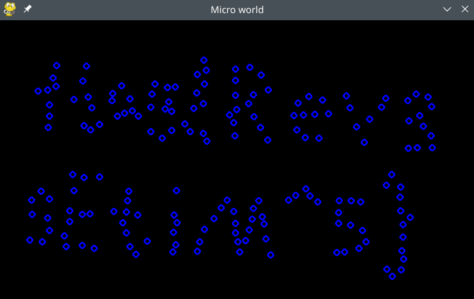

## Micro World

这题程序可以 Wine 跑。从命令行输出可以判断程序是 [pygame](https://www.pygame.org/) 写的。这要能直接弄出来代码就方便了。

exe 是用 PyInstaller 封装的。用 [pyinstxtractor](https://github.com/extremecoders-re/pyinstxtractor) 可以解出来 pyc 文件（Python 字节码）。结合程序 Ctrl-C 时的调用栈可以看出，`2.pyc` 是程序的入口：

```
pygame 1.9.6
Hello from the pygame community. https://www.pygame.org/contribute.html
^CTraceback (most recent call last):
  File "2.py", line 116, in <module>
    (162.687, 93.7322, -0.974567, -0.972881),
  File "2.py", line 84, in next_pos_list
    (324.602, 71.9988, -0.445236, -0.798294),
KeyboardInterrupt
```

我在 Linux 上可以直接 `python3 2.pyc` 跑起来程序。

然后搜索怎么把字节码反编译成 Python 代码。首先找到 [python-decompile3](https://github.com/rocky/python-decompile3)，但 `2.pyc` 的字节码是 Python 3.9 的，这个库还不支持。然后又找到 [pycdc](https://github.com/zrax/pycdc)，这个支持 Python 3.9，但反编译出来的代码不太完整，有些地方明显不对。比如下面是反编译代码的片段，`drawpoint` 那里直接来个 `pass`，主程序的 `if running` 也应该是 `while` 才对吧：

```python
def drawpoint(screen, list_):
    pass

def next_pos_list(Pointlist):
    pointlist = []
    return pointlist

Pointlist = []

def value(lis):
    count = 0
    return count

if running:
    clock.tick(FPS)
    screen.fill(BLACK)
    drawpoint(screen, Pointlist)
    Pointlist = next_pos_list(Pointlist)
    pygame.display.flip()
    continue
pygame.quit()
```

但反编译代码还是基本揭示了程序的逻辑的。程序最开始有个粒子坐标和速度的列表，然后有个看起来很复杂的 `get_new_point` 函数，应该是计算下一时刻粒子坐标的：

```python
list_ = [
    (104.58, 294.306, 0.157768, 0.417769),
    (97.8709, 284.077, -0.053708, -1.5118),
    (394.139, 342.409, 1.25792, -0.646164),
    (383.764, 351.02, 0.20006, 0.688641),
    # ......
]

class Point:
    def __init__(self, pos, vx, vy):
        (self.x, self.y) = pos
        self.vx = vx
        self.vy = vy
        self.flag = 1

def get_new_point(time, point1, point2):
    ......
```

并不用完全看懂程序。**自己重写一下主程序的循环，需要的函数可以直接从 pyc 文件 import**。把粒子运动方向都取反就可以看到0时刻之前的状态，代码如下：

```python
import time
import pygame
import random
import math
# monkey patch 一下 `pygame.quit`，不然窗口没办法重新跑起来
pygame.quit = lambda: None

# original_main.pyc 就是 2.pyc 重命名的
from original_main import drawpoint, clock, FPS, BLACK, screen, Pointlist, next_pos_list

print("TRAVELING BACK...")
for p in Pointlist:
    # 速度取反并且速度降到 10%，不然粒子跑太快了看不清
    p.vx = -p.vx * 0.1
    p.vy = -p.vy * 0.1

running = True
while running:
    clock.tick(FPS)
    screen.fill(BLACK)
    drawpoint(screen, Pointlist)
    Pointlist = next_pos_list(Pointlist)
    pygame.display.flip()
    continue

pygame.quit()
```

import 时会执行原来的程序，直接关掉窗口，然后就会执行我们写的代码，粒子开始反向运动方向。目测 flag 出现时截个图即可。


