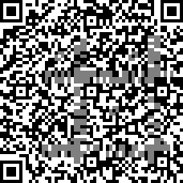

## 马赛克

这题原理很明确。马赛克方格的亮/暗实际上反应了掩盖区域的黑白像素比例。如果用的是最简单的马赛克算法——取遮挡区域像素平均值，那么完全可以**穷举被遮挡的 QRCode 方格颜色来试出正确的组合**。

马赛克方格大小是 23x23，QRCode 方格大小是 11x11，一个马赛克方格最多遮挡 3x3 个 QRCode。9 个黑白块至多有 512 种色彩组合，复杂度不高。不过只考虑一个马赛克方格的话，有些 QRCode 方格解可能不唯一。但只要试探出一个 QRCode 方格，覆盖它的其他马赛克方格的搜索空间也会减少，导致附近 QRCode 方格更可能有唯一解。所以这里我们不断重复穷举算法，直到无法解出新的  QRCode 方格。

另外还有一些额外的信息可以用。**被遮挡的部分有 4 个 Alignment pattern（见下图），这总共100个方格也是已知的**。不过本题好像不用这个信息也能做出来。


以下是恢复 QRCode 的程序代码：

```python
#!/usr/bin/env python3

from itertools import product
from collections import Counter
import numpy as np
from PIL import Image
import matplotlib.pyplot as plt

QR_UNIT_WIDTH = 11
QR_N_UNIT = 57
MASK_POS = (103, 137)
MASK_UNIT_WIDTH = 23
MASK_N_UNIT = 20
MASK_WIDTH = MASK_UNIT_WIDTH * MASK_N_UNIT

pil_img = Image.open('./pixelated_qrcode.bmp').convert('L')
img = np.array(pil_img)

mask = np.zeros_like(img)  # 记录哪些像素被马赛克覆盖
mask[MASK_POS[0]:MASK_POS[0] + MASK_WIDTH, MASK_POS[1]:MASK_POS[1] + MASK_WIDTH] = 1
bitmap = np.zeros((QR_N_UNIT, QR_N_UNIT), dtype=np.uint8)  # 用二维数组存的 QRCode 图像
pixel_map = dict()  # 记录每个像素对应 bitmap 的哪个位置

# 先把没完全被遮住的 QRCode 方格填上去
for i in range(QR_N_UNIT):
    y0 = i * QR_UNIT_WIDTH
    y1 = y0 + QR_UNIT_WIDTH

    for j in range(QR_N_UNIT):
        x0 = j * QR_UNIT_WIDTH
        x1 = x0 + QR_UNIT_WIDTH

        bitmap[i, j] = 127

        for y_sample in (y0, y1 - 1):
            for x_sample in (x0, x1 - 1):
                if mask[y_sample, x_sample] == 0:
                    bitmap[i, j] = img[y_sample, x_sample]
                    break

        for u in range(y0, y1):
            for v in range(x0, x1):
                pixel_map[u, v] = (i, j)


# 恢复一下被遮住的 alignment pattern
bitmap[26:31, 26:31] = bitmap[48:53, 26:31] = bitmap[26:31, 48:53] = bitmap[48:53, 48:53] = bitmap[4:9, 26:31]

# 主循环，每轮循环遍历所有马赛克方格，穷举被遮住的 QRCode 方格颜色
end_flag = False
while not end_flag:
    end_flag = True

    for i in range(MASK_N_UNIT):
        y0 = MASK_POS[0] + i * MASK_UNIT_WIDTH
        y1 = y0 + MASK_UNIT_WIDTH

        for j in range(MASK_N_UNIT):
            x0 = MASK_POS[1] + j * MASK_UNIT_WIDTH
            x1 = x0 + MASK_UNIT_WIDTH

            masked_pos_counter = Counter()
            known_sum = 0

            for u in range(y0, y1):
                for v in range(x0, x1):
                    bi, bj = pixel_map[u, v]

                    if bitmap[bi, bj] in (0, 255):
                        known_sum += bitmap[bi, bj]
                    else:
                        masked_pos_counter[bi, bj] += 1

            # 穷举被遮住的 QRCode 方格的所有可能的黑/白颜色组合
            possible_assignments = []
            for assignment in product(*([[0, 255]] * len(masked_pos_counter))):
                test_sum = known_sum + sum(a * b for a, b in zip(assignment, masked_pos_counter.values()))

                if img[y0, x0] == test_sum // MASK_UNIT_WIDTH ** 2:
                    # 平均后的像素值的确和马赛克格子像素值一致，说明找到一组解
                    possible_assignments.append(assignment)

            assert len(possible_assignments) > 0  # 肯定至少有个解吧
            assignment_matrix = np.array(possible_assignments)

            for k, (ii, jj) in enumerate(masked_pos_counter.keys()):
                col = assignment_matrix[:, k]
                if np.all(col == col[0]):
                    # 如果当前 QRCode 方格解唯一，记录下来
                    bitmap[ii, jj] = col[0]
                    end_flag = False


plt.imshow(bitmap, cmap='gray')
plt.show()
```

最后恢复出的 QRCode 如下图，有些格子仍然无法确定，但恢复出的部分已经足够解码了。


