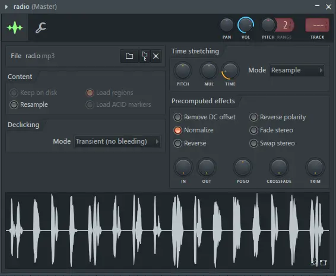

# 去吧！追寻自由的电波

~~音乐人狂喜(~~

使用保卫萝卜（）在Resample模式下调整TIME即可，顺便可以来个Normalize



# Easy RSA

不会数论，选择使用Mathematica解决问题

已知x、y，可求出p，参考https://www.geeksforgeeks.org/modular-exponentiation-power-in-modular-arithmetic/

```mathematica
p = NextPrime[Fold[Mod[#1 * ModularInverse[#2, x], x] &, x - 1, Range[y + 1, x - 1]]];
```

参考RSA原理可求出q

```mathematica
(* value10是value[-1] *)
value = NextPrime[value10, #] & /@ Range[-9, 0];
NCESolveM[nv_, c_, e_] := PowerMod[c, ModularInverse[e, Times @@ ((# - 1) & /@ nv)], Times @@ nv];
q = NextPrime[NCESolveM[value, valueQ, e]];
```

已知p、q、c、e，根据RSA原理求出m

```mathematica
m = NCESolveM[{p, q}, c, e];
```

转成字符串即可得到flag

```mathematica
StringJoin @@ (FromCharacterCode[FromDigits[#, 16]] &) /@ StringJoin /@ Partition[Characters[IntegerString[m, 16]], 2]
```

[完整代码](0.wl)

