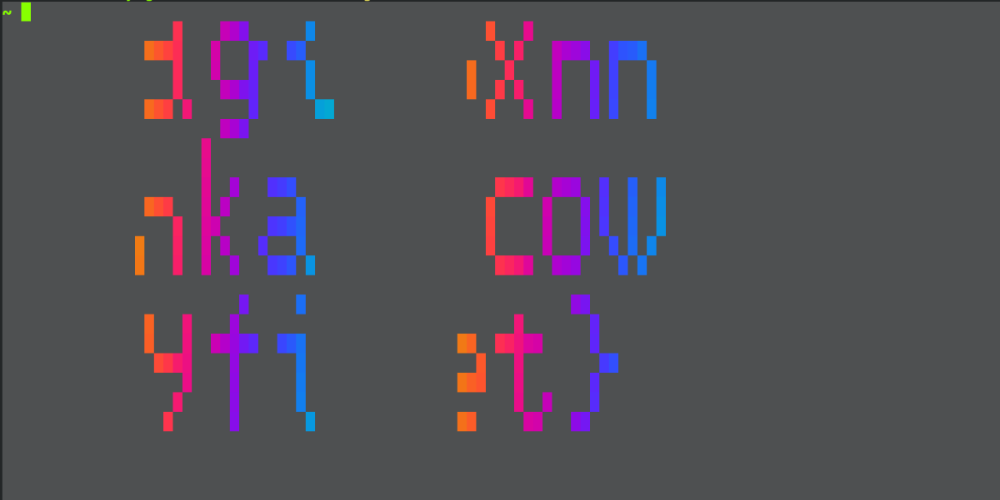
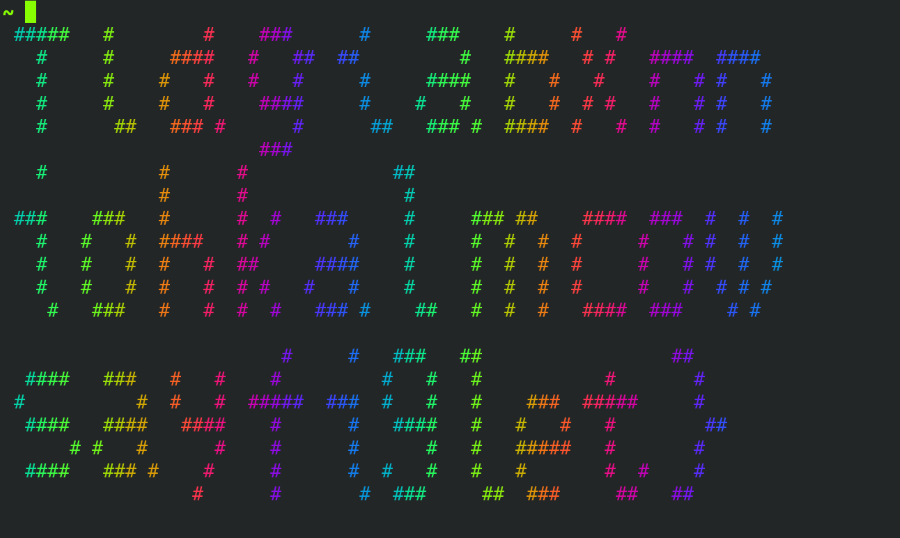
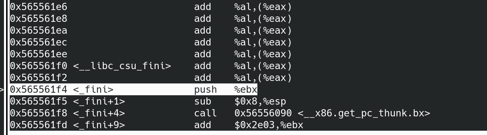
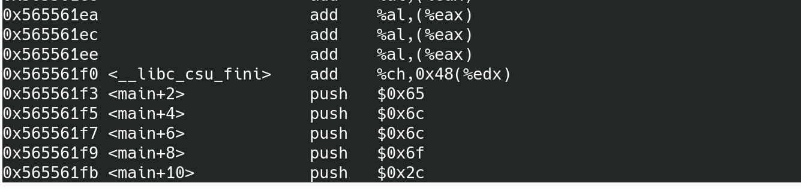
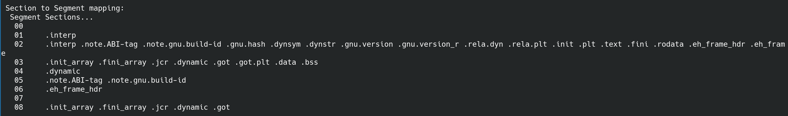
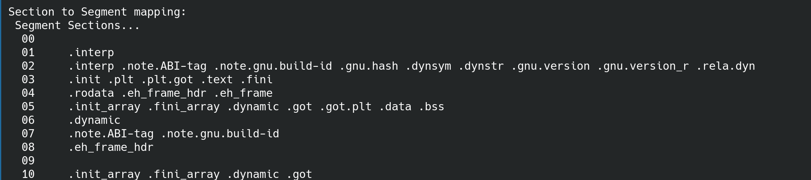
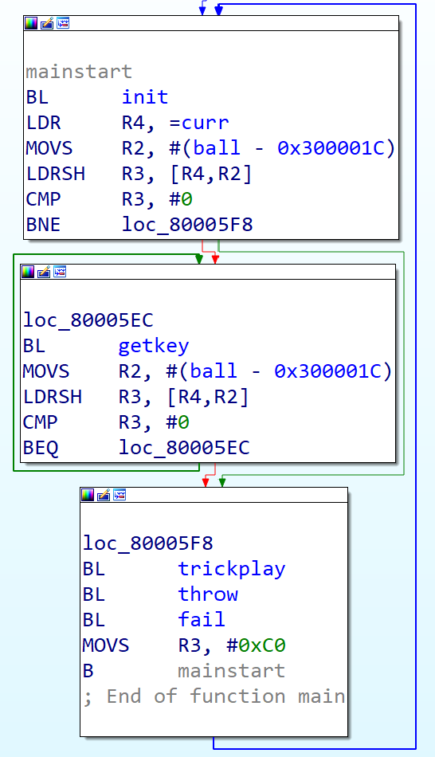

# Writeup

第一次参加 CTF，玩得很开心，学了很多，体验很好，还意外地上榜了，明年再来（

## 签到

点下 next，看到多了个 `page=1` 的 query，时间 1970-01-01 08:00:01，能看出 page 为 unix timestamp，查一下当前时间戳，替换进去完事

## 进制十六——参上

flag 太长了懒得手打，直接 ocr 再贴到 [CyberChef](https://gchq.github.io/CyberChef/)

再次安利一下 CyberChef，在 Win 下没环境时候没少用（

## 去吧！追寻自由的电波

题目提到"录音的速度有所改变"，那把音频减个速听就好

## 猫咪问答 Pro Max

### 第一问

网站现已无法访问，那就上 [Wayback Machine](https://archive.org/web/)

### 第二问

这种荣誉奖项[介绍](https://lug.ustc.edu.cn/wiki/intro/)里肯定会有

### 第三问

搜索**西区图书馆的活动室**，搜到 [西区图书馆新活动室启用](https://lug.ustc.edu.cn/news/2016/06/new-activity-room-in-west-library/https://lug.ustc.edu.cn/news/2016/06/new-activity-room-in-west-library/)，配图里能看到

### 第四问

搜 **SIGBOVIK 2021 Newcomb-Benford**，找到 [描述的论文](http://sigbovik.org/2021/proceedings.pdf)

一共有 14 个 figure，但第一个 figure 不是 dataset，不算

### 第五问

搜 **IETF Protocol Police**，找到那篇 [RFC](https://datatracker.ietf.org/doc/html/rfc8962)，读 Table of Contents 里有 Reporting Offenses 就能找到答案 **/dev/null**

## 卖瓜

玩了一会儿发现负数没反应、会溢出

于是凑一下

```python
int(math.pow(2,63) / 6) = 1537228672809129216
int(math.pow(2,63) ) - 6 * 1537228672809129216 = 512
512 / 6 = 85.33333333333333
```

那就先来 1537228672809129216 个 6 斤，再来 85 个 6 斤

得到 9223372036854775806, 离 int64 最大还差 2

结果再加 1 个 6 变成 float 了，迷茫（

又随便试了下，如果是加 1537228672809129216 个 9 斤的瓜会怎么样

成功溢出成一个负整数，得到 -4611686018427387904

接下来就好办了，先把它绝对值搞小一点

`int(4611686018427387904 / 9) = 512409557603043072`

加完变成 -256

再加 28 个 9 斤变成 -4

这时候已经可以发现，再加 24 斤 就是 20 了

最后再加 4 个 6 斤，得到 flag

## 透明的文件

先跑 `ls --color | less` 看看正常带颜色的是什么样的

```
ESC[0mESC[01;34mDesktopESC[0m
ESC[01;34mDocumentsESC[0m
ESC[01;34mDownloadsESC[0m
ESC[01;34mMusicESC[0m
ESC[01;34mPicturesESC[0m
ESC[01;34mPublicESC[0m
ESC[01;34mTemplatesESC[0m
ESC[01;34mVideosESC[0m
```

对比一下题目，能看到 cmd 把 `ESC` 处理掉了

把 `[` 替换成 `ESC [` 试了一下，结果得到了一片空白

后来发现其实选中看似空白的终端，还是能看到个残缺的 flag



再仔细看了一下给的文件，发现里面有大量的空格，猜想输出不完整和这个空格有关

于是把空格替换成了可见字符 #，得到了五颜六色的flag



## 旅行照片

第一反应去看 EXIF，不出意外什么都没有

图里可以看到一个海边的 KFC，于是搜索海洋蓝色 KFC，就知道是在秦皇岛了

### 面朝方向
找这个地方的地图可以推出来
### 时间
不是很确定，试的（
### 楼层
数了半天也不确定，也是试的（
### 电话
KFC 官网可以查到
### 汉字
搜别人拍的照片能看到是海豚馆

一开始没审题，试了半天冰激凌（

## FLAG 助力大红包

活动规则提到使用前后端检测 IP，其实是从前端获取 IP 发给后端，后端再去检测

提到后端查 IP，之前配 nginx 时候看到过有手动添加 `X-Forwarded-For` 防止伪造请求 IP 的配置

试了一下，后端果然相信这个 header，接下来只要写个脚本送请求即可

这题我踩了两个坑
1. 前端获取 IP 的脚本被我浏览器拦了，一开始自己试着点一下时候提示 IP 格式不正确把我弄懵了（
2. 得注意 rate limit，sleep 太长会超时，我测下来最佳 sleep 时机为每 10 个请求 sleep 3 秒


## Amnesia

### 轻度失忆

隐约记得 `.data` 和 `.rodata` 是放全局变量、常量的，那把字符串放在代码段 `.text` 里就好了

于是把字符串拆成一个个字符，编译时这些字符应该会变成 immediate value 被 push 到 stack 里，就能存活下来

最后调了十几次的 printf 就过了

后来才意识到不用这么麻烦，在 main 里定义个 `char hello[] = {'H', 'e' , ... }` 也行，这样就优雅多了嘛（


### 记忆清除

`.text` 是存放代码段的，要想代码段不被删除能怎么办呢

联想起之前读过这篇[文章](https://jroweboy.github.io/c/asm/2015/01/26/when-is-main-not-a-function.html)

作者将 main 定义成一个 `const char []`

我想，`const char []` 会在 `.rodata`，应该就没事了吧

于是和上文一样，写了段 x86 汇编，assemble 完把 bytes 提出来，放 [Compiler Explorer](https://godbolt.org/) 找到相近版本的 gcc 上编，成功输出正确的字符串

结果一提交，segfault 了

没办法，只能把编译的 docker 拉下来调了

`docker run --name lug_hello --cap-add=SYS_PTRACE --security-opt seccomp=unconfined -t ustclug/debian:10 bash`

跑时候需要加几个参数，允许 docker 跑 gdb

一调发现， `_start` 代码也变清空了，唯一执行的代码在 `.fini` 段



所以，只要把自己的代码添加到 `_fini` 的上面就可以了

于是，我把 inline asm 放在 main 里面，然后用 gcc 的 section attribute 建了一个 `.text2` 测试，结果又 segfault 了

再次打开 gdb， 看到了这么一幕



我没写过这行指令啊？用 objdump 确认一下


objdump 识别出来的指令没错

仔细观察可以看到，main 的第一行指令被合并到 `fini` 函数里去了

于是加了 align 的 attribute，通过了

最后我的代码:

```assembly
__attribute__((aligned(16),section(".text2")))
int main()
{
    __asm(
        "push $'H'\n"
        "push $'e'\n"
        "push $'l'\n"
        "push $'l'\n"
        "push $'o'\n"
        "push $','\n"
        "push $' '\n"
        "push $'w'\n"
        "push $'o'\n"
        "push $'r'\n"
        "push $'l'\n"
        "push $'d'\n"
        "push $'!'\n"
        // initialize loop variable
        "mov $0, %esi\n"
        // point to first character
        "add $48, %esp\n"
        // system call write
        "label: mov $4, %eax\n"
        "mov $1, %ebx\n"
        "mov %esp, %ecx\n"
        "mov $1, %edx\n"
        "int $0x80\n"
        // next chatacter
        "sub $4, %esp\n"
        "inc %esi\n"
        "cmp $12,%esi\n"
        "jle label\n"
        // system call exit
        "mov $1, %eax\n"
        // exit code = 0
        "mov $0, %ebx\n"
        "int $0x80\n"
    );
}

```

顺便，之前那位的做法在新版 gcc 也行不通了，因为目前 `.rodata` 所在的 Segment Section 不再是可执行了

之前 gcc 把 .text 和 .rodata 合并在一起看起来是[优化](https://stackoverflow.com/questions/44938745/rodata-section-loaded-in-executable-page)





## 图之上的信息

浏览器看到查询 note 请求

`{"query":"{ notes(userId: 2) { id\ncontents }}"}`

于是造了一个请求查询邮箱

`{"query":"{ user(id: 1) { email }}"}`

回复

`{"errors":[{"message":"Cannot query field 'email' on type 'GUser'.","locations":[{"line":1,"column":17}],"path":null}]}`

于是问题转变成了，如何知道 email 在模型里面叫什么

GraphQL 服务器应该都支持 introspection，于是找了一段 [introspection 请求](https://gist.github.com/craigbeck/b90915d49fda19d5b2b17ead14dcd6da)

回复

```json
......
{
    "name": "privateEmail",
    "description": null,
    "args": [],
    "type": {
    "kind": "SCALAR",
    "name": "String",
    "ofType": null
    },
}
......
```
知道了 email 对应的名字，再次请求即可拿到 flag

`{"query":"{ user(id: 1) { privateEmail}}"}`

## Easy RSA

### 求 p

根据提示，可以观察到 `x` 和 `y` 差值比较小，可以用 Wilson's Theorem 求 `y! % x`

### 求 q

`get_q()` 函数也相当于是一个 RSA，用公钥 `e` 加密了明文 `q`，得到 `value_q`

与 RSA 不同的是，这里的 `n` 是 10 个互质的数的积，而不是 `p` 和 `q` 的 积

因为给了 `value[-1]`， 所有 `value` 的值可以用 `sympy.prevprime()` 求出

有密文，有公钥，`n` 可以直接算， 那么加密 `q` 的私钥 `d` 即可用 Euler's theorem 求出，从而可以解出 `q`

```python
phi = 1
for i in range(10):
    phi = phi * (value[i] - 1)
d = sympy.mod_inverse(e, phi)
q = pow(value_q, d, n)
```
最后解开 flag:
```python
n = p * q
phi = (p - 1) * (q - 1)
d = sympy.mod_inverse(e, phi)
m = pow(c, d, n)
print(m.to_bytes(math.ceil(m.bit_length() // 8 ), 'big'))
```

## 加密的 U 盘

这题运用的是大多数磁盘加密方案的一个特性，就是区分用户的密码和实际加密的密钥

毕竟如果每次用户更换密码都更换 master key，就相当于得解密整个磁盘再重新加密，消耗太大

所以，只要从第一天的镜像里解出 master key， 或者 dump 出用原来 key 加密的 header，即可解密第二天的镜像

```bash
sudo losetup -P /dev/loop0 day1.img
sudo cryptsetup luksHeaderBackup --header-backup-file header.bin /dev/loop0p1
sudo losetup -P /dev/loop1 day2.img
sudo cryptsetup --header header.bin luksOpen /dev/loop1p1 day2
sudo mount /dev/mapper/day2 -o ro /mnt
```

## 赛博厨房

大概意思是写程序来做菜，写了新程序就不能做当天的菜

### Level 0

Programming 101：Hello world

一共只有4个菜谱，分别准备程序就好

### Level 1

Programming 102：Loops

看起来只有一个菜谱，但重复的太多了，写个循环吧

## 卷王与野生的 GPA

先拖到模拟器里看看，没大师球卡着了

把 ELF 拖到 IDA 看

```c
  while ( 1 )
  {
    init();
    while ( !ball )
      getkey();
    trickplay();
    throw();
    fail();
  }
```



同时，符号表里有个没 xref 的 `decrypt`

于是 patch 两个地方

1. 首先不能让他卡在没球，于是把 `BNE` 改成 `BL`

2. 然后不能让他每次都失败，于是得把 `BL fail` 改成 `BL decrypt`

   fail 的 offset 是 0x10438，decrypt 的 offset 是 0x10574，相差 0x13c

   `BL fail` 的指令为 `BL #0xfffffe38`

   于是 `BL decrypt` 指令就是 `BL #0xffffff74`

改完这两处并且在屏幕刷新前截图即可得 flag，截图不够快就会丢失 flag（

## 阵列恢复大师

### RAID 0

RAID 0 特点是把连续数据分散到多个盘储存，并且没冗余

利用这个特点，可以像拼拼图一样把这 8 块盘拼回去

首先看每块盘的开头和结尾

能观察到 wlOUASom2fI.img 开头有 EFI 头，ID7sM2RWkyI.img 结尾有 EFI 头，就可以知道**分别是第一和第八个碟**

然后扫一眼盘中间内容，大部分在 offset 0x8c0000 有文本内容，就从这边入手吧

观察到以下几点

5qiSQnlrA4Y.img 的文字是从 0x8c0000 到 0x8dffff，说明**块大小为 128KB**

5qiSQnlrA4Y.img 的块结尾是 re， d3Be7V0EVKo.img 块开头是 iveness_under

**则有 5qiSQnlrA4Y.img -> d3Be7V0EVKo.img**

eRL2MQSdOjo.img 块结尾有 0000471087，0000470796 等数字

RApjvIxRlu0.img 块开头有 0000470505， 0000470214 00000 等数字

**则有 eRL2MQSdOjo.img -> RApjvIxRlu0.img**

wlOUASom2fI.img 块结尾有 0000076852，0000076610 等数字

jCC60mutgoE.img 块开头有 0000076368，0000076127 等数字

**则有 wlOUASom2fI.img -> jCC60mutgoE.img**

1GHGGrmaMM0.img 块结尾有 /Subtype /Link /R

5qiSQnlrA4Y.img 块开头有 ect

**则有 1GHGGrmaMM0.img -> 5qiSQnlrA4Y.img**

整理一下，现在有

**wlOUASom2fI.img -> jCC60mutgoE.img -> ? -> ? -> ? -> ? -> ? -> ID7sM2RWkyI.img**

**eRL2MQSdOjo.img -> RApjvIxRlu0.img**

**1GHGGrmaMM0.img -> 5qiSQnlrA4Y.img -> d3Be7V0EVKo.img**

也就是说只有 2 种可能了，试一下就可以了

使用 mdadm 组没 metadata 的 RAID 0

```bash
sudo losetup /dev/loop......
sudo mdadm /dev/md0 --build /dev/md0 --verbose --raid-devices=8 --level=0 --chunk=128 ......
sudo mount /dev/md0p1 -o ro /mnt
```

挂上以后 cd 到挂载点跑脚本获取 flag 即可

### RAID 5

RAID 5 特点是把连续数据分散到多个盘储存，有冗余并且有 左/右 同步/异步 4 种常见的排序方式

用上面的方法看到 2 块盘开头有 EFI 头，2 块盘结尾有 EFI 头

应该分别对应数据和冗余吧

又一看之前用 mdadm 的 build 选项不支持 RAID 5，即没有 metadata 用 mdadm 组不了，溜了溜了（

## p😭q

看源码，gif 里每一帧代表每个频段的能量

如果能量大于一定阈值就是红色，否则就是白色

这题的主要思路是，只要把整个程序逆过来就可以得到 flag

那么第一步，就是将 gif 读取成一个 numpy 数组

没想到这解析 gif 还挺坑的，试了好多库读出来的数据格式都和原来不一样

找了个 librosa 的 example sound 来调试，完成了解析 gif 的代码

```python
gif_frames = []
# 为了方便处理，我事先把 gif 分割了
frame_list = glob.glob("flag/*.gif")
# glob 返回为乱序
frame_list.sort()
for image_file in frame_list:
    im = Image.open(image_file)
    # 默认 PIL 读取 gif 为 256 色，故转回 RGB
    # 发现读出来的长和宽是反的，转一下
    gif_frames.append(np.asarray(im.convert("RGB")).transpose([1, 0, 2]))
```

接下来是把这些图像转成频谱

```python
S = []
red_pixel_np = np.array(red_pixel)
white_pixel_np = np.array(white_pixel)

for frame in gif_frames:
    S_frame = []
    for frame_by_freq in frame:  # 130 * 92
        red_count = 0
        white_count = 0

        for pixel in frame_by_freq:
            if pixel.all() == red_pixel_np.all():
                red_count += 1
            elif pixel.all() == white_pixel_np.all():
                white_count += 1
            else:
                raise ValueError

        S_frame.append(float(red_count + min_db))
    # 每个频率对应 2 字节，频率之间又有 2 字节空白，每 4 字节采样一次
    S.append(S_frame[2::4])

M = np.array(S).transpose()
```

最后只要把频谱转回音频并输出就可以了，看 librosa 文档有一个包好的函数，就不分步了

librosa 没有接口输出音频，用的 SoundFile

```python
flag = librosa.feature.inverse.mel_to_audio(librosa.db_to_power(M),
                                            n_fft=fft_window_size,
                                            hop_length=frame_step_size,
                                            window=window_function_type)

sf.write("flag.wav", flag, sample_rate)
```
