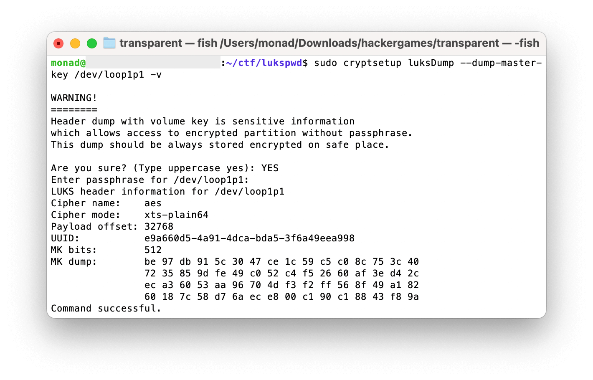

# 加密的 U 盘

通过查询 LUKS 的使用文档，可以发现其可以使用密码或 keyfile 加密，于是大胆猜测改密码不会改变 keyfile 一类的东西（注：实际上是 master key 不会变）。

首先使用 `losetup -P /dev/loop1 day1.img` 将镜像挂载至 loopback（day2 同理）。

然后用 `cryptsetup luksDump --dump-master-key /dev/loop1p1` dump 出 master key。`MK dump` 里就是 master key。并用 `xxd` 或其它工具将 master key 写入文件。

接着用 master key 打开 `day2.img` 即可：`sudo cryptsetup luksOpen --master-key-file <key file> /dev/loop2p1 day2`。

最后把 `/dev/mapper/day2` mount 一下就能读出 `flag.txt` 了。
