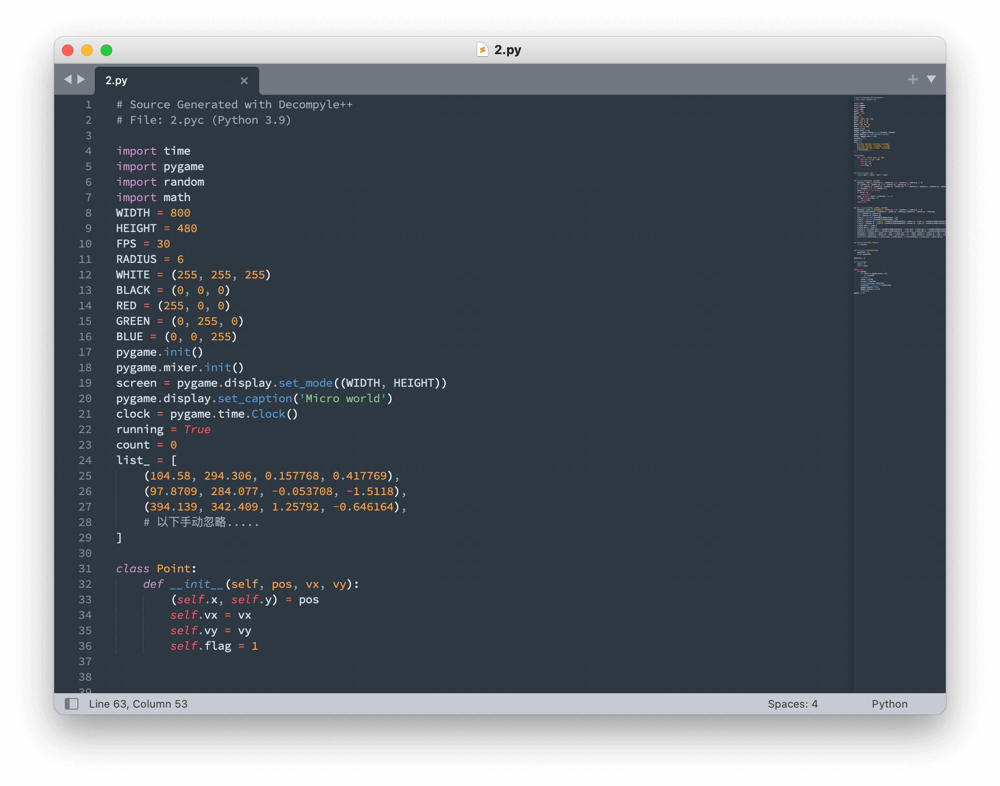

# Micro World

<del>随便乱瞅一下（我不会告诉你我走了多少弯路的）</del>，能发现这个程序是用 pyinstaller 生成的。

然后就找一个 pyinstaller unpacker（我用的是 [extremecoders-re/pyinstxtractor](https://github.com/extremecoders-re/pyinstxtractor)），然后就可以发现一个 `2.pyc` 文件。用 `pip` 安装 `pygame` 后，发现可以直接用 `python 2.pyc` 运行，能确定提取出了正确的东西。

接着继续尝试反编译，我这里找了 [zrax/pycdc](https://github.com/zrax/pycdc)，能够逆向 Python 3.9 的字节码，但不完全能逆向出来（但是至少能看到大致的逻辑，也能看到点的数据）。



这是 `2.pyc` 中 `Point` 的定义：

```python
class Point:
    def __init__(self, pos, vx, vy):
        (self.x, self.y) = pos
        self.vx = vx
        self.vy = vy
```

不难猜出，`vx` 和 `vy` 就是这个点的移动速度（也就是 `list_` 每个元素的后两个值）。显然，只要把这个速度取相反数就可以还原出原 flag 图案了（显然碰撞是可逆的）。

然而我并不想对着 bytecode 翻译一遍代码，所以我决定动态“注入”到 `2.pyc` 里面改变量。下面我们先把 `2.pyc` 重命名成 `w2.pyc`，因为不能直接 `import 2`。

但是 `import w2` 后，`import` 没返回，窗口已经运行了，有点难改变量。下面开始乱搞！

我们可以新建一个 `pygamx.py` 来 mock `pygame`，然后修改 `w2.pyc` 的 bytecode：暴力把 `pygame` 改成 `pygamx`（暴力替换二进制数据即可）。

`pygamx.py`：

```python
import pygame

class Time:
    class Clock:
        def init(self):
            self.first = True
            self.clock = pygame.time.Clock()

        def tick(self, fps):
            # 手动控制每一帧
            input()
            # self.clock.tick(fps)

            if self.first:
                self.first = False

                # 经过测试，可以在这里反向 import 并访问 Pointlist 而不抛出 AttributeError
                import w2
                for i in range(len(w2.Pointlist)):
                    p = w2.Pointlist[i]
                    w2.Pointlist[i] = w2.Point((p.x, p.y), -p.vx, -p.vy)

time = Time()

# mock attributes
init = pygame.init
quit = pygame.quit
mixer = pygame.mixer
display = pygame.display
event = pygame.event
draw = pygame.draw
QUIT = pygame.QUIT
```

然后经过测试，可以在上面 `pygame.time.Clock.tick` 里面反向 `import w2`，修改 `list_` 和 `Pointlist`，把速度取反，就可以了。

此时直接运行 `python w2.pyc`，并且在控制台窗口用回车控制每一帧，看到 flag 差不多展示出来了就行了：


