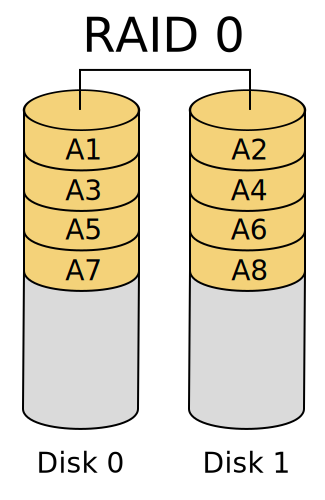
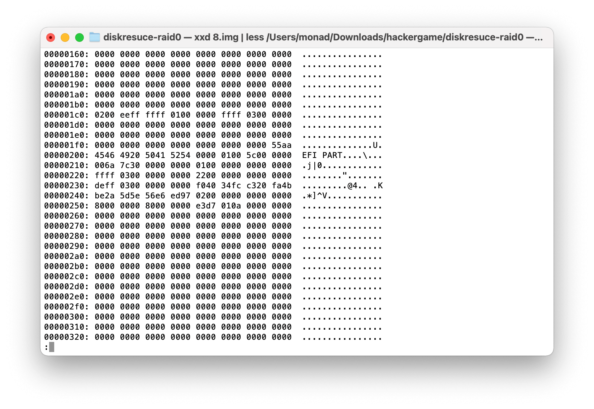
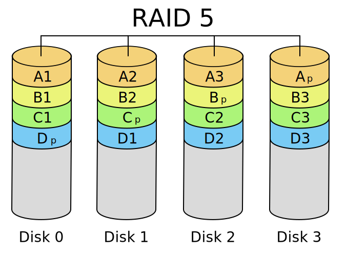
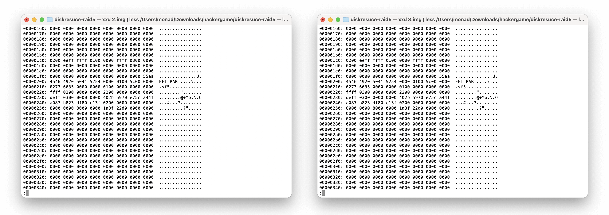

# 阵列恢复大师

<del>数据恢复软件都是浮云，手撕才是正道。</del>

当时做题的时候，看着 RAID 5 通过的人比 RAID 0 多，所以就先跑去做 RAID 5 了。后来仔细思索一下，可能是因为 RAID 5 有软件能一键恢复吧。

## 1 - RAID 0

额，在恢复之前，先来看一下 RAID 0 的结构。

说白了大概就是按块大小分块，然后按顺序依次存放在各个盘中。所以一个推论就是，一段内容只会出现在一个盘里面。

为了方便起见，先把硬盘名字按照字母序重命名成 1\~8.img。

先随便看看这些盘的内容，然后不难发现，8.img 的 0x00000200 处有一个 `EFI PART`，这是 GPT 分区表的标志。于是就不难推测出 8.img 是第一个盘。

然后的话，再随便翻翻这些盘的内容，发现似乎空的部分（`0x00`）比较多。要确定盘的顺序的话，因为块与块之间是直接拼起来的，所以可以直接看内容的连续性来判断块的顺序，进而判断盘的顺序。

这样的话，随便翻看几下，发现 `0x008C0000` 和 `0x008E0000` 附近的内容有断层，而且丰富性比较高，有文本、乱码、零。并且从这两个“断层”的距离不难推测出块的大小是 128KB。（注意下面第 4 块盘的 `0x008E0000` 前的部分，`n` 后面应该有一个空格。）

| Disk |  `0x008C0000` 前   |    `0x008C0000` 后   |   `0x008E0000` 前   |   `0x008E0000` 后  |
| :--: | :----------------: | :------------------: | :----------------: | :----------------: |
|  1   |     0x00000000     | ``2J..`...HD.....k`` | `Subtype /Link /R` |     0x00000000     |
|  2   |     0x00000000     |  `ect [118.3625 23`  | `g_system_respons` |     0x00000000     |
|  3   |     0x00000000     |  `iveness_under_lo`  | `...:......b.<.dL` |     0x00000000     |
|  4   |     0x00000000     |  `.q,.[.Q..B....Y.`  | `0470796 00000 n ` |     0x00000000     |
|  5   | `0 obj.<< /A 489 ` |  `..g..b.c.D\...G.`  | `F.O...\i...o.G..` |     0x00000000     |
|  6   |     0x00000000     |  `000 n .000007636`  | `M.t.p...V+.,=.2.` |     0x00000000     |
|  7   |     0x00000000     |  `.0000470505 0000`  | `4....%......,.iI` |     0x00000000     |
|  8   |     0x00000000     |  `0 R /Border [ 0 `  | `n .0000076610 00` | `.0..TL$w.......1` |

根据 RAID 0 的结构，不难推测出 `1 - 2`，`2 - 3`，`4 - 7`，`5 - 8`，`8 - 6`（能分成三大块：`5 8 6`，`1 2 3`，`4 7`）。（如果觉得看表难推测的话，可以再看看这些位置的上下文，找一下文本的规律（常见词等）。）

到这里，可能的盘的顺序就只剩下 `8 6 1 2 3 4 7 5` 和 `8 6 4 7 1 2 3 5` 两种，已经很优了。如果懒的话，可以直接两种方法都试一下，看看哪种对的就行了。

实际上，在 `0x001C0000` \~ `0x001E0000` 的地方，可以观测到内容从有（非 0x00）变无（0x00）：

|    Disk   | 1 |    2    | 3 | 4 | 5 | 6 | 7 | 8 |
| :-------: |:-:|:-------:|:-:|:-:|:-:|:-:|:-:|:-:|
| Not 0x00? | T | partial | F | F | F | T | F | T |

据此，能推断出第 2 块盘在第 4 个位置。也就是说上面的两个方案，`8 6 1 2 3 4 7 5` 是对的。

既然顺序和块大小（128 KB）都有了，直接恢复出完整镜像（我用了一下 DiskGenius），然后把镜像挂载一下就行了。

## 2 - RAID 5

同理，先来看看 RAID 5 的结构。

与上面 RAID 0 不同的是，它多了一块奇偶校验块。

也像上面一样，先瞅瞅这些盘的头部。

然后可以发现 2.img 和 3.img 有 GPT 头，故可以确定这两个盘一个是第一个位置，另一个是最后一个位置（首个校验块所在盘）。而且在 2.img 的 `0x0040400` 的地方可以找到 ext2/3/4 的 superblock。

所以现在就只剩下 12 种方案了……这一次我比较懒，就没有继续了（而且也懒得分析比较复杂的 RAID 5 了）。

然后我真的就去莽了，块大小 64 KB 和 256 KB 都莽一下（不要问我为什么不试 128 KB），再把上面 12 种方案都过一遍。实际操作就是在 DiskGenius 上排顺序，看看那个拼好了之后，DiskGenuis 能找到 ext2/3/4 分区。

最后试了几下，试出来了 `2 4 1 5 3`（块大小忘了实际上是多少了），然后用 DiskGenius 导出镜像（不知道为啥我那玩意不支持导出大于 1 MB 的文件），然后瞎搞一下，mount 上了就行了。

<del>为什么我导出镜像之后还要用 testdisk 找一下分区后，导出分区才能挂载。</del>
