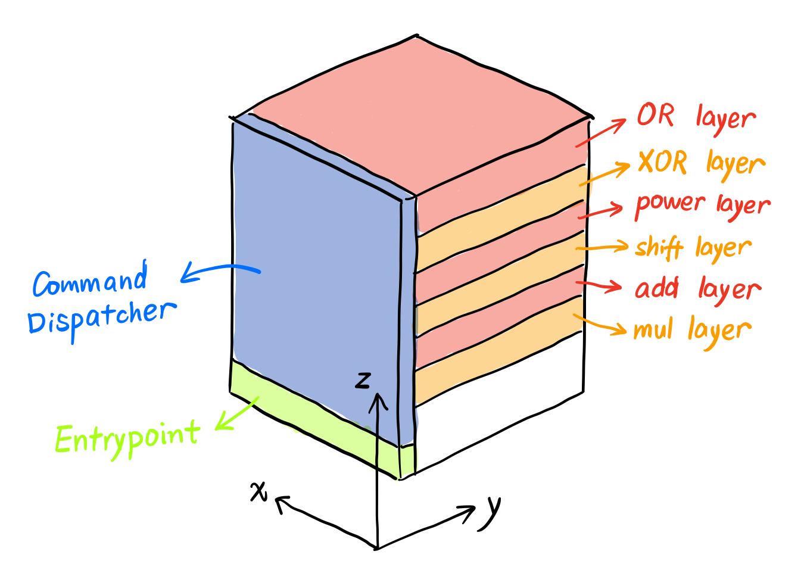
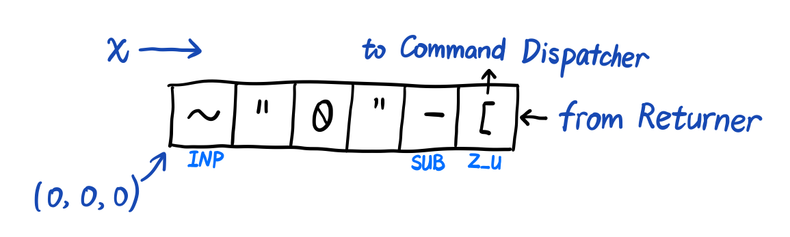
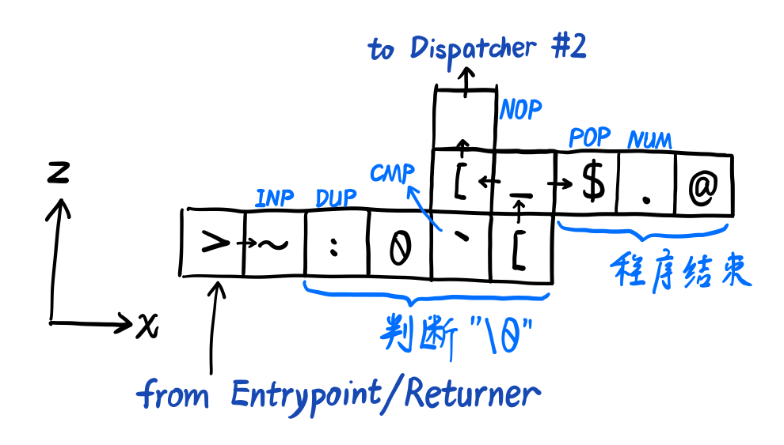
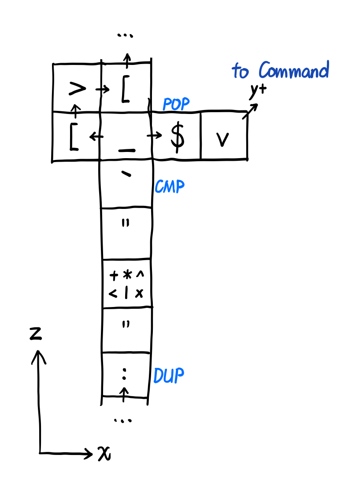
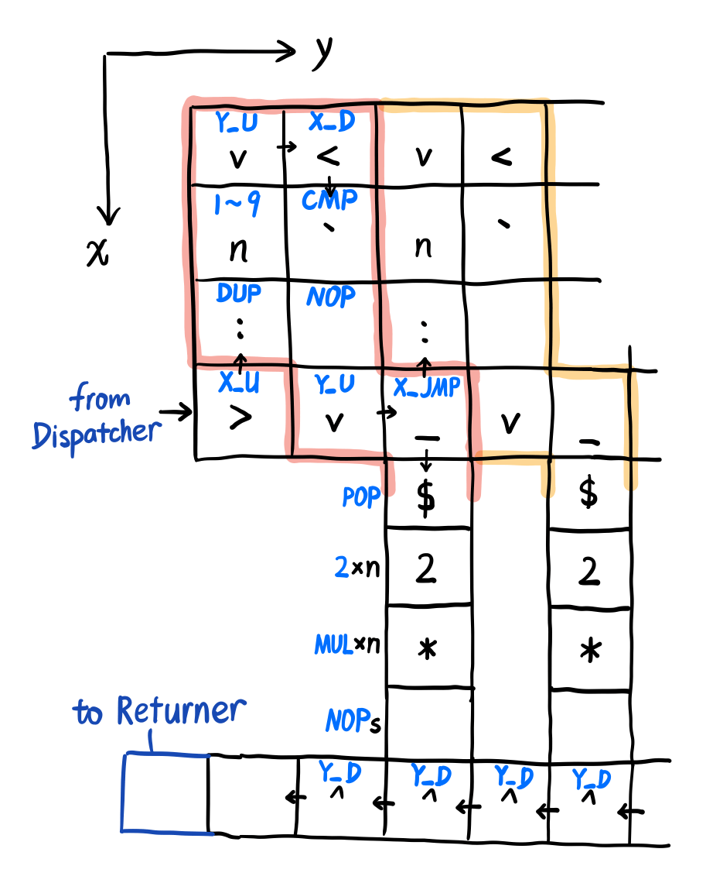

# JUST BE FUN

说实话，这道题还是蛮有意思的。怎么说呢，看着自己写的指令在三维空间上执行，虽然实际上没有什么用，但是看起来炫酷就完事了。

这道题的大致意思就是，你可以在一个三维（256 \* 256 \* 256）的空间（可以看成是地址）上写程序（每个点能写一个指令），然后解析器会在上面跑。同时解析器会随机生成一个求值字符串，需要你编写一个能正确算出这个值的程序。

|   指令   | 机器码 | 读取数 | 写入数 | 含义 |
| :------: | :---: | :---: | :---: | ----- |
| ADD_OP   |  `+`  |   2   |   1   | 将栈顶两个数相加 |
| SUB_OP   |  `-`  |   2   |   1   | 将栈顶两个数相减（栈顶为减数） |
| MUL_OP   |  `*`  |   2   |   1   | 将栈顶两个数相乘 |
| DIV_OP   |  `/`  |   2   |   1   | 将栈顶两个数相除（栈顶为除数） |
| MOD_OP   |  `%`  |   2   |   1   | 将栈顶两个数取模（栈顶为模数） |
| NOT_OP   |  `!`  |   1   |   1   | 取非 |
| CMP_OP   |`` ` ``|   2   |   1   | 比较，栈顶小则 1，否则为 0 |
| X_U_OP   |  `>`  |   0   |   0   | 向 x+ 运行 |
| X_D_OP   |  `<`  |   0   |   0   | 向 x- 运行 |
| Y_U_OP   |  `v`  |   0   |   0   | 向 y+ 运行 |
| Y_D_OP   |  `^`  |   0   |   0   | 向 y- 运行 |
| Z_U_OP   |  `[`  |   0   |   0   | 向 z+ 运行 |
| Z_D_OP   |  `]`  |   0   |   0   | 向 z- 运行 |
| X_JMP    |  `_`  |   1   |   0   | 若栈顶为 `True`，则向 x- 运行，反之亦然 |
| Y_JMP    |  `|`  |   1   |   0   | 若栈顶为 `True`，则向 y- 运行，反之亦然 |
| Z_JMP    |  `#`  |   1   |   0   | 若栈顶为 `True`，则向 z- 运行，反之亦然 |
| STR_OP   |  `"`  |   0   |   n   | 将此处（不含 `"`）到下一个 `"` 之前的指令，都作为 ASCII 写入栈中 |
| DUP_OP   |  `:`  |   1   |   2   | 将栈顶元素复制多一份 |
| SWAP_OP  |  `\`  |   2   |   0   | 将两个指定位置的值交换（位置为相对于栈顶，不计这两个操作数，从 1 开始） |
| POP_OP   |  `$`  |   1   |   0   | 弹出栈顶一个元素 |
| NUM_OP   |  `.`  |   1   |   0   | 将栈顶作为数字写入 `result` |
| CHR_OP   |  `,`  |   1   |   0   | 将栈顶作为 ASCII 写入 `result` |
| INP_OP   |  `~`  |   0   |   1   | 读取 `input` 序列的下一个字符，为 ASCII 码 |
| END_OP   |  `@`  |       |       | 程序结束 |
| NOP_OP   |  ` `  |   0   |   0   | 什么都不做（按照惯性继续向前） |

并且已知程序从 `[0, 0, 0]` 开始执行，方向为 `[1, 0, 0]`（x+）。

输入序列是像 `6*2|2*4<2*6*1x7^4|3` 一类的字符串，运算符没有优先级（都是从左向右），数字都是 1 位数字。运算符具体含义如下：

| 运算符 | ASCII | 含义 | 
| :---: | :---: | :--- |
|  `+`  |   43  | 加法 |
|  `*`  |   42  | 乘法 |
|  `^`  |   94  | 幂运算 |
|  `x`  |  120  | 二进制异或（XOR） |
|  `|`  |  124  | 二进制或（OR） |
|  `<`  |   60  | 二进制左移 |

于是我们可以大致确定这个程序的框架：

1. 先获取第一个数字，压入栈中，作为初始数值；
2. 获取下一个输入（运算符），然后分发到不同的代码段中执行；
3. 重复第 2 个操作，直到遇到 `\0`。

于是我们可以设计这么一种 layout：



注意到运算符的顺序，按照 ASCII 来排序可以方便后面的比较操作（只需要比较 `>` 一次就可以了，不用反过来再比一次）。

至于每一层，反正它给了 256 格高，我直接给每一层分配了 16 格的高度，让它们自由发挥，避免上下冲突。

下面我们来分别设计这些部分，目录：

- [Useful Patterns](#useful-patterns) (Pre-requisite knowledge)
- [Program Entrypoint](#program-entrypoint)
- [Command Dispatcher & Returner](#command-dispatcher-returner)
- [Binocular Operator (Add, Multiple)](#binocular-operator)
- [Power and Shift Operator](#power-and-shift-operator)
- [Bitwise Operator (XOR, OR)](#bitwise-operator)

## Useful Patterns

在开始之前，我们先定义一些常用操作的 patterns。

### 比较栈顶位置与一个常数（0\~9）

|   指令   |  栈                 | 备注 |
| :-----: | :------------------ | :--- |
|         | `[ val ]`           |  |
| DUP_OP  | `[ val, val ]`      | 栈顶元素需要保留，而比较指令会消耗参数，故复制一份 |
| 0\~9    | `[ val, val, 0~9 ]` | 需要比较的常数 |
| CMP_OP  | `[ val, 0/1 ]`      | 进行比较，并且把比较结果放到栈顶 |
| ...     | `[ val ]`           | 自定义跳转 |
| POP_OP  | `[]`                | **如果**整个匹配过程结束（`val` 不再需要） |

### 比较栈顶位置与一个常数（超出 0\~9）

如果范围超出了 0\~9，就要考虑用字符串模式将比较常数压入栈中。

|   指令   |  栈                      | 备注 |
| :-----: | :----------------------- | :--- |
|         | `[ val ]`                |  |
| DUP_OP  | `[ val, val ]`           | 栈顶元素需要保留，而比较指令会消耗参数，故复制一份 |
| STR_OP  | `[ val, val ]`           | 进入字符串模式 |
| x       | `[ val, val, 'x' ]`      | 需要比较的常数（比 9 大的数可以找 ASCII 后面的字母） |
| 0       | `[ val, val, 'x', '0' ]` | 用来后面做减法 |
| STR_OP  | `[ val, val, 'x', '0' ]` | 退出字符串模式 |
| SUB_OP  | `[ val, val, x ]`        | 减一下，获得真实数字 |
| CMP_OP  | `[ val, 0/1 ]`           | 进行比较，并且把比较结果放到栈顶 |
| ...     | `[ val ]`                | 自定义跳转 |
| POP_OP  | `[]`                     | **如果**整个匹配过程结束（`val` 不再需要） |

### 比较栈顶位置与一个字符

跟上一个相比，不用压入 `0` 了。

|   指令   |  栈                 | 备注 |
| :-----: | :------------------ | :--- |
|         | `[ val ]`           |  |
| DUP_OP  | `[ val, val ]`      | 栈顶元素需要保留，而比较指令会消耗参数，故复制一份 |
| STR_OP  | `[ val, val ]`      | 进入字符串模式 |
| x       | `[ val, val, 'x' ]` | 需要比较的字符 |
| STR_OP  | `[ val, val, 'x' ]` | 退出字符串模式 |
| CMP_OP  | `[ val, 0/1 ]`      | 进行比较，并且把比较结果放到栈顶 |
| ...     | `[ val ]`           | 自定义跳转 |
| POP_OP  | `[]`                | **如果**整个匹配过程结束（`val` 不再需要） |


### 交换栈顶两个元素

因为我一开始以为只能交换栈顶两个元素，等到实现到最后才发现不是。反正无伤大雅，加两个操作数就完事了。

|   指令   |  栈                | 备注 |
| :-----: | :----------------- | :--- |
|         | `[ v1, v2 ]`       |  |
| 1       | `[ v1, v2, 1 ]`    |  |
| 2       | `[ v1, v2, 1, 2 ]` |  |
| CMP_OP  | `[ v2, v1 ]`       | 观察 `be_fun.py` 代码，易得 |

## Program Entrypoint



如图所示，获取第一个数字然后减去 `0`，然后向上跳转，将控制权交给 Dispatcher。

注意到这里还有一个 Returner，其实只是复用了一下这个 `[` 字符，将 `[` 看成两部分共用的即可。

## Command Dispatcher & Returner

> 这一 section 的指令全部都是放在 `y=0` 中。



左下角的地址，可以看作是新一轮运算执行的开始（后面 Returner 也会返回到这个位置）。

所以先获取这一轮的运算符，然后判断是不是 0，是 0 的话就写出结果，然后退出程序。

否则就向 z+ 运行，到对应 Command 的 layer 的时候，就比较一下运算符，比较成功就跳转进去（y+）。

比较器如下所示，其中 `+*^<|x` 为这一层的 Command，根据情况安排：



至于 Returner 的话，我就直接在 `x=245, y=0` 的地方安排一条 Z_D_OP 的返回通道，指令运行完就跳到这个位置就行。

然后在 `z=0, y=0` 的地方，再安排一条返回 `[5, 0, 0]` 的 X_D_OP 通道（返回到 Entrypoint 的 from Returner 的地方，然后进入下一轮运算）

其实这个怎么搞也没有太大关系，先把标准弄好，后面对接的时候就会比较方便。

## Binocular Operator

加法和乘法比较简单，甚至指令都是一维的，就不画图了。

|     指令    |  栈                 | 备注 |
| :--------: | :------------------ | :--- |
|            | `[ val ]`           | 注意到运算符已经被提前 POP 出去了 |
| INP_OP     | `[ val, 'x' ]`      | 获取运算数 |
| STR_OP     | `[ val, 'x' ]`      | 进入字符串模式 |
| 0          | `[ val, 'x', '0' ]` |  |
| STR_OP     | `[ val, 'x', '0' ]` | 退出字符串模式 |
| SUB_OP     | `[ val, x ]`        | 因为前面的 `x` 是字符，需要减一个 `0` |
| `+` or `*` | `[ res ]`           | 进行加法/乘法操作 |

这堆操作搞完了之后，就直接导航到 `x=245, y=0` 处就不用管了（控制权交给 Returner）。

## Power and Shift Operator

这一段的操作主要是左移和幂。思考一下，虽然可以写一个简单循环，但是仔细想一下，发现细节还是挺多的，于是我就换了一个思路。

考虑到操作数只有 1 到 9 的范围，所以可以把这些把这些情况分开考虑（分别安排电路）。

对于左移操作，如果要左移 `x` 位的话，等价于乘上 `x` 个 2，于是我们就可以先压入 `x` 个 2，再执行 `x` 次乘法操作。

对于幂运算，就是把当前的 `val` 复制出 `x` 份，然后再执行 `x - 1` 次乘法即可。



上面划出来点部分可以往后堆叠，<del>我本来想做成单片的，但是没做成</del>。注意到这里的 `n` 是从小到大（即 1\~9）排的。

对于幂操作也类似，在中间竖条的地方改成 DUP_OP 和 MUL_OP（都是 `x - 1` 次）即可。

## Bitwise Operator

这个位运算，我一开始在想，怎么用加减乘除模这些运算凑出来一个位运算啊。然后想不出来（也可能是我太菜了）。

如果不能凑的话，考虑到操作数只有 1\~9，最多就是二进制的低 4 位，也就是说，对于左操作数，只用考虑它的低 4 位就行了（0\~15）。

然后掐指一算，$9 \times 16 = 144$，感觉打个表完全可以接受啊，整个地址空间每维有 256 个长度，完全够用。

也就是说，我们首先要把左操作数的低 4 位提取出来，跟右操作数一起寻址（打表）（实际上为了方便起见，这两个部分分开寻址），然后找到结果之后再跟原数的高位结合，就可以了。

先把大框架搭起来，先把左操作数 `val` 拆成 $16a + b$ 的形式（为了可读性，这里省略掉一些重复的部分）：

|      指令     |  栈                      | 备注 |
| :-----------: | :----------------------- | :--- |
|               | `[ val ]`                |  |
| DUP_OP        | `[ val, val ]`           | 复制一份，毕竟要拆成两个数 |
| STR_OP        | `[ val, val ]`           | 进入字符串模式 |
| '0' + 16      | `[ val, val, '@' ]`      | 因为 16 超出了 0\~9，只能这样干了 |
| '0'           | `[ val, val, '@', '0' ]` |  |
| STR_OP        | `[ val, val, '@', '0' ]` | 退出字符串模式 |
| SUB_OP        | `[ val, val, 16 ]`       | 减一下，获得真正的 16 |
| DIV_OP        | `[ val, a ]`             | 除一下，获得 `a` |
| 1, 2, SWAP_OP | `[ a, val ]`             | 交换栈顶俩元素 |
| STR_OP        | `[ a, val ]`             |  |
| \*            | `[ a, val, 16 ]`         | 自行用 STR 压入 16（参考上面） |
| MOD_OP        | `[ a, b ]`               | 模一下，获得 `b` |
| ... (P1)      | `[ a ]`                  | 把 `b` 拿去匹配（寻址） |
| INP_OP        | `[ a, 'x' ]`             |  |
| \*            | `[ a, x ]`               | 自行减 `0` |
| ... (P2)      | `[ a ]`                  | 把 `x` 拿去匹配 |
| STR_OP        | `[ a ]`                  |  |
| '0' + r       | `[ a, 'r' ]`             | 打表结果 |
| '0'           | `[ a, 'r', '0' ]`        |  |
| STR_OP        | `[ a, 'r', '0' ]`        |  |
| SUB_OP        | `[ a, r ]`               |  |
| ...           |                          | 这里可以先返回，后面的内容可以复用 |
| 1, 2, SWAP_OP | `[ r, a ]`               |  |
| \*            | `[ r, a, 16 ]`           | 自行用 STR 压入 16（参考上面） |
| MUL_OP        | `[ r, a * 16 ]`          |  |
| ADD_OP        | `[ a * 16 + r ]`         |  |

然后把子 dispatcher（P1、P2）写好就行了。由于打表，2 个变量就要用掉 2 维，还有一维要放匹配完后执行的指令，所以以下三维灵魂抽象画警告。


大概就是这个样子，相信大家都能看懂吧（）。

最后把所有的部分拼起来，就成了。代码呢，就是这个样子：

```python
from pwn import *

TOKEN = '1:MEQCIBY0ubN3BOXYsuRdXzqWIWNf8Jx0Y6giZCSp/Rg8zdNwAiBMZGWaiIGLD33KTfQ5TTLejp9PwGp8Gg4HsJbdo8sVig=='

ADD_OP = '+'
SUB_OP = '-'
MUL_OP = '*'
DIV_OP = '/'
MOD_OP = '%'
CMP_OP = '`'
X_U_OP = '>'
X_D_OP = '<'
Y_D_OP = '^'
Y_U_OP = 'v'
Z_U_OP = '['
Z_D_OP = ']'
X_JMP = '_'
Z_JMP = '#'
STR_OP = '\"'
DUP_OP = ':'
SWAP_OP = '\\'
POP_OP = '$'
NUM_OP = '.'
INP_OP = '~'
END_OP = '@'
NOP_OP = ' '

def NUM(x):
    return chr(x + ord('0'))


board = [[['@' for i in range(0x100)] for j in range(0x100)] for k in range(0x100)]

BLOCK_START = 0x20
BLOCK_HEIGHT = 0x10

SUB_COMMAND = {
    '*': BLOCK_START + BLOCK_HEIGHT * 1, # 42
    '+': BLOCK_START + BLOCK_HEIGHT * 2, # 43
    '<': BLOCK_START + BLOCK_HEIGHT * 3, # 60
    '^': BLOCK_START + BLOCK_HEIGHT * 4, # 94
    'x': BLOCK_START + BLOCK_HEIGHT * 5, # 120
    '|': BLOCK_START + BLOCK_HEIGHT * 6, # 124
}


def load_init():
    for (i, c) in enumerate([INP_OP, STR_OP, '0', STR_OP, SUB_OP, Z_U_OP]):
        board[i][0][0] = c


def load_command_dispatcher():
    board[ 5][0][1] = X_U_OP
    board[ 6][0][1] = INP_OP
    board[ 7][0][1] = DUP_OP
    board[ 8][0][1] = NUM(0)
    board[ 9][0][1] = CMP_OP
    board[10][0][1] = Z_U_OP
    board[10][0][2] = X_JMP
    board[ 9][0][2] = Z_U_OP

    board[11][0][2] = POP_OP
    board[12][0][2] = NUM_OP
    board[13][0][2] = END_OP

    for z in range(3, 0x100):
        board[ 9][0][z] = NOP_OP

    for (cmd, pos) in SUB_COMMAND.items():
        for (i, c) in enumerate([DUP_OP, STR_OP, cmd, STR_OP, CMP_OP]):
            board[9][0][pos - (5 - i)] = c
        board[9][0][pos] = X_JMP
        board[10][0][pos] = POP_OP
        board[11][0][pos] = Y_U_OP
        board[8][0][pos] = Z_U_OP
        board[8][0][pos + 1] = X_U_OP
        board[9][0][pos + 1] = Z_U_OP


def load_returner():
    for x in range( 6, 0x100):
        board[x][0][0] = X_D_OP
    for z in range(1, 0x100):
        board[0x100 - 10][0][z] = Z_D_OP


def load_binocular_operator(cmd, op):
    Z_BASE = SUB_COMMAND[cmd]

    for (i, c) in enumerate([X_U_OP, INP_OP, STR_OP, NUM(0), STR_OP, SUB_OP, op]):
        board[11 + i][1][Z_BASE] = c

    for x in range(18, 0x100):
        board[x][1][Z_BASE] = NOP_OP
    board[0x100 - 10][1][Z_BASE] = Y_D_OP


def load_pow_operator():
    Z_BASE = SUB_COMMAND['^']

    for (i, c) in enumerate([NOP_OP, INP_OP, STR_OP, NUM(0), STR_OP, SUB_OP]):
        board[11][i + 1][Z_BASE] = c

    board[11][7][Z_BASE] = X_D_OP
    for i in range(1, 9 + 1):
        y = (i - 1) * 2 + 7
        board[10][y    ][Z_BASE] = DUP_OP
        board[ 9][y    ][Z_BASE] = NUM(i)
        board[ 8][y    ][Z_BASE] = Y_U_OP
        board[ 8][y + 1][Z_BASE] = X_U_OP
        board[ 9][y + 1][Z_BASE] = CMP_OP
        board[10][y + 1][Z_BASE] = NOP_OP
        board[11][y + 1][Z_BASE] = Y_U_OP
        board[11][y + 2][Z_BASE] = X_JMP
        board[12][y + 2][Z_BASE] = POP_OP

        x = 13
        for j in range(i - 1):
            board[x][y + 2][Z_BASE] = DUP_OP
            x += 1
        for j in range(i - 1):
            board[x][y + 2][Z_BASE] = MUL_OP
            x += 1
        while x < 0x100:
            board[x][y + 2][Z_BASE] = NOP_OP
            x += 1

    for y in range(1, 0x100):
        board[0x100 - 10][y][Z_BASE] = Y_D_OP


def load_shift_operator():
    Z_BASE = SUB_COMMAND['<']

    for (i, c) in enumerate([NOP_OP, INP_OP, STR_OP, NUM(0), STR_OP, SUB_OP]):
        board[11][i + 1][Z_BASE] = c

    board[11][7][Z_BASE] = X_D_OP
    for i in range(1, 9 + 1):
        y = (i - 1) * 2 + 7
        board[10][y    ][Z_BASE] = DUP_OP
        board[ 9][y    ][Z_BASE] = NUM(i)
        board[ 8][y    ][Z_BASE] = Y_U_OP
        board[ 8][y + 1][Z_BASE] = X_U_OP
        board[ 9][y + 1][Z_BASE] = CMP_OP
        board[10][y + 1][Z_BASE] = NOP_OP
        board[11][y + 1][Z_BASE] = Y_U_OP
        board[11][y + 2][Z_BASE] = X_JMP
        board[12][y + 2][Z_BASE] = POP_OP

        x = 13
        for j in range(i):
            board[x][y + 2][Z_BASE] = NUM(2)
            x += 1
        for j in range(i):
            board[x][y + 2][Z_BASE] = MUL_OP
            x += 1
        while x < 0x100:
            board[x][y + 2][Z_BASE] = NOP_OP
            x += 1

    for y in range(1, 0x100):
        board[0x100 - 10][y][Z_BASE] = Y_D_OP


def load_bitwise_operator(cmd, calc):
    Z_BASE = SUB_COMMAND[cmd]

    for (i, c) in enumerate([DUP_OP, STR_OP, NUM(16), NUM(0), STR_OP, SUB_OP, DIV_OP, NUM(1), NUM(2), SWAP_OP,
                             STR_OP, NUM(16), NUM(0), STR_OP, SUB_OP, MOD_OP]):
        board[11][i + 1][Z_BASE] = c

    board[11][17][Z_BASE] = X_D_OP
    for i in range(16):
        y = i * 2 + 17
        board[10][y][Z_BASE] = DUP_OP
        board[ 9][y][Z_BASE] = STR_OP
        board[ 8][y][Z_BASE] = NUM(i)
        board[ 7][y][Z_BASE] = NUM(0)
        board[ 6][y][Z_BASE] = STR_OP
        board[ 5][y][Z_BASE] = Y_U_OP
        board[ 5][y + 1][Z_BASE] = X_U_OP
        board[ 6][y + 1][Z_BASE] = SUB_OP
        board[ 7][y + 1][Z_BASE] = CMP_OP
        board[ 8][y + 1][Z_BASE] = NOP_OP
        board[ 9][y + 1][Z_BASE] = NOP_OP
        board[10][y + 1][Z_BASE] = NOP_OP
        board[11][y + 1][Z_BASE] = Y_U_OP
        board[11][y + 2][Z_BASE] = X_JMP

        for (i, c) in enumerate([POP_OP, INP_OP, STR_OP, NUM(0), STR_OP, SUB_OP]):
            board[12 + i][y + 2][Z_BASE] = c

        y_base = y + 2
        board[18][y_base][Z_BASE] = Z_D_OP
        for j in range(1, 9 + 1):
            x = (j - 1) * 2 + (18)
            board[x    ][y_base][Z_BASE - 1] = DUP_OP
            board[x    ][y_base][Z_BASE - 2] = NUM(j)
            board[x    ][y_base][Z_BASE - 3] = X_U_OP
            board[x + 1][y_base][Z_BASE - 3] = Z_U_OP
            board[x + 1][y_base][Z_BASE - 2] = CMP_OP
            board[x + 1][y_base][Z_BASE - 1] = NOP_OP
            board[x + 1][y_base][Z_BASE    ] = X_U_OP
            board[x + 2][y_base][Z_BASE    ] = Z_JMP

            for (i, c) in enumerate([POP_OP, STR_OP, NUM(calc(i, j)), NUM(0), STR_OP, SUB_OP]):
                board[x + 2][y_base][Z_BASE + 1 + i] = c

        for x in range(18, 0x100):
            board[x][y_base][Z_BASE + 7] = X_U_OP

    for y in range(1, 0x100):
        board[0x100 - 10][y][Z_BASE + 7] = Y_D_OP
    for (i, c) in enumerate([NUM(1), NUM(2), SWAP_OP, STR_OP, NUM(16), NUM(0), STR_OP, SUB_OP, MUL_OP, ADD_OP]):
        board[0x100 - 10][10 - i][Z_BASE + 7] = c


def get_board():
    board_list = []
    for x in range(0x100):
        for y in range(0x100):
            for z in range(0x100):
                if board[x][y][z] != END_OP:
                    b = ord(board[x][y][z])
                    board_list.append(f'({x}, {y}, {z}) -> {b}')

    board_list.append('END')
    return ' '.join(board_list)


def submit():
    c = remote('202.38.93.111', 10104)
    result = get_board()
    c.recv()
    c.sendline(TOKEN)
    c.recv()
    c.sendline(result)

    while True:
        print(c.recvline())


def main():
    load_init()
    load_command_dispatcher()
    load_returner()

    load_binocular_operator('+', ADD_OP)
    load_binocular_operator('*', MUL_OP)
    load_pow_operator()
    load_shift_operator()
    load_bitwise_operator('|', lambda x, y: x | y)
    load_bitwise_operator('x', lambda x, y: x ^ y)

    submit()


if __name__ == '__main__':
    main()
```
