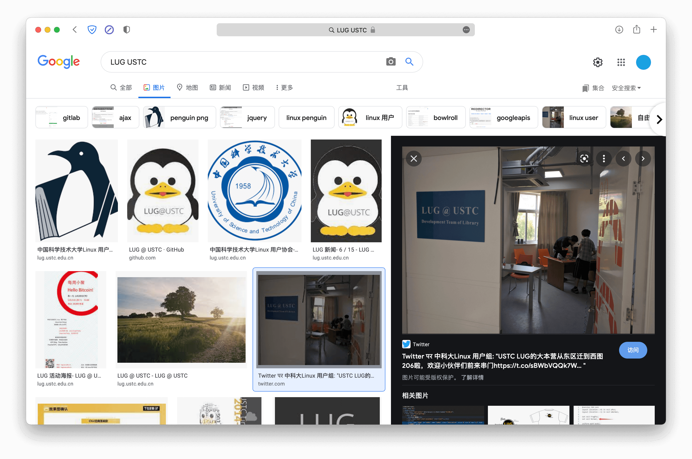

# 猫咪问答 Pro Max

> 1. 2017 年，中科大信息安全俱乐部（SEC@USTC）并入中科大 Linux 用户协会（USTCLUG）。目前，信息安全俱乐部的域名（sec.ustc.edu.cn）已经无法访问，但你能找到信息安全俱乐部的社团章程在哪一天的会员代表大会上通过的吗？  
>    提示：输入格式为 YYYYMMDD，如 20211023。请不要回答 “能” 或者 “不能”。

看到「已经无法访问」，直接下意识想到 [web.archive.org](https://web.archive.org)。

在 web archive 里打开 `sec.ustc.edu.cn`，找到章程，然后就找到其通过日期为 2015 年 5 月 4 日。

> 2. 中国科学技术大学 Linux 用户协会在近五年多少次被评为校五星级社团？  
>    提示：是一个非负整数。

查资料无果（可能我姿势不对），先下一题。

> 3. 中国科学技术大学 Linux 用户协会位于西区图书馆的活动室门口的牌子上“LUG @ USTC”下方的小字是？  
>    提示：正确答案的长度为 27，注意大小写。

经过多次搜索尝试，在 Google 搜索 “LUG USTC” 并切换至“图片”一栏，就可以发现这么一张照片：

即 “Development Team of Library”，刚好是 27 个字。

> 4. 在 SIGBOVIK 2021 的一篇关于二进制 Newcomb-Benford 定律的论文中，作者一共展示了多少个数据集对其理论结果进行验证？  
>    提示：是一个非负整数。

搜索 “SIGBOVIK Newcomb-Benford”，然后就能找到一篇论文（集）：[SIGBOVIK 2021](http://sigbovik.org/2021/proceedings.pdf)。

通过目录找到这篇文章，<del>然后仔细阅读，并且与作者友善探讨学术问题（大雾）。</del>  

实际上通过<del>简单</del>提取，不难发现附录的 figures 都是数据集，一共有 14 - 1 = 13 个

> 5. 不严格遵循协议规范的操作着实令人生厌，好在 IETF 于 2021 年成立了 Protocol Police 以监督并惩戒所有违背 RFC 文档的行为个体。假如你发现了某位同学可能违反了协议规范，根据 Protocol Police 相关文档中规定的举报方法，你应该将你的举报信发往何处？  
>    正确答案的长度为 9。

搜索 “IETF Protocol Police”，不难找到 [RFC 8962](https://datatracker.ietf.org/doc/html/rfc8962)。

直接搜索关键词 `(e)mail` 或 `send`，不难找到「Send all your reports of possible violations and all tips about wrongdoing to **/dev/null**.」（不得不说，这个玩笑开得真是可以）。

所以答案就是 `/dev/null`，长度也刚好是 9。

---

然后至此我们找到了 1, 3, 4, 5 的答案，还剩下的第 2 题，可能的答案只有 6 种，手动枚举一下即可（实际上是 5 次）。
