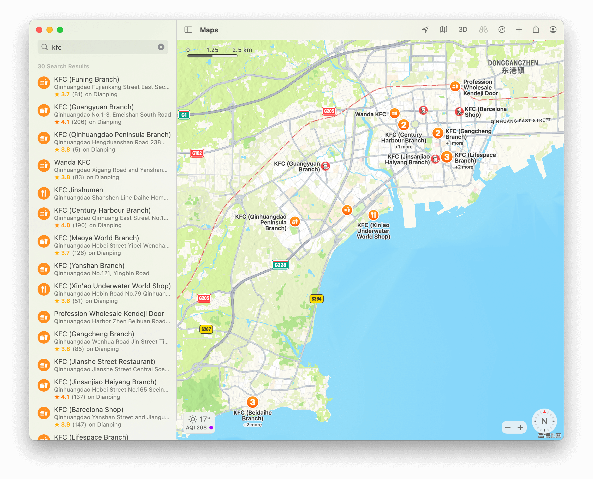
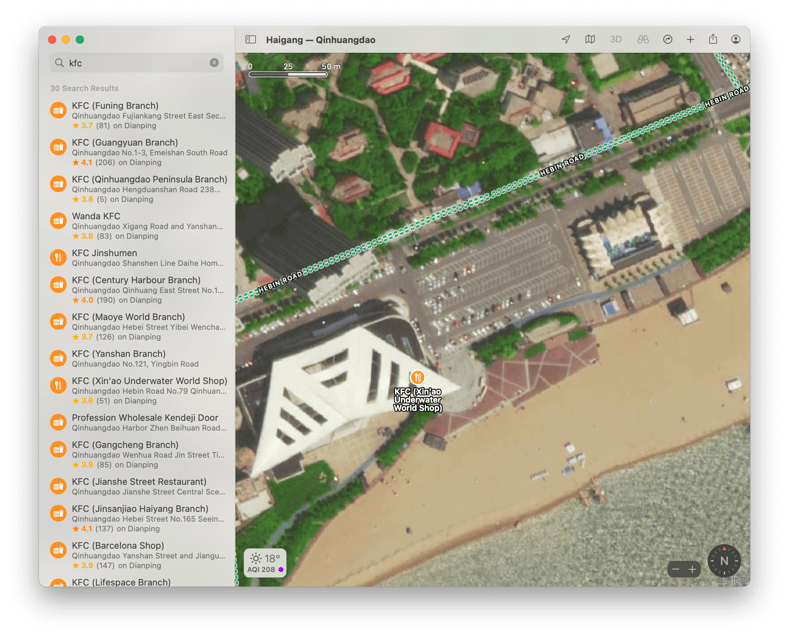
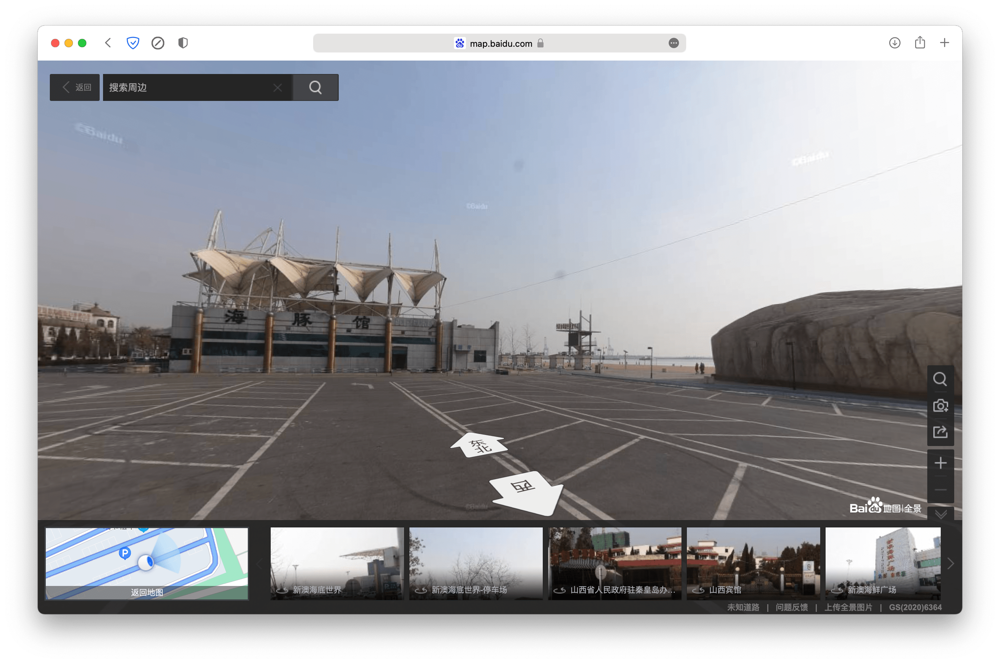

# 旅行照片

读题，发现题目的着重点在 KFC 上，并且其非常近海，猜想符合条件的 KFC 不多。  
于是搜索 “海边 KFC”，虽然不能直接找到目标（大概?），但是过半的搜索结果都是关于“秦皇岛”的。  
然后打开地图，定位到秦皇岛，查找附近的 KFC，得：

发现有一家 KFC 很接近海，打开卫星图模式，并放大观察：

可以发现停车位对上了，那块覆盖着植被的石头也对上了，<del>虽然 KFC 位置出现了一点偏差，但是不影响做题</del>。

观察原图的停车位方向和阴影方向，不难发现拍摄者面朝**东南**，时间是**傍晚**。

然后打开百度街景（不是广告），观察实地景象。<del>百度街景这都多久没更新了？</del>  

<del>虽然没有 KFC</del>，但观察屋顶，还是能确定就是那里的。然后就能确定那三个大字就是「**海豚馆**」。

然后打开 [KFC 门店信息查询](https://www.kfc.com.cn/kfccda/storelist/index.aspx)，定位秦皇岛。  
虽然「新澳海底世界甜品餐厅」没有电话，猜测电话跟旁边的「新澳海底世界餐厅餐厅」一样（**0335-7168800**）。

最后还剩下楼层高度，看隔壁楼层数一下，大概是在 **14** 层左右（如果不对就上下多试几层就对了）。
