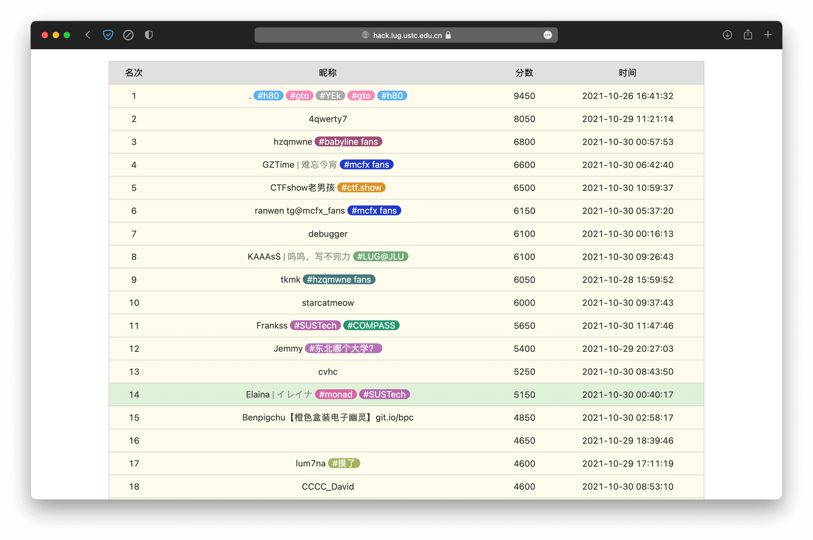

# monad

这是我个人的 writeups，仅包含我赛时会做的题（其它题看官方题解就好了，没必要再写一遍），记录自己做题时的奇奇怪怪的乱搞方法，仅供参考。

由于我只是个菜鸡，所以解题方法可能会有点绕，<del>可能有的原理甚至有问题</del>，请大佬原谅我这个菜鸡。

有的公式可能 GitHub 显示不出来，可以移步至[我的博客](https://blog.monadx.com/2021/10/31/Hackergame-2021/)。

---

初次打 Hackergame，请多指教。

