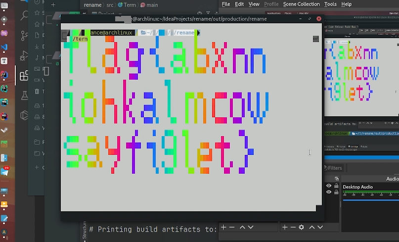

# Hackergame 2021 (by std::_Rb_tree)

<del>某Arch邪教徒 + Jvav程序猿</del>第一次打CTF, rk27挺意外的

一下为吐槽(主要) + 一些废话(主要) + 非正经题解(次要)

## 透明文件

<del>这玩意不就是我前几天瞎搞的[terminal播放器](https://github.com/RIvance/terminal-player)吗, tty看片指日可待了属于是</del>

这题难点在于他最后会把你最后一行信息给抹掉, 所以只要加sleep一点一点打印就好了, 另外就是gnome terminal在刷新的时候没法选择文本, 果断alacritty.  [(源码)](src/terminal.py)




## FLAG 助力大红包


emmm....好像已经不是我一个人这么起文件名了


Post时候header里加个`X-Forwarded-For`就好了


## Amnesia

T1很简单, 别开静态字符串就ok. T2总计花了超过10个小时搜资料+读gcc源码也没搞出来 <del>(手动裂开)</del>.


## Easy RSA

先是威尔迅定理推p, 然后在求解q上卡了一下午, 最后没想到其实Google能搜到, 欧拉函数这一步确实要数感很强才能想到. 


## 助记词

<del>我怎么觉得题干里这个室友就是当时在学Quarkus的我</del>

这题目的就是发送一个请求, 让后端调用Phrase这个类中的equals函数的机会尽量多. 那哪能用到equals呢??? 他那个HashSet! 这不摆明了告诉你她想让你通过哈希碰撞把她炸成链表吗? (虽然超过8个会成红黑树, 不过卡个9s还是够用了, 何况还是个LinkedHashSet) 但又一想, 不对啊, 他还有个Instance字段呢, 不过, 他同时也有个`Instant.now().truncatedTo(ChronoUnit.SECONDS)`, 点开他的hashCode函数, 会发现: 

```java
@Override
public int hashCode() {
	return ((int) (seconds ^ (seconds >>> 32))) + 51 * nanos;
}
```

这个东西有意思的地方就在于如果这个时间是整秒的话, 他的`hashCode()`就是1970年1月1日0点到这个时间的秒数. 

这时候我们再看:

```java
// Objects.hash
public static int hash(Object... values) {
	return Arrays.hashCode(values);
}

// Arrays.hashCode
public static int hashCode(Object a[]) {
    if (a == null)
        return 0;

    int result = 1;

    for (Object element : a)
        result = 31 * result + (element == null ? 0 : element.hashCode());

    return result;
}
```

分析后不难得出, 我们只需要构造一个9个连续的Instant, 用这些Instant分别去构建Phrases, 找到所有哈希值相同并记录其是由哪个Instant构造出来的即可.

[撞Hash源码](src/FindHash.java) <del> Jvav题就应该写Jvav去解</del>

[Post请求的源码](src/fuck_hash_map.ipynb)

为了快点出结果开满线程撞Hash, 于是乎:


## 马赛克

炼丹 -> 放弃

本来想用[pix2pixHD](https://github.com/NVIDIA/pix2pixHD)试一把, 结果发现这玩意在30系卡上问题具多, 直接放弃

<del>有炼出来能用的可以告诉我一声</del>


## 灯，等灯等灯

T1高斯消元, 发现是个模256的环有的元素没有乘法逆元, 于是就寄了...


## Micro World

Arch user表示这题及其不友好 (Linux下反编译总报错, 不管啥版本的py), 为这个和底下那个Qt的逆向题专门卸了俩游戏装Windows虚拟机


## 阵列恢复带师

人家用工具的一会就做出来了, 就我还搁这`hexdump`

Raid0 主要是先分析一开始的分区表找到第一张盘, 在通过结尾的pdf文件在`0x8c0000`和`0x8e0000`的数据确定磁盘顺序和chunksize.

Raid5 由于有纠错码的存在所以要通过有文本的区域确定纠错码的移动方式, 然后拼接的时候别忘了在后面补一段用于存metadata的区域.

操作部分可以参考[Archwiki](https://wiki.archlinux.org/title/RAID)


## minecRaft

反混淆 + 时刻想着google的存在

[源码](src/mc.js)


## p😭q

先opencv获取gif中数据转成数组, 按他给的源码反着来就行

[源码](src/fourier.py)

