在 [宝硕博客](https://blog.baoshuo.ren/post/ustc-hackergame-2021-write-up/) 上查看以获得更好的阅读体验。

## 签到

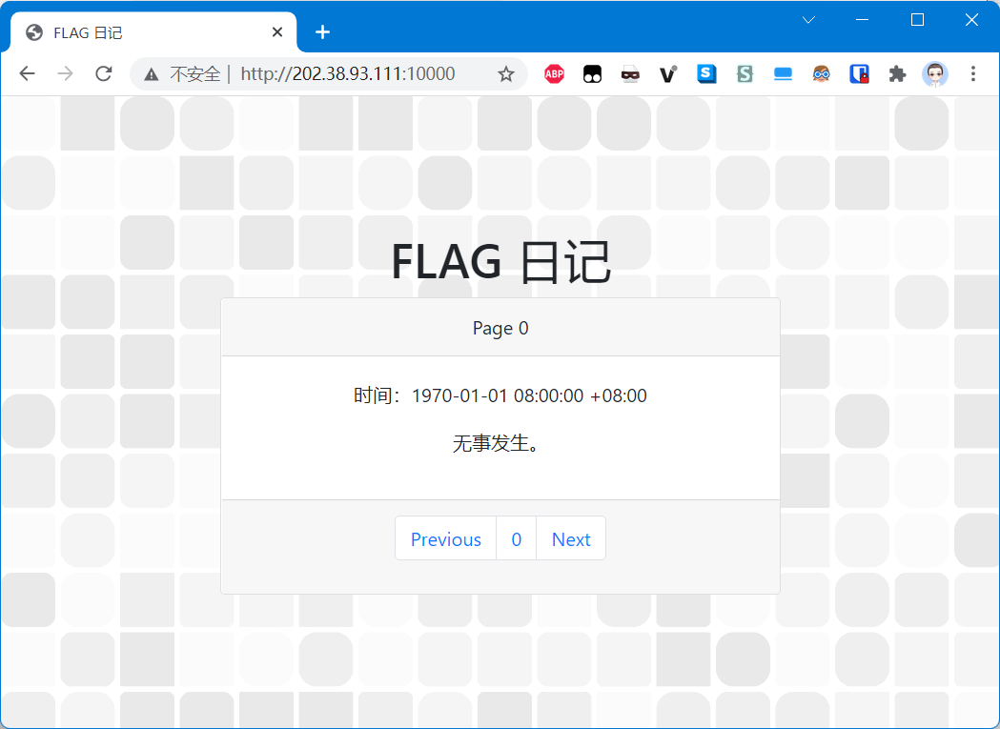

点击 `Next` 键，发现页面的 URL 后多了个 `?page=1` ，结合第一个页面中的 `1970-01-01` 字样，可以判断出来 `page` 参数应为比赛期间的 Unix 时间戳。

示例：http://202.38.93.111:10000/?page=1635002186

## 进制十六——参上

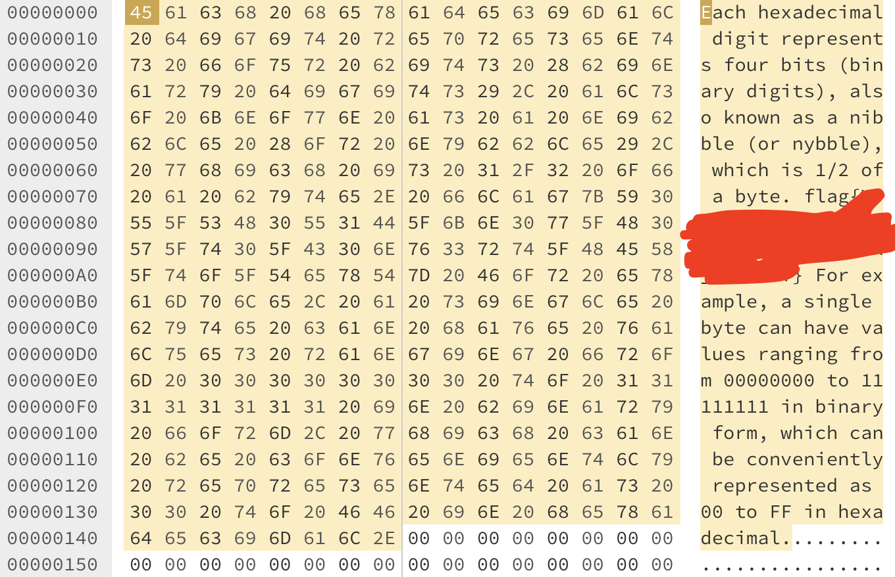

可以照着 16 进制数据搞一搞，然后 flag 就出来了：

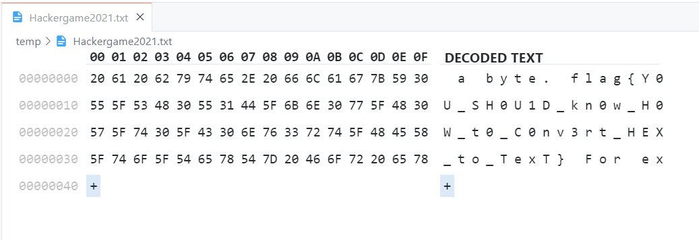

## 去吧！追寻自由的电波

下载音频之后使用 Adobe Audition 进行变速即可。

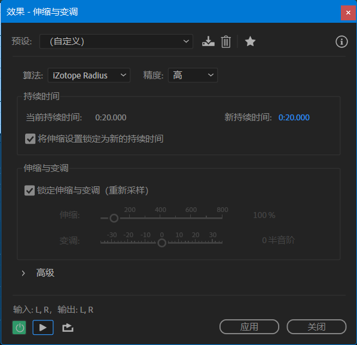

## 旅行照片


从图片中可以看出拍摄者在 14 层，并且楼下有一个蓝色的肯德基，那么使用 Google 搜索关键词 `海洋 蓝色 KFC` 可以得到以下结果：

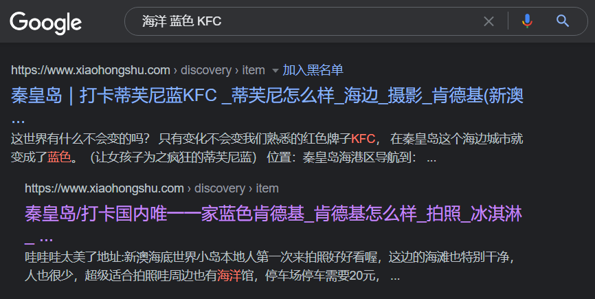

从照片的描述中可以得到这家肯德基位于秦皇岛新澳海底世界。

在百度地图上可以找到这家肯德基的电话、详细位置。同时按照卫星图可以推断出拍摄者所在的方向，进而推断出拍摄的大致时间。

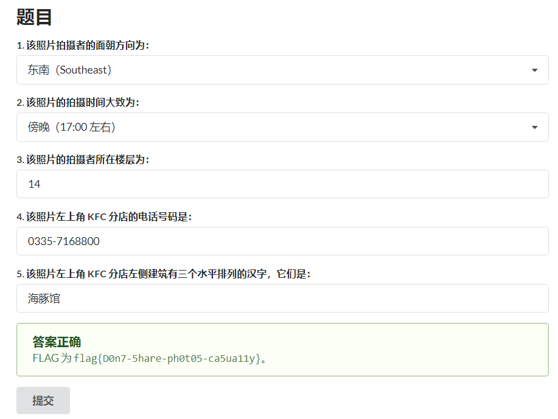

flag 获取成功。

## FLAG 助力大红包

查看点击助力按钮后的浏览器请求可以发现请求时有一个名为 IP 的参数，尝试修改这个参数发现会报错提示前后端检测 IP 不一致，那么考虑添加 `X-Forwarded-For` 头伪造经过代理的来源 IP 地址即可。

比赛平台的速率限制为每秒最多请求一次，所以在每次请求后还需要等待 1 秒。

```bash
for ((i=0; $i <= 255; i = ($i + 1))); do
    curl "http://202.38.93.111:10888/invite/$invite_id" -H "X-Forwarded-For: $i.11.45.14" -d "ip=$i.11.45.14"
    sleep 1
done
```

## 猫咪问答 Pro Max

1. 2017 年，中科大信息安全俱乐部（SEC@USTC）并入中科大 Linux 用户协会（USTCLUG）。目前，信息安全俱乐部的域名（sec.ustc.edu.cn）已经无法访问，但你能找到信息安全俱乐部的社团章程在哪一天的会员代表大会上通过的吗？

Wayback Machine 是个好东西啊。（[页面存档](https://web.archive.org/web/20170515053637/http://sec.ustc.edu.cn/doku.php/codes)）

2. 中国科学技术大学 Linux 用户协会在近五年多少次被评为校五星级社团？

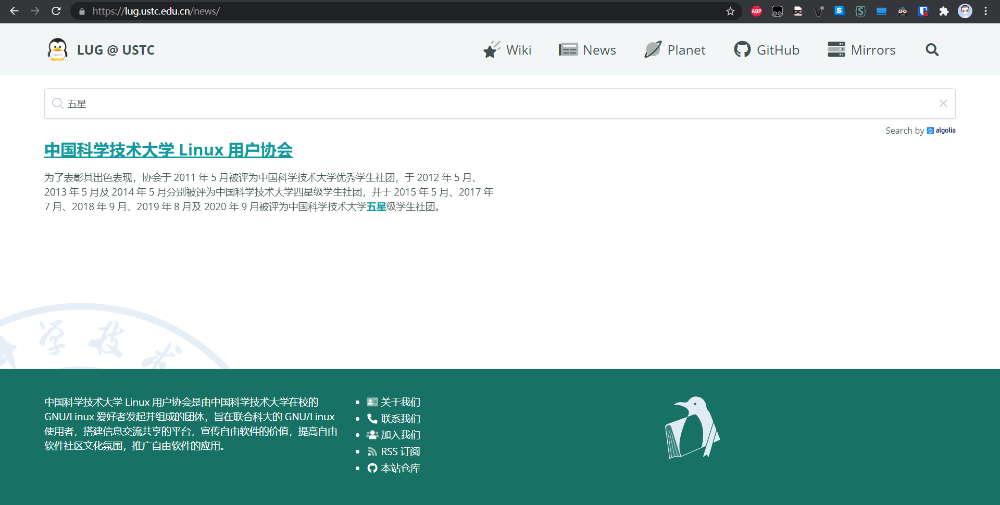

LUG 官网上直接搜就出来了。但实际上的答案应该是 5 ，可能是官网没更新最新信息。

3. 中国科学技术大学 Linux 用户协会位于西区图书馆的活动室门口的牌子上“LUG @ USTC”下方的小字是？

> 谷歌是你的好朋友。
> <cite>Hackergame 2020 「猫咪问答++」 flag 。</cite>

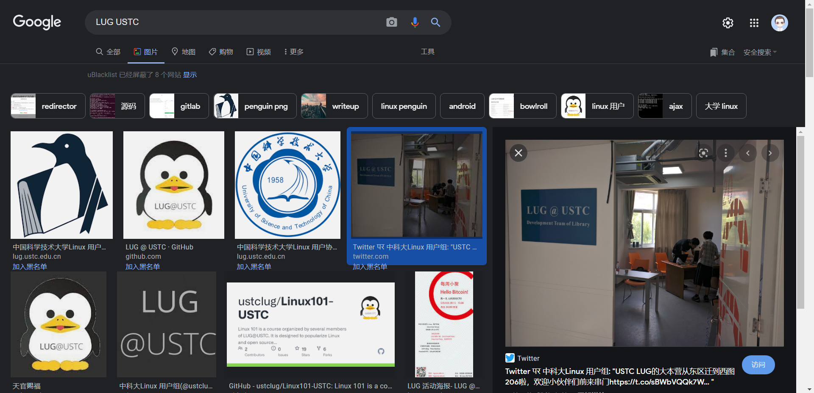

可以看到正确答案为 `Development Team of Library` 。

4. 在 SIGBOVIK 2021 的一篇关于二进制 Newcomb-Benford 定律的论文中，作者一共展示了多少个数据集对其理论结果进行验证？

可以在 [the record of the proceedings of SIGBOVIK 2021](http://sigbovik.org/2021/proceedings.pdf)（[页面存档](https://web.archive.org/web/20210626111527/http://www.sigbovik.org/2021/proceedings.pdf)）的 212 页找到这篇论文。

5. 不严格遵循协议规范的操作着实令人生厌，好在 IETF 于 2021 年成立了 Protocol Police 以监督并惩戒所有违背 RFC 文档的行为个体。假如你发现了某位同学可能违反了协议规范，根据 Protocol Police 相关文档中规定的举报方法，你应该将你的举报信发往何处？

搜索关键词：[IETF Protocol Police](https://www.google.com/search?q=IETF+Protocol+Police)

可以搜到这个「搞笑 RFC」：[Establishing the Protocol Police](https://datatracker.ietf.org/doc/html/rfc8962#section-6) ，在第 6 节中有相关介绍。

正确答案应为 `/dev/null` 。

## 卖瓜

最开始拿到题我先想的是能不能用负数凑，结果发现不行，于是考虑溢出。

试了试发现使用 6 斤瓜无法触发溢出，而使用 9 斤瓜的就可以触发溢出了。

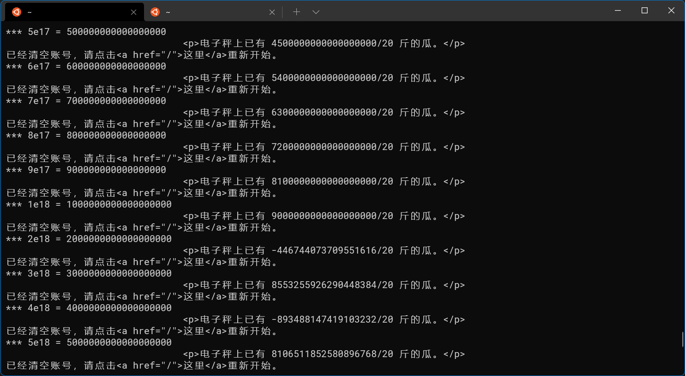

写了个脚本跑一跑，试出来了几个负数，挨个试了下发现放 2e18 个 9 斤瓜可以凑到 20 斤。

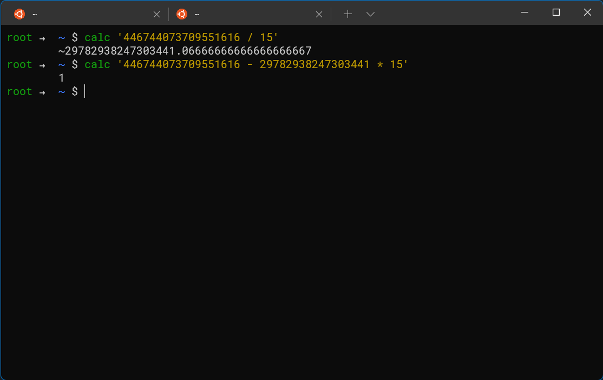

然后在计算器里算了一下，只需要加 6 斤的瓜和 9 斤的瓜各 29782938247303441 个就能让称的显示变成 -1 。

接下来放 2 个 6 斤瓜和 1 个 9 斤瓜就能拿到 flag 了。

## 透明的文件

本题与 [ANSI Escape Code](https://en.wikipedia.org/wiki/ANSI_escape_code) 有关。

首先需要将文件中的 `[` 替换成 `\033[` ，然后再找一个支持显示 ANSI 控制码的终端输出。

然后发现一片空白，啥也没有。

捣鼓到快怀疑人生才发现终端上的某些字符被遮挡了，进而想到这个脚本可能清除了终端上某些地方的字符来显示 flag 。

先编写一个复读函数用来填满终端：

```bash
repeat() {
    for ((i = 1; $i <= $1; i = ($i + 1))); do
        echo -n "▉"
    done
}
```

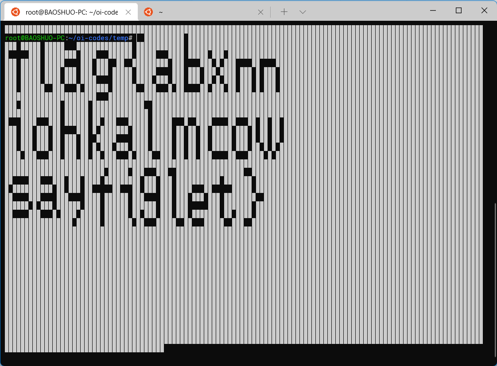

再配合上方替换好的文件输出即可，效果如图。

## Amnesia

### 轻度失忆

使用 `putchar()` 函数即可解决此问题。

```cpp
#include <stdio.h>

int main() {
    putchar('H');
    putchar('e');
    putchar('l');
    putchar('l');
    putchar('o');
    putchar(',');
    putchar(' ');
    putchar('w');
    putchar('o');
    putchar('r');
    putchar('l');
    putchar('d');
    putchar('!');
    putchar('\n');
    return 0;
}
```

## 图之上的信息

可以使用 `__schema` 字段查询所有存在的类型：

```graphql
{
  __schema {
    types {
      name
    }
  }
}
```

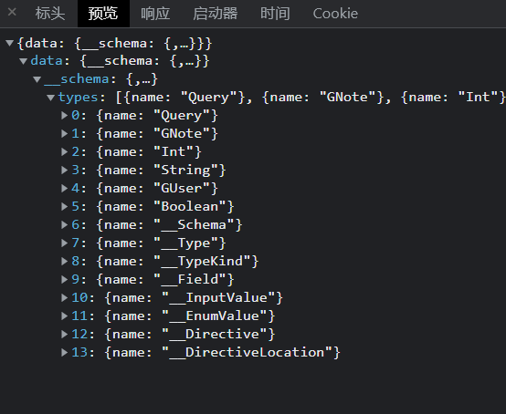

发现一个名为 `GUser` 的类型，再构造一个语句查询类型结构：

```graphql
{
  __type(name: "GUser") {
    name
    fields {
      name
      type {
        name
        kind
        ofType {
          name
          kind
        }
      }
    }
  }
}
```

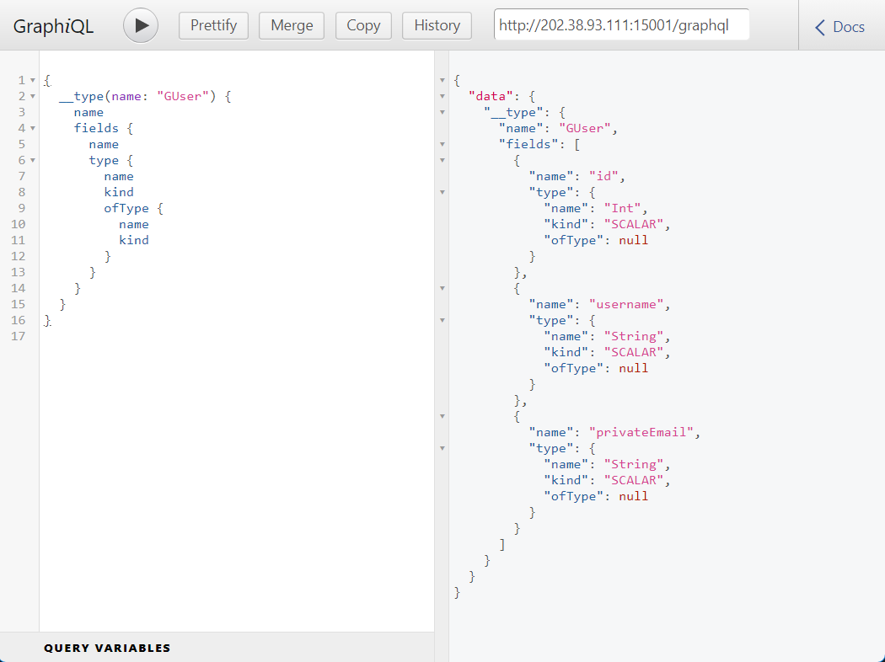

顺便获取了下 `GNote` 类型的结构：

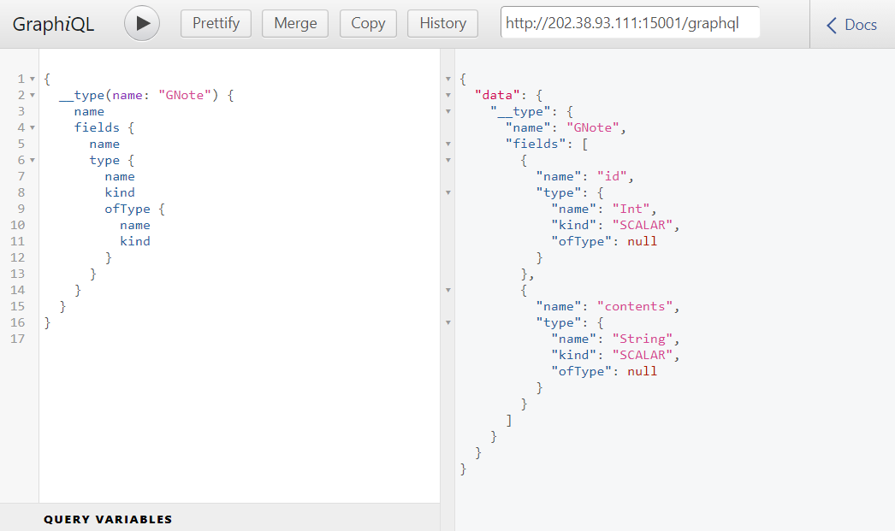

进行查询即可得到 flag ：

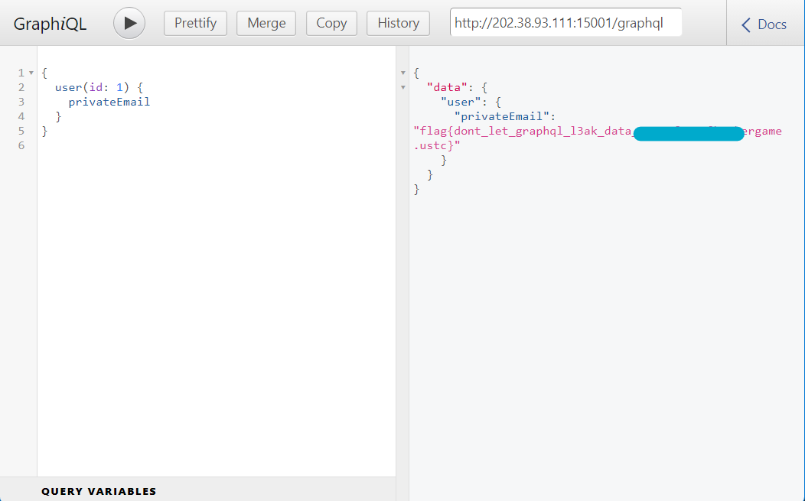

## 后记

今年拿的名次比去年的高，感觉在这一年里自己的 web 水平有很大的提升，但 math 还是一如既往地爆了零，和我的数学中考成绩一样的烂。

以后如果有时间的话逆向、汇编什么的也都要学一学，不然的话每次一看见 binary 就有点不知所措、无从下手属实不太好。

推荐阅读：[USTC Hackergame 2020 Write Up - 宝硕博客](https://blog.baoshuo.ren/post/ustc-hackergame-2020-write-up/)
