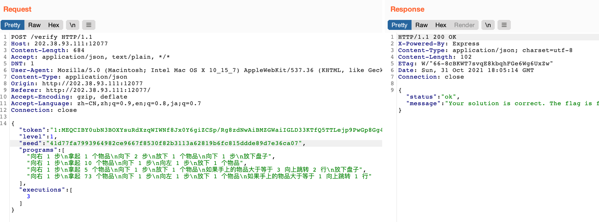

# Writeup
周四下午之后因为各种原因 AFK 了，等有空再回来的时候，大家已经陆续在分享各自的 writeup 了。阅读了一下**赛博厨房** Level 3 的官方题解、以及另外两位 dalao mcfx & 4qwerty7 的题解（膜拜），发现自己做是**非预期**，于是也记录分享一下。
### 赛博厨房
Level 0 和 1 我的做法和大家类似。在解 Level 2 时，我从 js map 恢复了前端代码，对题目生成随机种子和菜谱的方法进行了分析。抓包测试发现后端并不会对每一条程序进行合法性分析，于是我选择的是类似官方题解的方法，但是只生成 127 条固定的程序，最后一条直接枚举爆破递增的数字，就等菜谱落到我会做的范围。个人感觉不用修改程序容易一些，它们的 hash 也不用重复计算。
至于 Level 3，爆破肯定是不可行的。鉴于本题在前端使用 TypeScript 封装了大量的模型和方法，推测前后端可能存在代码复用，即后端也使用的是 NodeJS。那么会不会存在一些类型上的问题呢？

让我们来以 Level 1 为例，看一下提交答案的请求：



后端读取要执行的程序，大概是类似这样的代码：`req.body.programs[req.body.executions[0]]`。

现在试试把 `programs` 从数组改成对象：


后端没有报什么大错，反而是非常贴心地告诉我们 seed 不对。把请求中的 seed 修正之后，顺利得到 Level 1 的 flag。

这个 `e3b0...` 是哪里来的呢？搜一下就能发现，它是空字符串的 sha256。看一下前端的计算方法就知道了：

```typescript
public getInstrsHashes(programs: Array<string>) {
    let hashes = [];
    for (let i = 0; i < programs.length; i++) {
        const content = programs[i].trim();
        const hash = CryptoJS.SHA256(content).toString(CryptoJS.enc.Hex);
        hashes.push(hash);
    }
    let hashesConcat = hashes.join('\n');
    return CryptoJS.SHA256(hashesConcat).toString(CryptoJS.enc.Hex);
}
```

现在 `programs` 是个对象，`programs.length`为 `undefined`，`0<undefined`为假，于是并不会进入循环，最后一次 sha256 的输入就是空串。（当然乐意的话也可以给 `programs` 随意加个 `length`）

有了固定的 seed，意味着固定的菜谱，后面怎么做就不用多说了吧。