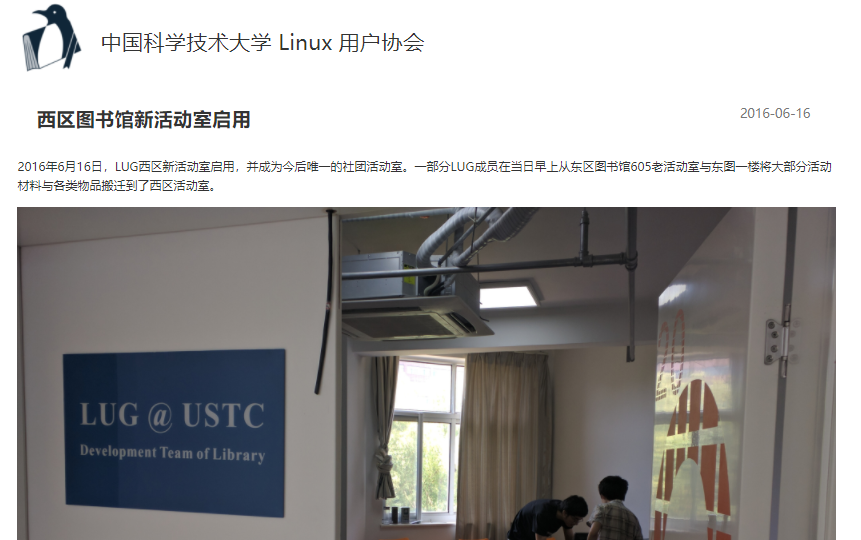
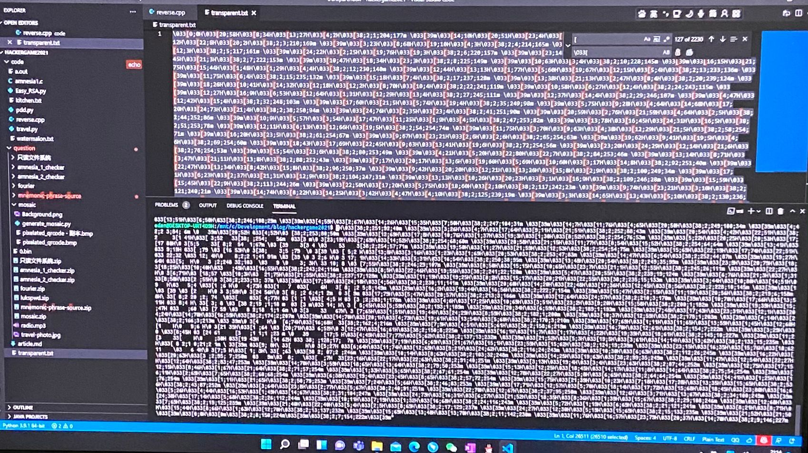
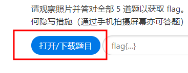
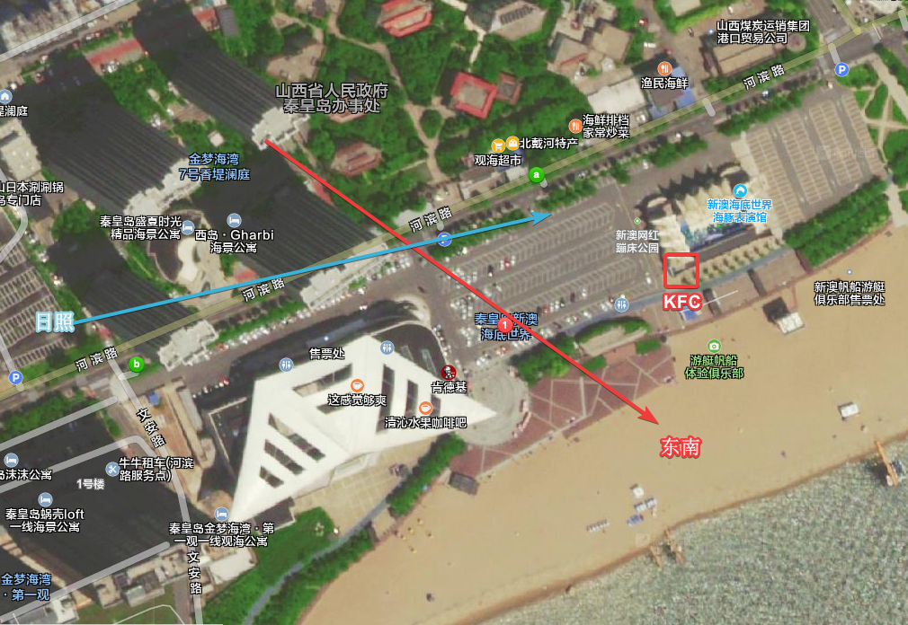
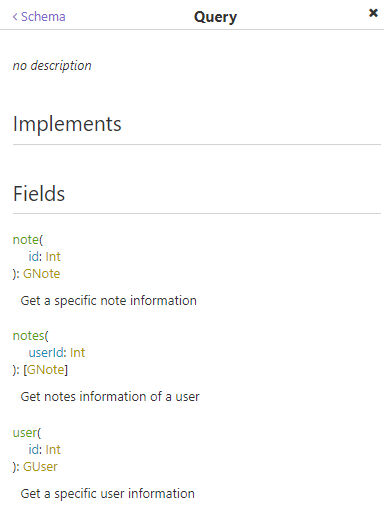

此文章同时发布于[记录下初次参加CTF的经历 - Hackergame 2021 - 星](https://blog.hoshi.tech/archives/85/)


## 0x0 背景

在`Hackergame 2021`结束的最后两天偶然打开某群时发现几个大佬这几天隔段时间就往群里丢一张分数及排名截图，翻翻记录发现某张图上截到了 `Hackergame 2021`的字样。搜了搜是`中国科学技术大学第八届信息安全大赛`，卧槽，看起来非常有趣。那么菜鸡空闲时间里的第一次安全游戏之旅就开始了...

还是怀念大学时的空闲时间啊，可以花时间边学边解。

## 0x1 题目

#### 签到

打开题目我是一脸懵逼的，意味わかんない。万幸官方有提示参考历年签到题，挨个看了看都是提交某个值获取到某个flag，再看看QA才知道游戏玩法。结合题意和返回的时间可知页数跟字符串有关。

> Hackergame 2021 比赛进行期间的任何一页

获取当前时间的Timestamp转到对应页即可。

`flag{HappyHacking2021-0af061d136}`

#### 进制十六——参上

阅读完文字觉得老哥们个个都是人才，说话又有趣......

看图答题，抹掉区域的十六进制对应回ASCII即可

`flag{Y0U_SH0U1D_kn0w_H0W_t0_C0nv3rt_HEX_to_TexT}`

#### 去吧！追寻自由的电波

[北约音标字母 - 维基百科，自由的百科全书 (wikipedia.org)](https://zh.wikipedia.org/wiki/北约音标字母)

其实我是用`Potplayer`慢放听了好一会儿才听出来，我也知道是因为现代的播放器自动保持声调导致的，但是懒得开au降调，硬是听出来了。直到后来水群的时候，发现关闭声音滤镜就不会保持声调了，才知道是真的好听。

`flag{phoneticab}`

#### 猫咪问答 Pro Max

同样参考历年题目，可以发现其实就是考察信息搜索能力。

##### 第一题

> 2017 年，中科大信息安全俱乐部（SEC@USTC）并入中科大 Linux 用户协会（USTCLUG）。目前，信息安全俱乐部的域名（sec.ustc.edu.cn）已经无法访问，但你能找到信息安全俱乐部的社团章程在哪一天的会员代表大会上通过的吗？

看到`域名已经无法访问`第一反应就是去[Wayback Machine (archive.org)](https://web.archive.org/)找，输入链接打开跳转到主页就能找到社团章程链接打开，第一行就是通过日期。

##### 第二题

> 中国科学技术大学 Linux 用户协会在近五年多少次被评为校五星级社团

Google `中国科学技术大学 Linux 用户协会 五星级社团` 第一条官方简介里就提到了

> 为了表彰其出色表现，协会于 2011 年 5 月被评为中国科学技术大学优秀学生社团，于 2012 年 5 月、2013 年 5 月及 2014 年 5 月分别被评为中国科学技术大学四星级学生社团，并于 2015 年 5 月、2017 年 7 月、2018 年 9 月、2019 年 8 月及 2020 年 9 月被评为中国科学技术大学五星级学生社团。

值得一提的是，居然还搜到了一个相关知乎问题[中国科学技术大学 Linux 用户协会在近五年多少次被评为校五星级社团？ - 知乎 (zhihu.com)](https://www.zhihu.com/question/494178119)，这位童鞋企图请求场外援助可还行。

##### 第三题

> 「中国科学技术大学 Linux 用户协会位于西区图书馆的活动室门口的牌子上“LUG @ USTC”下方的小字是？」

直接Google`中国科学技术大学 Linux 用户协会 西区图书馆`翻翻看有官方发布的新闻，标题为`西区图书馆新活动室启用`。



##### 第四题

> 「在 SIGBOVIK 2021 的一篇关于二进制 Newcomb-Benford 定律的论文中，作者一共展示了多少个数据集对其理论结果进行验证？」

Google `sigbovik 2021 newcomb-benford`即可找到PDF，下载后找到对应文章，作者有提到 

>We converted all of
>the data points to their binary representations, and plotted
>the relative frequency of the leading digits. The figures are
>shown in Figs. 2, 3, 4, 5, 6, 7, 8, 9, 10, 11, 12, 13, and 14
>in the appendix4.

数一数即得到答案。

##### 第五题

> 「不严格遵循协议规范的操作着实令人生厌，好在 IETF 于 2021 年成立了 Protocol Police 以监督并惩戒所有违背 RFC 文档的行为个体。假如你发现了某位同学可能违反了协议规范，根据 Protocol Police 相关文档中规定的举报方法，你应该将你的举报信发往何处？」

根据题意Google `IETF Protocol Police report`找到`rfc8962`，下翻找到

> 6.  Reporting Offenses
>
>     Send all your reports of possible violations and all tips about
>     wrongdoing to /dev/null.  The Protocol Police are listening and will
>     take care of it.


`flag{8804d9f3_bb1f4d1680}`

#### 卖瓜

我瞎填怎么就卖出去了？啊？

只知道9斤的瓜会溢出。其余就是瞎点碰出来了。~~凭运气解题可还行，我居然还有脸写下来...~~

`flag{HUAQIANG!HUAQIANG!_d097b45ebf}`

#### 透明的文件

题目中有提到`五颜六色`的字眼，打开文件可以看到大量`\[\d+m`，经验得知这是ANSI颜色转义，在`[`前补上`\033`或`\x1b`即可。但是输出的时候发现什么都没打印出来，多试了试发现终端里某些已经存在的字符消失了，结合题目可知打印出来是相对透明的空字符。随便输出铺满终端后再次打印即可得到flag。打印出来其实不太好看，但是众所周知，拿下眼镜之后就非常好看了，于是手机拍屏幕照抄搞定。

`flag{abxnniohkalmcowsayfiglet}`

#### 旅行照片

> 请观察照片并答对全部 5 道题以获取 flag。

我傻了，看了辣么久图片，都已经定位到地方了，我也没看出来是哪五道题。



直到晚上回来又看了会儿题，发现这个蓝色的按钮点开了才是题目.... 卖糕的，原谅我的第一次。

题目里已经提到KFC分店了，看到是蓝色涂装的KFC，大街上的巴士及巴士左面大门旁的标牌能确定这是国内。那么去百度搜蓝色KFC就能直接定位到这是秦皇岛新澳海底世界的肯德基甜品站。



打开卫星地图搜索此位置即可解大部分题。楼层大致数下就知道在10层之上，20层之下，遍历下就OK。

`flag{D0n7-5hare-ph0t05-ca5ua11y}`

#### FLAG 助力大红包

为好友助力时提交的表单里为前端获取到的IP，后端同样获取IP并于此IP对比，不符则不通过。说来前端是通过调用搜狐API获取当前IP，但此请求被广告屏蔽插件拦截了，导致没获取到，第一次点击按钮时返回

> 失败！错误的前端检测 IPv4 地址格式： ！

还让我愣了下。手动POST几次可以发现后端确实进行了校验，那么就必须想办法欺骗后端了，由于搭过Nginx反代，其中不少次还是某代理。第一反应就是`X-Forwarded-For`和`X-Real-IP`这两个请求头，尝试构造`X-Forwarded-For`可发现通过了校验。

```python
import requests
import time

uuid = "foobar"

for i in range(0, 256):
    ip = f'{i}.0.0.0'
    data = f'ip={ip}'
    headers = {
        'X-Forwarded-For': ip,
        'Content-Type': 'application/x-www-form-urlencoded',
    }
    response = requests.post(f'http://202.38.93.111:10888/invite/{uuid}', headers=headers, data=data, verify=False)
    print(response.text)
    time.sleep(2)

```

`flag{r3d-enve10p3-2782dacb99}`

#### Amnesia

欸嘿，这题要C语言，我不会！

##### 轻度失忆

但IDA经验告诉我好像字符串都存在.rodata里，那不写字符串应该就没问题了。搜索下C语言的`Hello, world!`实例代码，先不输出字符串输出整数试试：`printf("%d",1);`。结果什么都没有输出，emmmmm，`"%d"`也是字符串。看下C的标准库`<stdio.h>`，发现输出到stdout的还有`int putchar(int char)`。随即成功尝试输出一个字符。那么搜索一下关键词`c putchar hello wolrd`，Google没找到，倒是百度搜到了某CSDN文章，复制粘贴搞定此题。代码来自[c语言putchar_6个变态的C语言Hello World程序-CSDN博客](https://blog.csdn.net/weixin_39962889/article/details/110613918)

```c
#include <stdio.h>
int main(void)
{
    int x=0,y[14],*z=&y;*(z++)=0x48;*(z++)=y[x++]+0x1D;
    *(z++)=y[x++]+0x07;*(z++)=y[x++]+0x00;*(z++)=y[x++]+0x03;
    *(z++)=y[x++]-0x43;*(z++)=y[x++]-0x0C;*(z++)=y[x++]+0x57;
    *(z++)=y[x++]-0x08;*(z++)=y[x++]+0x03;*(z++)=y[x++]-0x06;
    *(z++)=y[x++]-0x08;*(z++)=y[x++]-0x43;*(z++)=y[x]-0x21;
    x=*(--z); while (y[x]!=NULL) putchar (y[x++]);
   return(0);
}
```

`flag{S0_S1mp1e_r1ght_a796597e01}`

#### 图之上的信息

定义好GraphQL后前端可以只查询自己关心的字段，且交互都是经由统一的入口。可以通过获取Schema来得到有哪些存在的数据，这里有篇不错的教程[How to Retrieve a GraphQL Schema | by Mr. Thank You | Medium](https://medium.com/@mrthankyou/how-to-get-a-graphql-schema-28915025de0e)。

不过现有支持GraphQL的网络测试工具会自动获取这些信息，并提供方便的UI辅助。我用的是[Insomnia](https://insomnia.rest/)。



可以看到除了面页中用到的`note`对象外以外还存在`user`。尝试获取`user(id: 1)`会发现并没有做权限控制。

```graphql
{
  user(id: 1) {
    username
    privateEmail
  }
}
```

`flag{dont_let_graphql_l3ak_data_23fae4f9ff@hackergame.ustc}`

#### 赛博厨房

##### Level 0

一上来实属没搞懂要干什么，不过试试`Level 0`中的这几个实例就能明白了。


| 0,0           | 0,1           | 1,0           | 1,1           |
| ------------- | ------------- | ------------- | ------------- |
| 向右 1 步     | 向右 1 步     | 向右 2 步     | 向右 2 步     |
| 拿起 2 个物品 | 拿起 1 个物品 | 拿起 1 个物品 | 拿起 2 个物品 |
| 向左 1 步     | 向左 1 步     | 向左 2 步     | 向左 2 步     |
| 向下 1 步     | 向下 1 步     | 向下 1 步     | 向下 1 步     |
| 放下 1 个物品 | 放下 1 个物品 | 放下 1 个物品 | 放下 1 个物品 |
| 放下 1 个物品 | 向上 1 步     | 向上 1 步     | 放下 1 个物品 |
| 向上 1 步     | 向右 2 步     | 向右 1 步     | 向上 1 步     |
|               | 拿起 1 个物品 | 拿起 1 个物品 |               |
|               | 向左 2 步     | 向左 1 步     |               |
|               | 向下 1 步     | 向下 1 步     |               |
|               | 放下 1 个物品 | 放下 1 个物品 |               |
|               | 向上 1 步     | 向上 1 步     |               |

`flag{level0_9d132008f193_5dd0c98b4e}`

##### Level 1

```
向右 1 步
拿起 73 个物品
向下 1 步
向左 1 步
放下 1 个物品
如果手上的物品大于等于 1 向上跳转 1 行
```

`flag{level1_212d794167df_5dd0c98b4e}`

#### minecRaft

其实一开始没想做这题，因为我没怎么玩过Minecraft，只是知道其有红石电路，但细节是一点都不知道。但是去排行榜一看大佬们一排都做了这题，来了兴趣看看这题到底是啥。

打开之后随便走走就看到第一个灯亮了，一开始以为是找规律，乱猜几次也看不出来什么规律。随之想看下代码灯亮是怎么触发的，看代码时注意到有个`flag.js`，赫然包含一个方法`gyflagh()`，查看下引用发现在`index.html`中是这么调用的：

```js
    function printcinput() {
        let content = document.getElementById('spann');
        if (cinput[0] === 'M') {
            if (pressplateList[64].status === false) {
                pressplateList[64].TurnOn_redstone_lamp();
                pressplateList[64].status = true;
            }
        }
        if (cinput.length >= 32) {
            let tbool = gyflagh(cinput.join(''));
            if (tbool) {
                pressplateList[65].TurnOn_redstone_lamp();
                content.innerText = 'Congratulations!!!';
                return;
            }
            cinput.length = 0;
        }
        content.innerText = cinput.join('');
    }
```

好家伙，原来什么规律都没有，就等着解js呢。

```js
function gyflagh(_0x111955) {
    const _0x50051f = _0x22517d; // const _0x22517d = _0x2c9e; // _0x2c9e -> _0x381b -> ['encrypt'...];
    let _0x3b790d = _0x111955[_0x50051f(0x1a8)](_0x50051f(0x1b7));
    if (_0x3b790d === _0x50051f(0x1aa))
        return !![];
    return ![];
}
```

第一行上来就能发现熟悉的套路，前段时间尝试解PHP混淆的时候刚遇到过将字符串全放数组再取用 [记录下初次尝试解PHP混淆时的学习资料 - 星 (hoshi.tech)](https://blog.hoshi.tech/archives/79/)，结果js也是这个套路。从Console里直接打印完事。

```js
function gyflagh(input) {
    const _getStringFunc = getStringFunc;
    let encryptResult = input.encrypt('1356853149054377');
    if (encryptResult === '6fbde674819a59bfa12092565b4ca2a7a11dc670c678681daf4afb6704b82f0c') return true;
    return false;
}
```

套路出来了就解套，按照加密方法写解密就完事。

加密方法：

```js
String['prototype']['encrypt'] = function (key) {
    let i;
        array_two = new Array(0x2),
        array_four = new Array(0x4); // [909456177, 825439544, 892352820, 926364468]
    let result = '';
    let plaintext = escape(this);
    for (i = 0x0; i < 0x4; i++) {
        array_four[i] = Str4ToLong(key.slice(i * 0x4, (i + 0x1) * 0x4));
    }
    for (i = 0x0; i < plaintext.length; i += 0x8) {
        array_two[0x0] = Str4ToLong(plaintext.slice(i, i + 0x4));
        array_two[0x1] = Str4ToLong(plaintext.slice(i + 0x4, i + 0x8));
        code(array_two, array_four);
        result += LongToBase16(array_two[0x0]) + LongToBase16(array_two[0x1]);
    }
    return result;
}
```

看循环条件，结合题目提到的需要最短序列，以及上面`index.html`中的条件语句`cinput.length >= 32`猜测flag就为32位，所以这个方法循环了4次。调用`LongToBase16()`可发现返回的都是8位字符串，将加密后的flag拆开解就可以了。

另外可以看到这里调用了`code()`方法，还需多倒推一个方法。

倒推解密方法：

```js
function decrypt(key) { // key: 1356853149054377
    let cipher = "6fbde674819a59bfa12092565b4ca2a7a11dc670c678681daf4afb6704b82f0c";
    cipher = cipher.match(/.{1,16}/g);

    const keys = new Array(0x4);
    for (let i = 0x0; i < 0x4; i++) {
        keys[i] = Str4ToLong(key.slice(i * 0x4, (i + 0x1) * 0x4));
    }
    let result = '';
    for (let j = 0; j < cipher.length; j++) {
        const parts = cipher[j].match(/.{1,8}/g);
        parts[0] = Base16ToLong(parts[0]);
        parts[1] = Base16ToLong(parts[1]);
        decode(parts, keys);
        parts[0] = LongToStr4(parts[0])
        parts[1] = LongToStr4(parts[1])
        result += parts[0] + parts[1];
    }
    console.log(result);
    return result;
}
```

这里我犯了第一个傻，我看到了`Base16ToLong()`这个方法已经定义，但是`LongToStr4()`这个方法在下面，我们看到也定义了。我的位运算基本功不扎实，花费了不少时间尝试写`LongToStr()`。这一操作让本就不充裕的时间雪上加霜。

原`code()`方法：

```js
function code(array_two, array_four) {
    let part_one = array_two[0x0],
        part_two = array_two[0x1];

    const a = 2654435769,
        b = a * 0x20;
    let i = 0x0;
    while (i != b) {
        part_one += (part_two << 0x4 ^ part_two >>> 0x5) +
            part_two ^ i +
            array_four[i & 0x3];

        i += a;

        part_two += (part_one << 0x4 ^ part_one >>> 0x5) +
            part_one ^ i +
            array_four[i >>> 0xb & 0x3];
    }
    array_two[0x0] = part_one, array_two[0x1] = part_two;
}
```

接着是倒推`code()`：

```js
function decode(array_two, array_four) {
    let part_one = array_two[0x0],
        part_two = array_two[0x1];

    const a = 2654435769,
        b = a * 0x20;

    let i = b;
    while (i != 0x0) {
        part_two -= ((part_one << 0x4 ^ part_one >>> 0x5) +
            part_one ^ i +
            array_four[i >>> 0xb & 0x3]);

        i -= a;

        part_one -= ((part_two << 0x4 ^ part_two >>> 0x5) +
            part_two ^ i +
            array_four[i & 0x3]);
    }
    array_two[0x0] = part_one, array_two[0x1] = part_two;
}
```

这里我犯了第二个傻，上面提到了我的位运算基本功不扎实，所以我看到这个方法的第一反应就是“我完蛋了。”

什么都没想就开始尝试逆算位运算，随机32个字符当flag后对着`part_one << 0x4 ^ part_one >>> 0x5`尝试了半天。边学[JavaScript 位运算符应用及优先级_Fancy_vae的博客-CSDN博客](https://blog.csdn.net/Fancy_vae/article/details/107470499)边写，从晚上九点多下班干到凌晨将近一点将通过`foo << 0x4`以及`foo >>> 0x5`拼接出`foo`的方法写好后才发现我只知道他们异或后的值，并不知道其中一个...

然后...卧槽，我知道他们异或后的值，那不是根本不用算，直接倒过来做减法就完事了。解完这题，游戏结束咯。

`flag{McWebRE_inMlnCrA1t_3a5y_1cIuop9i}`

## 0x2 尾巴

第一次参加CTF，总的来说感觉这种活动很有趣，出题的老哥们说话也好玩。只是只能当作萌新玩玩简单题目了，这次参加的太晚，很多看上去完全没头绪的题目在有限时间内也没太多心力去钻研了。下次早点参加应该会有更多的时间钻研。
