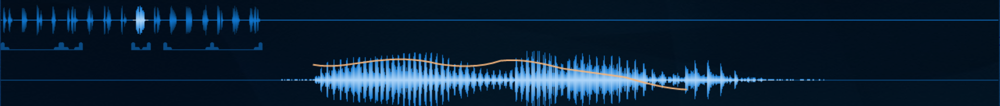
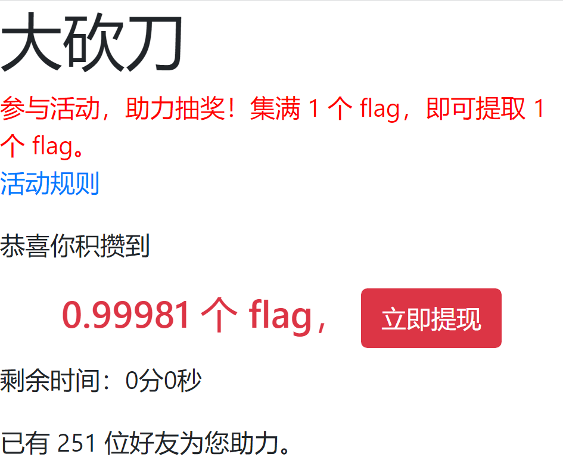
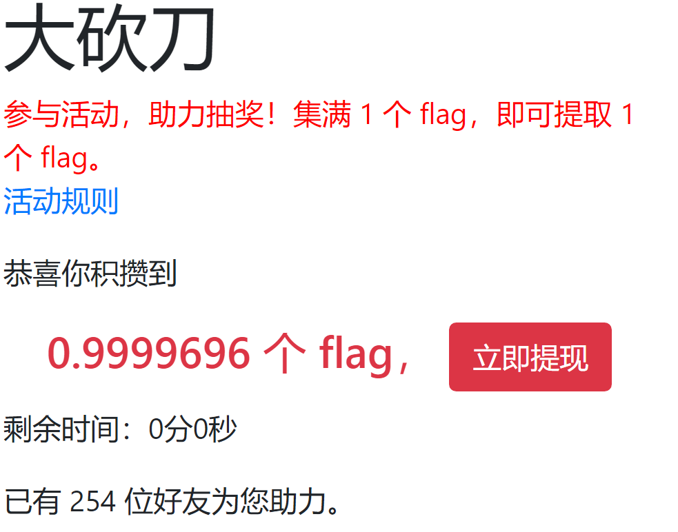
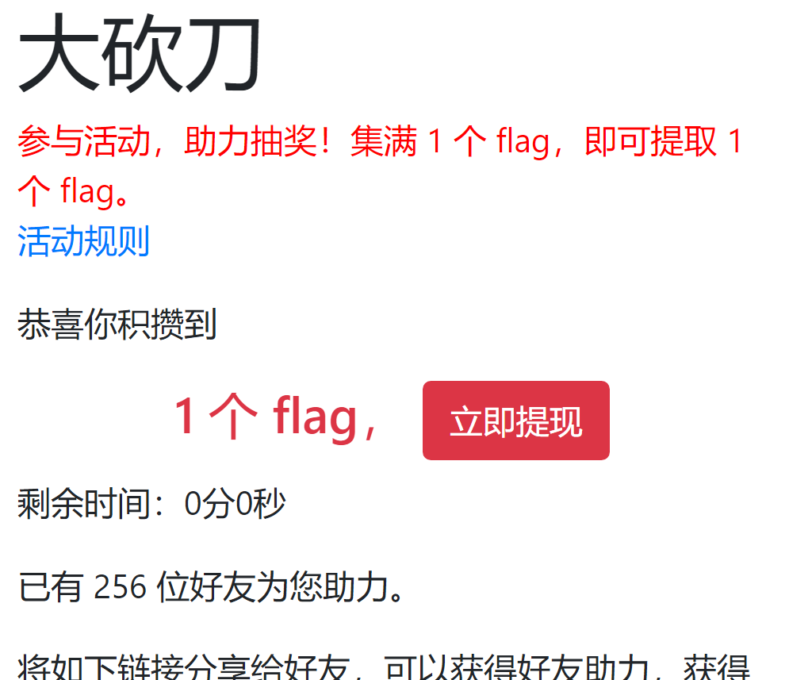
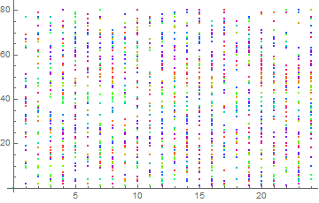

# Preface

来自数院的咸鱼选手，不会用python(就是玩玩)，在这个过程中学到了一点东西(纯数学也需要很多代码的，比如说LaTeX，比如可视化数据库)

此文章同时发布于 [我的博客](https://blog.tinyume.com/2021/hackergame2021-writeup/)

# 题目


## 进制十六 -- 参上

直接使用[Mathpix Snipping Tool](https://mathpix.com/)截图转文本(这个软件本来是用来将图片转LaTeX的，不过每个月只能用50次，希望能找个开源版本)，然后直接google“16进制转文本”。

## 去吧！追寻自由的电波

之前尝试本地调速调不出来，在网上查到个[在线调速](https://100audio.com/sound/100audio_editor/) 就调出来了，当时也不知道是啥原因。

伪证：用[Aboboo](http://www.aboboo.com/g/#/home)(学外语的软件，我平常用来加速看数学视频，也不是开源的)调速的时候发现有一部分能听出来另外一部分听不出来，观察波形图觉得是被添加了干扰音，尝试下载Cool Edit，发现不会用，于是放弃。




##  FLAG 助力大红包

首先按照搭建网站的经验，直接在html里面看到hidden的文本框，修改文字即可修改前端。

然后按照提示，我需要知道后端是啥以及怎么伪造。那么知乎搜索“伪造IP地址 后端”找到[如何向PHP伪造自己的ip？](https://www.zhihu.com/question/25721080/answer/31941799),于是找到某款Google extension(最后用的是X-Forwarded-For Header),好！这样我就可以手动伪造前后端了。

于是我就手动修改了10分钟，助力了大约100来位链接就过期了...

好家伙！看来这种提交可能需要点脚本来帮我点，毕竟我修改一次需要5-6秒，但是它还有10分钟。于是上网搜索到软件[AutoHotKey](https://www.autohotkey.com/) ，学习第一个“脚本”的制作。(副产物：以后打LaTeX代码可以更快了) 不过就算是自动点击，修改一次也需要2秒多，中间的停止时间过短的话就会出现错误。在经过多次微调后(可能是20次左右吧)，终于成功提交了所有的IP地址(中间有251次，254次的，有点担心256次是不是0.999999998个Flag，中途还尝试修改JavaScript和本地时钟试图将时间延长)

代码如下：

```
#MaxThreadsPerHotkey 3
^j::  
#MaxThreadsPerHotkey 1
if KeepWinZRunning  
{
    KeepWinZRunning := false  
    return  
}
KeepWinZRunning := true
rand := 0
Loop
{
    MyNumber :=  rand . ".233.233.233"
    Click, 1751 91 1
    Sleep, 120
    Click, 74 74 2
    Sleep, 50	
    Send, %MyNumber%
    Sleep, 70	
    Click, 429 346 2
    Sleep, 80
    Send, %MyNumber%
    Sleep, 40
    Click, 587 747 1
    ;Click, 1073 31 1
    Send ^{Click 387 437 1}
    Sleep, 60	
    rand += 1
    if not KeepWinZRunning  
        break  
}
KeepWinZRunning := false  
return
```

中途的图如下：





## minecRaft

作为曾经写过30行左右javascript代码的人还是知道尝试处理flag.js的。(以前想copy别人网页的导航栏，也是要强行读javascript代码，最后失败了)在使用alart函数辅助之后终于大致看懂了代码，发现核心函数code()中的变换都是可逆的，于是反过来写了一个函数得到了第三盏灯点亮需要的代码。(出题人不提供LongToStr4()和Base16ToLong()的话我就放弃了)

于是花了1个小时小心翼翼地把第三盏灯点亮了。未果，Flag呢？为啥没弹出窗口？

脑子爆炸了10分钟后突然想到直接把解码的文本输到flag里，成功！

# 吐槽(or 错解)

### 透明的文件

一看是每个变量五个数据(并且后三个数据“光滑”变化)，猜后三个数据是颜色，前两个数据是坐标，于是用正则表达式

```
.{0,100}(?=;\d{0,3};\d{0,3}m\n);(\d{0,3});(\d{0,3})m\n
```

修改之后在Mathematica中把图画出来：



观察图片无解，明明所有的变量都用上了呀，难道是表示啥频谱信息？遂放弃。

### 赛博厨房

这个就是吐槽题目的描述不清楚。

啥是物品？盘子是不是物品？锅是不是物品？

盘子是啥？有啥用？我怎么知道物品是否放进锅了？

那些图片都是啥？我一直以为那个白色的碗是盘子。。

编代码的时候没有注释就很无奈。另外“ 向上跳转 m 行”最开始理解成机器人在房间里“跳”上m行了。

看到Level2,3菜谱都没规律果断放弃，这要是程序哪里出了个bug都找不出来的节奏。。

### 灯，等灯等灯

我是当小游戏来玩的，并不是很想打代码。点击方块到一定程度的时候就很难看到中间的黄色文字了，就想吐槽下对色盲患者很不友好。。。

数学系的学生在math下的分数为0，对此我表示非常开心，反正这也不是纯数题

### 学到了啥

首先是如何阅读别人的javascript代码(似乎和阅读文献的方式类似：不需要全部搞懂，快速抓住主干信息后再补全细节)。

然后是学会了用软件[AutoHotKey](https://www.autohotkey.com/) 做一点简单的脚本。

最后是学会在Github上使用Pull Request(没错，数学系学生的信息技术水平就是这么low----这是自嘲)

最后希望以后遇到代码上的Bug能像大家请教;->