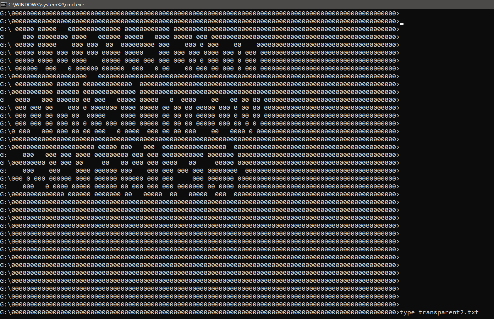
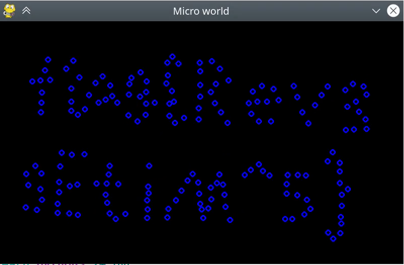

## <center>Hackergame 2021	题解</center>

<center>鹿目&amp;ensp;圆</center>

### 环境

- python 3
- Mathematica 12


### 1. 签到

不是去年的检查元素。观察发现 URL 会变，于是用二分法。


### 2. 进制十六——参上

用十六进制编辑器，例如 okteta。

这题的难点在于将十六进制数正确地输入编辑器，我就输错了很多次


### 3. 去吧！追寻自由的电波

一开始什么都听不出来，注意到题目中说

> 录音的速度有所改变

但是一般的慢放不行，需要修改采样率

```mathematica
ans = Audio[AudioData[audio][[1]], SampleRate -> AudioSampleRate@audio / 2];
```

然而还是听不懂，再查

> 使用了无线电中惯用的方法来区分字符串中读音相近的字母，

这是 [字母解释法](https://baike.baidu.com/item/%E5%AD%97%E6%AF%8D%E8%A7%A3%E9%87%8A%E6%B3%95)。


### 4. 猫咪问答 Pro Max

1. 在 web archive 上找到历史内容	[信息安全俱乐部社团章程](https://web.archive.org/web/20181004003308/http://sec.ustc.edu.cn/doku.php/codes)
2. 找到了 [中国科学技术大学 Linux 用户协会介绍](https://lug.ustc.edu.cn/wiki/intro)，不过不能确定是 4 还是 5，因为没有更新 2021 年的情况
3. ~~实地考察~~
4. 找到相应的文档 [SIGBOVIK 2021](http://sigbovik.org/2021/proceedings.pdf)，这篇文章的后 13 张图分别展示了一个数据集
5. 查找该文档 [IETF : Establishing the Protocol Police](https://datatracker.ietf.org/doc/html/rfc8962#section-6)，注意是阅读正文部分的 Reporting Offenses，而不是末尾的 Email


### 5. 卖瓜

6 和 9 怎么凑出 20 ？当然是用溢出啦

经试验，在 6 的地方输入 `3000000000000000000`，然后在 9 的地方输入 `49638230412172404` 即可


### 6. 透明的文件

搜索 “cmd 打印 颜色”，找到了相似的内容：[Python 打印带颜色的 log](https://zhuanlan.zhihu.com/p/136173259)

在所有 `[` 前加 `\x1B`，然后再 `type`，然而并没有显示。

后来偶然间（为第 17 题装的 conda 导致环境变量有问题，错误提示恰好把前两行占掉了）发现运行命令后左边的文字有些不寻常，于是




### 7. 旅行照片

查阅资料意识到根据街景识别几乎不可能。起初以为地点藏在图像的 Exif 数据里，虽然我看到了“未采取隐写措施”

题目中多次出现了 “KFC”，我一开始就查到了但当时不认为是同一个，于是开始沿着海岸线找……

后来再次按照 “KFC 沙滩 停车场” 进行搜索，确认是秦皇岛的。用百度地图查电话号码，用全景查左侧的文字。不过剩下 3 个迟迟无法确定，最后是用 `pyautogui` 辅助点击枚举出来的。


### 8. FLAG 助力大红包

点击助力按钮时，发送 POST 请求，请求内容包括 `IP`，直接修改此处的 IP 只会修改前端 IP，会提示 “前后端 IP 地址不匹配”。

搜索“后端 IP”，找到了 [http 请求头部的 client_ip 是如何获取的？](https://www.zhihu.com/question/264264051/answer/280132618) ，其中提到 `X-Forwarded-For` 这个请求头。不过向目标网站发送的请求中并没有这个请求头。

而 [伪造 HTTP 请求 IP 地址](https://blog.csdn.net/xxxcyzyy/article/details/93756574) 中说可以追加这个请求头。经测试，增加 `X-Forwarded-For` 可以修改后端 ip，于是编写代码

```python
import requests
import time

url = 'http://202.38.93.111:10888/invite/ec5a0b15-34af-4b79-a181-5635e416af80'

for i in range(256):
    ip = str(i) + '.' + str(i) + '.' + str(i) + '.' + str(i)
    print(ip)
    data = {'ip': ip}
    headers = {'x-forwarded-for': ip}
    requests.post(url, data, headers=headers)
    time.sleep(1)
```


### 9. Amnesia

#### (1) 轻度失忆

经过尝试，`printf` 不能用，而 `putchar` 可以使用。主要代码如下，完整程序见 [9.cpp](code/9.cpp) 

```c
#include <stdio.h>
int main() {
    int z = 0, c1, c4, c16, c96, H, e, l, o, comma, space, w, r, d, exclamation;
    c1 = !z;
    c4 = c1 + c1 + c1 + c1;
    c16 = c4 + c4 + c4 + c4;
    c96 = c16 + c16 + c16 + c16 + c16 + c16;

    H = c16 + c16 + c16 + c16 + c4 + c4;    // 72
    e = c96 + c4 + c1;                      // 101
    
    putchar(H);
    putchar(e);
    
    return z;
}
```

> 官方题解里说可以直接 `putchar` 字符


### 10. 图之上的信息

发现登录时 POST 请求了 graphql 文件

在了解 GraphQL 的语法，一开始以为和 SQL 注入有关，用“sql注入 graphql” 查到了 [渗透测试之 graphQL](https://blog.csdn.net/wy_97/article/details/110522150) 

其中提到了内省查询 `__schema`。发送下面的 POST 请求可以查询到结构信息

```json
{"query":"query IntrospectionQuery { __schema { queryType { name } mutationType { name } subscriptionType { name } types { ...FullType } directives { name description locations args { ...InputValue } } } } fragment FullType on __Type { kind name description fields(includeDeprecated: true) { name description args { ...InputValue } type { ...TypeRef } isDeprecated deprecationReason } inputFields { ...InputValue } interfaces { ...TypeRef } enumValues(includeDeprecated: true) { name description isDeprecated deprecationReason } possibleTypes { ...TypeRef } } fragment InputValue on __InputValue { name description type { ...TypeRef } defaultValue } fragment TypeRef on __Type { kind name ofType { kind name ofType { kind name ofType { kind name ofType { kind name ofType { kind name ofType { kind name ofType { kind name } } } } } } } }"}
```

响应内容中 `GUser` 有 `privateEmail` 字段，因此发送以下请求即可。

```json
{"query":"query{ user(id: 1){id username privateEmail}}"}
```


### 11. Easy RSA

> 完整代码见 [11.wl](code/11/11.wl)	[11.py](code/11/11.py) 

首先计算 `p` 。x 与 y 都是素数，可以使用 [威尔逊定理](https://baike.baidu.com/item/%E5%A8%81%E5%B0%94%E9%80%8A%E5%AE%9A%E7%90%86/1881444) $(p-1)! \equiv -1 \pmod{p}$

> 注意是与 -1 同余，我一开始记成 1 了

```mathematica
(* 已知 e, x, y, valueLast, valueQ, c *)
product = Fold[Mod[#1 #2, x] &, Range[y + 1, x - 1]];
inverse = PowerMod[-product, -1, x];
p = NextPrime@inverse;
```

再计算 `q`。$prevQ^e \equiv valueQ \pmod{n}$，而 $n= \prod value_i$，故 $prevQ^e \equiv valueQ \pmod{value_i}$

```mathematica
value = Table[NextPrime[valueLast, i], {i, -9, 0}];
n = Times @@ value;
prevQModValue = Table[Echo@PowerMod[Mod[valueQ, v], 1/e, v], {v, value}];
prevQ = ChineseRemainder[prevQModValue, value];
q = NextPrime@prevQ;
```

然后参考 [RSA 介绍](https://ctf-wiki.org/crypto/asymmetric/rsa/rsa_theory/) 求出原数字

```mathematica
phiN = (p - 1) (q - 1);
d = PowerMod[e, -1, phiN];
m = PowerMod[c, d, p q]
```

最后用以下 python 代码写 flag 文件

```python
file = open("flag.txt", "wb")
bytes = int.to_bytes(m, 28, byteorder='big')
file.write(bytes)
```


### 13. 赛博厨房

#### (1) LEVEL 0

菜谱只会在 0, 1 之间变化，多保存几次就会刷新。参考代码：

```
向右 1 步
拿起 1 个物品
向左 1 步
向下 1 步
放下 1 个物品
向上 1 步

向右 2 步
拿起 1 个物品
向左 2 步
向下 1 步
放下 1 个物品
```

#### (2) LEVEL 1

需要 73 个物品 0，而最多限制 72 行。只能使用 `如果手上的物品大于等于 n 向上跳转 m 行` 这条语句。

> 观察示例程序执行记录发现该语句是说代码跳 `m` 行，而不是说机器人移动多少步

```
向右 1 步
拿起 73 个物品
向左 1 步
向下 1 步
放下 1 个物品
如果手上的物品大于等于 1 向上跳转 1 行
```


### 14. 灯，等灯等灯

#### (1) LEVEL 0

> 完整代码见 [14.wl](code/14.wl) 

从网页的 js 文件中获得 `target` 矩阵

```mathematica
g[x_, y_] := 3 t[x, y] + 2 (t[x - 1, y] + t[x, y - 1] + t[x + 1, y] + t[x, y + 1]) + 
    t[x - 2, y] + t[x, y - 2] + t[x + 2, y] + t[x, y + 2]
t[x_, y_] := If[1 <= x <= n && 1 <= y <= n, c[x, y], 0];
allC = Flatten@Table[c[i, j], {i, n}, {j, n}];
eqns = Simplify@Flatten@Table[g[x, y] == target[[x, y]], {x, n}, {y, n}];
FindInstance[eqns, allC, Modulus -> 256]
```

> 我一开始使用了较为复杂的方法（自行编程把变量减少到 24，因为对于这么多含 `Mod` 的方程，`FindInstance` 无法解出），后来发现加选项 `Modulus -> 256` 就可以了。

然后使用 `pyautogui` 控制鼠标进行点击


### 17. Micro World

exe 这么大，怀疑是 python，用 IDA 查找字符串证实了这一点

使用 [pyinstxtractor](https://github.com/extremecoders-re/pyinstxtractor) 可以获得 pyc 文件

用 uncompyle6 可以将 pyc 文件转换为 python 源代码，但运行时只有一个点。查阅资料后发现这是 [代码混淆](https://zhuanlan.zhihu.com/p/145811103)，pyc 中存在一些跳转指令；里面还指出可以用 dis.dis（更推荐使用 pydisasm）将 pyc 翻译成指令码。

题目描述是

> 粒子初始化为 flag，程序记录了一段时间之后的运动情况

观察大部分正确的 python 代码，发生的应该不是非弹性碰撞（没有出现 0.9 之类的数字）。经测试，直接修改 fps 不会影响到运动状态，所以只能**把各点的速度反向**。

一开始想在较高层面（指令码）修改。将指令码转成 pyc 的工具有 xasm，但这个工具无法处理列表赋值的情况。所以只能**修改 pyc 字节码**。

在 py 文件中修改一些数字的符号，用 `python3 -m` 生成 pyc 文件。发现对于正数， pyc 中某个字节由 `3B` 变为 `FB` ；而对于负数，由 `FB` 变为 `3B`。

编写 [trans.py](code/17/trans.py) ，主要逻辑如下，把中间间隔 8 个字符的一对 `3B`/`FB` 换成相反的。

```python
for i in range(len(data)):
    if data[i] in [0x3F, 0xBF] and data[i + 9] in [0x3F, 0xBF] and hold[i]:
        hold[i] = False
        hold[i + 9] = False

for i in range(len(data)):
    if hold[i]:
        ansData.append(data[i])
    else:
        ansData.append(0x3F + 0xBF - data[i])
```

> 位置不会被改变符号可能是因为其绝对值比较大

用 [check.py](code/17/check.py) 检查指令码，发现多修改了一处，手动改回来。`diff` 确认指令码没有问题

运行，使用 VLC 录屏并逐帧查看




### 23. 马赛克

> 完整代码见 [23.wl](code/23.wl) 

将二维码的每个模糊的格子视为一个变量。按每个马赛克方块的灰度值列方程

```mathematica
eqns[1] = Simplify@Flatten@Floor[Flatten[expectValue], 1/255] == 
  Flatten@mosaicValue // Thread
```

对于每一个方程，**将每个变量在 0, 1 范围内枚举**。**若有多个解，取每个解中值都相同的变量**

> 经试验，单纯地只取有单个解的方程的解，不能做出此题

```mathematica
inferSolve[eqn_] := Module[{vars = Cases[eqn, t[a_, b_], Infinity], possible}, 
  possible = #1 & @@@ Select[#[[2]] &]@Table[values -> eqn /. Thread[vars -> values],
    {values, Tuples[{0, 1}, Length@vars]}];
  First /@ Select[AssociationThread[vars -> Transpose@possible], Equal @@ # &] // Normal]
```

将每次确定的解代入方程，进行**迭代**计算。

```mathematica
Table[ans[i] = inferSolve /@ eqns[i] // Flatten // Union; 
  eqns[i + 1] = eqns[i] /. Union@Flatten@ans[i] /. True -> Nothing, {i, 10}];
```

虽然还剩余一部分没有解出，但在此 QR 码的容错范围内。


### 25. 密码生成器

> 刚做这题的时候象征性地打开了 IDA 和 x64dbg，由于我不会逆向（比赛前两天才安装）并且也不想逆向，什么都没能发现。

注意到密码生成器没有提供任何输入，且每次运行都有较长的延迟，更奇怪的是，题目中每句话都不离时间：

> 网页显示时间的时区改到了 Asia/Shanghai，我说怎么打印出来总是差 8 个小时。  
> 【由用户 admin 于 2021-09-22 23:40 发布】  
> 【由用户 admin 于 2021-09-22 23:39 发布】  
> 于 2021-09-22 23:11 注册

怀疑生成的密码和**系统时间**有关。经测试，在相同的秒数会显示相同的密码。

所以将日期调整为 2021 年 9 月 22 日。编写脚本，用 `time` 命令调整时间（需要管理员权限）至 23:11 附近，用 `pyautogui` 点击密码生成器的按钮并将输出的密码粘贴到文本编辑器中。

```python
import subprocess
from pyautogui import click, sleep, moveTo, hotkey, press

for i in range(60):
    moveTo(buttonX, buttonY)

    command = 'time 23:10:' + str(i)
    print(command)
    subprocess.run(command,shell=True)

    click()
    sleep(2)

    moveTo(labelX, labelY)
    click()
    hotkey('ctrl', 'a')
    hotkey('ctrl', 'c')

    moveTo(textX, textY)
    click()
    press('enter')
    hotkey('ctrl', 'v')
```

最后用 `pyautogui` 输入用户名和密码并进行提交（这样提交比较有仪式感）

> IDA 也就图一乐，真做逆向还得靠 `pyautogui`


### 27. JUST BE FUN

解题过程：读代码，写代码（建议将 python 文件中的背景字符换成空格，合理使用 Insert 键），调代码（条件断点）。  
此题要求：写一个三维空间的程序，读入 9 以下的数字和 6 种运算符，计算结果。  
主要思路：先读一个操作数，读入运算符，按运算符进行分类读入操作数并计算，再读下一个运算符……

调试结果为 [1++](code/27/1++) 

由于看了使用说明后仍然不知道如何发送超过 4096 字节的数据，我使用两层的结构把它优化到了 4096 字节以下。两层分别为 [2-1](code/27/2-1)	[2-2](code/27/2-2) 

修改后的 python 文件为 [be_fun+.py](code/27/be_fun+.py)  
由“三维代码”生成 python 输入的文件为  [generate.wl](code/27/generate.wl)

